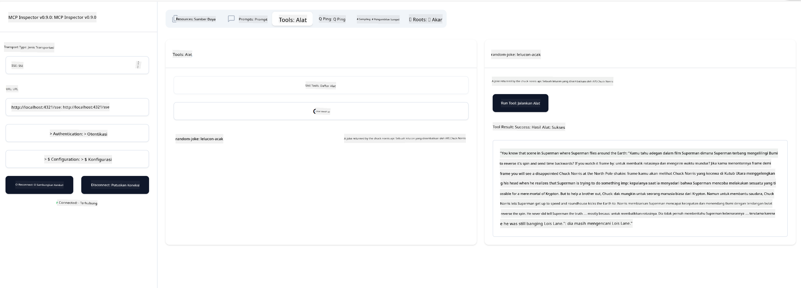

<!--
CO_OP_TRANSLATOR_METADATA:
{
  "original_hash": "64645691bf0985f1760b948123edf269",
  "translation_date": "2025-06-13T10:54:25+00:00",
  "source_file": "03-GettingStarted/05-sse-server/README.md",
  "language_code": "id"
}
-->
Sekarang kita sudah tahu sedikit lebih banyak tentang SSE, mari kita buat server SSE selanjutnya.

## Latihan: Membuat Server SSE

Untuk membuat server kita, kita perlu mengingat dua hal:

- Kita perlu menggunakan web server untuk membuka endpoint untuk koneksi dan pesan.
- Bangun server kita seperti biasa dengan tools, resources, dan prompt saat kita menggunakan stdio.

### -1- Membuat instance server

Untuk membuat server kita, kita menggunakan tipe yang sama seperti dengan stdio. Namun, untuk transport, kita perlu memilih SSE.

Mari kita tambahkan rute yang diperlukan selanjutnya.

### -2- Menambahkan rute

Mari kita tambahkan rute yang menangani koneksi dan pesan masuk:

Mari kita tambahkan kemampuan ke server selanjutnya.

### -3- Menambahkan kemampuan server

Sekarang setelah kita mendefinisikan semua yang spesifik untuk SSE, mari kita tambahkan kemampuan server seperti tools, prompt, dan resources.

Kode lengkap kamu harus terlihat seperti ini:

Bagus, kita sudah punya server yang menggunakan SSE, mari kita coba jalankan selanjutnya.

## Latihan: Debugging Server SSE dengan Inspector

Inspector adalah alat hebat yang sudah kita lihat di pelajaran sebelumnya [Membuat server pertama kamu](/03-GettingStarted/01-first-server/README.md). Mari kita lihat apakah kita bisa menggunakan Inspector di sini juga:

### -1- Menjalankan inspector

Untuk menjalankan inspector, kamu harus terlebih dahulu menjalankan server SSE, jadi mari kita lakukan itu dulu:

1. Jalankan server

1. Jalankan inspector

    > ![NOTE]
    > Jalankan ini di jendela terminal yang terpisah dari tempat server berjalan. Juga perhatikan, kamu perlu menyesuaikan perintah di bawah agar sesuai dengan URL tempat server kamu berjalan.

    ```sh
    npx @modelcontextprotocol/inspector --cli http://localhost:8000/sse --method tools/list
    ```

    Menjalankan inspector terlihat sama di semua runtime. Perhatikan bagaimana kita tidak lagi mengirimkan path ke server dan perintah untuk memulai server, melainkan kita mengirimkan URL tempat server berjalan dan juga menentukan rute `/sse`.

### -2- Mencoba alat ini

Hubungkan server dengan memilih SSE di dropdown dan isi field url dengan tempat server kamu berjalan, misalnya http:localhost:4321/sse. Sekarang klik tombol "Connect". Seperti sebelumnya, pilih untuk melihat daftar tools, pilih sebuah tool dan berikan nilai input. Kamu akan melihat hasil seperti di bawah ini:



Bagus, kamu bisa bekerja dengan inspector, mari kita lihat bagaimana kita bisa bekerja dengan Visual Studio Code selanjutnya.

## Tugas

Coba bangun server kamu dengan lebih banyak kemampuan. Lihat [halaman ini](https://api.chucknorris.io/) untuk contoh menambahkan tool yang memanggil API, kamu tentukan bagaimana servernya harus terlihat. Selamat bersenang-senang :)

## Solusi

[Solusi](./solution/README.md) Berikut adalah solusi yang mungkin dengan kode yang berfungsi.

## Poin Penting

Poin penting dari bab ini adalah:

- SSE adalah transport kedua yang didukung setelah stdio.
- Untuk mendukung SSE, kamu perlu mengelola koneksi masuk dan pesan menggunakan framework web.
- Kamu bisa menggunakan baik Inspector maupun Visual Studio Code untuk menggunakan server SSE, sama seperti server stdio. Perhatikan perbedaan kecil antara stdio dan SSE. Untuk SSE, kamu perlu menjalankan server secara terpisah dan kemudian menjalankan alat inspector. Untuk alat inspector, ada juga beberapa perbedaan yaitu kamu perlu menentukan URL.

## Contoh

- [Java Calculator](../samples/java/calculator/README.md)
- [.Net Calculator](../../../../03-GettingStarted/samples/csharp)
- [JavaScript Calculator](../samples/javascript/README.md)
- [TypeScript Calculator](../samples/typescript/README.md)
- [Python Calculator](../../../../03-GettingStarted/samples/python)

## Sumber Tambahan

- [SSE](https://developer.mozilla.org/en-US/docs/Web/API/Server-sent_events)

## Selanjutnya

- Selanjutnya: [HTTP Streaming dengan MCP (Streamable HTTP)](/03-GettingStarted/06-http-streaming/README.md)

**Penafian**:  
Dokumen ini telah diterjemahkan menggunakan layanan terjemahan AI [Co-op Translator](https://github.com/Azure/co-op-translator). Meskipun kami berusaha untuk akurasi, harap diingat bahwa terjemahan otomatis mungkin mengandung kesalahan atau ketidakakuratan. Dokumen asli dalam bahasa aslinya harus dianggap sebagai sumber yang sah. Untuk informasi penting, disarankan menggunakan terjemahan profesional oleh manusia. Kami tidak bertanggung jawab atas kesalahpahaman atau salah tafsir yang timbul dari penggunaan terjemahan ini.