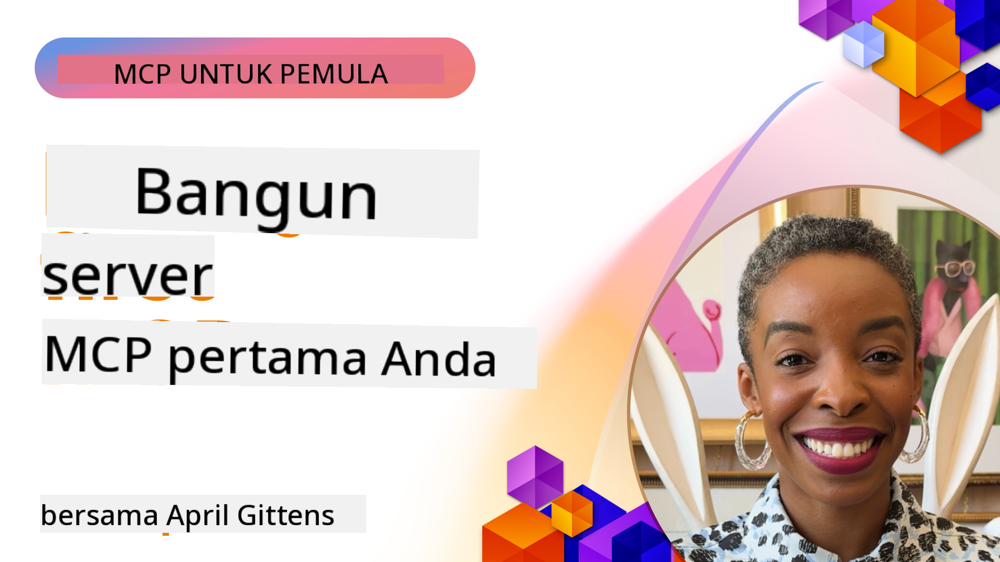

<!--
CO_OP_TRANSLATOR_METADATA:
{
  "original_hash": "1197b6dbde36773e04a5ae826557fdb9",
  "translation_date": "2025-08-26T18:03:44+00:00",
  "source_file": "03-GettingStarted/README.md",
  "language_code": "id"
}
-->
## Memulai  

_(Klik gambar di atas untuk menonton video pelajaran ini)_

Bagian ini terdiri dari beberapa pelajaran:

- **1 Server pertama Anda**, dalam pelajaran pertama ini, Anda akan belajar cara membuat server pertama Anda dan memeriksanya dengan alat inspeksi, cara yang berharga untuk menguji dan men-debug server Anda, [ke pelajaran](01-first-server/README.md)

- **2 Klien**, dalam pelajaran ini, Anda akan belajar cara menulis klien yang dapat terhubung ke server Anda, [ke pelajaran](02-client/README.md)

- **3 Klien dengan LLM**, cara yang lebih baik untuk menulis klien adalah dengan menambahkan LLM sehingga dapat "bernegosiasi" dengan server Anda tentang apa yang harus dilakukan, [ke pelajaran](03-llm-client/README.md)

- **4 Menggunakan mode GitHub Copilot Agent server di Visual Studio Code**. Di sini, kita akan melihat cara menjalankan Server MCP dari dalam Visual Studio Code, [ke pelajaran](04-vscode/README.md)

- **5 Server Transport stdio** stdio transport adalah standar yang direkomendasikan untuk komunikasi server-ke-klien MCP dalam spesifikasi saat ini, menyediakan komunikasi berbasis subprocess yang aman [ke pelajaran](05-stdio-server/README.md)

- **6 HTTP Streaming dengan MCP (Streamable HTTP)**. Pelajari tentang HTTP streaming modern, notifikasi progres, dan cara mengimplementasikan server dan klien MCP yang skalabel dan real-time menggunakan Streamable HTTP. [ke pelajaran](06-http-streaming/README.md)

- **7 Memanfaatkan AI Toolkit untuk VSCode** untuk menggunakan dan menguji Klien dan Server MCP Anda [ke pelajaran](07-aitk/README.md)

- **8 Pengujian**. Di sini kita akan fokus pada berbagai cara untuk menguji server dan klien Anda, [ke pelajaran](08-testing/README.md)

- **9 Deployment**. Bab ini akan membahas berbagai cara untuk mendistribusikan solusi MCP Anda, [ke pelajaran](09-deployment/README.md)

Model Context Protocol (MCP) adalah protokol terbuka yang menstandarkan cara aplikasi menyediakan konteks ke LLM. Pikirkan MCP seperti port USB-C untuk aplikasi AI - ini menyediakan cara standar untuk menghubungkan model AI ke berbagai sumber data dan alat.

## Tujuan Pembelajaran

Pada akhir pelajaran ini, Anda akan dapat:

- Menyiapkan lingkungan pengembangan untuk MCP dalam C#, Java, Python, TypeScript, dan JavaScript
- Membangun dan mendistribusikan server MCP dasar dengan fitur kustom (sumber daya, prompt, dan alat)
- Membuat aplikasi host yang terhubung ke server MCP
- Menguji dan men-debug implementasi MCP
- Memahami tantangan umum dalam pengaturan dan solusinya
- Menghubungkan implementasi MCP Anda ke layanan LLM populer

## Menyiapkan Lingkungan MCP Anda

Sebelum Anda mulai bekerja dengan MCP, penting untuk mempersiapkan lingkungan pengembangan Anda dan memahami alur kerja dasar. Bagian ini akan memandu Anda melalui langkah-langkah awal untuk memastikan awal yang lancar dengan MCP.

### Prasyarat

Sebelum memulai pengembangan MCP, pastikan Anda memiliki:

- **Lingkungan Pengembangan**: Untuk bahasa pilihan Anda (C#, Java, Python, TypeScript, atau JavaScript)
- **IDE/Editor**: Visual Studio, Visual Studio Code, IntelliJ, Eclipse, PyCharm, atau editor kode modern lainnya
- **Package Managers**: NuGet, Maven/Gradle, pip, atau npm/yarn
- **API Keys**: Untuk layanan AI apa pun yang Anda rencanakan untuk digunakan dalam aplikasi host Anda

### SDK Resmi

Dalam bab-bab berikutnya, Anda akan melihat solusi yang dibangun menggunakan Python, TypeScript, Java, dan .NET. Berikut adalah semua SDK resmi yang didukung.

MCP menyediakan SDK resmi untuk berbagai bahasa:
- [C# SDK](https://github.com/modelcontextprotocol/csharp-sdk) - Dipelihara bersama dengan Microsoft
- [Java SDK](https://github.com/modelcontextprotocol/java-sdk) - Dipelihara bersama dengan Spring AI
- [TypeScript SDK](https://github.com/modelcontextprotocol/typescript-sdk) - Implementasi resmi TypeScript
- [Python SDK](https://github.com/modelcontextprotocol/python-sdk) - Implementasi resmi Python
- [Kotlin SDK](https://github.com/modelcontextprotocol/kotlin-sdk) - Implementasi resmi Kotlin
- [Swift SDK](https://github.com/modelcontextprotocol/swift-sdk) - Dipelihara bersama dengan Loopwork AI
- [Rust SDK](https://github.com/modelcontextprotocol/rust-sdk) - Implementasi resmi Rust

## Poin Penting

- Menyiapkan lingkungan pengembangan MCP mudah dilakukan dengan SDK khusus bahasa
- Membangun server MCP melibatkan pembuatan dan pendaftaran alat dengan skema yang jelas
- Klien MCP terhubung ke server dan model untuk memanfaatkan kemampuan yang diperluas
- Pengujian dan debugging sangat penting untuk implementasi MCP yang andal
- Opsi distribusi mencakup pengembangan lokal hingga solusi berbasis cloud

## Berlatih

Kami memiliki serangkaian contoh yang melengkapi latihan yang akan Anda lihat di semua bab dalam bagian ini. Selain itu, setiap bab juga memiliki latihan dan tugas masing-masing.

- [Java Calculator](./samples/java/calculator/README.md)
- [.Net Calculator](../../../03-GettingStarted/samples/csharp)
- [JavaScript Calculator](./samples/javascript/README.md)
- [TypeScript Calculator](./samples/typescript/README.md)
- [Python Calculator](../../../03-GettingStarted/samples/python)

## Sumber Daya Tambahan

- [Bangun Agen menggunakan Model Context Protocol di Azure](https://learn.microsoft.com/azure/developer/ai/intro-agents-mcp)
- [Remote MCP dengan Azure Container Apps (Node.js/TypeScript/JavaScript)](https://learn.microsoft.com/samples/azure-samples/mcp-container-ts/mcp-container-ts/)
- [.NET OpenAI MCP Agent](https://learn.microsoft.com/samples/azure-samples/openai-mcp-agent-dotnet/openai-mcp-agent-dotnet/)

## Selanjutnya

Berikutnya: [Membuat Server MCP pertama Anda](01-first-server/README.md)

---

**Penafian**:  
Dokumen ini telah diterjemahkan menggunakan layanan penerjemahan AI [Co-op Translator](https://github.com/Azure/co-op-translator). Meskipun kami berusaha untuk memberikan hasil yang akurat, harap diingat bahwa terjemahan otomatis mungkin mengandung kesalahan atau ketidakakuratan. Dokumen asli dalam bahasa aslinya harus dianggap sebagai sumber yang otoritatif. Untuk informasi yang bersifat kritis, disarankan menggunakan jasa penerjemahan profesional oleh manusia. Kami tidak bertanggung jawab atas kesalahpahaman atau penafsiran yang keliru yang timbul dari penggunaan terjemahan ini.