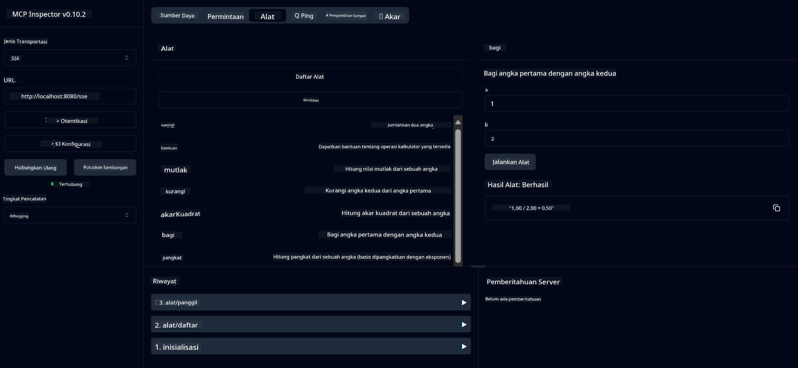

<!--
CO_OP_TRANSLATOR_METADATA:
{
  "original_hash": "13231e9951b68efd9df8c56bd5cdb27e",
  "translation_date": "2025-05-17T13:14:58+00:00",
  "source_file": "03-GettingStarted/samples/java/calculator/README.md",
  "language_code": "id"
}
-->
# Layanan MCP Kalkulator Dasar

Layanan ini menyediakan operasi kalkulator dasar melalui Model Context Protocol (MCP) menggunakan Spring Boot dengan transportasi WebFlux. Ini dirancang sebagai contoh sederhana bagi pemula yang belajar tentang implementasi MCP.

Untuk informasi lebih lanjut, lihat dokumentasi referensi [MCP Server Boot Starter](https://docs.spring.io/spring-ai/reference/api/mcp/mcp-server-boot-starter-docs.html).

## Gambaran Umum

Layanan ini menampilkan:
- Dukungan untuk SSE (Server-Sent Events)
- Pendaftaran alat otomatis menggunakan anotasi `@Tool` dari Spring AI
- Fungsi kalkulator dasar:
  - Penambahan, pengurangan, perkalian, pembagian
  - Perhitungan pangkat dan akar kuadrat
  - Modulus (sisa) dan nilai mutlak
  - Fungsi bantuan untuk deskripsi operasi

## Fitur

Layanan kalkulator ini menawarkan kemampuan berikut:

1. **Operasi Aritmatika Dasar**:
   - Penambahan dua angka
   - Pengurangan satu angka dari angka lain
   - Perkalian dua angka
   - Pembagian satu angka dengan angka lain (dengan pemeriksaan pembagian nol)

2. **Operasi Lanjutan**:
   - Perhitungan pangkat (menaikkan basis ke eksponen)
   - Perhitungan akar kuadrat (dengan pemeriksaan angka negatif)
   - Perhitungan modulus (sisa)
   - Perhitungan nilai mutlak

3. **Sistem Bantuan**:
   - Fungsi bantuan bawaan yang menjelaskan semua operasi yang tersedia

## Menggunakan Layanan

Layanan ini mengekspos endpoint API berikut melalui protokol MCP:

- `add(a, b)`: Menambahkan dua angka
- `subtract(a, b)`: Mengurangi angka kedua dari yang pertama
- `multiply(a, b)`: Mengalikan dua angka
- `divide(a, b)`: Membagi angka pertama dengan angka kedua (dengan pemeriksaan nol)
- `power(base, exponent)`: Menghitung pangkat dari sebuah angka
- `squareRoot(number)`: Menghitung akar kuadrat (dengan pemeriksaan angka negatif)
- `modulus(a, b)`: Menghitung sisa pembagian
- `absolute(number)`: Menghitung nilai mutlak
- `help()`: Mendapatkan informasi tentang operasi yang tersedia

## Klien Uji

Klien uji sederhana disertakan dalam paket `com.microsoft.mcp.sample.client`. Kelas `SampleCalculatorClient` mendemonstrasikan operasi yang tersedia dari layanan kalkulator.

## Menggunakan Klien LangChain4j

Proyek ini menyertakan contoh klien LangChain4j di `com.microsoft.mcp.sample.client.LangChain4jClient` yang menunjukkan cara mengintegrasikan layanan kalkulator dengan LangChain4j dan model GitHub:

### Prasyarat

1. **Pengaturan Token GitHub**:
   
   Untuk menggunakan model AI GitHub (seperti phi-4), Anda memerlukan token akses pribadi GitHub:

   a. Buka pengaturan akun GitHub Anda: https://github.com/settings/tokens
   
   b. Klik "Generate new token" → "Generate new token (classic)"
   
   c. Berikan nama deskriptif untuk token Anda
   
   d. Pilih cakupan berikut:
      - `repo` (Kontrol penuh repositori pribadi)
      - `read:org` (Baca keanggotaan organisasi dan tim, baca proyek organisasi)
      - `gist` (Buat gists)
      - `user:email` (Akses alamat email pengguna (hanya-baca))
   
   e. Klik "Generate token" dan salin token baru Anda
   
   f. Atur sebagai variabel lingkungan:
      
      Pada Windows:
      ```
      set GITHUB_TOKEN=your-github-token
      ```
      
      Pada macOS/Linux:
      ```bash
      export GITHUB_TOKEN=your-github-token
      ```

   g. Untuk pengaturan yang berkelanjutan, tambahkan ke variabel lingkungan Anda melalui pengaturan sistem

2. Tambahkan ketergantungan GitHub LangChain4j ke proyek Anda (sudah disertakan dalam pom.xml):
   ```xml
   <dependency>
       <groupId>dev.langchain4j</groupId>
       <artifactId>langchain4j-github</artifactId>
       <version>${langchain4j.version}</version>
   </dependency>
   ```

3. Pastikan server kalkulator berjalan di `localhost:8080`

### Menjalankan Klien LangChain4j

Contoh ini menunjukkan:
- Menghubungkan ke server MCP kalkulator melalui transportasi SSE
- Menggunakan LangChain4j untuk membuat bot obrolan yang memanfaatkan operasi kalkulator
- Integrasi dengan model AI GitHub (sekarang menggunakan model phi-4)

Klien mengirimkan kueri contoh berikut untuk mendemonstrasikan fungsionalitas:
1. Menghitung jumlah dari dua angka
2. Mencari akar kuadrat dari sebuah angka
3. Mendapatkan informasi bantuan tentang operasi kalkulator yang tersedia

Jalankan contoh dan periksa keluaran konsol untuk melihat bagaimana model AI menggunakan alat kalkulator untuk merespons kueri.

### Konfigurasi Model GitHub

Klien LangChain4j dikonfigurasi untuk menggunakan model phi-4 GitHub dengan pengaturan berikut:

```java
ChatLanguageModel model = GitHubChatModel.builder()
    .apiKey(System.getenv("GITHUB_TOKEN"))
    .timeout(Duration.ofSeconds(60))
    .modelName("phi-4")
    .logRequests(true)
    .logResponses(true)
    .build();
```

Untuk menggunakan model GitHub yang berbeda, cukup ubah parameter `modelName` ke model lain yang didukung (misalnya, "claude-3-haiku-20240307", "llama-3-70b-8192", dll.).

## Ketergantungan

Proyek ini memerlukan ketergantungan kunci berikut:

```xml
<!-- For MCP Server -->
<dependency>
    <groupId>org.springframework.ai</groupId>
    <artifactId>spring-ai-starter-mcp-server-webflux</artifactId>
</dependency>

<!-- For LangChain4j integration -->
<dependency>
    <groupId>dev.langchain4j</groupId>
    <artifactId>langchain4j-mcp</artifactId>
    <version>${langchain4j.version}</version>
</dependency>

<!-- For GitHub models support -->
<dependency>
    <groupId>dev.langchain4j</groupId>
    <artifactId>langchain4j-github</artifactId>
    <version>${langchain4j.version}</version>
</dependency>
```

## Membangun Proyek

Bangun proyek menggunakan Maven:
```bash
./mvnw clean install -DskipTests
```

## Menjalankan Server

### Menggunakan Java

```bash
java -jar target/calculator-server-0.0.1-SNAPSHOT.jar
```

### Menggunakan MCP Inspector

MCP Inspector adalah alat yang berguna untuk berinteraksi dengan layanan MCP. Untuk menggunakannya dengan layanan kalkulator ini:

1. **Pasang dan jalankan MCP Inspector** di jendela terminal baru:
   ```bash
   npx @modelcontextprotocol/inspector
   ```

2. **Akses antarmuka web** dengan mengklik URL yang ditampilkan oleh aplikasi (biasanya http://localhost:6274)

3. **Konfigurasikan koneksi**:
   - Atur jenis transportasi ke "SSE"
   - Atur URL ke endpoint SSE server Anda yang berjalan: `http://localhost:8080/sse`
   - Klik "Connect"

4. **Gunakan alat**:
   - Klik "List Tools" untuk melihat operasi kalkulator yang tersedia
   - Pilih alat dan klik "Run Tool" untuk menjalankan operasi



### Menggunakan Docker

Proyek ini menyertakan Dockerfile untuk penyebaran terkontainerisasi:

1. **Bangun gambar Docker**:
   ```bash
   docker build -t calculator-mcp-service .
   ```

2. **Jalankan kontainer Docker**:
   ```bash
   docker run -p 8080:8080 calculator-mcp-service
   ```

Ini akan:
- Membangun gambar Docker multi-tahap dengan Maven 3.9.9 dan Eclipse Temurin 24 JDK
- Membuat gambar kontainer yang dioptimalkan
- Mengekspos layanan pada port 8080
- Memulai layanan kalkulator MCP di dalam kontainer

Anda dapat mengakses layanan di `http://localhost:8080` setelah kontainer berjalan.

## Pemecahan Masalah

### Masalah Umum dengan Token GitHub

1. **Masalah Izin Token**: Jika Anda mendapatkan kesalahan 403 Forbidden, periksa bahwa token Anda memiliki izin yang benar seperti yang diuraikan dalam prasyarat.

2. **Token Tidak Ditemukan**: Jika Anda mendapatkan kesalahan "No API key found", pastikan variabel lingkungan GITHUB_TOKEN diatur dengan benar.

3. **Pembatasan Tingkat**: API GitHub memiliki batas tingkat. Jika Anda menghadapi kesalahan batas tingkat (kode status 429), tunggu beberapa menit sebelum mencoba lagi.

4. **Kedaluwarsa Token**: Token GitHub dapat kedaluwarsa. Jika Anda menerima kesalahan otentikasi setelah beberapa waktu, buat token baru dan perbarui variabel lingkungan Anda.

Jika Anda memerlukan bantuan lebih lanjut, periksa [dokumentasi LangChain4j](https://github.com/langchain4j/langchain4j) atau [dokumentasi API GitHub](https://docs.github.com/en/rest).

**Penafian**:  
Dokumen ini telah diterjemahkan menggunakan layanan terjemahan AI [Co-op Translator](https://github.com/Azure/co-op-translator). Meskipun kami berusaha untuk memberikan terjemahan yang akurat, harap disadari bahwa terjemahan otomatis dapat mengandung kesalahan atau ketidakakuratan. Dokumen asli dalam bahasa aslinya harus dianggap sebagai sumber yang berwenang. Untuk informasi penting, disarankan menggunakan terjemahan manusia profesional. Kami tidak bertanggung jawab atas kesalahpahaman atau penafsiran yang keliru yang timbul dari penggunaan terjemahan ini.