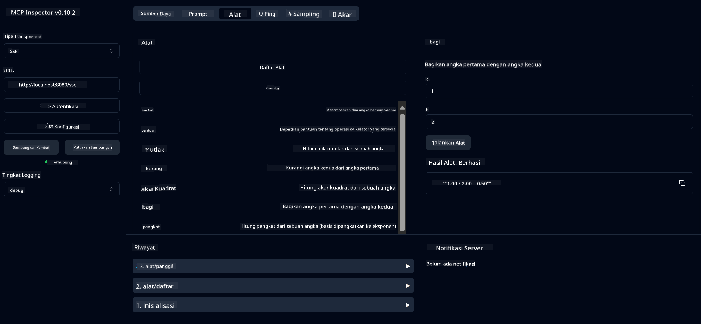

<!--
CO_OP_TRANSLATOR_METADATA:
{
  "original_hash": "13231e9951b68efd9df8c56bd5cdb27e",
  "translation_date": "2025-07-13T22:29:16+00:00",
  "source_file": "03-GettingStarted/samples/java/calculator/README.md",
  "language_code": "id"
}
-->
# Basic Calculator MCP Service

Layanan ini menyediakan operasi kalkulator dasar melalui Model Context Protocol (MCP) menggunakan Spring Boot dengan transport WebFlux. Dirancang sebagai contoh sederhana untuk pemula yang belajar tentang implementasi MCP.

Untuk informasi lebih lanjut, lihat dokumentasi referensi [MCP Server Boot Starter](https://docs.spring.io/spring-ai/reference/api/mcp/mcp-server-boot-starter-docs.html).

## Ikhtisar

Layanan ini menampilkan:
- Dukungan untuk SSE (Server-Sent Events)
- Pendaftaran alat otomatis menggunakan anotasi `@Tool` dari Spring AI
- Fungsi kalkulator dasar:
  - Penjumlahan, pengurangan, perkalian, pembagian
  - Perhitungan pangkat dan akar kuadrat
  - Modulus (sisa bagi) dan nilai mutlak
  - Fungsi bantuan untuk deskripsi operasi

## Fitur

Layanan kalkulator ini menawarkan kemampuan berikut:

1. **Operasi Aritmatika Dasar**:
   - Penjumlahan dua angka
   - Pengurangan satu angka dari angka lain
   - Perkalian dua angka
   - Pembagian satu angka dengan angka lain (dengan pengecekan pembagian nol)

2. **Operasi Lanjutan**:
   - Perhitungan pangkat (mengangkat basis ke eksponen)
   - Perhitungan akar kuadrat (dengan pengecekan angka negatif)
   - Perhitungan modulus (sisa bagi)
   - Perhitungan nilai mutlak

3. **Sistem Bantuan**:
   - Fungsi bantuan bawaan yang menjelaskan semua operasi yang tersedia

## Menggunakan Layanan

Layanan ini menyediakan endpoint API berikut melalui protokol MCP:

- `add(a, b)`: Menjumlahkan dua angka
- `subtract(a, b)`: Mengurangi angka kedua dari angka pertama
- `multiply(a, b)`: Mengalikan dua angka
- `divide(a, b)`: Membagi angka pertama dengan angka kedua (dengan pengecekan nol)
- `power(base, exponent)`: Menghitung pangkat sebuah angka
- `squareRoot(number)`: Menghitung akar kuadrat (dengan pengecekan angka negatif)
- `modulus(a, b)`: Menghitung sisa bagi dari pembagian
- `absolute(number)`: Menghitung nilai mutlak
- `help()`: Mendapatkan informasi tentang operasi yang tersedia

## Test Client

Sebuah test client sederhana disertakan dalam paket `com.microsoft.mcp.sample.client`. Kelas `SampleCalculatorClient` menunjukkan operasi yang tersedia dari layanan kalkulator.

## Menggunakan LangChain4j Client

Proyek ini menyertakan contoh client LangChain4j di `com.microsoft.mcp.sample.client.LangChain4jClient` yang menunjukkan cara mengintegrasikan layanan kalkulator dengan LangChain4j dan model GitHub:

### Prasyarat

1. **Pengaturan Token GitHub**:
   
   Untuk menggunakan model AI GitHub (seperti phi-4), Anda memerlukan token akses pribadi GitHub:

   a. Buka pengaturan akun GitHub Anda: https://github.com/settings/tokens
   
   b. Klik "Generate new token" → "Generate new token (classic)"
   
   c. Beri nama token Anda dengan deskripsi yang jelas
   
   d. Pilih cakupan berikut:
      - `repo` (Kontrol penuh repositori privat)
      - `read:org` (Membaca keanggotaan organisasi dan tim, membaca proyek organisasi)
      - `gist` (Membuat gists)
      - `user:email` (Akses alamat email pengguna (hanya baca))
   
   e. Klik "Generate token" dan salin token baru Anda
   
   f. Setel sebagai variabel lingkungan:
      
      Pada Windows:
      ```
      set GITHUB_TOKEN=your-github-token
      ```
      
      Pada macOS/Linux:
      ```bash
      export GITHUB_TOKEN=your-github-token
      ```

   g. Untuk pengaturan permanen, tambahkan ke variabel lingkungan melalui pengaturan sistem

2. Tambahkan dependensi LangChain4j GitHub ke proyek Anda (sudah termasuk di pom.xml):
   ```xml
   <dependency>
       <groupId>dev.langchain4j</groupId>
       <artifactId>langchain4j-github</artifactId>
       <version>${langchain4j.version}</version>
   </dependency>
   ```

3. Pastikan server kalkulator berjalan di `localhost:8080`

### Menjalankan LangChain4j Client

Contoh ini menunjukkan:
- Menghubungkan ke server MCP kalkulator melalui transport SSE
- Menggunakan LangChain4j untuk membuat chat bot yang memanfaatkan operasi kalkulator
- Integrasi dengan model AI GitHub (sekarang menggunakan model phi-4)

Client mengirimkan contoh query berikut untuk mendemonstrasikan fungsionalitas:
1. Menghitung jumlah dua angka
2. Mencari akar kuadrat sebuah angka
3. Mendapatkan informasi bantuan tentang operasi kalkulator yang tersedia

Jalankan contoh dan periksa output konsol untuk melihat bagaimana model AI menggunakan alat kalkulator untuk merespons pertanyaan.

### Konfigurasi Model GitHub

Client LangChain4j dikonfigurasi untuk menggunakan model phi-4 GitHub dengan pengaturan berikut:

```java
ChatLanguageModel model = GitHubChatModel.builder()
    .apiKey(System.getenv("GITHUB_TOKEN"))
    .timeout(Duration.ofSeconds(60))
    .modelName("phi-4")
    .logRequests(true)
    .logResponses(true)
    .build();
```

Untuk menggunakan model GitHub lain, cukup ubah parameter `modelName` ke model lain yang didukung (misalnya, "claude-3-haiku-20240307", "llama-3-70b-8192", dll.).

## Dependensi

Proyek ini membutuhkan dependensi utama berikut:

```xml
<!-- For MCP Server -->
<dependency>
    <groupId>org.springframework.ai</groupId>
    <artifactId>spring-ai-starter-mcp-server-webflux</artifactId>
</dependency>

<!-- For LangChain4j integration -->
<dependency>
    <groupId>dev.langchain4j</groupId>
    <artifactId>langchain4j-mcp</artifactId>
    <version>${langchain4j.version}</version>
</dependency>

<!-- For GitHub models support -->
<dependency>
    <groupId>dev.langchain4j</groupId>
    <artifactId>langchain4j-github</artifactId>
    <version>${langchain4j.version}</version>
</dependency>
```

## Membangun Proyek

Bangun proyek menggunakan Maven:
```bash
./mvnw clean install -DskipTests
```

## Menjalankan Server

### Menggunakan Java

```bash
java -jar target/calculator-server-0.0.1-SNAPSHOT.jar
```

### Menggunakan MCP Inspector

MCP Inspector adalah alat yang berguna untuk berinteraksi dengan layanan MCP. Untuk menggunakannya dengan layanan kalkulator ini:

1. **Instal dan jalankan MCP Inspector** di jendela terminal baru:
   ```bash
   npx @modelcontextprotocol/inspector
   ```

2. **Akses UI web** dengan mengklik URL yang ditampilkan oleh aplikasi (biasanya http://localhost:6274)

3. **Konfigurasikan koneksi**:
   - Atur tipe transport ke "SSE"
   - Atur URL ke endpoint SSE server yang berjalan: `http://localhost:8080/sse`
   - Klik "Connect"

4. **Gunakan alat**:
   - Klik "List Tools" untuk melihat operasi kalkulator yang tersedia
   - Pilih alat dan klik "Run Tool" untuk menjalankan operasi



### Menggunakan Docker

Proyek ini menyertakan Dockerfile untuk deployment containerized:

1. **Bangun image Docker**:
   ```bash
   docker build -t calculator-mcp-service .
   ```

2. **Jalankan container Docker**:
   ```bash
   docker run -p 8080:8080 calculator-mcp-service
   ```

Ini akan:
- Membangun image Docker multi-stage dengan Maven 3.9.9 dan Eclipse Temurin 24 JDK
- Membuat image container yang dioptimalkan
- Mengekspos layanan pada port 8080
- Menjalankan layanan MCP kalkulator di dalam container

Anda dapat mengakses layanan di `http://localhost:8080` setelah container berjalan.

## Pemecahan Masalah

### Masalah Umum dengan Token GitHub

1. **Masalah Izin Token**: Jika Anda mendapatkan error 403 Forbidden, periksa apakah token Anda memiliki izin yang benar seperti yang dijelaskan di prasyarat.

2. **Token Tidak Ditemukan**: Jika muncul error "No API key found", pastikan variabel lingkungan GITHUB_TOKEN sudah disetel dengan benar.

3. **Pembatasan Rate**: API GitHub memiliki batasan rate. Jika Anda mengalami error batas rate (kode status 429), tunggu beberapa menit sebelum mencoba lagi.

4. **Token Kadaluarsa**: Token GitHub bisa kadaluarsa. Jika Anda menerima error otentikasi setelah beberapa waktu, buat token baru dan perbarui variabel lingkungan Anda.

Jika Anda membutuhkan bantuan lebih lanjut, periksa [dokumentasi LangChain4j](https://github.com/langchain4j/langchain4j) atau [dokumentasi API GitHub](https://docs.github.com/en/rest).

**Penafian**:  
Dokumen ini telah diterjemahkan menggunakan layanan terjemahan AI [Co-op Translator](https://github.com/Azure/co-op-translator). Meskipun kami berupaya untuk mencapai akurasi, harap diperhatikan bahwa terjemahan otomatis mungkin mengandung kesalahan atau ketidakakuratan. Dokumen asli dalam bahasa aslinya harus dianggap sebagai sumber yang sahih. Untuk informasi penting, disarankan menggunakan terjemahan profesional oleh manusia. Kami tidak bertanggung jawab atas kesalahpahaman atau penafsiran yang keliru yang timbul dari penggunaan terjemahan ini.