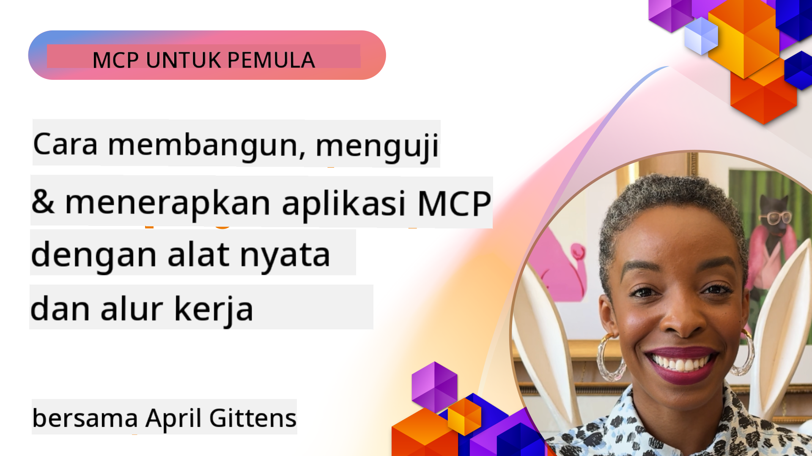
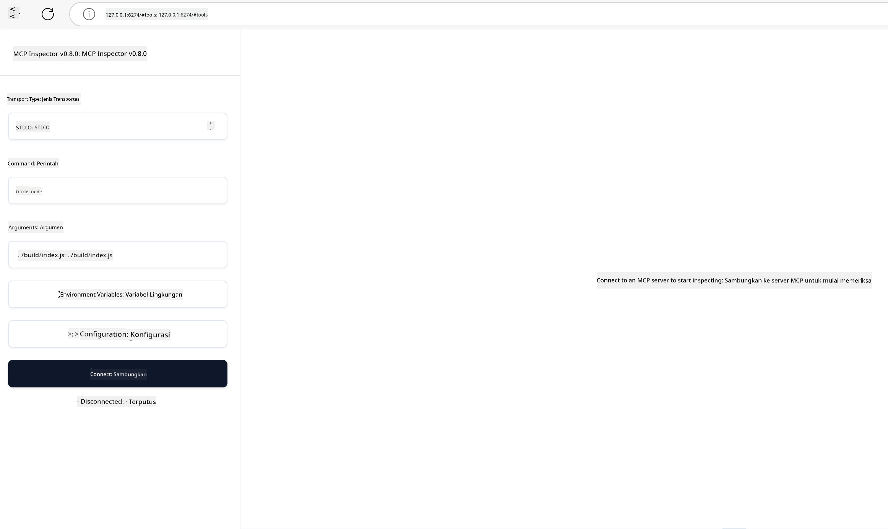

<!--
CO_OP_TRANSLATOR_METADATA:
{
  "original_hash": "83efa75a69bc831277263a6f1ae53669",
  "translation_date": "2025-08-18T17:32:04+00:00",
  "source_file": "04-PracticalImplementation/README.md",
  "language_code": "id"
}
-->
# Implementasi Praktis

[](https://youtu.be/vCN9-mKBDfQ)

_(Klik gambar di atas untuk menonton video pelajaran ini)_

Implementasi praktis adalah tempat kekuatan Model Context Protocol (MCP) menjadi nyata. Meskipun memahami teori dan arsitektur di balik MCP itu penting, nilai sebenarnya muncul ketika Anda menerapkan konsep-konsep ini untuk membangun, menguji, dan mendeploy solusi yang menyelesaikan masalah dunia nyata. Bab ini menjembatani kesenjangan antara pengetahuan konseptual dan pengembangan langsung, membimbing Anda melalui proses mewujudkan aplikasi berbasis MCP.

Apakah Anda sedang mengembangkan asisten cerdas, mengintegrasikan AI ke dalam alur kerja bisnis, atau membangun alat khusus untuk pemrosesan data, MCP menyediakan fondasi yang fleksibel. Desainnya yang independen dari bahasa dan SDK resmi untuk bahasa pemrograman populer membuatnya dapat diakses oleh berbagai pengembang. Dengan memanfaatkan SDK ini, Anda dapat dengan cepat membuat prototipe, iterasi, dan menskalakan solusi Anda di berbagai platform dan lingkungan.

Di bagian berikut, Anda akan menemukan contoh praktis, kode sampel, dan strategi deployment yang menunjukkan cara mengimplementasikan MCP dalam C#, Java dengan Spring, TypeScript, JavaScript, dan Python. Anda juga akan belajar cara debug dan menguji server MCP, mengelola API, dan mendeploy solusi ke cloud menggunakan Azure. Sumber daya langsung ini dirancang untuk mempercepat pembelajaran Anda dan membantu Anda dengan percaya diri membangun aplikasi MCP yang tangguh dan siap produksi.

## Ikhtisar

Pelajaran ini berfokus pada aspek praktis implementasi MCP di berbagai bahasa pemrograman. Kita akan mengeksplorasi cara menggunakan SDK MCP dalam C#, Java dengan Spring, TypeScript, JavaScript, dan Python untuk membangun aplikasi yang tangguh, debug dan menguji server MCP, serta membuat sumber daya, prompt, dan alat yang dapat digunakan kembali.

## Tujuan Pembelajaran

Pada akhir pelajaran ini, Anda akan dapat:

- Mengimplementasikan solusi MCP menggunakan SDK resmi dalam berbagai bahasa pemrograman
- Debug dan menguji server MCP secara sistematis
- Membuat dan menggunakan fitur server (Resources, Prompts, dan Tools)
- Merancang alur kerja MCP yang efektif untuk tugas-tugas kompleks
- Mengoptimalkan implementasi MCP untuk kinerja dan keandalan

## Sumber Daya SDK Resmi

Model Context Protocol menawarkan SDK resmi untuk berbagai bahasa:

- [C# SDK](https://github.com/modelcontextprotocol/csharp-sdk)
- [Java dengan Spring SDK](https://github.com/modelcontextprotocol/java-sdk) **Catatan:** membutuhkan dependensi pada [Project Reactor](https://projectreactor.io). (Lihat [diskusi isu 246](https://github.com/orgs/modelcontextprotocol/discussions/246).)
- [TypeScript SDK](https://github.com/modelcontextprotocol/typescript-sdk)
- [Python SDK](https://github.com/modelcontextprotocol/python-sdk)
- [Kotlin SDK](https://github.com/modelcontextprotocol/kotlin-sdk)

## Bekerja dengan SDK MCP

Bagian ini menyediakan contoh praktis implementasi MCP di berbagai bahasa pemrograman. Anda dapat menemukan kode sampel di direktori `samples` yang diorganisasi berdasarkan bahasa.

### Sampel yang Tersedia

Repositori ini mencakup [implementasi sampel](../../../04-PracticalImplementation/samples) dalam bahasa berikut:

- [C#](./samples/csharp/README.md)
- [Java dengan Spring](./samples/java/containerapp/README.md)
- [TypeScript](./samples/typescript/README.md)
- [JavaScript](./samples/javascript/README.md)
- [Python](./samples/python/README.md)

Setiap sampel menunjukkan konsep utama MCP dan pola implementasi untuk bahasa dan ekosistem tertentu.

## Fitur Utama Server

Server MCP dapat mengimplementasikan kombinasi fitur berikut:

### Resources

Resources menyediakan konteks dan data untuk digunakan oleh pengguna atau model AI:

- Repositori dokumen
- Basis pengetahuan
- Sumber data terstruktur
- Sistem file

### Prompts

Prompts adalah pesan dan alur kerja yang telah diatur untuk pengguna:

- Template percakapan yang telah ditentukan
- Pola interaksi yang terarah
- Struktur dialog khusus

### Tools

Tools adalah fungsi yang dapat dijalankan oleh model AI:

- Utilitas pemrosesan data
- Integrasi API eksternal
- Kemampuan komputasi
- Fungsi pencarian

## Implementasi Sampel: Implementasi C#

Repositori SDK C# resmi berisi beberapa implementasi sampel yang menunjukkan berbagai aspek MCP:

- **Basic MCP Client**: Contoh sederhana yang menunjukkan cara membuat klien MCP dan memanggil tools
- **Basic MCP Server**: Implementasi server minimal dengan pendaftaran tools dasar
- **Advanced MCP Server**: Server lengkap dengan pendaftaran tools, autentikasi, dan penanganan error
- **Integrasi ASP.NET**: Contoh yang menunjukkan integrasi dengan ASP.NET Core
- **Pola Implementasi Tools**: Berbagai pola untuk mengimplementasikan tools dengan tingkat kompleksitas yang berbeda

SDK MCP C# masih dalam tahap preview dan API dapat berubah. Kami akan terus memperbarui blog ini seiring perkembangan SDK.

### Fitur Utama

- [C# MCP Nuget ModelContextProtocol](https://www.nuget.org/packages/ModelContextProtocol)
- Membangun [server MCP pertama Anda](https://devblogs.microsoft.com/dotnet/build-a-model-context-protocol-mcp-server-in-csharp/).

Untuk sampel implementasi C# lengkap, kunjungi [repositori sampel SDK C# resmi](https://github.com/modelcontextprotocol/csharp-sdk)

## Implementasi Sampel: Implementasi Java dengan Spring

SDK Java dengan Spring menawarkan opsi implementasi MCP yang tangguh dengan fitur kelas enterprise.

### Fitur Utama

- Integrasi dengan Spring Framework
- Keamanan tipe yang kuat
- Dukungan pemrograman reaktif
- Penanganan error yang komprehensif

Untuk sampel implementasi Java dengan Spring lengkap, lihat [sampel Java dengan Spring](samples/java/containerapp/README.md) di direktori sampel.

## Implementasi Sampel: Implementasi JavaScript

SDK JavaScript menyediakan pendekatan ringan dan fleksibel untuk implementasi MCP.

### Fitur Utama

- Dukungan Node.js dan browser
- API berbasis Promise
- Integrasi mudah dengan Express dan framework lainnya
- Dukungan WebSocket untuk streaming

Untuk sampel implementasi JavaScript lengkap, lihat [sampel JavaScript](samples/javascript/README.md) di direktori sampel.

## Implementasi Sampel: Implementasi Python

SDK Python menawarkan pendekatan Pythonic untuk implementasi MCP dengan integrasi yang sangat baik dengan framework ML.

### Fitur Utama

- Dukungan async/await dengan asyncio
- Integrasi FastAPI
- Pendaftaran tools yang sederhana
- Integrasi native dengan pustaka ML populer

Untuk sampel implementasi Python lengkap, lihat [sampel Python](samples/python/README.md) di direktori sampel.

## Manajemen API

Azure API Management adalah solusi yang sangat baik untuk mengamankan server MCP. Ide utamanya adalah menempatkan instance Azure API Management di depan server MCP Anda dan membiarkannya menangani fitur-fitur yang mungkin Anda butuhkan seperti:

- pembatasan kecepatan
- manajemen token
- pemantauan
- penyeimbangan beban
- keamanan

### Sampel Azure

Berikut adalah sampel Azure yang melakukan hal tersebut, yaitu [membuat server MCP dan mengamankannya dengan Azure API Management](https://github.com/Azure-Samples/remote-mcp-apim-functions-python).

Lihat bagaimana alur otorisasi terjadi pada gambar di bawah ini:


Pada gambar di atas, berikut yang terjadi:

- Autentikasi/Otorisasi dilakukan menggunakan Microsoft Entra.
- Azure API Management bertindak sebagai gateway dan menggunakan kebijakan untuk mengarahkan dan mengelola lalu lintas.
- Azure Monitor mencatat semua permintaan untuk analisis lebih lanjut.

#### Alur Otorisasi

Mari kita lihat alur otorisasi lebih detail:


#### Spesifikasi otorisasi MCP

Pelajari lebih lanjut tentang [spesifikasi otorisasi MCP](https://modelcontextprotocol.io/specification/2025-03-26/basic/authorization#2-10-third-party-authorization-flow)

## Deploy Server MCP Remote ke Azure

Mari kita coba deploy sampel yang disebutkan sebelumnya:

1. Clone repositori

    ```bash
    git clone https://github.com/Azure-Samples/remote-mcp-apim-functions-python.git
    cd remote-mcp-apim-functions-python
    ```

1. Daftarkan penyedia sumber daya `Microsoft.App`.

   - Jika Anda menggunakan Azure CLI, jalankan `az provider register --namespace Microsoft.App --wait`.
   - Jika Anda menggunakan Azure PowerShell, jalankan `Register-AzResourceProvider -ProviderNamespace Microsoft.App`. Kemudian jalankan `(Get-AzResourceProvider -ProviderNamespace Microsoft.App).RegistrationState` setelah beberapa waktu untuk memeriksa apakah pendaftaran selesai.

1. Jalankan perintah [azd](https://aka.ms/azd) ini untuk menyediakan layanan manajemen API, aplikasi fungsi (dengan kode), dan semua sumber daya Azure yang diperlukan

    ```shell
    azd up
    ```

    Perintah ini harus mendeploy semua sumber daya cloud di Azure

### Menguji server Anda dengan MCP Inspector

1. Di **jendela terminal baru**, instal dan jalankan MCP Inspector

    ```shell
    npx @modelcontextprotocol/inspector
    ```

    Anda akan melihat antarmuka yang mirip dengan:

    

1. Klik CTRL untuk memuat aplikasi web MCP Inspector dari URL yang ditampilkan oleh aplikasi (misalnya [http://127.0.0.1:6274/#resources](http://127.0.0.1:6274/#resources))
1. Atur jenis transport ke `SSE`
1. Atur URL ke endpoint SSE API Management yang sedang berjalan yang ditampilkan setelah `azd up` dan **Connect**:

    ```shell
    https://<apim-servicename-from-azd-output>.azure-api.net/mcp/sse
    ```

1. **List Tools**. Klik pada sebuah tool dan **Run Tool**.  

Jika semua langkah berhasil, Anda sekarang harus terhubung ke server MCP dan dapat memanggil sebuah tool.

## Server MCP untuk Azure

[Remote-mcp-functions](https://github.com/Azure-Samples/remote-mcp-functions-dotnet): Kumpulan repositori ini adalah template quickstart untuk membangun dan mendeploy server MCP (Model Context Protocol) remote khusus menggunakan Azure Functions dengan Python, C# .NET, atau Node/TypeScript.

Sampel ini menyediakan solusi lengkap yang memungkinkan pengembang untuk:

- Membangun dan menjalankan secara lokal: Mengembangkan dan debug server MCP di mesin lokal
- Deploy ke Azure: Dengan mudah mendeploy ke cloud dengan perintah sederhana `azd up`
- Terhubung dari klien: Terhubung ke server MCP dari berbagai klien termasuk mode agen Copilot di VS Code dan alat MCP Inspector

### Fitur Utama

- Keamanan yang dirancang: Server MCP diamankan menggunakan kunci dan HTTPS
- Opsi autentikasi: Mendukung OAuth menggunakan autentikasi bawaan dan/atau API Management
- Isolasi jaringan: Mendukung isolasi jaringan menggunakan Azure Virtual Networks (VNET)
- Arsitektur tanpa server: Memanfaatkan Azure Functions untuk eksekusi yang skalabel dan berbasis event
- Pengembangan lokal: Dukungan pengembangan dan debugging lokal yang komprehensif
- Proses deployment sederhana: Proses deployment yang efisien ke Azure

Repositori ini mencakup semua file konfigurasi, kode sumber, dan definisi infrastruktur yang diperlukan untuk memulai implementasi server MCP yang siap produksi.

- [Azure Remote MCP Functions Python](https://github.com/Azure-Samples/remote-mcp-functions-python) - Implementasi sampel MCP menggunakan Azure Functions dengan Python

- [Azure Remote MCP Functions .NET](https://github.com/Azure-Samples/remote-mcp-functions-dotnet) - Implementasi sampel MCP menggunakan Azure Functions dengan C# .NET

- [Azure Remote MCP Functions Node/Typescript](https://github.com/Azure-Samples/remote-mcp-functions-typescript) - Implementasi sampel MCP menggunakan Azure Functions dengan Node/TypeScript.

## Poin Penting

- SDK MCP menyediakan alat spesifik bahasa untuk mengimplementasikan solusi MCP yang tangguh
- Proses debugging dan pengujian sangat penting untuk aplikasi MCP yang andal
- Template prompt yang dapat digunakan kembali memungkinkan interaksi AI yang konsisten
- Alur kerja yang dirancang dengan baik dapat mengatur tugas-tugas kompleks menggunakan beberapa tools
- Mengimplementasikan solusi MCP memerlukan pertimbangan keamanan, kinerja, dan penanganan error

## Latihan

Rancang alur kerja MCP praktis yang menangani masalah dunia nyata di domain Anda:

1. Identifikasi 3-4 tools yang akan berguna untuk menyelesaikan masalah ini
2. Buat diagram alur kerja yang menunjukkan bagaimana tools ini berinteraksi
3. Implementasikan versi dasar dari salah satu tools menggunakan bahasa pilihan Anda
4. Buat template prompt yang akan membantu model menggunakan tool Anda secara efektif

## Sumber Daya Tambahan

---

Selanjutnya: [Topik Lanjutan](../05-AdvancedTopics/README.md)

**Penafian**:  
Dokumen ini telah diterjemahkan menggunakan layanan terjemahan AI [Co-op Translator](https://github.com/Azure/co-op-translator). Meskipun kami berupaya untuk memberikan hasil yang akurat, harap diperhatikan bahwa terjemahan otomatis mungkin mengandung kesalahan atau ketidakakuratan. Dokumen asli dalam bahasa aslinya harus dianggap sebagai sumber yang berwenang. Untuk informasi yang bersifat kritis, disarankan menggunakan jasa penerjemahan manusia profesional. Kami tidak bertanggung jawab atas kesalahpahaman atau penafsiran yang keliru yang timbul dari penggunaan terjemahan ini.