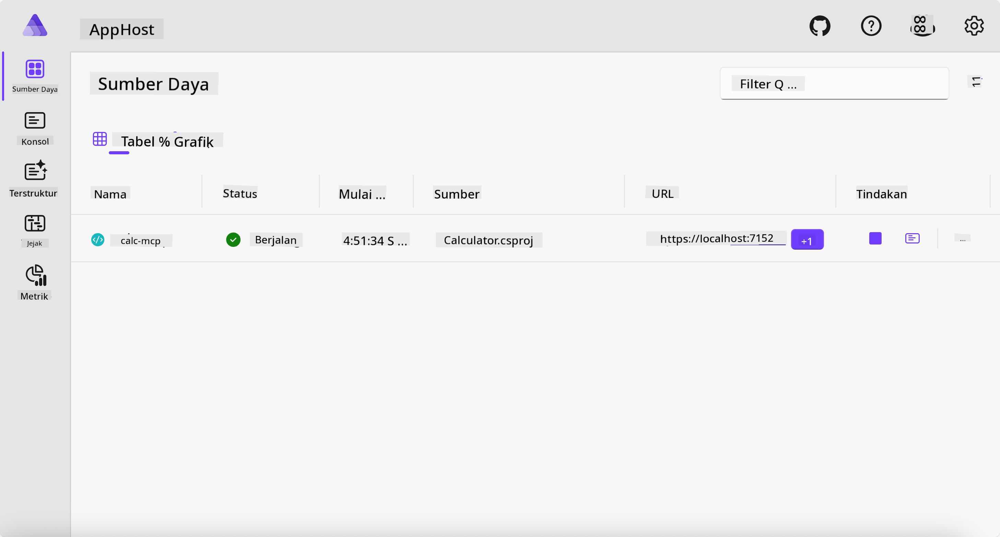
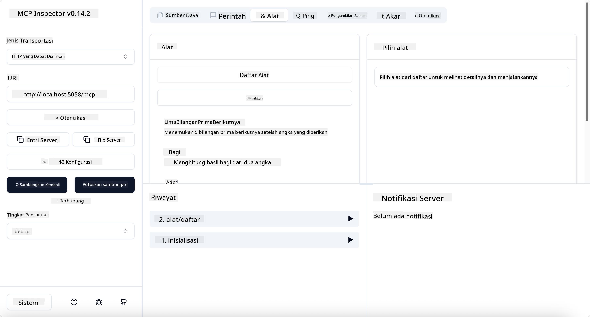
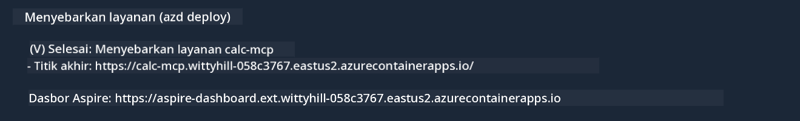

<!--
CO_OP_TRANSLATOR_METADATA:
{
  "original_hash": "0bc7bd48f55f1565f1d95ccb2c16f728",
  "translation_date": "2025-07-13T23:08:30+00:00",
  "source_file": "04-PracticalImplementation/samples/csharp/README.md",
  "language_code": "id"
}
-->
# Contoh

Contoh sebelumnya menunjukkan cara menggunakan proyek .NET lokal dengan tipe `stdio`. Dan bagaimana menjalankan server secara lokal di dalam container. Ini adalah solusi yang baik dalam banyak situasi. Namun, terkadang berguna untuk menjalankan server secara remote, misalnya di lingkungan cloud. Di sinilah tipe `http` digunakan.

Melihat solusi di folder `04-PracticalImplementation`, mungkin terlihat jauh lebih kompleks dibandingkan yang sebelumnya. Tapi sebenarnya tidak. Jika Anda perhatikan proyek `src/Calculator`, Anda akan melihat bahwa sebagian besar kodenya sama dengan contoh sebelumnya. Perbedaannya hanya kita menggunakan library berbeda yaitu `ModelContextProtocol.AspNetCore` untuk menangani permintaan HTTP. Dan kita mengubah metode `IsPrime` menjadi private, hanya untuk menunjukkan bahwa Anda bisa memiliki metode private dalam kode Anda. Sisanya sama seperti sebelumnya.

Proyek lain berasal dari [.NET Aspire](https://learn.microsoft.com/dotnet/aspire/get-started/aspire-overview). Memiliki .NET Aspire dalam solusi akan meningkatkan pengalaman pengembang saat mengembangkan dan menguji serta membantu dalam observabilitas. Ini tidak wajib untuk menjalankan server, tapi merupakan praktik yang baik untuk menyertakannya dalam solusi Anda.

## Menjalankan server secara lokal

1. Dari VS Code (dengan ekstensi C# DevKit), navigasikan ke direktori `04-PracticalImplementation/samples/csharp`.
1. Jalankan perintah berikut untuk memulai server:

   ```bash
    dotnet watch run --project ./src/AppHost
   ```

1. Saat browser web membuka dashboard .NET Aspire, catat URL `http`-nya. Seharusnya seperti `http://localhost:5058/`.

   

## Menguji Streamable HTTP dengan MCP Inspector

Jika Anda memiliki Node.js versi 22.7.5 ke atas, Anda bisa menggunakan MCP Inspector untuk menguji server Anda.

Jalankan server dan ketik perintah berikut di terminal:

```bash
npx @modelcontextprotocol/inspector http://localhost:5058
```



- Pilih `Streamable HTTP` sebagai tipe Transport.
- Di kolom Url, masukkan URL server yang sudah dicatat sebelumnya, dan tambahkan `/mcp`. Harus menggunakan `http` (bukan `https`), misalnya `http://localhost:5058/mcp`.
- Klik tombol Connect.

Hal yang menyenangkan dari Inspector adalah memberikan visibilitas yang baik tentang apa yang sedang terjadi.

- Coba daftar alat yang tersedia
- Coba beberapa alat tersebut, seharusnya berfungsi seperti sebelumnya.

## Menguji MCP Server dengan GitHub Copilot Chat di VS Code

Untuk menggunakan transport Streamable HTTP dengan GitHub Copilot Chat, ubah konfigurasi server `calc-mcp` yang sudah dibuat sebelumnya menjadi seperti ini:

```jsonc
// .vscode/mcp.json
{
  "servers": {
    "calc-mcp": {
      "type": "http",
      "url": "http://localhost:5058/mcp"
    }
  }
}
```

Lakukan beberapa pengujian:

- Minta "3 prime numbers after 6780". Perhatikan bagaimana Copilot akan menggunakan alat baru `NextFivePrimeNumbers` dan hanya mengembalikan 3 bilangan prima pertama.
- Minta "7 prime numbers after 111", untuk melihat apa yang terjadi.
- Minta "John has 24 lollies and wants to distribute them all to his 3 kids. How many lollies does each kid have?", untuk melihat apa yang terjadi.

## Deploy server ke Azure

Mari kita deploy server ke Azure agar lebih banyak orang bisa menggunakannya.

Dari terminal, navigasikan ke folder `04-PracticalImplementation/samples/csharp` dan jalankan perintah berikut:

```bash
azd up
```

Setelah proses deploy selesai, Anda akan melihat pesan seperti ini:



Ambil URL tersebut dan gunakan di MCP Inspector serta GitHub Copilot Chat.

```jsonc
// .vscode/mcp.json
{
  "servers": {
    "calc-mcp": {
      "type": "http",
      "url": "https://calc-mcp.gentleriver-3977fbcf.australiaeast.azurecontainerapps.io/mcp"
    }
  }
}
```

## Selanjutnya?

Kita sudah mencoba berbagai tipe transport dan alat pengujian. Kita juga sudah melakukan deploy MCP server ke Azure. Tapi bagaimana jika server kita perlu mengakses sumber daya privat? Misalnya, database atau API privat? Di bab berikutnya, kita akan melihat bagaimana cara meningkatkan keamanan server kita.

**Penafian**:  
Dokumen ini telah diterjemahkan menggunakan layanan terjemahan AI [Co-op Translator](https://github.com/Azure/co-op-translator). Meskipun kami berupaya untuk mencapai akurasi, harap diingat bahwa terjemahan otomatis mungkin mengandung kesalahan atau ketidakakuratan. Dokumen asli dalam bahasa aslinya harus dianggap sebagai sumber yang sahih. Untuk informasi penting, disarankan menggunakan terjemahan profesional oleh manusia. Kami tidak bertanggung jawab atas kesalahpahaman atau penafsiran yang keliru yang timbul dari penggunaan terjemahan ini.