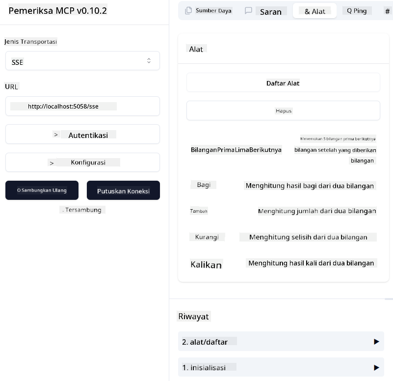

<!--
CO_OP_TRANSLATOR_METADATA:
{
  "original_hash": "5020a3e1a1c7f30c00f9e37f1fa208e3",
  "translation_date": "2025-05-17T14:10:40+00:00",
  "source_file": "04-PracticalImplementation/samples/csharp/README.md",
  "language_code": "id"
}
-->
# Contoh

Contoh sebelumnya menunjukkan cara menggunakan proyek .NET lokal dengan tipe `sdio`. Dan cara menjalankan server secara lokal dalam sebuah container. Ini adalah solusi yang baik dalam banyak situasi. Namun, bisa berguna jika server berjalan secara remote, seperti di lingkungan cloud. Di sinilah tipe `http` berperan.

Melihat solusi di folder `04-PracticalImplementation`, mungkin terlihat jauh lebih kompleks dibandingkan yang sebelumnya. Tapi sebenarnya, tidak begitu. Jika Anda melihat lebih dekat ke proyek `src/mcpserver/mcpserver.csproj`, Anda akan melihat bahwa sebagian besar kodenya sama dengan contoh sebelumnya. Satu-satunya perbedaan adalah kita menggunakan pustaka yang berbeda `ModelContextProtocol.AspNetCore` untuk menangani permintaan HTTP. Dan kita mengubah metode `IsPrime` menjadi privat, hanya untuk menunjukkan bahwa Anda bisa memiliki metode privat dalam kode Anda. Sisa kode sama seperti sebelumnya.

Proyek lainnya berasal dari [.NET Aspire](https://learn.microsoft.com/dotnet/aspire/get-started/aspire-overview). Memiliki .NET Aspire dalam solusi akan meningkatkan pengalaman pengembang saat mengembangkan dan menguji serta membantu dengan observabilitas. Ini tidak diperlukan untuk menjalankan server, tetapi merupakan praktik yang baik untuk memasukkannya dalam solusi Anda.

## Memulai server secara lokal

1. Dari VS Code (dengan ekstensi C# DevKit), buka solusi `04-PracticalImplementation\samples\csharp\src\Calculator-chap4.sln`.
2. Tekan `F5` untuk memulai server. Seharusnya akan membuka browser web dengan dasbor .NET Aspire.

atau

1. Dari terminal, navigasikan ke folder `04-PracticalImplementation\samples\csharp\src`
2. Jalankan perintah berikut untuk memulai server:
   ```bash
    dotnet run --project .\AppHost
   ```

3. Dari Dashboard, catat URL `http`. Seharusnya seperti `http://localhost:5058/`.

## Test `SSE` dengan ModelContext Protocol Inspector

Jika Anda memiliki Node.js 22.7.5 dan lebih tinggi, Anda dapat menggunakan ModelContext Protocol Inspector untuk menguji server Anda.

Mulai server dan jalankan perintah berikut di terminal:

```bash
npx @modelcontextprotocol/inspector@latest
```



- Pilih `SSE` as the Transport type. SSE stand for Server-Sent Events. 
- In the Url field, enter the URL of the server noted earlier,and append `/sse`. Seharusnya `http` (bukan `https`) something like `http://localhost:5058/sse`.
- select the Connect button.

A nice thing about the Inspector is that it provide a nice visibility on what is happening.

- Try listing the availables tools
- Try some of them, it should works just like before.


## Test `SSE` with Github Copilot Chat in VS Code

To use the `SSE` transport with Github Copilot Chat, change the configuration of the `mcp-calc` server yang dibuat sebelumnya untuk terlihat seperti ini:

```json
"mcp-calc": {
    "type": "sse",
    "url": "http://localhost:5058/sse"
}
```

Lakukan beberapa tes:
- Minta 3 bilangan prima setelah 6780. Perhatikan bagaimana Copilot akan menggunakan alat baru `NextFivePrimeNumbers` dan hanya mengembalikan 3 bilangan prima pertama.
- Minta 7 bilangan prima setelah 111, untuk melihat apa yang terjadi.


# Menyebarkan server ke Azure

Mari kita sebarkan server ke Azure agar lebih banyak orang bisa menggunakannya.

Dari terminal, navigasikan ke folder `04-PracticalImplementation\samples\csharp\src` dan jalankan perintah berikut:

```bash
azd init
```

Ini akan membuat beberapa file secara lokal untuk menyimpan konfigurasi sumber daya Azure, dan Infrastruktur Anda sebagai kode (IaC).

Kemudian, jalankan perintah berikut untuk menyebarkan server ke Azure:

```bash
azd up
```

Setelah penyebaran selesai, Anda akan melihat pesan seperti ini:


Navigasikan ke dasbor Aspire dan catat URL `HTTP` untuk digunakan di MCP Inspector dan di Github Copilot Chat.


## Apa selanjutnya?

Kita mencoba berbagai jenis transportasi, alat pengujian dan juga menyebarkan server MCP kita ke Azure. Tetapi bagaimana jika server kita perlu mengakses sumber daya privat? Misalnya, basis data atau API privat? Di bab berikutnya, kita akan melihat bagaimana kita dapat meningkatkan keamanan server kita.

**Penafian**:  
Dokumen ini telah diterjemahkan menggunakan layanan penerjemahan AI [Co-op Translator](https://github.com/Azure/co-op-translator). Meskipun kami berusaha untuk akurasi, harap diketahui bahwa terjemahan otomatis mungkin mengandung kesalahan atau ketidakakuratan. Dokumen asli dalam bahasa aslinya harus dianggap sebagai sumber yang berwenang. Untuk informasi penting, disarankan untuk menggunakan terjemahan manusia profesional. Kami tidak bertanggung jawab atas kesalahpahaman atau penafsiran yang salah yang timbul dari penggunaan terjemahan ini.