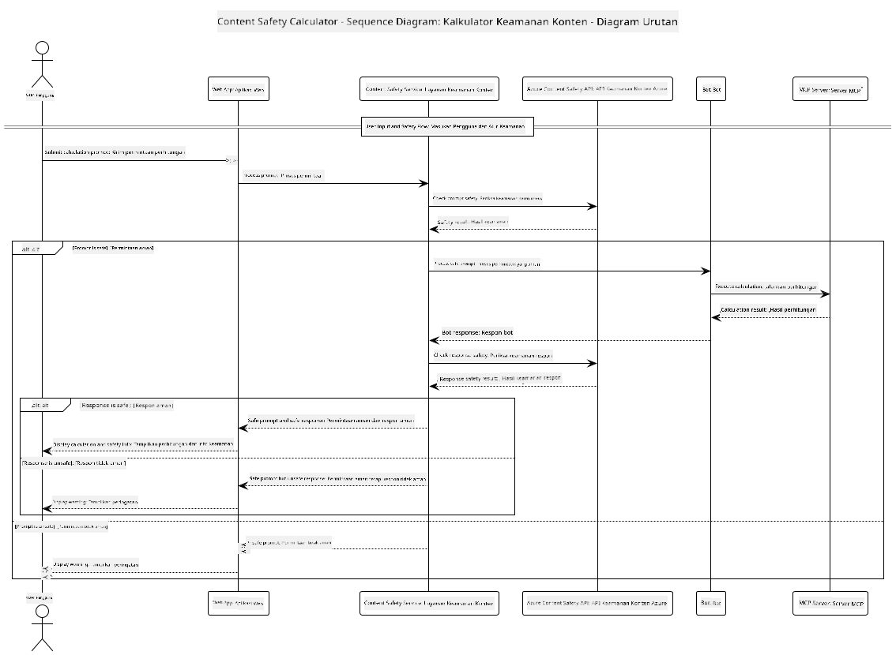

<!--
CO_OP_TRANSLATOR_METADATA:
{
  "original_hash": "e5ea5e7582f70008ea9bec3b3820f20a",
  "translation_date": "2025-07-13T23:18:28+00:00",
  "source_file": "04-PracticalImplementation/samples/java/containerapp/README.md",
  "language_code": "id"
}
-->
## Arsitektur Sistem

Proyek ini menunjukkan sebuah aplikasi web yang menggunakan pemeriksaan keamanan konten sebelum meneruskan perintah pengguna ke layanan kalkulator melalui Model Context Protocol (MCP).



### Cara Kerjanya

1. **Input Pengguna**: Pengguna memasukkan perintah perhitungan di antarmuka web  
2. **Penyaringan Keamanan Konten (Input)**: Perintah dianalisis oleh Azure Content Safety API  
3. **Keputusan Keamanan (Input)**:  
   - Jika konten aman (tingkat keparahan < 2 di semua kategori), proses dilanjutkan ke kalkulator  
   - Jika konten terdeteksi berpotensi berbahaya, proses dihentikan dan mengembalikan peringatan  
4. **Integrasi Kalkulator**: Konten yang aman diproses oleh LangChain4j, yang berkomunikasi dengan server kalkulator MCP  
5. **Penyaringan Keamanan Konten (Output)**: Respon bot dianalisis oleh Azure Content Safety API  
6. **Keputusan Keamanan (Output)**:  
   - Jika respon bot aman, ditampilkan ke pengguna  
   - Jika respon bot terdeteksi berpotensi berbahaya, diganti dengan peringatan  
7. **Respon**: Hasil (jika aman) ditampilkan kepada pengguna beserta kedua analisis keamanan

## Menggunakan Model Context Protocol (MCP) dengan Layanan Kalkulator

Proyek ini menunjukkan cara menggunakan Model Context Protocol (MCP) untuk memanggil layanan kalkulator MCP dari LangChain4j. Implementasinya menggunakan server MCP lokal yang berjalan di port 8080 untuk menyediakan operasi kalkulator.

### Menyiapkan Layanan Azure Content Safety

Sebelum menggunakan fitur keamanan konten, Anda perlu membuat sumber daya layanan Azure Content Safety:

1. Masuk ke [Azure Portal](https://portal.azure.com)  
2. Klik "Create a resource" dan cari "Content Safety"  
3. Pilih "Content Safety" dan klik "Create"  
4. Masukkan nama unik untuk sumber daya Anda  
5. Pilih langganan dan grup sumber daya Anda (atau buat yang baru)  
6. Pilih wilayah yang didukung (cek [Ketersediaan Wilayah](https://azure.microsoft.com/en-us/global-infrastructure/services/?products=cognitive-services) untuk detail)  
7. Pilih tingkat harga yang sesuai  
8. Klik "Create" untuk menerapkan sumber daya  
9. Setelah penerapan selesai, klik "Go to resource"  
10. Di panel kiri, di bawah "Resource Management", pilih "Keys and Endpoint"  
11. Salin salah satu kunci dan URL endpoint untuk digunakan pada langkah berikutnya

### Mengonfigurasi Variabel Lingkungan

Setel variabel lingkungan `GITHUB_TOKEN` untuk autentikasi model GitHub:  
```sh
export GITHUB_TOKEN=<your_github_token>
```

Untuk fitur keamanan konten, setel:  
```sh
export CONTENT_SAFETY_ENDPOINT=<your_content_safety_endpoint>
export CONTENT_SAFETY_KEY=<your_content_safety_key>
```

Variabel lingkungan ini digunakan oleh aplikasi untuk autentikasi dengan layanan Azure Content Safety. Jika variabel ini tidak disetel, aplikasi akan menggunakan nilai placeholder untuk tujuan demonstrasi, namun fitur keamanan konten tidak akan berfungsi dengan baik.

### Memulai Server MCP Kalkulator

Sebelum menjalankan klien, Anda perlu memulai server MCP kalkulator dalam mode SSE di localhost:8080.

## Deskripsi Proyek

Proyek ini menunjukkan integrasi Model Context Protocol (MCP) dengan LangChain4j untuk memanggil layanan kalkulator. Fitur utama meliputi:

- Menggunakan MCP untuk terhubung ke layanan kalkulator untuk operasi matematika dasar  
- Pemeriksaan keamanan konten berlapis ganda pada perintah pengguna dan respon bot  
- Integrasi dengan model gpt-4.1-nano dari GitHub melalui LangChain4j  
- Menggunakan Server-Sent Events (SSE) untuk transportasi MCP

## Integrasi Keamanan Konten

Proyek ini mencakup fitur keamanan konten yang komprehensif untuk memastikan bahwa baik input pengguna maupun respon sistem bebas dari konten berbahaya:

1. **Penyaringan Input**: Semua perintah pengguna dianalisis untuk kategori konten berbahaya seperti ujaran kebencian, kekerasan, menyakiti diri sendiri, dan konten seksual sebelum diproses.  

2. **Penyaringan Output**: Bahkan saat menggunakan model yang mungkin tidak tersensor, sistem memeriksa semua respon yang dihasilkan melalui filter keamanan konten yang sama sebelum ditampilkan ke pengguna.

Pendekatan berlapis ganda ini memastikan sistem tetap aman terlepas dari model AI yang digunakan, melindungi pengguna dari input berbahaya maupun keluaran AI yang berpotensi bermasalah.

## Klien Web

Aplikasi ini menyertakan antarmuka web yang ramah pengguna yang memungkinkan pengguna berinteraksi dengan sistem Content Safety Calculator:

### Fitur Antarmuka Web

- Formulir sederhana dan intuitif untuk memasukkan perintah perhitungan  
- Validasi keamanan konten berlapis ganda (input dan output)  
- Umpan balik waktu nyata tentang keamanan perintah dan respon  
- Indikator keamanan berwarna untuk memudahkan interpretasi  
- Desain bersih dan responsif yang bekerja di berbagai perangkat  
- Contoh perintah aman untuk memandu pengguna

### Menggunakan Klien Web

1. Mulai aplikasi:  
   ```sh
   mvn spring-boot:run
   ```

2. Buka browser dan akses `http://localhost:8087`

3. Masukkan perintah perhitungan di area teks yang disediakan (misalnya, "Calculate the sum of 24.5 and 17.3")

4. Klik "Submit" untuk memproses permintaan Anda

5. Lihat hasilnya, yang akan mencakup:  
   - Analisis keamanan konten dari perintah Anda  
   - Hasil perhitungan (jika perintah aman)  
   - Analisis keamanan konten dari respon bot  
   - Peringatan keamanan jika input atau output terdeteksi bermasalah

Klien web secara otomatis menangani kedua proses verifikasi keamanan konten, memastikan semua interaksi aman dan sesuai terlepas dari model AI yang digunakan.

**Penafian**:  
Dokumen ini telah diterjemahkan menggunakan layanan terjemahan AI [Co-op Translator](https://github.com/Azure/co-op-translator). Meskipun kami berupaya untuk mencapai akurasi, harap diperhatikan bahwa terjemahan otomatis mungkin mengandung kesalahan atau ketidakakuratan. Dokumen asli dalam bahasa aslinya harus dianggap sebagai sumber yang sahih. Untuk informasi penting, disarankan menggunakan terjemahan profesional oleh manusia. Kami tidak bertanggung jawab atas kesalahpahaman atau penafsiran yang keliru yang timbul dari penggunaan terjemahan ini.