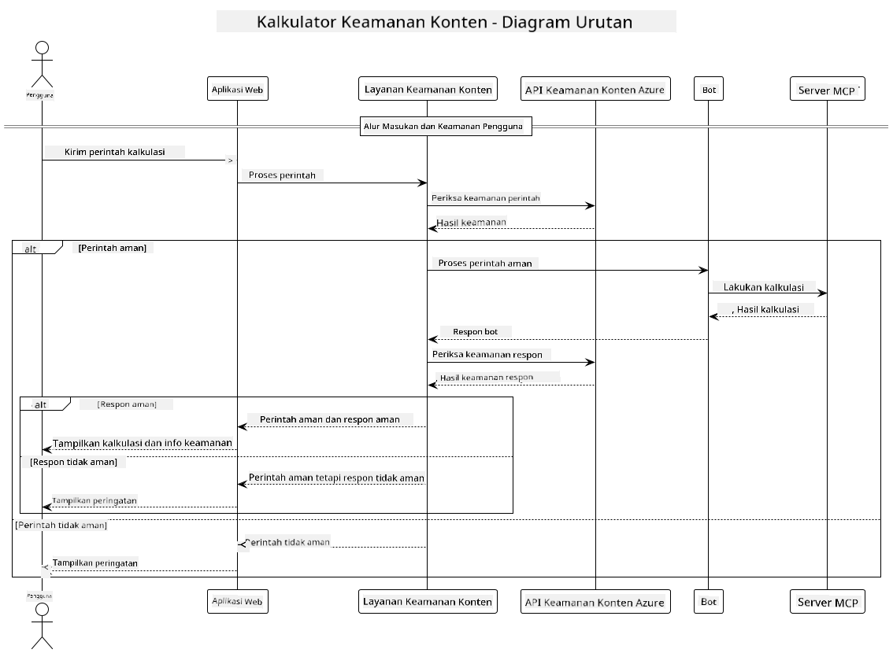

<!--
CO_OP_TRANSLATOR_METADATA:
{
  "original_hash": "e5ea5e7582f70008ea9bec3b3820f20a",
  "translation_date": "2025-05-17T14:29:29+00:00",
  "source_file": "04-PracticalImplementation/samples/java/containerapp/README.md",
  "language_code": "id"
}
-->
## Arsitektur Sistem

Proyek ini menunjukkan aplikasi web yang menggunakan pemeriksaan keamanan konten sebelum meneruskan permintaan pengguna ke layanan kalkulator melalui Model Context Protocol (MCP).



### Cara Kerjanya

1. **Input Pengguna**: Pengguna memasukkan permintaan kalkulasi di antarmuka web
2. **Pemeriksaan Keamanan Konten (Input)**: Permintaan dianalisis oleh Azure Content Safety API
3. **Keputusan Keamanan (Input)**:
   - Jika konten aman (tingkat keparahan < 2 di semua kategori), diteruskan ke kalkulator
   - Jika konten ditandai sebagai berpotensi berbahaya, proses berhenti dan mengembalikan peringatan
4. **Integrasi Kalkulator**: Konten yang aman diproses oleh LangChain4j, yang berkomunikasi dengan server kalkulator MCP
5. **Pemeriksaan Keamanan Konten (Output)**: Respons bot dianalisis oleh Azure Content Safety API
6. **Keputusan Keamanan (Output)**:
   - Jika respons bot aman, ditampilkan kepada pengguna
   - Jika respons bot ditandai sebagai berpotensi berbahaya, diganti dengan peringatan
7. **Respons**: Hasil (jika aman) ditampilkan kepada pengguna bersama dengan kedua analisis keamanan

## Menggunakan Model Context Protocol (MCP) dengan Layanan Kalkulator

Proyek ini menunjukkan cara menggunakan Model Context Protocol (MCP) untuk memanggil layanan kalkulator MCP dari LangChain4j. Implementasi menggunakan server MCP lokal yang berjalan pada port 8080 untuk menyediakan operasi kalkulator.

### Menyiapkan Layanan Keamanan Konten Azure

Sebelum menggunakan fitur keamanan konten, Anda perlu membuat sumber daya layanan Keamanan Konten Azure:

1. Masuk ke [Azure Portal](https://portal.azure.com)
2. Klik "Create a resource" dan cari "Content Safety"
3. Pilih "Content Safety" dan klik "Create"
4. Masukkan nama unik untuk sumber daya Anda
5. Pilih langganan dan grup sumber daya Anda (atau buat yang baru)
6. Pilih wilayah yang didukung (periksa [Ketersediaan Wilayah](https://azure.microsoft.com/en-us/global-infrastructure/services/?products=cognitive-services) untuk detail)
7. Pilih tingkat harga yang sesuai
8. Klik "Create" untuk menerapkan sumber daya
9. Setelah penerapan selesai, klik "Go to resource"
10. Di panel kiri, di bawah "Resource Management", pilih "Keys and Endpoint"
11. Salin salah satu kunci dan URL endpoint untuk digunakan pada langkah berikutnya

### Mengonfigurasi Variabel Lingkungan

Set variabel lingkungan `GITHUB_TOKEN` untuk otentikasi model GitHub:
```sh
export GITHUB_TOKEN=<your_github_token>
```

Untuk fitur keamanan konten, set:
```sh
export CONTENT_SAFETY_ENDPOINT=<your_content_safety_endpoint>
export CONTENT_SAFETY_KEY=<your_content_safety_key>
```

Variabel lingkungan ini digunakan oleh aplikasi untuk otentikasi dengan layanan Keamanan Konten Azure. Jika variabel ini tidak diatur, aplikasi akan menggunakan nilai placeholder untuk tujuan demonstrasi, tetapi fitur keamanan konten tidak akan berfungsi dengan baik.

### Memulai Server Kalkulator MCP

Sebelum menjalankan klien, Anda perlu memulai server kalkulator MCP dalam mode SSE di localhost:8080.

## Deskripsi Proyek

Proyek ini menunjukkan integrasi Model Context Protocol (MCP) dengan LangChain4j untuk memanggil layanan kalkulator. Fitur utama meliputi:

- Menggunakan MCP untuk terhubung ke layanan kalkulator untuk operasi matematika dasar
- Pemeriksaan keamanan konten berlapis ganda pada permintaan pengguna dan respons bot
- Integrasi dengan model gpt-4.1-nano GitHub melalui LangChain4j
- Menggunakan Server-Sent Events (SSE) untuk transportasi MCP

## Integrasi Keamanan Konten

Proyek ini mencakup fitur keamanan konten yang komprehensif untuk memastikan bahwa input pengguna dan respons sistem bebas dari konten berbahaya:

1. **Pemeriksaan Input**: Semua permintaan pengguna dianalisis untuk kategori konten berbahaya seperti ujaran kebencian, kekerasan, melukai diri sendiri, dan konten seksual sebelum diproses.

2. **Pemeriksaan Output**: Bahkan saat menggunakan model yang mungkin tidak disensor, sistem memeriksa semua respons yang dihasilkan melalui filter keamanan konten yang sama sebelum menampilkannya kepada pengguna.

Pendekatan berlapis ganda ini memastikan bahwa sistem tetap aman terlepas dari model AI yang digunakan, melindungi pengguna dari input berbahaya dan output yang berpotensi bermasalah yang dihasilkan AI.

## Klien Web

Aplikasi ini mencakup antarmuka web yang ramah pengguna yang memungkinkan pengguna berinteraksi dengan sistem Kalkulator Keamanan Konten:

### Fitur Antarmuka Web

- Formulir sederhana dan intuitif untuk memasukkan permintaan kalkulasi
- Validasi keamanan konten berlapis ganda (input dan output)
- Umpan balik waktu nyata tentang keamanan permintaan dan respons
- Indikator keamanan berwarna untuk interpretasi yang mudah
- Desain bersih dan responsif yang bekerja pada berbagai perangkat
- Contoh permintaan aman untuk membimbing pengguna

### Menggunakan Klien Web

1. Mulai aplikasi:
   ```sh
   mvn spring-boot:run
   ```

2. Buka browser Anda dan navigasikan ke `http://localhost:8087`

3. Masukkan permintaan kalkulasi di area teks yang disediakan (misalnya, "Hitung jumlah dari 24.5 dan 17.3")

4. Klik "Submit" untuk memproses permintaan Anda

5. Lihat hasilnya, yang akan mencakup:
   - Analisis keamanan konten dari permintaan Anda
   - Hasil kalkulasi (jika permintaan aman)
   - Analisis keamanan konten dari respons bot
   - Peringatan keamanan jika baik input atau output ditandai

Klien web secara otomatis menangani kedua proses verifikasi keamanan konten, memastikan semua interaksi aman dan sesuai terlepas dari model AI yang digunakan.

**Penafian**:  
Dokumen ini telah diterjemahkan menggunakan layanan terjemahan AI [Co-op Translator](https://github.com/Azure/co-op-translator). Meskipun kami berusaha untuk mencapai ketepatan, harap diperhatikan bahwa terjemahan otomatis mungkin mengandung kesalahan atau ketidakakuratan. Dokumen asli dalam bahasa aslinya harus dianggap sebagai sumber yang berwenang. Untuk informasi penting, disarankan menggunakan terjemahan manusia profesional. Kami tidak bertanggung jawab atas kesalahpahaman atau interpretasi yang salah yang timbul dari penggunaan terjemahan ini.