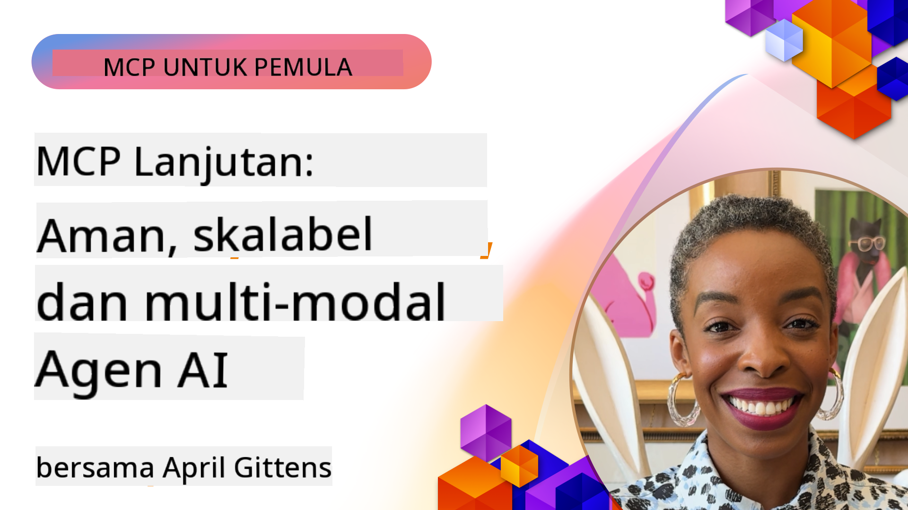

<!--
CO_OP_TRANSLATOR_METADATA:
{
  "original_hash": "d204bc94ea6027d06a703b21b711ca57",
  "translation_date": "2025-08-18T17:33:39+00:00",
  "source_file": "05-AdvancedTopics/README.md",
  "language_code": "id"
}
-->
# Topik Lanjutan dalam MCP

_(Klik gambar di atas untuk menonton video pelajaran ini)_

Bab ini membahas serangkaian topik lanjutan dalam implementasi Model Context Protocol (MCP), termasuk integrasi multi-modal, skalabilitas, praktik terbaik keamanan, dan integrasi perusahaan. Topik-topik ini sangat penting untuk membangun aplikasi MCP yang tangguh dan siap produksi yang dapat memenuhi kebutuhan sistem AI modern.

## Ikhtisar

Pelajaran ini mengeksplorasi konsep-konsep lanjutan dalam implementasi Model Context Protocol, dengan fokus pada integrasi multi-modal, skalabilitas, praktik terbaik keamanan, dan integrasi perusahaan. Topik-topik ini penting untuk membangun aplikasi MCP tingkat produksi yang mampu menangani kebutuhan kompleks di lingkungan perusahaan.

## Tujuan Pembelajaran

Pada akhir pelajaran ini, Anda akan dapat:

- Mengimplementasikan kemampuan multi-modal dalam kerangka MCP
- Merancang arsitektur MCP yang skalabel untuk skenario dengan permintaan tinggi
- Menerapkan praktik terbaik keamanan yang selaras dengan prinsip keamanan MCP
- Mengintegrasikan MCP dengan sistem dan kerangka kerja AI perusahaan
- Mengoptimalkan kinerja dan keandalan di lingkungan produksi

## Pelajaran dan Proyek Contoh

| Tautan | Judul | Deskripsi |
|-------|-------|-----------|
| [5.1 Integrasi dengan Azure](./mcp-integration/README.md) | Integrasi dengan Azure | Pelajari cara mengintegrasikan Server MCP Anda di Azure |
| [5.2 Contoh Multi-modal](./mcp-multi-modality/README.md) | Contoh Multi-modal MCP | Contoh untuk audio, gambar, dan respons multi-modal |
| [5.3 Contoh OAuth2 MCP](../../../05-AdvancedTopics/mcp-oauth2-demo) | Demo OAuth2 MCP | Aplikasi Spring Boot minimal yang menunjukkan OAuth2 dengan MCP, baik sebagai Server Otorisasi maupun Server Sumber Daya. Menunjukkan penerbitan token yang aman, endpoint yang dilindungi, penyebaran Azure Container Apps, dan integrasi API Management. |
| [5.4 Root Contexts](./mcp-root-contexts/README.md) | Root Contexts | Pelajari lebih lanjut tentang root context dan cara mengimplementasikannya |
| [5.5 Routing](./mcp-routing/README.md) | Routing | Pelajari berbagai jenis routing |
| [5.6 Sampling](./mcp-sampling/README.md) | Sampling | Pelajari cara bekerja dengan sampling |
| [5.7 Skalabilitas](./mcp-scaling/README.md) | Skalabilitas | Pelajari tentang skalabilitas |
| [5.8 Keamanan](./mcp-security/README.md) | Keamanan | Amankan Server MCP Anda |
| [5.9 Contoh Pencarian Web](./web-search-mcp/README.md) | MCP Pencarian Web | Server dan klien MCP Python yang terintegrasi dengan SerpAPI untuk pencarian web, berita, produk, dan Q&A secara real-time. Menunjukkan orkestrasi multi-alat, integrasi API eksternal, dan penanganan kesalahan yang tangguh. |
| [5.10 Streaming Real-time](./mcp-realtimestreaming/README.md) | Streaming | Streaming data real-time menjadi penting di dunia yang didorong oleh data saat ini, di mana bisnis dan aplikasi membutuhkan akses langsung ke informasi untuk membuat keputusan tepat waktu. |
| [5.11 Pencarian Web Real-time](./mcp-realtimesearch/README.md) | Pencarian Web | Bagaimana MCP mengubah pencarian web real-time dengan menyediakan pendekatan standar untuk manajemen konteks di seluruh model AI, mesin pencari, dan aplikasi. |
| [5.12 Autentikasi Entra ID untuk Server Model Context Protocol](./mcp-security-entra/README.md) | Autentikasi Entra ID | Microsoft Entra ID menyediakan solusi manajemen identitas dan akses berbasis cloud yang tangguh, membantu memastikan bahwa hanya pengguna dan aplikasi yang berwenang yang dapat berinteraksi dengan server MCP Anda. |
| [5.13 Integrasi Agen Azure AI Foundry](./mcp-foundry-agent-integration/README.md) | Integrasi Azure AI Foundry | Pelajari cara mengintegrasikan server Model Context Protocol dengan agen Azure AI Foundry, memungkinkan orkestrasi alat yang kuat dan kemampuan AI perusahaan dengan koneksi sumber data eksternal yang terstandarisasi. |
| [5.14 Rekayasa Konteks](./mcp-contextengineering/README.md) | Rekayasa Konteks | Peluang masa depan teknik rekayasa konteks untuk server MCP, termasuk optimasi konteks, manajemen konteks dinamis, dan strategi untuk rekayasa prompt yang efektif dalam kerangka MCP. |

## Referensi Tambahan

Untuk informasi terbaru tentang topik MCP lanjutan, lihat:
- [Dokumentasi MCP](https://modelcontextprotocol.io/)
- [Spesifikasi MCP](https://spec.modelcontextprotocol.io/)
- [Repositori GitHub](https://github.com/modelcontextprotocol)

## Poin Penting

- Implementasi MCP multi-modal memperluas kemampuan AI di luar pemrosesan teks
- Skalabilitas sangat penting untuk penyebaran perusahaan dan dapat diatasi melalui skalabilitas horizontal dan vertikal
- Langkah-langkah keamanan yang komprehensif melindungi data dan memastikan kontrol akses yang tepat
- Integrasi perusahaan dengan platform seperti Azure OpenAI dan Microsoft AI Foundry meningkatkan kemampuan MCP
- Implementasi MCP lanjutan mendapat manfaat dari arsitektur yang dioptimalkan dan manajemen sumber daya yang hati-hati

## Latihan

Rancang implementasi MCP tingkat perusahaan untuk kasus penggunaan tertentu:

1. Identifikasi kebutuhan multi-modal untuk kasus penggunaan Anda
2. Garis besar kontrol keamanan yang diperlukan untuk melindungi data sensitif
3. Rancang arsitektur yang skalabel yang dapat menangani beban yang bervariasi
4. Rencanakan titik integrasi dengan sistem AI perusahaan
5. Dokumentasikan potensi hambatan kinerja dan strategi mitigasi

## Sumber Daya Tambahan

- [Dokumentasi Azure OpenAI](https://learn.microsoft.com/en-us/azure/ai-services/openai/)
- [Dokumentasi Microsoft AI Foundry](https://learn.microsoft.com/en-us/ai-services/)

---

## Apa Selanjutnya

- [5.1 Integrasi MCP](./mcp-integration/README.md)

**Penafian**:  
Dokumen ini telah diterjemahkan menggunakan layanan penerjemahan AI [Co-op Translator](https://github.com/Azure/co-op-translator). Meskipun kami berupaya untuk memberikan hasil yang akurat, harap diperhatikan bahwa terjemahan otomatis mungkin mengandung kesalahan atau ketidakakuratan. Dokumen asli dalam bahasa aslinya harus dianggap sebagai sumber yang berwenang. Untuk informasi yang bersifat kritis, disarankan menggunakan jasa penerjemahan manusia profesional. Kami tidak bertanggung jawab atas kesalahpahaman atau penafsiran yang keliru yang timbul dari penggunaan terjemahan ini.