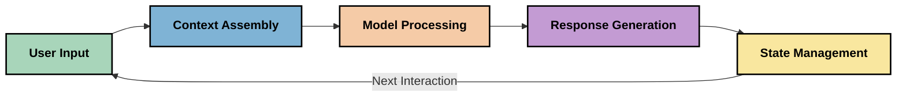
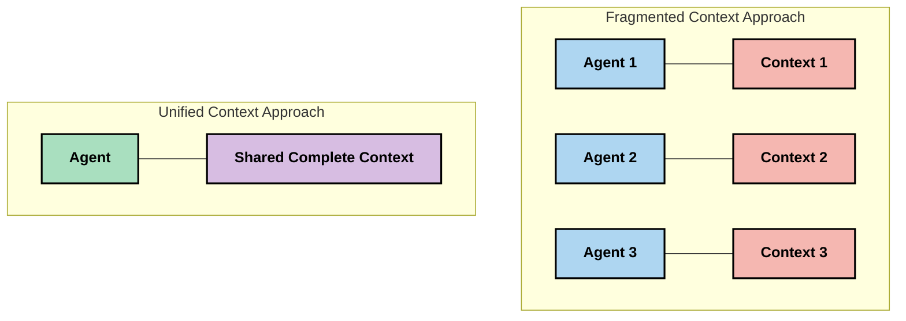
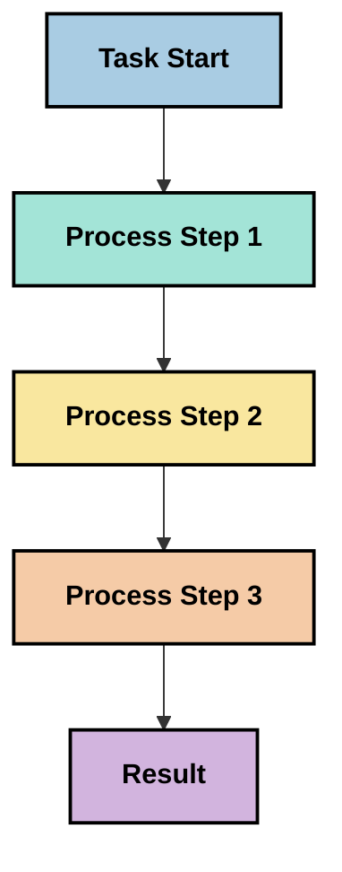
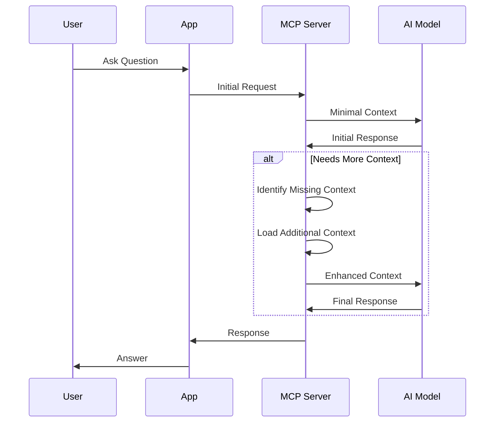
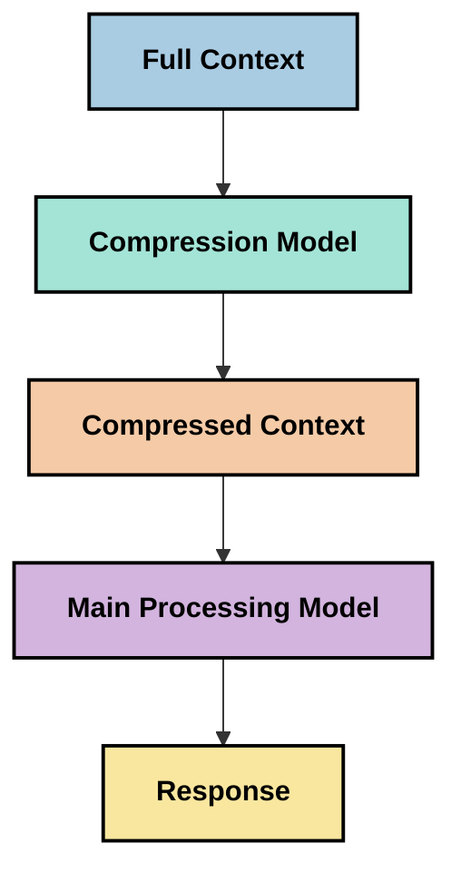
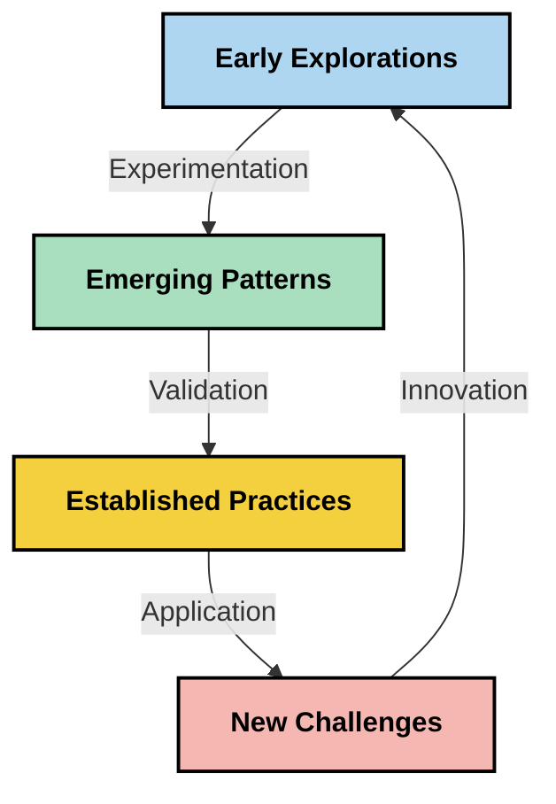

<!--
CO_OP_TRANSLATOR_METADATA:
{
  "original_hash": "fd169ca3071b81b5ee282e194bc823df",
  "translation_date": "2025-09-15T20:49:04+00:00",
  "source_file": "05-AdvancedTopics/mcp-contextengineering/README.md",
  "language_code": "id"
}
-->
# Rekayasa Konteks: Konsep Baru dalam Ekosistem MCP

## Ikhtisar

Rekayasa konteks adalah konsep baru dalam ruang AI yang mengeksplorasi bagaimana informasi disusun, disampaikan, dan dipelihara selama interaksi antara klien dan layanan AI. Seiring berkembangnya ekosistem Model Context Protocol (MCP), memahami cara mengelola konteks secara efektif menjadi semakin penting. Modul ini memperkenalkan konsep rekayasa konteks dan mengeksplorasi potensi aplikasinya dalam implementasi MCP.

## Tujuan Pembelajaran

Pada akhir modul ini, Anda akan dapat:

- Memahami konsep baru rekayasa konteks dan perannya dalam aplikasi MCP
- Mengidentifikasi tantangan utama dalam pengelolaan konteks yang diatasi oleh desain protokol MCP
- Mengeksplorasi teknik untuk meningkatkan kinerja model melalui pengelolaan konteks yang lebih baik
- Mempertimbangkan pendekatan untuk mengukur dan mengevaluasi efektivitas konteks
- Menerapkan konsep baru ini untuk meningkatkan pengalaman AI melalui kerangka MCP

## Pengantar Rekayasa Konteks

Rekayasa konteks adalah konsep baru yang berfokus pada desain dan pengelolaan aliran informasi secara sengaja antara pengguna, aplikasi, dan model AI. Berbeda dengan bidang yang sudah mapan seperti rekayasa prompt, rekayasa konteks masih didefinisikan oleh para praktisi saat mereka bekerja untuk menyelesaikan tantangan unik dalam memberikan informasi yang tepat kepada model AI pada waktu yang tepat.

Seiring berkembangnya model bahasa besar (LLM), pentingnya konteks menjadi semakin jelas. Kualitas, relevansi, dan struktur konteks yang kita berikan secara langsung memengaruhi keluaran model. Rekayasa konteks mengeksplorasi hubungan ini dan berupaya mengembangkan prinsip-prinsip untuk pengelolaan konteks yang efektif.

> "Pada tahun 2025, model yang ada sangat cerdas. Namun bahkan manusia paling pintar pun tidak akan dapat melakukan pekerjaannya dengan baik tanpa konteks tentang apa yang diminta untuk mereka lakukan... 'Rekayasa konteks' adalah tingkat berikutnya dari rekayasa prompt. Ini tentang melakukannya secara otomatis dalam sistem yang dinamis." — Walden Yan, Cognition AI

Rekayasa konteks mungkin mencakup:

1. **Pemilihan Konteks**: Menentukan informasi apa yang relevan untuk tugas tertentu
2. **Penyusunan Konteks**: Mengorganisasi informasi untuk memaksimalkan pemahaman model
3. **Penyampaian Konteks**: Mengoptimalkan cara dan waktu informasi dikirim ke model
4. **Pemeliharaan Konteks**: Mengelola keadaan dan evolusi konteks dari waktu ke waktu
5. **Evaluasi Konteks**: Mengukur dan meningkatkan efektivitas konteks

Area fokus ini sangat relevan untuk ekosistem MCP, yang menyediakan cara standar bagi aplikasi untuk memberikan konteks kepada LLM.

## Perspektif Perjalanan Konteks

Salah satu cara untuk memvisualisasikan rekayasa konteks adalah dengan menelusuri perjalanan informasi melalui sistem MCP:



### Tahapan Utama dalam Perjalanan Konteks:

1. **Input Pengguna**: Informasi mentah dari pengguna (teks, gambar, dokumen)
2. **Perakitan Konteks**: Menggabungkan input pengguna dengan konteks sistem, riwayat percakapan, dan informasi lain yang diambil
3. **Pemrosesan Model**: Model AI memproses konteks yang dirakit
4. **Pembuatan Respons**: Model menghasilkan keluaran berdasarkan konteks yang diberikan
5. **Manajemen Keadaan**: Sistem memperbarui keadaan internalnya berdasarkan interaksi

Perspektif ini menyoroti sifat dinamis konteks dalam sistem AI dan mengajukan pertanyaan penting tentang cara terbaik mengelola informasi di setiap tahap.

## Prinsip-Prinsip Baru dalam Rekayasa Konteks

Seiring terbentuknya bidang rekayasa konteks, beberapa prinsip awal mulai muncul dari para praktisi. Prinsip-prinsip ini dapat membantu menginformasikan pilihan implementasi MCP:

### Prinsip 1: Bagikan Konteks Secara Lengkap

Konteks harus dibagikan sepenuhnya antara semua komponen sistem daripada terfragmentasi di berbagai agen atau proses. Ketika konteks terdistribusi, keputusan yang dibuat di satu bagian sistem dapat bertentangan dengan keputusan yang dibuat di tempat lain.



Dalam aplikasi MCP, ini menyarankan desain sistem di mana konteks mengalir dengan lancar melalui seluruh pipeline daripada terkotak-kotak.

### Prinsip 2: Sadari Bahwa Tindakan Membawa Keputusan Implisit

Setiap tindakan yang diambil model mencerminkan keputusan implisit tentang cara menafsirkan konteks. Ketika beberapa komponen bertindak berdasarkan konteks yang berbeda, keputusan implisit ini dapat bertentangan, menghasilkan hasil yang tidak konsisten.

Prinsip ini memiliki implikasi penting untuk aplikasi MCP:
- Lebih memilih pemrosesan linear untuk tugas kompleks daripada eksekusi paralel dengan konteks yang terfragmentasi
- Memastikan bahwa semua titik keputusan memiliki akses ke informasi kontekstual yang sama
- Merancang sistem di mana langkah-langkah selanjutnya dapat melihat konteks penuh dari keputusan sebelumnya

### Prinsip 3: Seimbangkan Kedalaman Konteks dengan Batasan Jendela

Seiring percakapan dan proses menjadi lebih panjang, jendela konteks akhirnya meluap. Rekayasa konteks yang efektif mengeksplorasi pendekatan untuk mengelola ketegangan antara konteks yang komprehensif dan keterbatasan teknis.

Pendekatan potensial yang sedang dieksplorasi meliputi:
- Kompresi konteks yang mempertahankan informasi penting sambil mengurangi penggunaan token
- Pemuatan progresif konteks berdasarkan relevansi dengan kebutuhan saat ini
- Ringkasan interaksi sebelumnya sambil mempertahankan keputusan dan fakta utama

## Tantangan Konteks dan Desain Protokol MCP

Model Context Protocol (MCP) dirancang dengan kesadaran akan tantangan unik pengelolaan konteks. Memahami tantangan ini membantu menjelaskan aspek-aspek utama desain protokol MCP:

### Tantangan 1: Batasan Jendela Konteks
Sebagian besar model AI memiliki ukuran jendela konteks tetap, membatasi seberapa banyak informasi yang dapat mereka proses sekaligus.

**Respon Desain MCP:** 
- Protokol mendukung konteks berbasis sumber daya yang terstruktur yang dapat dirujuk secara efisien
- Sumber daya dapat dipaginasi dan dimuat secara progresif

### Tantangan 2: Penentuan Relevansi
Menentukan informasi mana yang paling relevan untuk dimasukkan dalam konteks adalah hal yang sulit.

**Respon Desain MCP:**
- Alat fleksibel memungkinkan pengambilan informasi secara dinamis berdasarkan kebutuhan
- Prompt terstruktur memungkinkan pengorganisasian konteks yang konsisten

### Tantangan 3: Persistensi Konteks
Mengelola keadaan di seluruh interaksi membutuhkan pelacakan konteks yang cermat.

**Respon Desain MCP:**
- Manajemen sesi yang terstandarisasi
- Pola interaksi yang jelas untuk evolusi konteks

### Tantangan 4: Konteks Multi-Modal
Berbagai jenis data (teks, gambar, data terstruktur) memerlukan penanganan yang berbeda.

**Respon Desain MCP:**
- Desain protokol mengakomodasi berbagai jenis konten
- Representasi standar informasi multi-modal

### Tantangan 5: Keamanan dan Privasi
Konteks sering kali mengandung informasi sensitif yang harus dilindungi.

**Respon Desain MCP:**
- Batasan yang jelas antara tanggung jawab klien dan server
- Opsi pemrosesan lokal untuk meminimalkan paparan data

Memahami tantangan ini dan bagaimana MCP mengatasinya memberikan dasar untuk mengeksplorasi teknik rekayasa konteks yang lebih maju.

## Pendekatan Rekayasa Konteks yang Baru

Seiring berkembangnya bidang rekayasa konteks, beberapa pendekatan menjanjikan mulai muncul. Pendekatan ini mewakili pemikiran saat ini daripada praktik terbaik yang sudah mapan, dan kemungkinan akan berkembang seiring bertambahnya pengalaman dengan implementasi MCP.

### 1. Pemrosesan Linear Berulir Tunggal

Berbeda dengan arsitektur multi-agen yang mendistribusikan konteks, beberapa praktisi menemukan bahwa pemrosesan linear berulir tunggal menghasilkan hasil yang lebih konsisten. Ini sejalan dengan prinsip mempertahankan konteks yang terpadu.



Meskipun pendekatan ini mungkin tampak kurang efisien dibandingkan pemrosesan paralel, sering kali menghasilkan hasil yang lebih koheren dan andal karena setiap langkah dibangun berdasarkan pemahaman lengkap tentang keputusan sebelumnya.

### 2. Pengelompokan dan Prioritas Konteks

Memecah konteks besar menjadi bagian-bagian yang dapat dikelola dan memprioritaskan yang paling penting.

```python
# Conceptual Example: Context Chunking and Prioritization
def process_with_chunked_context(documents, query):
    # 1. Break documents into smaller chunks
    chunks = chunk_documents(documents)
    
    # 2. Calculate relevance scores for each chunk
    scored_chunks = [(chunk, calculate_relevance(chunk, query)) for chunk in chunks]
    
    # 3. Sort chunks by relevance score
    sorted_chunks = sorted(scored_chunks, key=lambda x: x[1], reverse=True)
    
    # 4. Use the most relevant chunks as context
    context = create_context_from_chunks([chunk for chunk, score in sorted_chunks[:5]])
    
    # 5. Process with the prioritized context
    return generate_response(context, query)
```

Konsep di atas menggambarkan bagaimana kita dapat memecah dokumen besar menjadi bagian-bagian yang dapat dikelola dan memilih hanya bagian yang paling relevan untuk konteks. Pendekatan ini dapat membantu bekerja dalam batasan jendela konteks sambil tetap memanfaatkan basis pengetahuan yang besar.

### 3. Pemuatan Konteks Progresif

Memuat konteks secara progresif sesuai kebutuhan daripada sekaligus.



Pemuatan konteks progresif dimulai dengan konteks minimal dan berkembang hanya jika diperlukan. Ini dapat secara signifikan mengurangi penggunaan token untuk kueri sederhana sambil mempertahankan kemampuan untuk menangani pertanyaan kompleks.

### 4. Kompresi dan Ringkasan Konteks

Mengurangi ukuran konteks sambil mempertahankan informasi penting.



Kompresi konteks berfokus pada:
- Menghapus informasi yang berlebihan
- Merangkum konten yang panjang
- Mengekstraksi fakta dan detail utama
- Mempertahankan elemen konteks yang kritis
- Mengoptimalkan efisiensi token

Pendekatan ini dapat sangat berharga untuk mempertahankan percakapan panjang dalam jendela konteks atau untuk memproses dokumen besar secara efisien. Beberapa praktisi menggunakan model khusus untuk kompresi konteks dan ringkasan riwayat percakapan.

## Pertimbangan Eksplorasi Rekayasa Konteks

Saat kita mengeksplorasi bidang baru rekayasa konteks, beberapa pertimbangan patut diperhatikan saat bekerja dengan implementasi MCP. Ini bukan praktik terbaik yang bersifat preskriptif, melainkan area eksplorasi yang mungkin menghasilkan peningkatan dalam kasus penggunaan spesifik Anda.

### Pertimbangkan Tujuan Konteks Anda

Sebelum menerapkan solusi pengelolaan konteks yang kompleks, artikulasikan dengan jelas apa yang ingin Anda capai:
- Informasi spesifik apa yang dibutuhkan model untuk berhasil?
- Informasi mana yang penting dibandingkan yang bersifat tambahan?
- Apa kendala kinerja Anda (latensi, batasan token, biaya)?

### Eksplorasi Pendekatan Konteks Berlapis

Beberapa praktisi menemukan keberhasilan dengan konteks yang diatur dalam lapisan konseptual:
- **Lapisan Inti**: Informasi penting yang selalu dibutuhkan model
- **Lapisan Situasional**: Konteks spesifik untuk interaksi saat ini
- **Lapisan Pendukung**: Informasi tambahan yang mungkin berguna
- **Lapisan Cadangan**: Informasi yang diakses hanya jika diperlukan

### Investigasi Strategi Pengambilan

Efektivitas konteks Anda sering kali bergantung pada cara Anda mengambil informasi:
- Pencarian semantik dan embedding untuk menemukan informasi yang relevan secara konseptual
- Pencarian berbasis kata kunci untuk detail faktual spesifik
- Pendekatan hibrida yang menggabungkan beberapa metode pengambilan
- Penyaringan metadata untuk mempersempit cakupan berdasarkan kategori, tanggal, atau sumber

### Eksperimen dengan Koherensi Konteks

Struktur dan aliran konteks Anda dapat memengaruhi pemahaman model:
- Mengelompokkan informasi terkait bersama-sama
- Menggunakan format dan organisasi yang konsisten
- Mempertahankan urutan logis atau kronologis jika sesuai
- Menghindari informasi yang bertentangan

### Pertimbangkan Trade-off Arsitektur Multi-Agen

Meskipun arsitektur multi-agen populer dalam banyak kerangka kerja AI, mereka memiliki tantangan signifikan untuk pengelolaan konteks:
- Fragmentasi konteks dapat menyebabkan keputusan yang tidak konsisten di antara agen
- Pemrosesan paralel dapat memperkenalkan konflik yang sulit diselesaikan
- Overhead komunikasi antar agen dapat mengimbangi keuntungan kinerja
- Manajemen keadaan yang kompleks diperlukan untuk mempertahankan koherensi

Dalam banyak kasus, pendekatan agen tunggal dengan pengelolaan konteks yang komprehensif dapat menghasilkan hasil yang lebih andal daripada beberapa agen khusus dengan konteks yang terfragmentasi.

### Kembangkan Metode Evaluasi

Untuk meningkatkan rekayasa konteks dari waktu ke waktu, pertimbangkan bagaimana Anda akan mengukur keberhasilan:
- Pengujian A/B berbagai struktur konteks
- Memantau penggunaan token dan waktu respons
- Melacak kepuasan pengguna dan tingkat penyelesaian tugas
- Menganalisis kapan dan mengapa strategi konteks gagal

Pertimbangan ini mewakili area eksplorasi aktif dalam ruang rekayasa konteks. Seiring bidang ini berkembang, pola dan praktik yang lebih definitif kemungkinan akan muncul.

## Mengukur Efektivitas Konteks: Kerangka yang Berkembang

Seiring munculnya rekayasa konteks sebagai konsep, para praktisi mulai mengeksplorasi bagaimana kita dapat mengukur efektivitasnya. Belum ada kerangka kerja yang mapan, tetapi berbagai metrik sedang dipertimbangkan yang dapat membantu membimbing pekerjaan di masa depan.

### Dimensi Pengukuran Potensial

#### 1. Pertimbangan Efisiensi Input

- **Rasio Konteks-ke-Respons**: Berapa banyak konteks yang diperlukan relatif terhadap ukuran respons?
- **Pemanfaatan Token**: Persentase token konteks yang diberikan yang memengaruhi respons?
- **Pengurangan Konteks**: Seberapa efektif kita dapat mengompresi informasi mentah?

#### 2. Pertimbangan Kinerja

- **Dampak Latensi**: Bagaimana pengelolaan konteks memengaruhi waktu respons?
- **Ekonomi Token**: Apakah kita mengoptimalkan penggunaan token secara efektif?
- **Presisi Pengambilan**: Seberapa relevan informasi yang diambil?
- **Pemanfaatan Sumber Daya**: Sumber daya komputasi apa yang diperlukan?

#### 3. Pertimbangan Kualitas

- **Relevansi Respons**: Seberapa baik respons menjawab kueri?
- **Akurasi Faktual**: Apakah pengelolaan konteks meningkatkan kebenaran faktual?
- **Konsistensi**: Apakah respons konsisten di seluruh kueri serupa?
- **Tingkat Halusinasi**: Apakah konteks yang lebih baik mengurangi halusinasi model?

#### 4. Pertimbangan Pengalaman Pengguna

- **Tingkat Tindak Lanjut**: Seberapa sering pengguna membutuhkan klarifikasi?
- **Penyelesaian Tugas**: Apakah pengguna berhasil mencapai tujuan mereka?
- **Indikator Kepuasan**: Bagaimana pengguna menilai pengalaman mereka?

### Pendekatan Eksplorasi untuk Pengukuran

Saat bereksperimen dengan rekayasa konteks dalam implementasi MCP, pertimbangkan pendekatan eksplorasi ini:

1. **Perbandingan Dasar**: Tetapkan dasar dengan pendekatan konteks sederhana sebelum menguji metode yang lebih canggih

2. **Perubahan Bertahap**: Ubah satu aspek pengelolaan konteks pada satu waktu untuk mengisolasi efeknya

3. **Evaluasi Berpusat pada Pengguna**: Gabungkan metrik kuantitatif dengan umpan balik pengguna kualitatif

4. **Analisis Kegagalan**: Periksa kasus di mana strategi konteks gagal untuk memahami potensi peningkatan

5. **Penilaian Multi-Dimensi**: Pertimbangkan trade-off antara efisiensi, kualitas, dan pengalaman pengguna

Pendekatan eksperimental dan multi-faset ini untuk pengukuran sejalan dengan sifat rekayasa konteks yang baru muncul.

## Pemikiran Penutup

Rekayasa konteks adalah area eksplorasi baru yang mungkin menjadi pusat aplikasi MCP yang efektif. Dengan mempertimbangkan secara cermat bagaimana informasi mengalir melalui sistem Anda, Anda dapat menciptakan pengalaman AI yang lebih efisien, akurat, dan bernilai bagi pengguna.

Teknik dan pendekatan yang diuraikan dalam modul ini mewakili pemikiran awal dalam ruang ini, bukan praktik yang sudah mapan. Rekayasa konteks mungkin berkembang menjadi disiplin yang lebih terdefinisi seiring kemampuan AI berkembang dan pemahaman kita semakin dalam. Untuk saat ini, eksperimen yang dikombinasikan dengan pengukuran yang cermat tampaknya menjadi pendekatan yang paling produktif.

## Arah Masa Depan yang Potensial

Bidang rekayasa konteks masih dalam tahap awal, tetapi beberapa arah yang menjanjikan mulai muncul:

- Prinsip rekayasa konteks dapat secara signifikan memengaruhi kinerja model, efisiensi, pengalaman pengguna, dan keandalan
- Pendekatan berulir tunggal dengan pengelolaan konteks yang komprehensif dapat mengungguli arsitektur multi-agen untuk banyak kasus penggunaan
- Model kompresi konteks khusus dapat menjadi komponen standar dalam pipeline AI
- Ketegangan antara kelengkapan konteks dan batasan token kemungkinan akan mendorong inovasi dalam penanganan konteks
- Seiring model menjadi lebih mampu dalam komunikasi manusia yang efisien, kolaborasi multi-agen yang sebenarnya mungkin menjadi lebih layak
- Implementasi MCP dapat berkembang untuk menstandarkan pola pengelolaan konteks yang muncul dari eksperimen saat ini



## Sumber Daya

### Sumber Daya Resmi MCP
- [Model Context Protocol Website](https://modelcontextprotocol.io/)
- [Model Context Protocol Specification](https://github.com/modelcontextprotocol/modelcontextprotocol)
- [MCP Documentation](https://modelcontextprotocol.io/docs)
- [MCP C# SDK](https://github.com/modelcontextprotocol/csharp-sdk)
- [MCP Python SDK](https://github.com/modelcontextprotocol/python-sdk)
- [MCP TypeScript SDK](https://github.com/modelcontextprotocol/typescript-sdk)
- [MCP Inspector](https://github.com/modelcontextprotocol/inspector) - Alat pengujian visual untuk server MCP

### Artikel Teknik Konteks
- [Jangan Bangun Multi-Agents: Prinsip Teknik Konteks](https://cognition.ai/blog/dont-build-multi-agents) - Wawasan Walden Yan tentang prinsip teknik konteks
- [Panduan Praktis Membangun Agen](https://cdn.openai.com/business-guides-and-resources/a-practical-guide-to-building-agents.pdf) - Panduan OpenAI tentang desain agen yang efektif
- [Membangun Agen yang Efektif](https://www.anthropic.com/engineering/building-effective-agents) - Pendekatan Anthropic terhadap pengembangan agen

### Penelitian Terkait
- [Dynamic Retrieval Augmentation for Large Language Models](https://arxiv.org/abs/2310.01487) - Penelitian tentang pendekatan pengambilan informasi dinamis
- [Lost in the Middle: How Language Models Use Long Contexts](https://arxiv.org/abs/2307.03172) - Penelitian penting tentang pola pemrosesan konteks
- [Hierarchical Text-Conditioned Image Generation with CLIP Latents](https://arxiv.org/abs/2204.06125) - Makalah DALL-E 2 dengan wawasan tentang struktur konteks
- [Exploring the Role of Context in Large Language Model Architectures](https://aclanthology.org/2023.findings-emnlp.124/) - Penelitian terbaru tentang penanganan konteks
- [Multi-Agent Collaboration: A Survey](https://arxiv.org/abs/2304.03442) - Penelitian tentang sistem multi-agen dan tantangannya

### Sumber Daya Tambahan
- [Teknik Optimasi Jendela Konteks](https://learn.microsoft.com/en-us/azure/ai-services/openai/concepts/context-window)
- [Teknik RAG Lanjutan](https://www.microsoft.com/en-us/research/blog/retrieval-augmented-generation-rag-and-frontier-models/)
- [Dokumentasi Semantic Kernel](https://github.com/microsoft/semantic-kernel)
- [AI Toolkit untuk Manajemen Konteks](https://github.com/microsoft/aitoolkit)

## Apa yang akan datang

- [5.15 MCP Custom Transport](../mcp-transport/README.md)

---

**Penafian**:  
Dokumen ini telah diterjemahkan menggunakan layanan penerjemahan AI [Co-op Translator](https://github.com/Azure/co-op-translator). Meskipun kami berusaha untuk memberikan hasil yang akurat, harap diingat bahwa terjemahan otomatis mungkin mengandung kesalahan atau ketidakakuratan. Dokumen asli dalam bahasa aslinya harus dianggap sebagai sumber yang otoritatif. Untuk informasi yang bersifat kritis, disarankan menggunakan jasa penerjemahan profesional oleh manusia. Kami tidak bertanggung jawab atas kesalahpahaman atau penafsiran yang keliru yang timbul dari penggunaan terjemahan ini.