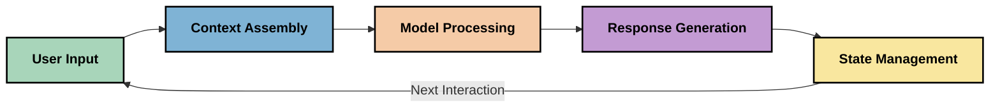
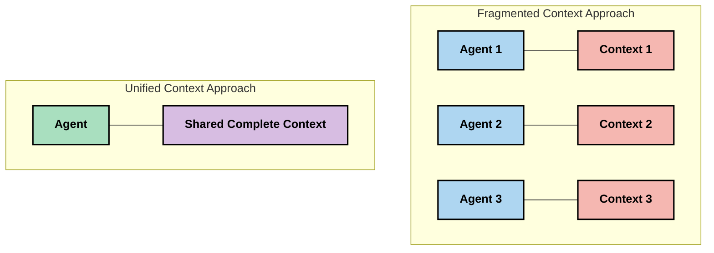
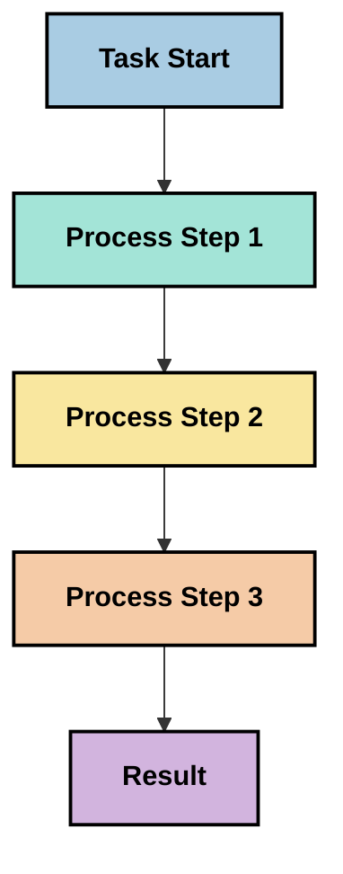
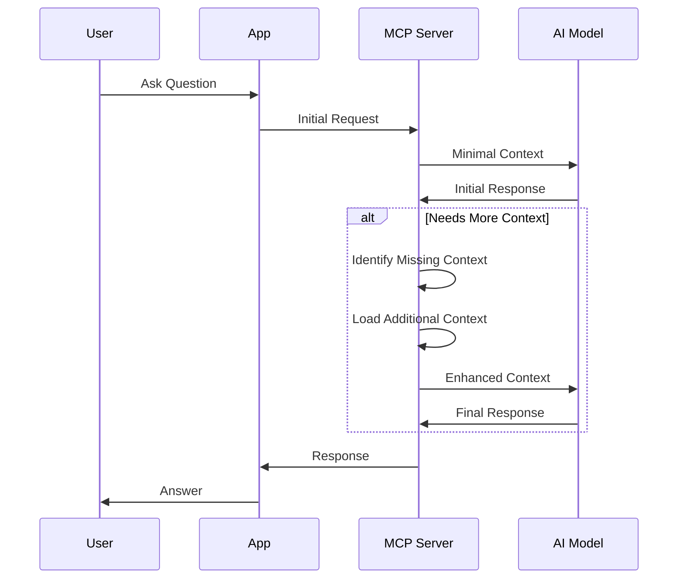
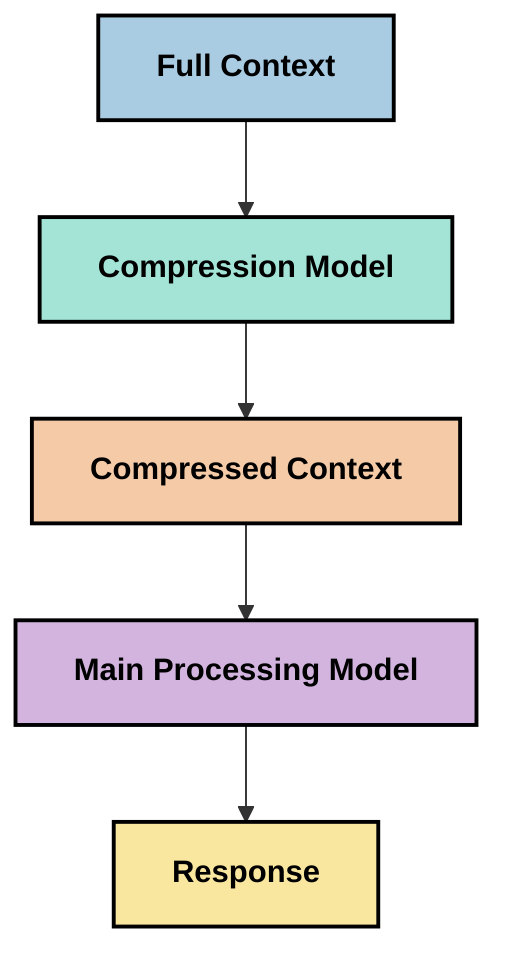
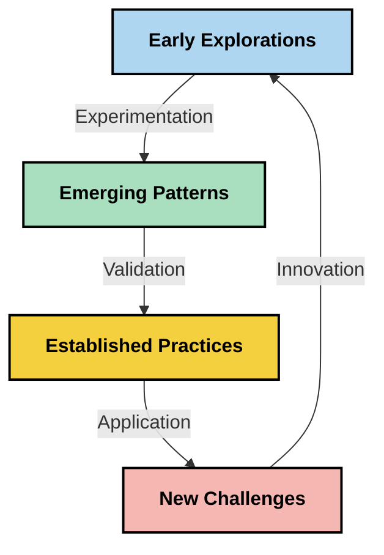

<!--
CO_OP_TRANSLATOR_METADATA:
{
  "original_hash": "5762e8e74dd99d8b7dbb31e69a82561e",
  "translation_date": "2025-07-17T08:41:08+00:00",
  "source_file": "05-AdvancedTopics/mcp-contextengineering/README.md",
  "language_code": "id"
}
-->
# Rekayasa Konteks: Konsep Baru dalam Ekosistem MCP

## Ikhtisar

Rekayasa konteks adalah konsep baru di bidang AI yang mempelajari bagaimana informasi disusun, disampaikan, dan dipertahankan selama interaksi antara klien dan layanan AI. Seiring berkembangnya ekosistem Model Context Protocol (MCP), pemahaman tentang cara mengelola konteks secara efektif menjadi semakin penting. Modul ini memperkenalkan konsep rekayasa konteks dan mengeksplorasi potensi penerapannya dalam implementasi MCP.

## Tujuan Pembelajaran

Pada akhir modul ini, Anda akan mampu:

- Memahami konsep baru rekayasa konteks dan perannya dalam aplikasi MCP
- Mengidentifikasi tantangan utama dalam pengelolaan konteks yang diatasi oleh desain protokol MCP
- Mengeksplorasi teknik untuk meningkatkan performa model melalui pengelolaan konteks yang lebih baik
- Mempertimbangkan pendekatan untuk mengukur dan mengevaluasi efektivitas konteks
- Menerapkan konsep-konsep baru ini untuk meningkatkan pengalaman AI melalui kerangka kerja MCP

## Pengenalan Rekayasa Konteks

Rekayasa konteks adalah konsep baru yang berfokus pada desain dan pengelolaan aliran informasi secara sengaja antara pengguna, aplikasi, dan model AI. Berbeda dengan bidang yang sudah mapan seperti prompt engineering, rekayasa konteks masih didefinisikan oleh para praktisi saat mereka berusaha mengatasi tantangan unik dalam menyediakan informasi yang tepat kepada model AI pada waktu yang tepat.

Seiring evolusi model bahasa besar (LLM), pentingnya konteks menjadi semakin jelas. Kualitas, relevansi, dan struktur konteks yang kita berikan secara langsung memengaruhi keluaran model. Rekayasa konteks mengeksplorasi hubungan ini dan berupaya mengembangkan prinsip-prinsip untuk pengelolaan konteks yang efektif.

> "Pada tahun 2025, model-model yang ada sangat cerdas. Namun bahkan manusia paling pintar pun tidak akan bisa melakukan pekerjaannya dengan efektif tanpa konteks dari apa yang diminta untuk dilakukan... 'Rekayasa konteks' adalah tingkat berikutnya dari prompt engineering. Ini tentang melakukan hal ini secara otomatis dalam sistem yang dinamis." — Walden Yan, Cognition AI

Rekayasa konteks mungkin mencakup:

1. **Pemilihan Konteks**: Menentukan informasi apa yang relevan untuk tugas tertentu
2. **Strukturisasi Konteks**: Mengorganisasi informasi untuk memaksimalkan pemahaman model
3. **Pengiriman Konteks**: Mengoptimalkan cara dan waktu pengiriman informasi ke model
4. **Pemeliharaan Konteks**: Mengelola status dan evolusi konteks seiring waktu
5. **Evaluasi Konteks**: Mengukur dan meningkatkan efektivitas konteks

Area fokus ini sangat relevan dengan ekosistem MCP, yang menyediakan cara standar bagi aplikasi untuk memberikan konteks kepada LLM.

## Perspektif Perjalanan Konteks

Salah satu cara untuk memvisualisasikan rekayasa konteks adalah dengan melacak perjalanan informasi melalui sistem MCP:



### Tahapan Kunci dalam Perjalanan Konteks:

1. **Input Pengguna**: Informasi mentah dari pengguna (teks, gambar, dokumen)
2. **Perakitan Konteks**: Menggabungkan input pengguna dengan konteks sistem, riwayat percakapan, dan informasi lain yang diambil
3. **Pemrosesan Model**: Model AI memproses konteks yang telah dirakit
4. **Pembuatan Respons**: Model menghasilkan keluaran berdasarkan konteks yang diberikan
5. **Manajemen Status**: Sistem memperbarui status internal berdasarkan interaksi

Perspektif ini menyoroti sifat dinamis konteks dalam sistem AI dan menimbulkan pertanyaan penting tentang cara terbaik mengelola informasi di setiap tahap.

## Prinsip-Prinsip Baru dalam Rekayasa Konteks

Seiring berkembangnya bidang rekayasa konteks, beberapa prinsip awal mulai muncul dari para praktisi. Prinsip-prinsip ini dapat membantu menginformasikan pilihan implementasi MCP:

### Prinsip 1: Bagikan Konteks Secara Lengkap

Konteks harus dibagikan secara lengkap antara semua komponen sistem, bukan terfragmentasi di berbagai agen atau proses. Ketika konteks tersebar, keputusan yang dibuat di satu bagian sistem bisa bertentangan dengan yang dibuat di bagian lain.



Dalam aplikasi MCP, ini menunjukkan perlunya merancang sistem di mana konteks mengalir mulus melalui seluruh pipeline, bukan terkotak-kotak.

### Prinsip 2: Sadari Bahwa Tindakan Mengandung Keputusan Implisit

Setiap tindakan yang diambil model mengandung keputusan implisit tentang cara menafsirkan konteks. Ketika beberapa komponen bertindak berdasarkan konteks yang berbeda, keputusan implisit ini bisa bertentangan, menyebabkan hasil yang tidak konsisten.

Prinsip ini memiliki implikasi penting untuk aplikasi MCP:
- Lebih baik memproses tugas kompleks secara linear daripada menjalankan secara paralel dengan konteks terfragmentasi
- Pastikan semua titik pengambilan keputusan memiliki akses ke informasi kontekstual yang sama
- Rancang sistem di mana langkah-langkah berikutnya dapat melihat konteks penuh dari keputusan sebelumnya

### Prinsip 3: Seimbangkan Kedalaman Konteks dengan Batasan Jendela

Seiring percakapan dan proses yang semakin panjang, jendela konteks akhirnya akan penuh. Rekayasa konteks yang efektif mengeksplorasi pendekatan untuk mengelola ketegangan antara konteks yang komprehensif dan keterbatasan teknis.

Pendekatan yang sedang dieksplorasi meliputi:
- Kompresi konteks yang mempertahankan informasi penting sambil mengurangi penggunaan token
- Pemuatan konteks secara progresif berdasarkan relevansi dengan kebutuhan saat ini
- Ringkasan interaksi sebelumnya sambil mempertahankan keputusan dan fakta kunci

## Tantangan Konteks dan Desain Protokol MCP

Model Context Protocol (MCP) dirancang dengan kesadaran akan tantangan unik dalam pengelolaan konteks. Memahami tantangan ini membantu menjelaskan aspek utama desain protokol MCP:

### Tantangan 1: Batasan Jendela Konteks  
Sebagian besar model AI memiliki ukuran jendela konteks tetap, membatasi seberapa banyak informasi yang dapat diproses sekaligus.

**Respons Desain MCP:**  
- Protokol mendukung konteks berbasis sumber daya yang terstruktur dan dapat direferensikan secara efisien  
- Sumber daya dapat dipaginasi dan dimuat secara progresif

### Tantangan 2: Penentuan Relevansi  
Menentukan informasi mana yang paling relevan untuk dimasukkan dalam konteks adalah hal yang sulit.

**Respons Desain MCP:**  
- Alat yang fleksibel memungkinkan pengambilan informasi secara dinamis sesuai kebutuhan  
- Prompt terstruktur memungkinkan organisasi konteks yang konsisten

### Tantangan 3: Persistensi Konteks  
Mengelola status antar interaksi membutuhkan pelacakan konteks yang cermat.

**Respons Desain MCP:**  
- Manajemen sesi yang distandarisasi  
- Pola interaksi yang jelas untuk evolusi konteks

### Tantangan 4: Konteks Multi-Modal  
Berbagai jenis data (teks, gambar, data terstruktur) memerlukan penanganan yang berbeda.

**Respons Desain MCP:**  
- Desain protokol mengakomodasi berbagai jenis konten  
- Representasi standar untuk informasi multi-modal

### Tantangan 5: Keamanan dan Privasi  
Konteks sering mengandung informasi sensitif yang harus dilindungi.

**Respons Desain MCP:**  
- Batasan jelas antara tanggung jawab klien dan server  
- Opsi pemrosesan lokal untuk meminimalkan eksposur data

Memahami tantangan ini dan bagaimana MCP mengatasinya memberikan dasar untuk mengeksplorasi teknik rekayasa konteks yang lebih maju.

## Pendekatan Baru dalam Rekayasa Konteks

Seiring berkembangnya bidang rekayasa konteks, beberapa pendekatan menjanjikan mulai muncul. Ini mencerminkan pemikiran saat ini, bukan praktik terbaik yang sudah mapan, dan kemungkinan akan berkembang seiring pengalaman dengan implementasi MCP bertambah.

### 1. Pemrosesan Linear Single-Threaded

Berbeda dengan arsitektur multi-agen yang mendistribusikan konteks, beberapa praktisi menemukan bahwa pemrosesan linear single-threaded menghasilkan hasil yang lebih konsisten. Ini sejalan dengan prinsip menjaga konteks yang terpadu.



Meskipun pendekatan ini mungkin tampak kurang efisien dibandingkan pemrosesan paralel, sering kali menghasilkan hasil yang lebih koheren dan dapat diandalkan karena setiap langkah dibangun berdasarkan pemahaman lengkap atas keputusan sebelumnya.

### 2. Pemecahan dan Prioritisasi Konteks

Memecah konteks besar menjadi bagian-bagian yang dapat dikelola dan memprioritaskan bagian yang paling penting.

```python
# Conceptual Example: Context Chunking and Prioritization
def process_with_chunked_context(documents, query):
    # 1. Break documents into smaller chunks
    chunks = chunk_documents(documents)
    
    # 2. Calculate relevance scores for each chunk
    scored_chunks = [(chunk, calculate_relevance(chunk, query)) for chunk in chunks]
    
    # 3. Sort chunks by relevance score
    sorted_chunks = sorted(scored_chunks, key=lambda x: x[1], reverse=True)
    
    # 4. Use the most relevant chunks as context
    context = create_context_from_chunks([chunk for chunk, score in sorted_chunks[:5]])
    
    # 5. Process with the prioritized context
    return generate_response(context, query)
```

Konsep di atas menggambarkan bagaimana kita dapat memecah dokumen besar menjadi bagian yang dapat dikelola dan memilih hanya bagian yang paling relevan untuk konteks. Pendekatan ini membantu bekerja dalam batasan jendela konteks sambil tetap memanfaatkan basis pengetahuan besar.

### 3. Pemuatan Konteks Progresif

Memuat konteks secara bertahap sesuai kebutuhan, bukan sekaligus.



Pemuatan konteks progresif dimulai dengan konteks minimal dan diperluas hanya saat diperlukan. Ini dapat secara signifikan mengurangi penggunaan token untuk pertanyaan sederhana sambil mempertahankan kemampuan menangani pertanyaan kompleks.

### 4. Kompresi dan Ringkasan Konteks

Mengurangi ukuran konteks sambil mempertahankan informasi penting.



Kompresi konteks berfokus pada:  
- Menghapus informasi yang berulang  
- Merangkum konten panjang  
- Mengekstrak fakta dan detail kunci  
- Mempertahankan elemen konteks kritis  
- Mengoptimalkan efisiensi token

Pendekatan ini sangat berharga untuk mempertahankan percakapan panjang dalam jendela konteks atau untuk memproses dokumen besar secara efisien. Beberapa praktisi menggunakan model khusus untuk kompresi konteks dan ringkasan riwayat percakapan.

## Pertimbangan Eksplorasi Rekayasa Konteks

Saat mengeksplorasi bidang rekayasa konteks yang baru, ada beberapa hal yang perlu diperhatikan saat bekerja dengan implementasi MCP. Ini bukan praktik terbaik yang mengikat, melainkan area eksplorasi yang mungkin memberikan peningkatan pada kasus penggunaan Anda.

### Pertimbangkan Tujuan Konteks Anda

Sebelum menerapkan solusi pengelolaan konteks yang kompleks, jelaskan dengan jelas apa yang ingin Anda capai:  
- Informasi spesifik apa yang dibutuhkan model agar berhasil?  
- Informasi mana yang esensial dan mana yang tambahan?  
- Apa batasan performa Anda (latensi, batas token, biaya)?

### Eksplorasi Pendekatan Konteks Berlapis

Beberapa praktisi menemukan keberhasilan dengan konteks yang disusun dalam lapisan konseptual:  
- **Lapisan Inti**: Informasi esensial yang selalu dibutuhkan model  
- **Lapisan Situasional**: Konteks spesifik untuk interaksi saat ini  
- **Lapisan Pendukung**: Informasi tambahan yang mungkin berguna  
- **Lapisan Cadangan**: Informasi yang diakses hanya saat diperlukan

### Selidiki Strategi Pengambilan

Efektivitas konteks sering bergantung pada cara Anda mengambil informasi:  
- Pencarian semantik dan embedding untuk menemukan informasi yang relevan secara konseptual  
- Pencarian berbasis kata kunci untuk detail faktual spesifik  
- Pendekatan hibrida yang menggabungkan beberapa metode pengambilan  
- Penyaringan metadata untuk mempersempit cakupan berdasarkan kategori, tanggal, atau sumber

### Eksperimen dengan Koherensi Konteks

Struktur dan alur konteks dapat memengaruhi pemahaman model:  
- Mengelompokkan informasi terkait bersama  
- Menggunakan format dan organisasi yang konsisten  
- Mempertahankan urutan logis atau kronologis bila sesuai  
- Menghindari informasi yang bertentangan

### Pertimbangkan Kelebihan dan Kekurangan Arsitektur Multi-Agen

Meskipun arsitektur multi-agen populer di banyak kerangka AI, mereka membawa tantangan signifikan dalam pengelolaan konteks:  
- Fragmentasi konteks dapat menyebabkan keputusan yang tidak konsisten antar agen  
- Pemrosesan paralel dapat menimbulkan konflik yang sulit diselesaikan  
- Overhead komunikasi antar agen dapat mengurangi keuntungan performa  
- Manajemen status yang kompleks diperlukan untuk menjaga koherensi

Dalam banyak kasus, pendekatan single-agent dengan pengelolaan konteks yang komprehensif mungkin menghasilkan hasil yang lebih dapat diandalkan dibandingkan banyak agen khusus dengan konteks terfragmentasi.

### Kembangkan Metode Evaluasi

Untuk meningkatkan rekayasa konteks dari waktu ke waktu, pertimbangkan bagaimana Anda akan mengukur keberhasilan:  
- Pengujian A/B dengan struktur konteks yang berbeda  
- Memantau penggunaan token dan waktu respons  
- Melacak kepuasan pengguna dan tingkat penyelesaian tugas  
- Menganalisis kapan dan mengapa strategi konteks gagal

Pertimbangan ini merupakan area eksplorasi aktif dalam ruang rekayasa konteks. Seiring kematangan bidang ini, pola dan praktik yang lebih pasti kemungkinan akan muncul.

## Mengukur Efektivitas Konteks: Kerangka Kerja yang Berkembang

Seiring munculnya rekayasa konteks sebagai konsep, para praktisi mulai mengeksplorasi cara mengukur efektivitasnya. Belum ada kerangka kerja yang mapan, tetapi berbagai metrik sedang dipertimbangkan yang dapat membantu mengarahkan pekerjaan di masa depan.

### Dimensi Pengukuran Potensial

#### 1. Pertimbangan Efisiensi Input

- **Rasio Konteks ke Respons**: Seberapa banyak konteks yang dibutuhkan relatif terhadap ukuran respons?  
- **Pemanfaatan Token**: Berapa persen token konteks yang tampaknya memengaruhi respons?  
- **Pengurangan Konteks**: Seberapa efektif kita dapat mengompresi informasi mentah?

#### 2. Pertimbangan Performa

- **Dampak Latensi**: Bagaimana pengelolaan konteks memengaruhi waktu respons?  
- **Ekonomi Token**: Apakah penggunaan token dioptimalkan dengan baik?  
- **Presisi Pengambilan**: Seberapa relevan informasi yang diambil?  
- **Pemanfaatan Sumber Daya**: Sumber daya komputasi apa yang dibutuhkan?

#### 3. Pertimbangan Kualitas

- **Relevansi Respons**: Seberapa baik respons menjawab pertanyaan?  
- **Akurasi Faktual**: Apakah pengelolaan konteks meningkatkan ketepatan fakta?  
- **Konsistensi**: Apakah respons konsisten untuk pertanyaan serupa?  
- **Tingkat Halusinasi**: Apakah konteks yang lebih baik mengurangi halusinasi model?

#### 4. Pertimbangan Pengalaman Pengguna

- **Tingkat Tindak Lanjut**: Seberapa sering pengguna membutuhkan klarifikasi?  
- **Penyelesaian Tugas**: Apakah pengguna berhasil mencapai tujuan mereka?  
- **Indikator Kepuasan**: Bagaimana pengguna menilai pengalaman mereka?

### Pendekatan Eksplorasi untuk Pengukuran

Saat bereksperimen dengan rekayasa konteks dalam implementasi MCP, pertimbangkan pendekatan eksplorasi berikut:

1. **Perbandingan Baseline**: Tetapkan baseline dengan pendekatan konteks sederhana sebelum menguji metode yang lebih canggih  
2. **Perubahan Bertahap**: Ubah satu aspek pengelolaan konteks pada satu waktu untuk mengisolasi efeknya  
3. **Evaluasi Berbasis Pengguna**: Gabungkan metrik kuantitatif dengan umpan balik kualitatif dari pengguna  
4. **Analisis Kegagalan**: Pelajari kasus di mana strategi konteks gagal untuk memahami potensi perbaikan  
5. **Penilaian Multi-Dimensi**: Pertimbangkan trade-off antara efisiensi, kualitas, dan pengalaman pengguna

Pendekatan eksperimental dan multi-faceted ini sejalan dengan sifat rekayasa konteks yang masih berkembang.

## Pemikiran Penutup

Rekayasa konteks adalah bidang eksplorasi baru yang mungkin menjadi kunci dalam aplikasi MCP yang efektif. Dengan mempertimbangkan secara cermat bagaimana informasi mengalir melalui sistem Anda, Anda berpotensi menciptakan pengalaman AI yang lebih efisien, akurat, dan bernilai bagi pengguna.

Teknik dan pendekatan yang dijelaskan dalam modul ini mewakili pemikiran awal di bidang ini, bukan praktik yang sudah mapan. Rekayasa konteks mungkin berkembang menjadi disiplin yang lebih terdefinisi seiring kemampuan AI meningkat dan pemahaman kita semakin dalam. Untuk saat ini, eksperimen yang dipadukan dengan pengukuran yang cermat tampaknya menjadi pendekatan paling produktif.

## Arah Masa Depan yang Potensial

Bidang rekayasa konteks masih dalam tahap awal, tetapi beberapa arah menjanjikan mulai muncul:

- Prinsip rekayasa konteks dapat berdampak signifikan pada performa model, efisiensi, pengalaman pengguna, dan keandalan  
- Pendekatan single-threaded dengan pengelolaan konteks komprehensif mungkin mengungguli arsitektur multi-agen untuk banyak kasus penggunaan  
- Model kompresi konteks khusus mungkin menjadi komponen standar dalam pipeline AI  
- Ketegangan antara kelengkapan konteks dan batasan token kemungkinan akan mendorong inovasi dalam pengelolaan konteks  
- Seiring model menjadi lebih mampu berkomunikasi secara efisien seperti manusia, kolaborasi multi-agen yang sesungguhnya mungkin menjadi lebih layak  
- Implementasi MCP mungkin berkembang untuk menstandarisasi pola pengelolaan konteks yang muncul dari eksperimen saat ini



## Sumber Daya

### Sumber Daya Resmi MCP
- [Model Context Protocol Website](https://modelcontextprotocol.io/)
- [Model Context Protocol Specification](https://github.com/modelcontextprotocol/modelcontextprotocol)
- [MCP Documentation](https://modelcontextprotocol.io/docs)
- [MCP C# SDK](https://github.com/modelcontextprotocol/csharp-sdk)
- [MCP Python SDK](https://github.com/modelcontextprotocol/python-sdk)
- [MCP TypeScript SDK](https://github.com/modelcontextprotocol/typescript-sdk)
- [MCP Inspector](https://github.com/modelcontextprotocol/inspector) - Alat pengujian visual untuk server MCP

### Artikel Rekayasa Konteks
- [Don't Build Multi-Agents: Principles of Context Engineering](https://cognition.ai/blog/dont-build-multi-agents) - Wawasan Walden Yan tentang prinsip rekayasa konteks
- [A Practical Guide to Building Agents](https://cdn.openai.com/business-guides-and-resources/a-practical-guide-to-building-agents.pdf) - Panduan OpenAI tentang desain agen yang efektif
- [Building Effective Agents](https://www.anthropic.com/engineering/building-effective-agents) - Pendekatan Anthropic dalam pengembangan agen

### Penelitian Terkait
- [Dynamic Retrieval Augmentation for Large Language Models](https://arxiv.org/abs/2310.01487) - Penelitian tentang pendekatan pengambilan dinamis
- [Lost in the Middle: How Language Models Use Long Contexts](https://arxiv.org/abs/2307.03172) - Penelitian penting tentang pola pemrosesan konteks
- [Hierarchical Text-Conditioned Image Generation with CLIP Latents](https://arxiv.org/abs/2204.06125) - Makalah DALL-E 2 dengan wawasan tentang struktur konteks
- [Exploring the Role of Context in Large Language Model Architectures](https://aclanthology.org/2023.findings-emnlp.124/) - Penelitian terbaru tentang penanganan konteks
- [Multi-Agent Collaboration: A Survey](https://arxiv.org/abs/2304.03442) - Penelitian tentang sistem multi-agen dan tantangannya

### Sumber Tambahan
- [Context Window Optimization Techniques](https://learn.microsoft.com/en-us/azure/ai-services/openai/concepts/context-window)
- [Advanced RAG Techniques](https://www.microsoft.com/en-us/research/blog/retrieval-augmented-generation-rag-and-frontier-models/)
- [Semantic Kernel Documentation](https://github.com/microsoft/semantic-kernel)
- [AI Toolkit for Context Management](https://github.com/microsoft/aitoolkit)

## Selanjutnya
- [6. Community Contributions](../../06-CommunityContributions/README.md)

**Penafian**:  
Dokumen ini telah diterjemahkan menggunakan layanan terjemahan AI [Co-op Translator](https://github.com/Azure/co-op-translator). Meskipun kami berupaya untuk mencapai akurasi, harap diperhatikan bahwa terjemahan otomatis mungkin mengandung kesalahan atau ketidakakuratan. Dokumen asli dalam bahasa aslinya harus dianggap sebagai sumber yang sahih. Untuk informasi penting, disarankan menggunakan terjemahan profesional oleh manusia. Kami tidak bertanggung jawab atas kesalahpahaman atau penafsiran yang keliru yang timbul dari penggunaan terjemahan ini.