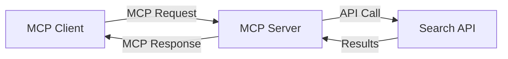
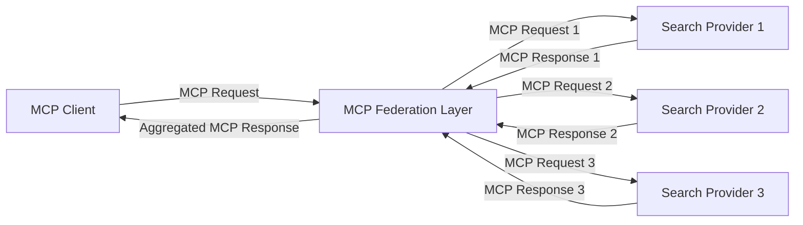
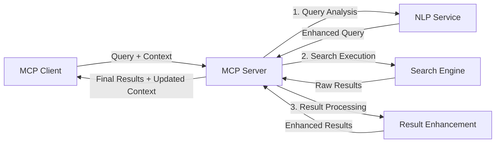

<!--
CO_OP_TRANSLATOR_METADATA:
{
  "original_hash": "eb12652eb7bd17f2193b835a344425c6",
  "translation_date": "2025-06-26T14:13:02+00:00",
  "source_file": "05-AdvancedTopics/mcp-realtimesearch/README.md",
  "language_code": "id"
}
-->
## Penafian Contoh Kode

> **Catatan Penting**: Contoh kode di bawah ini menunjukkan integrasi Model Context Protocol (MCP) dengan fungsi pencarian web. Meskipun mengikuti pola dan struktur SDK MCP resmi, contoh ini disederhanakan untuk tujuan pembelajaran.
> 
> Contoh-contoh ini menampilkan:
> 
> 1. **Implementasi Python**: Implementasi server FastMCP yang menyediakan alat pencarian web dan terhubung ke API pencarian eksternal. Contoh ini menunjukkan pengelolaan masa hidup, penanganan konteks, dan implementasi alat yang benar sesuai pola dari [SDK Python MCP resmi](https://github.com/modelcontextprotocol/python-sdk). Server menggunakan transport Streamable HTTP yang direkomendasikan dan telah menggantikan transport SSE lama untuk penggunaan produksi.
> 
> 2. **Implementasi JavaScript**: Implementasi TypeScript/JavaScript menggunakan pola FastMCP dari [SDK TypeScript MCP resmi](https://github.com/modelcontextprotocol/typescript-sdk) untuk membuat server pencarian dengan definisi alat dan koneksi klien yang tepat. Ini mengikuti pola terbaru yang direkomendasikan untuk manajemen sesi dan pelestarian konteks.
> 
> Contoh-contoh ini memerlukan penanganan kesalahan tambahan, autentikasi, dan kode integrasi API spesifik untuk penggunaan produksi. Endpoint API pencarian yang ditunjukkan (`https://api.search-service.example/search`) hanyalah placeholder dan perlu diganti dengan endpoint layanan pencarian yang sebenarnya.
> 
> Untuk detail implementasi lengkap dan pendekatan terbaru, silakan merujuk ke [spesifikasi MCP resmi](https://spec.modelcontextprotocol.io/) dan dokumentasi SDK.

## Konsep Inti

### Kerangka Kerja Model Context Protocol (MCP)

Pada dasarnya, Model Context Protocol menyediakan cara standar bagi model AI, aplikasi, dan layanan untuk bertukar konteks. Dalam pencarian web waktu nyata, kerangka ini sangat penting untuk menciptakan pengalaman pencarian multi-putar yang koheren. Komponen kunci meliputi:

1. **Arsitektur Klien-Server**: MCP menetapkan pemisahan yang jelas antara klien pencarian (peminta) dan server pencarian (penyedia), memungkinkan model penyebaran yang fleksibel.

2. **Komunikasi JSON-RPC**: Protokol menggunakan JSON-RPC untuk pertukaran pesan, membuatnya kompatibel dengan teknologi web dan mudah diimplementasikan di berbagai platform.

3. **Manajemen Konteks**: MCP mendefinisikan metode terstruktur untuk memelihara, memperbarui, dan memanfaatkan konteks pencarian di berbagai interaksi.

4. **Definisi Alat**: Kemampuan pencarian diekspos sebagai alat standar dengan parameter dan nilai pengembalian yang jelas.

5. **Dukungan Streaming**: Protokol mendukung streaming hasil, penting untuk pencarian waktu nyata di mana hasil dapat tiba secara bertahap.

### Pola Integrasi Pencarian Web

Saat mengintegrasikan MCP dengan pencarian web, beberapa pola muncul:

#### 1. Integrasi Penyedia Pencarian Langsung

Dalam pola ini, server MCP langsung berinteraksi dengan satu atau lebih API pencarian, menerjemahkan permintaan MCP menjadi panggilan API spesifik dan memformat hasil sebagai respons MCP.

#### 2. Pencarian Federasi dengan Pelestarian Konteks

Pola ini mendistribusikan kueri pencarian ke beberapa penyedia pencarian kompatibel MCP, yang masing-masing mungkin mengkhususkan diri dalam jenis konten atau kemampuan pencarian yang berbeda, sambil mempertahankan konteks yang terpadu.

#### 3. Rantai Pencarian yang Ditingkatkan Konteks

Dalam pola ini, proses pencarian dibagi menjadi beberapa tahap, dengan konteks yang diperkaya di setiap langkah, menghasilkan hasil yang semakin relevan secara bertahap.

### Komponen Konteks Pencarian

Dalam pencarian web berbasis MCP, konteks biasanya mencakup:

- **Riwayat Kueri**: Kueri pencarian sebelumnya dalam sesi
- **Preferensi Pengguna**: Bahasa, wilayah, pengaturan pencarian aman
- **Riwayat Interaksi**: Hasil mana yang diklik, waktu yang dihabiskan pada hasil
- **Parameter Pencarian**: Filter, urutan sortir, dan modifikator pencarian lainnya
- **Pengetahuan Domain**: Konteks khusus subjek yang relevan dengan pencarian
- **Konteks Temporal**: Faktor relevansi berbasis waktu
- **Preferensi Sumber**: Sumber informasi yang dipercaya atau disukai

## Kasus Penggunaan dan Aplikasi

### Penelitian dan Pengumpulan Informasi

MCP meningkatkan alur kerja penelitian dengan:

- Melestarikan konteks penelitian di berbagai sesi pencarian
- Memungkinkan kueri yang lebih canggih dan relevan secara kontekstual
- Mendukung federasi pencarian multi-sumber
- Memfasilitasi ekstraksi pengetahuan dari hasil pencarian

### Pemantauan Berita dan Tren Waktu Nyata

Pencarian berbasis MCP menawarkan keuntungan untuk pemantauan berita:

- Penemuan cerita berita yang muncul hampir secara waktu nyata
- Penyaringan kontekstual informasi yang relevan
- Pelacakan topik dan entitas di berbagai sumber
- Pemberitahuan berita yang dipersonalisasi berdasarkan konteks pengguna

### Penjelajahan dan Penelitian yang Didukung AI

MCP membuka kemungkinan baru untuk penjelajahan yang didukung AI:

- Saran pencarian kontekstual berdasarkan aktivitas browser saat ini
- Integrasi mulus pencarian web dengan asisten berbasis LLM
- Penyempurnaan pencarian multi-putar dengan konteks yang dipertahankan
- Peningkatan pemeriksaan fakta dan verifikasi informasi

## Tren dan Inovasi Masa Depan

### Evolusi MCP dalam Pencarian Web

Ke depan, kami memperkirakan MCP akan berkembang untuk mengatasi:

- **Pencarian Multimodal**: Mengintegrasikan pencarian teks, gambar, audio, dan video dengan konteks yang dipertahankan
- **Pencarian Terdesentralisasi**: Mendukung ekosistem pencarian yang terdistribusi dan federasi
- **Privasi Pencarian**: Mekanisme pencarian yang menjaga privasi dengan kesadaran konteks
- **Pemahaman Kueri**: Parsing semantik mendalam dari kueri pencarian bahasa alami

### Kemajuan Potensial dalam Teknologi

Teknologi yang muncul yang akan membentuk masa depan pencarian MCP:

1. **Arsitektur Pencarian Neural**: Sistem pencarian berbasis embedding yang dioptimalkan untuk MCP
2. **Konteks Pencarian yang Dipersonalisasi**: Mempelajari pola pencarian pengguna individu dari waktu ke waktu
3. **Integrasi Grafik Pengetahuan**: Pencarian kontekstual yang ditingkatkan oleh grafik pengetahuan domain-spesifik
4. **Konteks Lintas Modal**: Mempertahankan konteks di berbagai modalitas pencarian

## Latihan Praktis

### Latihan 1: Menyiapkan Pipeline Pencarian MCP Dasar

Dalam latihan ini, Anda akan belajar bagaimana:
- Mengonfigurasi lingkungan pencarian MCP dasar
- Mengimplementasikan penangan konteks untuk pencarian web
- Menguji dan memvalidasi pelestarian konteks di berbagai iterasi pencarian

### Latihan 2: Membangun Asisten Penelitian dengan Pencarian MCP

Buat aplikasi lengkap yang:
- Memproses pertanyaan penelitian dalam bahasa alami
- Melakukan pencarian web yang sadar konteks
- Mensintesis informasi dari berbagai sumber
- Menyajikan temuan penelitian yang terorganisir

### Latihan 3: Mengimplementasikan Federasi Pencarian Multi-Sumber dengan MCP

Latihan lanjutan yang mencakup:
- Pengiriman kueri yang sadar konteks ke berbagai mesin pencari
- Peringkat dan agregasi hasil
- Dedupikasi hasil pencarian secara kontekstual
- Penanganan metadata spesifik sumber

## Sumber Daya Tambahan

- [Spesifikasi Model Context Protocol](https://spec.modelcontextprotocol.io/) - Spesifikasi MCP resmi dan dokumentasi protokol terperinci
- [Dokumentasi Model Context Protocol](https://modelcontextprotocol.io/) - Tutorial dan panduan implementasi terperinci
- [SDK Python MCP](https://github.com/modelcontextprotocol/python-sdk) - Implementasi resmi MCP untuk Python
- [SDK TypeScript MCP](https://github.com/modelcontextprotocol/typescript-sdk) - Implementasi resmi MCP untuk TypeScript
- [Server Referensi MCP](https://github.com/modelcontextprotocol/servers) - Implementasi server MCP referensi
- [Dokumentasi Bing Web Search API](https://learn.microsoft.com/en-us/bing/search-apis/bing-web-search/overview) - API pencarian web Microsoft
- [Google Custom Search JSON API](https://developers.google.com/custom-search/v1/overview) - Mesin pencari yang dapat diprogram Google
- [Dokumentasi SerpAPI](https://serpapi.com/search-api) - API halaman hasil mesin pencari
- [Dokumentasi Meilisearch](https://www.meilisearch.com/docs) - Mesin pencari open-source
- [Dokumentasi Elasticsearch](https://www.elastic.co/guide/index.html) - Mesin pencari dan analitik terdistribusi
- [Dokumentasi LangChain](https://python.langchain.com/docs/get_started/introduction) - Membangun aplikasi dengan LLM

## Hasil Pembelajaran

Dengan menyelesaikan modul ini, Anda akan dapat:

- Memahami dasar-dasar pencarian web waktu nyata dan tantangannya
- Menjelaskan bagaimana Model Context Protocol (MCP) meningkatkan kemampuan pencarian web waktu nyata
- Mengimplementasikan solusi pencarian berbasis MCP menggunakan kerangka kerja dan API populer
- Merancang dan menyebarkan arsitektur pencarian yang skalabel dan berkinerja tinggi dengan MCP
- Menerapkan konsep MCP ke berbagai kasus penggunaan termasuk pencarian semantik, asisten penelitian, dan penjelajahan yang didukung AI
- Mengevaluasi tren yang muncul dan inovasi masa depan dalam teknologi pencarian berbasis MCP

### Pertimbangan Kepercayaan dan Keamanan

Saat mengimplementasikan solusi pencarian web berbasis MCP, ingat prinsip penting berikut dari spesifikasi MCP:

1. **Persetujuan dan Kontrol Pengguna**: Pengguna harus secara eksplisit memberikan persetujuan dan memahami semua akses data dan operasi. Ini sangat penting untuk implementasi pencarian web yang mungkin mengakses sumber data eksternal.

2. **Privasi Data**: Pastikan penanganan kueri pencarian dan hasil yang tepat, terutama saat mengandung informasi sensitif. Terapkan kontrol akses yang sesuai untuk melindungi data pengguna.

3. **Keamanan Alat**: Terapkan otorisasi dan validasi yang tepat untuk alat pencarian, karena alat ini dapat menjadi risiko keamanan melalui eksekusi kode sembarangan. Deskripsi perilaku alat harus dianggap tidak terpercaya kecuali diperoleh dari server yang terpercaya.

4. **Dokumentasi Jelas**: Berikan dokumentasi yang jelas tentang kemampuan, keterbatasan, dan pertimbangan keamanan dari implementasi pencarian berbasis MCP Anda, sesuai panduan implementasi dari spesifikasi MCP.

5. **Alur Persetujuan yang Kuat**: Bangun alur persetujuan dan otorisasi yang kuat yang menjelaskan dengan jelas apa yang dilakukan setiap alat sebelum mengizinkan penggunaannya, terutama untuk alat yang berinteraksi dengan sumber daya web eksternal.

Untuk detail lengkap tentang keamanan MCP dan pertimbangan kepercayaan, silakan lihat [dokumentasi resmi](https://modelcontextprotocol.io/specification/2025-03-26#security-and-trust-%26-safety).

## Selanjutnya

- [5.11 Autentikasi Entra ID untuk Server Model Context Protocol](../mcp-security-entra/README.md)

**Penafian**:  
Dokumen ini telah diterjemahkan menggunakan layanan terjemahan AI [Co-op Translator](https://github.com/Azure/co-op-translator). Meskipun kami berupaya untuk mencapai akurasi, harap diingat bahwa terjemahan otomatis mungkin mengandung kesalahan atau ketidakakuratan. Dokumen asli dalam bahasa aslinya harus dianggap sebagai sumber yang sahih. Untuk informasi penting, disarankan menggunakan jasa terjemahan profesional oleh manusia. Kami tidak bertanggung jawab atas kesalahpahaman atau salah tafsir yang timbul dari penggunaan terjemahan ini.