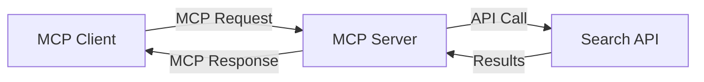
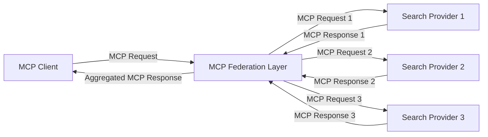
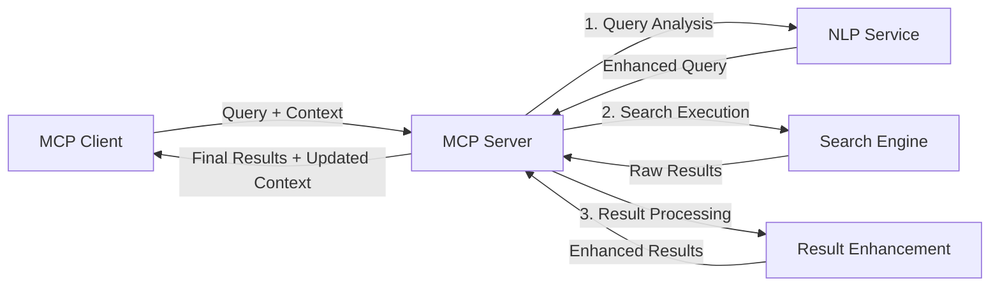

<!--
CO_OP_TRANSLATOR_METADATA:
{
  "original_hash": "16bef2c93c6a86d4ca6a8ce9e120e384",
  "translation_date": "2025-06-13T02:55:22+00:00",
  "source_file": "05-AdvancedTopics/mcp-realtimesearch/README.md",
  "language_code": "id"
}
-->
## Penafian Contoh Kode

> **Catatan Penting**: Contoh kode di bawah ini menunjukkan integrasi Model Context Protocol (MCP) dengan fungsi pencarian web. Meskipun mengikuti pola dan struktur dari SDK MCP resmi, contoh ini disederhanakan untuk tujuan pembelajaran.
> 
> Contoh-contoh ini menampilkan:
> 
> 1. **Implementasi Python**: Implementasi server FastMCP yang menyediakan alat pencarian web dan terhubung ke API pencarian eksternal. Contoh ini memperlihatkan pengelolaan lifespan yang tepat, penanganan konteks, dan implementasi alat sesuai pola dari [SDK MCP Python resmi](https://github.com/modelcontextprotocol/python-sdk). Server menggunakan transport HTTP Streamable yang direkomendasikan dan telah menggantikan transport SSE lama untuk penggunaan produksi.
> 
> 2. **Implementasi JavaScript**: Implementasi TypeScript/JavaScript menggunakan pola FastMCP dari [SDK MCP TypeScript resmi](https://github.com/modelcontextprotocol/typescript-sdk) untuk membuat server pencarian dengan definisi alat dan koneksi klien yang tepat. Ini mengikuti pola terbaru yang direkomendasikan untuk manajemen sesi dan pelestarian konteks.
> 
> Contoh-contoh ini memerlukan penanganan error tambahan, autentikasi, dan kode integrasi API spesifik untuk penggunaan produksi. Endpoint API pencarian yang ditampilkan (`https://api.search-service.example/search`) adalah placeholder dan harus diganti dengan endpoint layanan pencarian yang sebenarnya.
> 
> Untuk detail implementasi lengkap dan pendekatan terkini, silakan merujuk ke [spesifikasi MCP resmi](https://spec.modelcontextprotocol.io/) dan dokumentasi SDK.

## Konsep Inti

### Kerangka Kerja Model Context Protocol (MCP)

Pada dasarnya, Model Context Protocol menyediakan cara standar bagi model AI, aplikasi, dan layanan untuk bertukar konteks. Dalam pencarian web real-time, kerangka ini sangat penting untuk menciptakan pengalaman pencarian multi-putaran yang koheren. Komponen kunci meliputi:

1. **Arsitektur Klien-Server**: MCP menetapkan pemisahan yang jelas antara klien pencarian (peminta) dan server pencarian (penyedia), memungkinkan model penyebaran yang fleksibel.

2. **Komunikasi JSON-RPC**: Protokol menggunakan JSON-RPC untuk pertukaran pesan, membuatnya kompatibel dengan teknologi web dan mudah diimplementasikan di berbagai platform.

3. **Manajemen Konteks**: MCP mendefinisikan metode terstruktur untuk memelihara, memperbarui, dan memanfaatkan konteks pencarian di berbagai interaksi.

4. **Definisi Alat**: Kapabilitas pencarian diekspos sebagai alat standar dengan parameter dan nilai pengembalian yang terdefinisi dengan baik.

5. **Dukungan Streaming**: Protokol mendukung hasil streaming, penting untuk pencarian real-time di mana hasil dapat datang secara bertahap.

### Pola Integrasi Pencarian Web

Saat mengintegrasikan MCP dengan pencarian web, beberapa pola muncul:

#### 1. Integrasi Penyedia Pencarian Langsung

Dalam pola ini, server MCP langsung berinteraksi dengan satu atau lebih API pencarian, menerjemahkan permintaan MCP menjadi panggilan API spesifik dan memformat hasil sebagai respons MCP.

#### 2. Federasi Pencarian dengan Pelestarian Konteks

Pola ini mendistribusikan kueri pencarian ke beberapa penyedia pencarian yang kompatibel dengan MCP, masing-masing mungkin mengkhususkan diri pada jenis konten atau kapabilitas pencarian yang berbeda, sambil mempertahankan konteks yang terpadu.

#### 3. Rantai Pencarian dengan Konteks yang Ditingkatkan

Dalam pola ini, proses pencarian dibagi menjadi beberapa tahap, dengan konteks yang diperkaya pada setiap langkah, menghasilkan hasil yang semakin relevan secara bertahap.

### Komponen Konteks Pencarian

Dalam pencarian web berbasis MCP, konteks biasanya mencakup:

- **Riwayat Kueri**: Kueri pencarian sebelumnya dalam sesi
- **Preferensi Pengguna**: Bahasa, wilayah, pengaturan pencarian aman
- **Riwayat Interaksi**: Hasil mana yang diklik, waktu yang dihabiskan pada hasil
- **Parameter Pencarian**: Filter, urutan sortir, dan modifikasi pencarian lainnya
- **Pengetahuan Domain**: Konteks khusus subjek yang relevan dengan pencarian
- **Konteks Temporal**: Faktor relevansi berdasarkan waktu
- **Preferensi Sumber**: Sumber informasi yang dipercaya atau diprioritaskan

## Kasus Penggunaan dan Aplikasi

### Penelitian dan Pengumpulan Informasi

MCP meningkatkan alur kerja penelitian dengan:

- Memelihara konteks penelitian di berbagai sesi pencarian
- Memungkinkan kueri yang lebih canggih dan relevan secara kontekstual
- Mendukung federasi pencarian multi-sumber
- Memfasilitasi ekstraksi pengetahuan dari hasil pencarian

### Pemantauan Berita dan Tren Real-Time

Pencarian berbasis MCP menawarkan keuntungan untuk pemantauan berita:

- Penemuan cerita berita yang muncul hampir secara real-time
- Penyaringan kontekstual informasi yang relevan
- Pelacakan topik dan entitas di berbagai sumber
- Pemberitahuan berita personal berdasarkan konteks pengguna

### Penjelajahan dan Penelitian yang Ditingkatkan AI

MCP membuka kemungkinan baru untuk penjelajahan yang ditingkatkan AI:

- Saran pencarian kontekstual berdasarkan aktivitas browser saat ini
- Integrasi mulus pencarian web dengan asisten berbasis LLM
- Penyempurnaan pencarian multi-putaran dengan konteks yang terjaga
- Peningkatan pemeriksaan fakta dan verifikasi informasi

## Tren dan Inovasi Masa Depan

### Evolusi MCP dalam Pencarian Web

Ke depan, kami memperkirakan MCP akan berkembang untuk mengatasi:

- **Pencarian Multimodal**: Mengintegrasikan pencarian teks, gambar, audio, dan video dengan konteks yang terjaga
- **Pencarian Terdesentralisasi**: Mendukung ekosistem pencarian terdistribusi dan federasi
- **Privasi Pencarian**: Mekanisme pencarian yang melindungi privasi dengan kesadaran konteks
- **Pemahaman Kueri**: Parsing semantik mendalam untuk kueri pencarian bahasa alami

### Kemajuan Teknologi Potensial

Teknologi yang muncul dan akan membentuk masa depan pencarian MCP:

1. **Arsitektur Pencarian Neural**: Sistem pencarian berbasis embedding yang dioptimalkan untuk MCP
2. **Konteks Pencarian yang Dipersonalisasi**: Mempelajari pola pencarian pengguna individu dari waktu ke waktu
3. **Integrasi Graf Pengetahuan**: Pencarian kontekstual yang ditingkatkan oleh graf pengetahuan domain-spesifik
4. **Konteks Lintas Modalitas**: Mempertahankan konteks di berbagai modalitas pencarian

## Latihan Praktik

### Latihan 1: Menyiapkan Pipeline Pencarian MCP Dasar

Dalam latihan ini, Anda akan belajar bagaimana:
- Mengonfigurasi lingkungan pencarian MCP dasar
- Mengimplementasikan penangan konteks untuk pencarian web
- Menguji dan memvalidasi pelestarian konteks di berbagai iterasi pencarian

### Latihan 2: Membangun Asisten Penelitian dengan Pencarian MCP

Buat aplikasi lengkap yang:
- Memproses pertanyaan penelitian dalam bahasa alami
- Melakukan pencarian web yang sadar konteks
- Mensintesis informasi dari berbagai sumber
- Menyajikan temuan penelitian yang terorganisir

### Latihan 3: Mengimplementasikan Federasi Pencarian Multi-Sumber dengan MCP

Latihan lanjutan yang mencakup:
- Pengiriman kueri yang sadar konteks ke beberapa mesin pencari
- Peringkat dan agregasi hasil
- Dedupikasi hasil pencarian secara kontekstual
- Penanganan metadata spesifik sumber

## Sumber Daya Tambahan

- [Spesifikasi Model Context Protocol](https://spec.modelcontextprotocol.io/) - Spesifikasi MCP resmi dan dokumentasi protokol terperinci
- [Dokumentasi Model Context Protocol](https://modelcontextprotocol.io/) - Tutorial dan panduan implementasi terperinci
- [SDK MCP Python](https://github.com/modelcontextprotocol/python-sdk) - Implementasi resmi MCP dalam Python
- [SDK MCP TypeScript](https://github.com/modelcontextprotocol/typescript-sdk) - Implementasi resmi MCP dalam TypeScript
- [Server Referensi MCP](https://github.com/modelcontextprotocol/servers) - Implementasi server MCP referensi
- [Dokumentasi Bing Web Search API](https://learn.microsoft.com/en-us/bing/search-apis/bing-web-search/overview) - API pencarian web Microsoft
- [Google Custom Search JSON API](https://developers.google.com/custom-search/v1/overview) - Mesin pencari yang dapat diprogram dari Google
- [Dokumentasi SerpAPI](https://serpapi.com/search-api) - API halaman hasil mesin pencari
- [Dokumentasi Meilisearch](https://www.meilisearch.com/docs) - Mesin pencari open-source
- [Dokumentasi Elasticsearch](https://www.elastic.co/guide/index.html) - Mesin pencarian dan analitik terdistribusi
- [Dokumentasi LangChain](https://python.langchain.com/docs/get_started/introduction) - Membangun aplikasi dengan LLM

## Hasil Pembelajaran

Dengan menyelesaikan modul ini, Anda akan mampu:

- Memahami dasar-dasar pencarian web real-time dan tantangannya
- Menjelaskan bagaimana Model Context Protocol (MCP) meningkatkan kapabilitas pencarian web real-time
- Mengimplementasikan solusi pencarian berbasis MCP menggunakan framework dan API populer
- Merancang dan menerapkan arsitektur pencarian yang skalabel dan berperforma tinggi dengan MCP
- Menerapkan konsep MCP pada berbagai kasus penggunaan termasuk pencarian semantik, asisten penelitian, dan penjelajahan yang ditingkatkan AI
- Mengevaluasi tren yang muncul dan inovasi masa depan dalam teknologi pencarian berbasis MCP

### Pertimbangan Kepercayaan dan Keamanan

Saat mengimplementasikan solusi pencarian web berbasis MCP, ingat prinsip penting berikut dari spesifikasi MCP:

1. **Persetujuan dan Kontrol Pengguna**: Pengguna harus secara eksplisit menyetujui dan memahami semua akses data dan operasi. Ini sangat penting untuk implementasi pencarian web yang mungkin mengakses sumber data eksternal.

2. **Privasi Data**: Pastikan penanganan yang tepat terhadap kueri pencarian dan hasilnya, terutama jika mengandung informasi sensitif. Terapkan kontrol akses yang sesuai untuk melindungi data pengguna.

3. **Keamanan Alat**: Terapkan otorisasi dan validasi yang tepat untuk alat pencarian, karena mereka dapat menjadi risiko keamanan melalui eksekusi kode arbitrer. Deskripsi perilaku alat harus dianggap tidak terpercaya kecuali diperoleh dari server yang terpercaya.

4. **Dokumentasi Jelas**: Berikan dokumentasi yang jelas mengenai kapabilitas, keterbatasan, dan pertimbangan keamanan dari implementasi pencarian berbasis MCP Anda, sesuai pedoman implementasi dari spesifikasi MCP.

5. **Alur Persetujuan yang Kuat**: Bangun alur persetujuan dan otorisasi yang kuat yang menjelaskan dengan jelas apa yang dilakukan setiap alat sebelum mengizinkan penggunaannya, terutama untuk alat yang berinteraksi dengan sumber daya web eksternal.

Untuk detail lengkap mengenai keamanan MCP dan pertimbangan kepercayaan, silakan merujuk ke [dokumentasi resmi](https://modelcontextprotocol.io/specification/2025-03-26#security-and-trust-%26-safety).

## Selanjutnya

- [6. Kontribusi Komunitas](../../06-CommunityContributions/README.md)

**Penafian**:  
Dokumen ini telah diterjemahkan menggunakan layanan terjemahan AI [Co-op Translator](https://github.com/Azure/co-op-translator). Meskipun kami berusaha untuk akurasi, harap diingat bahwa terjemahan otomatis mungkin mengandung kesalahan atau ketidakakuratan. Dokumen asli dalam bahasa aslinya harus dianggap sebagai sumber yang otoritatif. Untuk informasi yang penting, disarankan menggunakan terjemahan profesional oleh manusia. Kami tidak bertanggung jawab atas kesalahpahaman atau salah tafsir yang timbul dari penggunaan terjemahan ini.