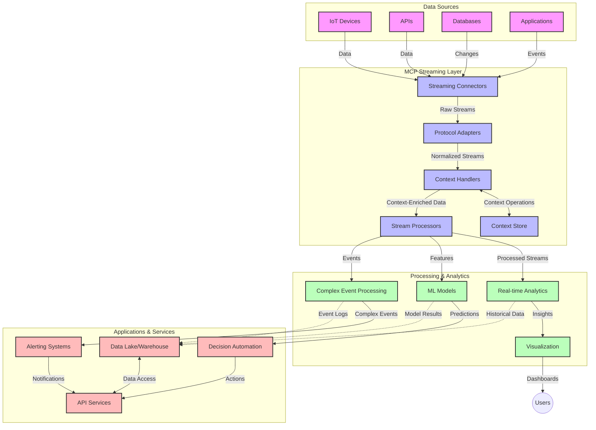

<!--
CO_OP_TRANSLATOR_METADATA:
{
  "original_hash": "68c518dbff8a3b127ed2aa934054c56c",
  "translation_date": "2025-06-11T17:24:26+00:00",
  "source_file": "05-AdvancedTopics/mcp-realtimestreaming/README.md",
  "language_code": "id"
}
-->
# Model Context Protocol untuk Streaming Data Waktu Nyata

## Ikhtisar

Streaming data waktu nyata telah menjadi sangat penting di dunia yang didorong oleh data saat ini, di mana bisnis dan aplikasi membutuhkan akses langsung ke informasi untuk mengambil keputusan tepat waktu. Model Context Protocol (MCP) merupakan kemajuan signifikan dalam mengoptimalkan proses streaming waktu nyata ini, meningkatkan efisiensi pemrosesan data, menjaga integritas konteks, dan meningkatkan kinerja sistem secara keseluruhan.

Modul ini membahas bagaimana MCP mengubah streaming data waktu nyata dengan menyediakan pendekatan standar untuk manajemen konteks di antara model AI, platform streaming, dan aplikasi.

## Pengantar Streaming Data Waktu Nyata

Streaming data waktu nyata adalah paradigma teknologi yang memungkinkan transfer, pemrosesan, dan analisis data secara terus-menerus saat data dihasilkan, memungkinkan sistem bereaksi secara langsung terhadap informasi baru. Berbeda dengan pemrosesan batch tradisional yang bekerja pada dataset statis, streaming memproses data yang sedang bergerak, memberikan wawasan dan tindakan dengan latensi minimal.

### Konsep Inti Streaming Data Waktu Nyata:

- **Aliran Data Berkelanjutan**: Data diproses sebagai aliran peristiwa atau catatan yang terus-menerus dan tidak pernah berhenti.
- **Pemrosesan Latensi Rendah**: Sistem dirancang untuk meminimalkan waktu antara pembuatan data dan pemrosesan.
- **Skalabilitas**: Arsitektur streaming harus mampu menangani volume dan kecepatan data yang bervariasi.
- **Toleransi Kesalahan**: Sistem harus tangguh terhadap kegagalan agar aliran data tidak terganggu.
- **Pemrosesan Stateful**: Mempertahankan konteks antar peristiwa sangat penting untuk analisis yang bermakna.

### Model Context Protocol dan Streaming Waktu Nyata

Model Context Protocol (MCP) mengatasi beberapa tantangan penting dalam lingkungan streaming waktu nyata:

1. **Kontinuitas Kontekstual**: MCP menstandarisasi bagaimana konteks dipertahankan di antara komponen streaming yang terdistribusi, memastikan model AI dan node pemrosesan memiliki akses ke konteks historis dan lingkungan yang relevan.

2. **Manajemen Status yang Efisien**: Dengan menyediakan mekanisme terstruktur untuk transmisi konteks, MCP mengurangi beban manajemen status dalam pipeline streaming.

3. **Interoperabilitas**: MCP menciptakan bahasa umum untuk berbagi konteks antara teknologi streaming dan model AI yang beragam, memungkinkan arsitektur yang lebih fleksibel dan dapat diperluas.

4. **Konteks yang Dioptimalkan untuk Streaming**: Implementasi MCP dapat memprioritaskan elemen konteks yang paling relevan untuk pengambilan keputusan waktu nyata, mengoptimalkan kinerja dan akurasi.

5. **Pemrosesan Adaptif**: Dengan manajemen konteks yang tepat melalui MCP, sistem streaming dapat menyesuaikan pemrosesan secara dinamis berdasarkan kondisi dan pola yang berkembang dalam data.

Dalam aplikasi modern mulai dari jaringan sensor IoT hingga platform perdagangan finansial, integrasi MCP dengan teknologi streaming memungkinkan pemrosesan yang lebih cerdas dan sadar konteks yang dapat merespons situasi kompleks dan dinamis secara tepat waktu.

## Tujuan Pembelajaran

Pada akhir pelajaran ini, Anda akan dapat:

- Memahami dasar-dasar streaming data waktu nyata dan tantangannya
- Menjelaskan bagaimana Model Context Protocol (MCP) meningkatkan streaming data waktu nyata
- Mengimplementasikan solusi streaming berbasis MCP menggunakan framework populer seperti Kafka dan Pulsar
- Merancang dan menerapkan arsitektur streaming yang tahan kesalahan dan berkinerja tinggi dengan MCP
- Menerapkan konsep MCP pada kasus penggunaan IoT, perdagangan finansial, dan analitik berbasis AI
- Mengevaluasi tren yang muncul dan inovasi masa depan dalam teknologi streaming berbasis MCP

### Definisi dan Signifikansi

Streaming data waktu nyata melibatkan pembuatan, pemrosesan, dan pengiriman data secara terus-menerus dengan latensi minimal. Berbeda dengan pemrosesan batch, di mana data dikumpulkan dan diproses secara kelompok, data streaming diproses secara bertahap saat tiba, memungkinkan wawasan dan tindakan langsung.

Karakteristik utama streaming data waktu nyata meliputi:

- **Latensi Rendah**: Memproses dan menganalisis data dalam hitungan milidetik hingga detik
- **Aliran Berkelanjutan**: Aliran data tanpa henti dari berbagai sumber
- **Pemrosesan Langsung**: Menganalisis data saat tiba, bukan secara batch
- **Arsitektur Berbasis Peristiwa**: Merespons peristiwa saat terjadi

### Tantangan dalam Streaming Data Tradisional

Pendekatan streaming data tradisional menghadapi beberapa keterbatasan:

1. **Kehilangan Konteks**: Kesulitan mempertahankan konteks di sistem yang terdistribusi
2. **Masalah Skalabilitas**: Tantangan dalam mengelola volume dan kecepatan data yang tinggi
3. **Kompleksitas Integrasi**: Masalah interoperabilitas antar sistem yang berbeda
4. **Manajemen Latensi**: Menyeimbangkan throughput dengan waktu pemrosesan
5. **Konsistensi Data**: Menjamin akurasi dan kelengkapan data di seluruh aliran

## Memahami Model Context Protocol (MCP)

### Apa itu MCP?

Model Context Protocol (MCP) adalah protokol komunikasi standar yang dirancang untuk memfasilitasi interaksi efisien antara model AI dan aplikasi. Dalam konteks streaming data waktu nyata, MCP menyediakan kerangka kerja untuk:

- Mempertahankan konteks sepanjang pipeline data
- Menstandarisasi format pertukaran data
- Mengoptimalkan transmisi dataset besar
- Meningkatkan komunikasi antar model dan antara model dengan aplikasi

### Komponen Inti dan Arsitektur

Arsitektur MCP untuk streaming waktu nyata terdiri dari beberapa komponen utama:

1. **Context Handlers**: Mengelola dan mempertahankan informasi kontekstual di seluruh pipeline streaming
2. **Stream Processors**: Memproses aliran data masuk menggunakan teknik sadar konteks
3. **Protocol Adapters**: Mengonversi antar protokol streaming yang berbeda sambil mempertahankan konteks
4. **Context Store**: Menyimpan dan mengambil informasi kontekstual secara efisien
5. **Streaming Connectors**: Menghubungkan ke berbagai platform streaming (Kafka, Pulsar, Kinesis, dll.)



### Bagaimana MCP Meningkatkan Penanganan Data Waktu Nyata

MCP mengatasi tantangan streaming tradisional melalui:

- **Integritas Kontekstual**: Mempertahankan hubungan antar data di seluruh pipeline
- **Transmisi yang Dioptimalkan**: Mengurangi redundansi dalam pertukaran data lewat manajemen konteks yang cerdas
- **Antarmuka Standar**: Menyediakan API konsisten untuk komponen streaming
- **Latensi yang Dikurangi**: Meminimalkan overhead pemrosesan melalui penanganan konteks yang efisien
- **Skalabilitas yang Ditingkatkan**: Mendukung skala horizontal sambil mempertahankan konteks

## Integrasi dan Implementasi

Sistem streaming data waktu nyata memerlukan desain arsitektur dan implementasi yang cermat untuk menjaga kinerja dan integritas konteks. Model Context Protocol menawarkan pendekatan standar untuk mengintegrasikan model AI dan teknologi streaming, memungkinkan pipeline pemrosesan yang lebih canggih dan sadar konteks.

### Ikhtisar Integrasi MCP dalam Arsitektur Streaming

Implementasi MCP dalam lingkungan streaming waktu nyata melibatkan beberapa pertimbangan utama:

1. **Serialisasi dan Transportasi Konteks**: MCP menyediakan mekanisme efisien untuk pengkodean informasi kontekstual dalam paket data streaming, memastikan konteks penting mengikuti data sepanjang pipeline pemrosesan. Ini termasuk format serialisasi standar yang dioptimalkan untuk transportasi streaming.

2. **Pemrosesan Stream Stateful**: MCP memungkinkan pemrosesan stateful yang lebih cerdas dengan mempertahankan representasi konteks yang konsisten di seluruh node pemrosesan. Ini sangat berharga dalam arsitektur streaming terdistribusi yang secara tradisional menghadapi tantangan manajemen status.

3. **Waktu Peristiwa vs. Waktu Pemrosesan**: Implementasi MCP dalam sistem streaming harus mengatasi tantangan umum membedakan kapan peristiwa terjadi dan kapan diproses. Protokol dapat mengintegrasikan konteks temporal yang mempertahankan semantik waktu peristiwa.

4. **Manajemen Backpressure**: Dengan menstandarisasi penanganan konteks, MCP membantu mengelola backpressure dalam sistem streaming, memungkinkan komponen berkomunikasi kemampuan pemrosesan mereka dan menyesuaikan aliran data secara tepat.

5. **Windowing dan Agregasi Konteks**: MCP memfasilitasi operasi windowing yang lebih canggih dengan menyediakan representasi terstruktur dari konteks temporal dan relasional, memungkinkan agregasi yang lebih bermakna di seluruh aliran peristiwa.

6. **Pemrosesan Exactly-Once**: Dalam sistem streaming yang memerlukan semantik exactly-once, MCP dapat memasukkan metadata pemrosesan untuk membantu melacak dan memverifikasi status pemrosesan di komponen terdistribusi.

Implementasi MCP di berbagai teknologi streaming menciptakan pendekatan terpadu untuk manajemen konteks, mengurangi kebutuhan kode integrasi khusus sekaligus meningkatkan kemampuan sistem untuk mempertahankan konteks bermakna saat data mengalir melalui pipeline.

### MCP di Berbagai Framework Streaming Data

MCP dapat diintegrasikan dengan framework streaming populer termasuk:

#### Integrasi Apache Kafka

```python
from mcp_streaming import MCPKafkaConnector

# Initialize MCP Kafka connector
connector = MCPKafkaConnector(
    bootstrap_servers='localhost:9092',
    context_preservation=True
)

# Create a context-aware consumer
consumer = connector.create_consumer('input-topic')

# Process streaming data with context
for message in consumer:
    context = message.get_context()
    data = message.get_value()
    
    # Process with context awareness
    result = process_with_context(data, context)
    
    # Produce output with preserved context
    connector.produce('output-topic', result, context=context)
```

#### Implementasi Apache Pulsar

```python
from mcp_streaming import MCPPulsarClient

# Initialize MCP Pulsar client
client = MCPPulsarClient('pulsar://localhost:6650')

# Subscribe with context awareness
consumer = client.subscribe('input-topic', 'subscription-name', 
                           context_enabled=True)

# Process messages with context preservation
while True:
    message = consumer.receive()
    context = message.get_context()
    
    # Process with context
    result = process_with_context(message.data(), context)
    
    # Acknowledge the message
    consumer.acknowledge(message)
    
    # Send result with preserved context
    producer = client.create_producer('output-topic')
    producer.send(result, context=context)
```

### Praktik Terbaik untuk Penyebaran

Saat mengimplementasikan MCP untuk streaming waktu nyata:

1. **Rancang untuk Toleransi Kesalahan**:
   - Terapkan penanganan error yang tepat
   - Gunakan dead-letter queue untuk pesan yang gagal
   - Rancang processor yang idempoten

2. **Optimalkan Kinerja**:
   - Konfigurasi ukuran buffer yang sesuai
   - Gunakan batching bila perlu
   - Terapkan mekanisme backpressure

3. **Pantau dan Observasi**:
   - Lacak metrik pemrosesan stream
   - Monitor propagasi konteks
   - Siapkan peringatan untuk anomali

4. **Amankan Aliran Anda**:
   - Terapkan enkripsi untuk data sensitif
   - Gunakan autentikasi dan otorisasi
   - Terapkan kontrol akses yang tepat

### MCP dalam IoT dan Edge Computing

MCP meningkatkan streaming IoT dengan:

- Mempertahankan konteks perangkat di seluruh pipeline pemrosesan
- Memungkinkan streaming data efisien dari edge ke cloud
- Mendukung analitik waktu nyata pada aliran data IoT
- Memfasilitasi komunikasi perangkat-ke-perangkat dengan konteks

Contoh: Jaringan Sensor Kota Pintar  
```
Sensors → Edge Gateways → MCP Stream Processors → Real-time Analytics → Automated Responses
```

### Peran dalam Transaksi Finansial dan Perdagangan Frekuensi Tinggi

MCP memberikan keuntungan signifikan untuk streaming data finansial:

- Pemrosesan latensi ultra-rendah untuk keputusan perdagangan
- Mempertahankan konteks transaksi sepanjang pemrosesan
- Mendukung pemrosesan peristiwa kompleks dengan kesadaran konteks
- Menjamin konsistensi data di seluruh sistem perdagangan terdistribusi

### Meningkatkan Analitik Data Berbasis AI

MCP membuka kemungkinan baru untuk analitik streaming:

- Pelatihan dan inferensi model secara waktu nyata
- Pembelajaran berkelanjutan dari data streaming
- Ekstraksi fitur yang sadar konteks
- Pipeline inferensi multi-model dengan konteks yang dipertahankan

## Tren dan Inovasi Masa Depan

### Evolusi MCP di Lingkungan Waktu Nyata

Ke depan, kami memperkirakan MCP akan berkembang untuk mengatasi:

- **Integrasi Komputasi Kuantum**: Mempersiapkan sistem streaming berbasis kuantum
- **Pemrosesan Native Edge**: Memindahkan lebih banyak pemrosesan sadar konteks ke perangkat edge
- **Manajemen Streaming Otonom**: Pipeline streaming yang mengoptimalkan diri sendiri
- **Streaming Federasi**: Pemrosesan terdistribusi sambil menjaga privasi

### Kemajuan Teknologi Potensial

Teknologi baru yang akan membentuk masa depan streaming MCP:

1. **Protokol Streaming yang Dioptimalkan untuk AI**: Protokol khusus yang dirancang untuk beban kerja AI
2. **Integrasi Komputasi Neuromorfik**: Komputasi terinspirasi otak untuk pemrosesan stream
3. **Streaming Serverless**: Streaming yang skalabel dan berbasis peristiwa tanpa pengelolaan infrastruktur
4. **Context Store Terdistribusi**: Manajemen konteks yang tersebar secara global namun sangat konsisten

## Latihan Praktik

### Latihan 1: Menyiapkan Pipeline Streaming MCP Dasar

Dalam latihan ini, Anda akan belajar cara:

- Mengonfigurasi lingkungan streaming MCP dasar
- Mengimplementasikan context handler untuk pemrosesan stream
- Menguji dan memvalidasi pelestarian konteks

### Latihan 2: Membangun Dashboard Analitik Waktu Nyata

Buat aplikasi lengkap yang:

- Mengambil data streaming menggunakan MCP
- Memproses stream sambil mempertahankan konteks
- Memvisualisasikan hasil secara waktu nyata

### Latihan 3: Mengimplementasikan Pemrosesan Peristiwa Kompleks dengan MCP

Latihan lanjutan yang mencakup:

- Deteksi pola dalam stream
- Korelasi kontekstual antar banyak stream
- Menghasilkan peristiwa kompleks dengan konteks yang dipertahankan

## Sumber Daya Tambahan

- [Model Context Protocol Specification](https://github.com/microsoft/model-context-protocol) - Spesifikasi dan dokumentasi resmi MCP  
- [Apache Kafka Documentation](https://kafka.apache.org/documentation/) - Pelajari tentang Kafka untuk pemrosesan stream  
- [Apache Pulsar](https://pulsar.apache.org/) - Platform pesan dan streaming terpadu  
- [Streaming Systems: The What, Where, When, and How of Large-Scale Data Processing](https://www.oreilly.com/library/view/streaming-systems/9781491983867/) - Buku komprehensif tentang arsitektur streaming  
- [Microsoft Azure Event Hubs](https://learn.microsoft.com/en-us/azure/event-hubs/event-hubs-about) - Layanan streaming event yang dikelola  
- [MLflow Documentation](https://mlflow.org/docs/latest/index.html) - Untuk pelacakan dan penyebaran model ML  
- [Real-Time Analytics with Apache Storm](https://storm.apache.org/releases/current/index.html) - Framework pemrosesan untuk komputasi waktu nyata  
- [Flink ML](https://nightlies.apache.org/flink/flink-ml-docs-master/) - Perpustakaan machine learning untuk Apache Flink  
- [LangChain Documentation](https://python.langchain.com/docs/get_started/introduction) - Membangun aplikasi dengan LLM

## Hasil Pembelajaran

Dengan menyelesaikan modul ini, Anda akan mampu:

- Memahami dasar-dasar streaming data waktu nyata dan tantangannya
- Menjelaskan bagaimana Model Context Protocol (MCP) meningkatkan streaming data waktu nyata
- Mengimplementasikan solusi streaming berbasis MCP menggunakan framework populer seperti Kafka dan Pulsar
- Merancang dan menerapkan arsitektur streaming yang tahan kesalahan dan berkinerja tinggi dengan MCP
- Menerapkan konsep MCP pada kasus penggunaan IoT, perdagangan finansial, dan analitik berbasis AI
- Mengevaluasi tren yang muncul dan inovasi masa depan dalam teknologi streaming berbasis MCP

## Selanjutnya

- [6. Community Contributions](../../06-CommunityContributions/README.md)

**Penafian**:  
Dokumen ini telah diterjemahkan menggunakan layanan terjemahan AI [Co-op Translator](https://github.com/Azure/co-op-translator). Meskipun kami berusaha untuk akurasi, harap diketahui bahwa terjemahan otomatis mungkin mengandung kesalahan atau ketidakakuratan. Dokumen asli dalam bahasa aslinya harus dianggap sebagai sumber yang otoritatif. Untuk informasi penting, disarankan menggunakan terjemahan profesional oleh manusia. Kami tidak bertanggung jawab atas kesalahpahaman atau penafsiran yang salah yang timbul dari penggunaan terjemahan ini.