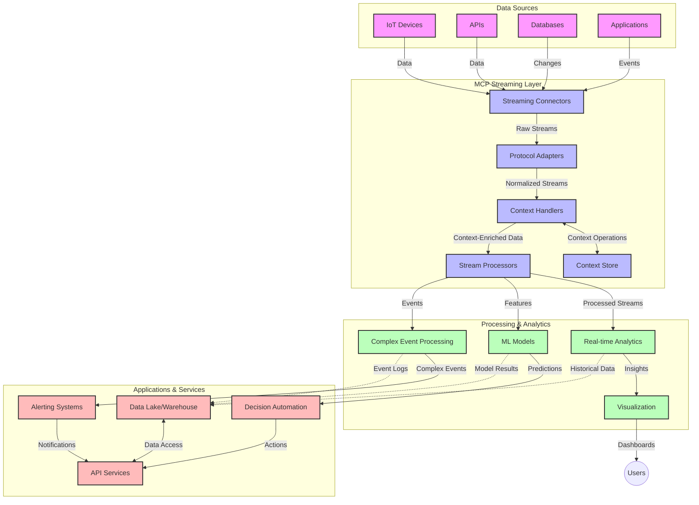

<!--
CO_OP_TRANSLATOR_METADATA:
{
  "original_hash": "195f7287638b77a549acadd96c8f981c",
  "translation_date": "2025-07-14T01:46:05+00:00",
  "source_file": "05-AdvancedTopics/mcp-realtimestreaming/README.md",
  "language_code": "id"
}
-->
# Model Context Protocol untuk Streaming Data Real-Time

## Ikhtisar

Streaming data real-time telah menjadi hal yang sangat penting di dunia yang didorong oleh data saat ini, di mana bisnis dan aplikasi membutuhkan akses informasi secara langsung untuk mengambil keputusan tepat waktu. Model Context Protocol (MCP) merupakan kemajuan signifikan dalam mengoptimalkan proses streaming real-time ini, meningkatkan efisiensi pemrosesan data, menjaga integritas konteks, dan memperbaiki kinerja sistem secara keseluruhan.

Modul ini membahas bagaimana MCP mengubah streaming data real-time dengan menyediakan pendekatan standar untuk manajemen konteks di antara model AI, platform streaming, dan aplikasi.

## Pengenalan Streaming Data Real-Time

Streaming data real-time adalah paradigma teknologi yang memungkinkan transfer, pemrosesan, dan analisis data secara berkelanjutan saat data dihasilkan, sehingga sistem dapat merespons informasi baru secara langsung. Berbeda dengan pemrosesan batch tradisional yang bekerja pada dataset statis, streaming memproses data yang sedang bergerak, memberikan wawasan dan tindakan dengan latensi minimal.

### Konsep Inti Streaming Data Real-Time:

- **Aliran Data Berkelanjutan**: Data diproses sebagai aliran peristiwa atau catatan yang terus menerus tanpa henti.
- **Pemrosesan Latensi Rendah**: Sistem dirancang untuk meminimalkan waktu antara data dihasilkan dan diproses.
- **Skalabilitas**: Arsitektur streaming harus mampu menangani volume dan kecepatan data yang bervariasi.
- **Toleransi Kesalahan**: Sistem harus tahan terhadap kegagalan agar aliran data tidak terputus.
- **Pemrosesan Stateful**: Mempertahankan konteks antar peristiwa sangat penting untuk analisis yang bermakna.

### Model Context Protocol dan Streaming Real-Time

Model Context Protocol (MCP) mengatasi beberapa tantangan penting dalam lingkungan streaming real-time:

1. **Kontinuitas Kontekstual**: MCP menstandarisasi cara konteks dipertahankan di antara komponen streaming yang terdistribusi, memastikan model AI dan node pemrosesan memiliki akses ke konteks historis dan lingkungan yang relevan.

2. **Manajemen Status yang Efisien**: Dengan menyediakan mekanisme terstruktur untuk transmisi konteks, MCP mengurangi beban manajemen status dalam pipeline streaming.

3. **Interoperabilitas**: MCP menciptakan bahasa umum untuk berbagi konteks antara teknologi streaming dan model AI yang beragam, memungkinkan arsitektur yang lebih fleksibel dan dapat diperluas.

4. **Konteks yang Dioptimalkan untuk Streaming**: Implementasi MCP dapat memprioritaskan elemen konteks yang paling relevan untuk pengambilan keputusan real-time, mengoptimalkan kinerja dan akurasi.

5. **Pemrosesan Adaptif**: Dengan manajemen konteks yang tepat melalui MCP, sistem streaming dapat menyesuaikan pemrosesan secara dinamis berdasarkan kondisi dan pola data yang berkembang.

Dalam aplikasi modern mulai dari jaringan sensor IoT hingga platform perdagangan keuangan, integrasi MCP dengan teknologi streaming memungkinkan pemrosesan yang lebih cerdas dan sadar konteks yang dapat merespons situasi kompleks dan berubah secara real-time.

## Tujuan Pembelajaran

Setelah menyelesaikan pelajaran ini, Anda akan mampu:

- Memahami dasar-dasar streaming data real-time dan tantangannya
- Menjelaskan bagaimana Model Context Protocol (MCP) meningkatkan streaming data real-time
- Mengimplementasikan solusi streaming berbasis MCP menggunakan framework populer seperti Kafka dan Pulsar
- Merancang dan menerapkan arsitektur streaming yang tahan kesalahan dan berkinerja tinggi dengan MCP
- Menerapkan konsep MCP pada kasus penggunaan IoT, perdagangan keuangan, dan analitik berbasis AI
- Mengevaluasi tren baru dan inovasi masa depan dalam teknologi streaming berbasis MCP

### Definisi dan Signifikansi

Streaming data real-time melibatkan generasi, pemrosesan, dan pengiriman data secara berkelanjutan dengan latensi minimal. Berbeda dengan pemrosesan batch, di mana data dikumpulkan dan diproses dalam kelompok, data streaming diproses secara bertahap saat tiba, memungkinkan wawasan dan tindakan langsung.

Karakteristik utama streaming data real-time meliputi:

- **Latensi Rendah**: Memproses dan menganalisis data dalam hitungan milidetik hingga detik
- **Aliran Berkelanjutan**: Aliran data tanpa henti dari berbagai sumber
- **Pemrosesan Langsung**: Menganalisis data saat tiba, bukan secara batch
- **Arsitektur Berbasis Peristiwa**: Merespons peristiwa saat terjadi

### Tantangan dalam Streaming Data Tradisional

Pendekatan streaming data tradisional menghadapi beberapa keterbatasan:

1. **Kehilangan Konteks**: Kesulitan mempertahankan konteks di sistem terdistribusi
2. **Masalah Skalabilitas**: Tantangan dalam mengelola data dengan volume dan kecepatan tinggi
3. **Kompleksitas Integrasi**: Masalah interoperabilitas antar sistem yang berbeda
4. **Manajemen Latensi**: Menyeimbangkan throughput dengan waktu pemrosesan
5. **Konsistensi Data**: Menjamin akurasi dan kelengkapan data di seluruh aliran

## Memahami Model Context Protocol (MCP)

### Apa itu MCP?

Model Context Protocol (MCP) adalah protokol komunikasi standar yang dirancang untuk memfasilitasi interaksi efisien antara model AI dan aplikasi. Dalam konteks streaming data real-time, MCP menyediakan kerangka kerja untuk:

- Mempertahankan konteks sepanjang pipeline data
- Menstandarisasi format pertukaran data
- Mengoptimalkan transmisi dataset besar
- Meningkatkan komunikasi antar model dan antara model dengan aplikasi

### Komponen Inti dan Arsitektur

Arsitektur MCP untuk streaming real-time terdiri dari beberapa komponen utama:

1. **Context Handlers**: Mengelola dan mempertahankan informasi kontekstual di seluruh pipeline streaming
2. **Stream Processors**: Memproses aliran data masuk menggunakan teknik sadar konteks
3. **Protocol Adapters**: Mengonversi antar protokol streaming yang berbeda sambil mempertahankan konteks
4. **Context Store**: Menyimpan dan mengambil informasi kontekstual secara efisien
5. **Streaming Connectors**: Menghubungkan ke berbagai platform streaming (Kafka, Pulsar, Kinesis, dll.)



### Bagaimana MCP Meningkatkan Penanganan Data Real-Time

MCP mengatasi tantangan streaming tradisional melalui:

- **Integritas Kontekstual**: Mempertahankan hubungan antar titik data di seluruh pipeline
- **Transmisi yang Dioptimalkan**: Mengurangi redundansi dalam pertukaran data melalui manajemen konteks yang cerdas
- **Antarmuka Standar**: Menyediakan API yang konsisten untuk komponen streaming
- **Pengurangan Latensi**: Meminimalkan beban pemrosesan melalui penanganan konteks yang efisien
- **Peningkatan Skalabilitas**: Mendukung skala horizontal sambil mempertahankan konteks

## Integrasi dan Implementasi

Sistem streaming data real-time memerlukan desain arsitektur dan implementasi yang cermat untuk menjaga kinerja sekaligus integritas konteks. Model Context Protocol menawarkan pendekatan standar untuk mengintegrasikan model AI dan teknologi streaming, memungkinkan pipeline pemrosesan yang lebih canggih dan sadar konteks.

### Ikhtisar Integrasi MCP dalam Arsitektur Streaming

Implementasi MCP dalam lingkungan streaming real-time melibatkan beberapa pertimbangan utama:

1. **Serialisasi dan Transportasi Konteks**: MCP menyediakan mekanisme efisien untuk mengkodekan informasi kontekstual dalam paket data streaming, memastikan konteks penting mengikuti data sepanjang pipeline pemrosesan. Ini termasuk format serialisasi standar yang dioptimalkan untuk transportasi streaming.

2. **Pemrosesan Stream Stateful**: MCP memungkinkan pemrosesan stateful yang lebih cerdas dengan mempertahankan representasi konteks yang konsisten di seluruh node pemrosesan. Ini sangat berharga dalam arsitektur streaming terdistribusi di mana manajemen status biasanya menantang.

3. **Waktu Peristiwa vs. Waktu Pemrosesan**: Implementasi MCP dalam sistem streaming harus mengatasi tantangan umum membedakan kapan peristiwa terjadi dan kapan diproses. Protokol dapat menggabungkan konteks temporal yang mempertahankan semantik waktu peristiwa.

4. **Manajemen Backpressure**: Dengan menstandarisasi penanganan konteks, MCP membantu mengelola backpressure dalam sistem streaming, memungkinkan komponen untuk mengomunikasikan kapasitas pemrosesan mereka dan menyesuaikan aliran data.

5. **Windowing dan Agregasi Konteks**: MCP memfasilitasi operasi windowing yang lebih canggih dengan menyediakan representasi terstruktur dari konteks temporal dan relasional, memungkinkan agregasi yang lebih bermakna di seluruh aliran peristiwa.

6. **Pemrosesan Exactly-Once**: Dalam sistem streaming yang memerlukan semantik exactly-once, MCP dapat menggabungkan metadata pemrosesan untuk membantu melacak dan memverifikasi status pemrosesan di seluruh komponen terdistribusi.

Implementasi MCP di berbagai teknologi streaming menciptakan pendekatan terpadu untuk manajemen konteks, mengurangi kebutuhan kode integrasi khusus sekaligus meningkatkan kemampuan sistem untuk mempertahankan konteks bermakna saat data mengalir melalui pipeline.

### MCP dalam Berbagai Framework Streaming Data

Contoh-contoh ini mengikuti spesifikasi MCP saat ini yang berfokus pada protokol berbasis JSON-RPC dengan mekanisme transportasi yang berbeda. Kode menunjukkan bagaimana Anda dapat mengimplementasikan transportasi kustom yang mengintegrasikan platform streaming seperti Kafka dan Pulsar sambil mempertahankan kompatibilitas penuh dengan protokol MCP.

Contoh ini dirancang untuk menunjukkan bagaimana platform streaming dapat diintegrasikan dengan MCP untuk menyediakan pemrosesan data real-time sambil menjaga kesadaran konteks yang menjadi inti MCP. Pendekatan ini memastikan contoh kode mencerminkan kondisi spesifikasi MCP terkini per Juni 2025.

MCP dapat diintegrasikan dengan framework streaming populer termasuk:

#### Integrasi Apache Kafka

```python
import asyncio
import json
from typing import Dict, Any, Optional
from confluent_kafka import Consumer, Producer, KafkaError
from mcp.client import Client, ClientCapabilities
from mcp.core.message import JsonRpcMessage
from mcp.core.transports import Transport

# Custom transport class to bridge MCP with Kafka
class KafkaMCPTransport(Transport):
    def __init__(self, bootstrap_servers: str, input_topic: str, output_topic: str):
        self.bootstrap_servers = bootstrap_servers
        self.input_topic = input_topic
        self.output_topic = output_topic
        self.producer = Producer({'bootstrap.servers': bootstrap_servers})
        self.consumer = Consumer({
            'bootstrap.servers': bootstrap_servers,
            'group.id': 'mcp-client-group',
            'auto.offset.reset': 'earliest'
        })
        self.message_queue = asyncio.Queue()
        self.running = False
        self.consumer_task = None
        
    async def connect(self):
        """Connect to Kafka and start consuming messages"""
        self.consumer.subscribe([self.input_topic])
        self.running = True
        self.consumer_task = asyncio.create_task(self._consume_messages())
        return self
        
    async def _consume_messages(self):
        """Background task to consume messages from Kafka and queue them for processing"""
        while self.running:
            try:
                msg = self.consumer.poll(1.0)
                if msg is None:
                    await asyncio.sleep(0.1)
                    continue
                
                if msg.error():
                    if msg.error().code() == KafkaError._PARTITION_EOF:
                        continue
                    print(f"Consumer error: {msg.error()}")
                    continue
                
                # Parse the message value as JSON-RPC
                try:
                    message_str = msg.value().decode('utf-8')
                    message_data = json.loads(message_str)
                    mcp_message = JsonRpcMessage.from_dict(message_data)
                    await self.message_queue.put(mcp_message)
                except Exception as e:
                    print(f"Error parsing message: {e}")
            except Exception as e:
                print(f"Error in consumer loop: {e}")
                await asyncio.sleep(1)
    
    async def read(self) -> Optional[JsonRpcMessage]:
        """Read the next message from the queue"""
        try:
            message = await self.message_queue.get()
            return message
        except Exception as e:
            print(f"Error reading message: {e}")
            return None
    
    async def write(self, message: JsonRpcMessage) -> None:
        """Write a message to the Kafka output topic"""
        try:
            message_json = json.dumps(message.to_dict())
            self.producer.produce(
                self.output_topic,
                message_json.encode('utf-8'),
                callback=self._delivery_report
            )
            self.producer.poll(0)  # Trigger callbacks
        except Exception as e:
            print(f"Error writing message: {e}")
    
    def _delivery_report(self, err, msg):
        """Kafka producer delivery callback"""
        if err is not None:
            print(f'Message delivery failed: {err}')
        else:
            print(f'Message delivered to {msg.topic()} [{msg.partition()}]')
    
    async def close(self) -> None:
        """Close the transport"""
        self.running = False
        if self.consumer_task:
            self.consumer_task.cancel()
            try:
                await self.consumer_task
            except asyncio.CancelledError:
                pass
        self.consumer.close()
        self.producer.flush()

# Example usage of the Kafka MCP transport
async def kafka_mcp_example():
    # Create MCP client with Kafka transport
    client = Client(
        {"name": "kafka-mcp-client", "version": "1.0.0"},
        ClientCapabilities({})
    )
    
    # Create and connect the Kafka transport
    transport = KafkaMCPTransport(
        bootstrap_servers="localhost:9092",
        input_topic="mcp-responses",
        output_topic="mcp-requests"
    )
    
    await client.connect(transport)
    
    try:
        # Initialize the MCP session
        await client.initialize()
        
        # Example of executing a tool via MCP
        response = await client.execute_tool(
            "process_data",
            {
                "data": "sample data",
                "metadata": {
                    "source": "sensor-1",
                    "timestamp": "2025-06-12T10:30:00Z"
                }
            }
        )
        
        print(f"Tool execution response: {response}")
        
        # Clean shutdown
        await client.shutdown()
    finally:
        await transport.close()

# Run the example
if __name__ == "__main__":
    asyncio.run(kafka_mcp_example())
```

#### Implementasi Apache Pulsar

```python
import asyncio
import json
import pulsar
from typing import Dict, Any, Optional
from mcp.core.message import JsonRpcMessage
from mcp.core.transports import Transport
from mcp.server import Server, ServerOptions
from mcp.server.tools import Tool, ToolExecutionContext, ToolMetadata

# Create a custom MCP transport that uses Pulsar
class PulsarMCPTransport(Transport):
    def __init__(self, service_url: str, request_topic: str, response_topic: str):
        self.service_url = service_url
        self.request_topic = request_topic
        self.response_topic = response_topic
        self.client = pulsar.Client(service_url)
        self.producer = self.client.create_producer(response_topic)
        self.consumer = self.client.subscribe(
            request_topic,
            "mcp-server-subscription",
            consumer_type=pulsar.ConsumerType.Shared
        )
        self.message_queue = asyncio.Queue()
        self.running = False
        self.consumer_task = None
    
    async def connect(self):
        """Connect to Pulsar and start consuming messages"""
        self.running = True
        self.consumer_task = asyncio.create_task(self._consume_messages())
        return self
    
    async def _consume_messages(self):
        """Background task to consume messages from Pulsar and queue them for processing"""
        while self.running:
            try:
                # Non-blocking receive with timeout
                msg = self.consumer.receive(timeout_millis=500)
                
                # Process the message
                try:
                    message_str = msg.data().decode('utf-8')
                    message_data = json.loads(message_str)
                    mcp_message = JsonRpcMessage.from_dict(message_data)
                    await self.message_queue.put(mcp_message)
                    
                    # Acknowledge the message
                    self.consumer.acknowledge(msg)
                except Exception as e:
                    print(f"Error processing message: {e}")
                    # Negative acknowledge if there was an error
                    self.consumer.negative_acknowledge(msg)
            except Exception as e:
                # Handle timeout or other exceptions
                await asyncio.sleep(0.1)
    
    async def read(self) -> Optional[JsonRpcMessage]:
        """Read the next message from the queue"""
        try:
            message = await self.message_queue.get()
            return message
        except Exception as e:
            print(f"Error reading message: {e}")
            return None
    
    async def write(self, message: JsonRpcMessage) -> None:
        """Write a message to the Pulsar output topic"""
        try:
            message_json = json.dumps(message.to_dict())
            self.producer.send(message_json.encode('utf-8'))
        except Exception as e:
            print(f"Error writing message: {e}")
    
    async def close(self) -> None:
        """Close the transport"""
        self.running = False
        if self.consumer_task:
            self.consumer_task.cancel()
            try:
                await self.consumer_task
            except asyncio.CancelledError:
                pass
        self.consumer.close()
        self.producer.close()
        self.client.close()

# Define a sample MCP tool that processes streaming data
@Tool(
    name="process_streaming_data",
    description="Process streaming data with context preservation",
    metadata=ToolMetadata(
        required_capabilities=["streaming"]
    )
)
async def process_streaming_data(
    ctx: ToolExecutionContext,
    data: str,
    source: str,
    priority: str = "medium"
) -> Dict[str, Any]:
    """
    Process streaming data while preserving context
    
    Args:
        ctx: Tool execution context
        data: The data to process
        source: The source of the data
        priority: Priority level (low, medium, high)
        
    Returns:
        Dict containing processed results and context information
    """
    # Example processing that leverages MCP context
    print(f"Processing data from {source} with priority {priority}")
    
    # Access conversation context from MCP
    conversation_id = ctx.conversation_id if hasattr(ctx, 'conversation_id') else "unknown"
    
    # Return results with enhanced context
    return {
        "processed_data": f"Processed: {data}",
        "context": {
            "conversation_id": conversation_id,
            "source": source,
            "priority": priority,
            "processing_timestamp": ctx.get_current_time_iso()
        }
    }

# Example MCP server implementation using Pulsar transport
async def run_mcp_server_with_pulsar():
    # Create MCP server
    server = Server(
        {"name": "pulsar-mcp-server", "version": "1.0.0"},
        ServerOptions(
            capabilities={"streaming": True}
        )
    )
    
    # Register our tool
    server.register_tool(process_streaming_data)
    
    # Create and connect Pulsar transport
    transport = PulsarMCPTransport(
        service_url="pulsar://localhost:6650",
        request_topic="mcp-requests",
        response_topic="mcp-responses"
    )
    
    try:
        # Start the server with the Pulsar transport
        await server.run(transport)
    finally:
        await transport.close()

# Run the server
if __name__ == "__main__":
    asyncio.run(run_mcp_server_with_pulsar())
```

### Praktik Terbaik untuk Penerapan

Saat mengimplementasikan MCP untuk streaming real-time:

1. **Rancang untuk Toleransi Kesalahan**:
   - Terapkan penanganan kesalahan yang tepat
   - Gunakan dead-letter queue untuk pesan yang gagal
   - Rancang processor yang idempoten

2. **Optimalkan Kinerja**:
   - Konfigurasikan ukuran buffer yang sesuai
   - Gunakan batching bila perlu
   - Terapkan mekanisme backpressure

3. **Pantau dan Amati**:
   - Lacak metrik pemrosesan stream
   - Monitor propagasi konteks
   - Atur peringatan untuk anomali

4. **Amankan Aliran Data Anda**:
   - Terapkan enkripsi untuk data sensitif
   - Gunakan autentikasi dan otorisasi
   - Terapkan kontrol akses yang tepat

### MCP dalam IoT dan Edge Computing

MCP meningkatkan streaming IoT dengan:

- Mempertahankan konteks perangkat sepanjang pipeline pemrosesan
- Memungkinkan streaming data efisien dari edge ke cloud
- Mendukung analitik real-time pada aliran data IoT
- Memfasilitasi komunikasi antar perangkat dengan konteks

Contoh: Jaringan Sensor Kota Pintar  
```
Sensors → Edge Gateways → MCP Stream Processors → Real-time Analytics → Automated Responses
```

### Peran dalam Transaksi Keuangan dan Perdagangan Frekuensi Tinggi

MCP memberikan keuntungan signifikan untuk streaming data keuangan:

- Pemrosesan latensi ultra-rendah untuk keputusan perdagangan
- Mempertahankan konteks transaksi sepanjang pemrosesan
- Mendukung pemrosesan peristiwa kompleks dengan kesadaran konteks
- Menjamin konsistensi data di seluruh sistem perdagangan terdistribusi

### Meningkatkan Analitik Data Berbasis AI

MCP membuka kemungkinan baru untuk analitik streaming:

- Pelatihan dan inferensi model secara real-time
- Pembelajaran berkelanjutan dari data streaming
- Ekstraksi fitur yang sadar konteks
- Pipeline inferensi multi-model dengan konteks yang terjaga

## Tren dan Inovasi Masa Depan

### Evolusi MCP di Lingkungan Real-Time

Ke depan, kami memperkirakan MCP akan berkembang untuk mengatasi:

- **Integrasi Komputasi Kuantum**: Mempersiapkan sistem streaming berbasis kuantum
- **Pemrosesan Edge-Native**: Memindahkan lebih banyak pemrosesan sadar konteks ke perangkat edge
- **Manajemen Streaming Otonom**: Pipeline streaming yang mengoptimalkan diri sendiri
- **Streaming Federasi**: Pemrosesan terdistribusi sambil menjaga privasi

### Kemajuan Teknologi Potensial

Teknologi baru yang akan membentuk masa depan streaming MCP:

1. **Protokol Streaming yang Dioptimalkan untuk AI**: Protokol khusus yang dirancang untuk beban kerja AI
2. **Integrasi Komputasi Neuromorfik**: Komputasi terinspirasi otak untuk pemrosesan streaming
3. **Streaming Serverless**: Streaming berbasis event-driven yang skalabel tanpa pengelolaan infrastruktur
4. **Context Store Terdistribusi**: Manajemen konteks yang tersebar secara global namun sangat konsisten

## Latihan Praktik

### Latihan 1: Menyiapkan Pipeline Streaming MCP Dasar

Dalam latihan ini, Anda akan belajar bagaimana:

- Mengonfigurasi lingkungan streaming MCP dasar
- Mengimplementasikan context handler untuk pemrosesan stream
- Menguji dan memvalidasi pelestarian konteks

### Latihan 2: Membangun Dashboard Analitik Real-Time

Buat aplikasi lengkap yang:

- Mengambil data streaming menggunakan MCP
- Memproses stream sambil mempertahankan konteks
- Memvisualisasikan hasil secara real-time

### Latihan 3: Mengimplementasikan Pemrosesan Peristiwa Kompleks dengan MCP

Latihan lanjutan yang mencakup:

- Deteksi pola dalam stream
- Korelasi kontekstual antar beberapa stream
- Menghasilkan peristiwa kompleks dengan konteks yang terjaga

## Sumber Daya Tambahan

- [Model Context Protocol Specification](https://github.com/modelcontextprotocol) - Spesifikasi dan dokumentasi resmi MCP
- [Apache Kafka Documentation](https://kafka.apache.org/documentation/) - Pelajari tentang Kafka untuk pemrosesan stream
- [Apache Pulsar](https://pulsar.apache.org/) - Platform messaging dan streaming terpadu
- [Streaming Systems: The What, Where, When, and How of Large-Scale Data Processing](https://www.oreilly.com/library/view/streaming-systems/9781491983867/) - Buku komprehensif tentang arsitektur streaming
- [Microsoft Azure Event Hubs](https://learn.microsoft.com/azure/event-hubs/event-hubs-about) - Layanan streaming event terkelola
- [MLflow Documentation](https://mlflow.org/docs/latest/index.html) - Untuk pelacakan dan penerapan model ML
- [Real-Time Analytics with Apache Storm](https://storm.apache.org/releases/current/index.html) - Framework pemrosesan komputasi real-time
- [Flink ML](https://nightlies.apache.org/flink/flink-ml-docs-master/) - Perpustakaan machine learning untuk Apache Flink
- [LangChain Documentation](https://python.langchain.com/docs/get_started/introduction) - Membangun aplikasi dengan LLM

## Hasil Pembelajaran

Dengan menyelesaikan modul ini, Anda akan mampu:

- Memahami dasar-dasar streaming data real-time dan tantangannya
- Menjelaskan bagaimana Model Context Protocol (MCP) meningkatkan streaming data real-time
- Mengimplementasikan solusi streaming berbasis MCP menggunakan framework populer seperti Kafka dan Pulsar
- Merancang dan menerapkan arsitektur streaming yang tahan kesalahan dan berkinerja tinggi dengan MCP
- Menerapkan konsep MCP pada kasus penggunaan IoT, perdagangan keuangan, dan analitik berbasis AI
- Mengevaluasi tren baru dan inovasi masa depan dalam teknologi streaming berbasis MCP

## Selanjutnya

- [5.11 Realtime Search](../mcp-realtimesearch/README.md)

**Penafian**:  
Dokumen ini telah diterjemahkan menggunakan layanan terjemahan AI [Co-op Translator](https://github.com/Azure/co-op-translator). Meskipun kami berupaya untuk mencapai akurasi, harap diingat bahwa terjemahan otomatis mungkin mengandung kesalahan atau ketidakakuratan. Dokumen asli dalam bahasa aslinya harus dianggap sebagai sumber yang sahih. Untuk informasi penting, disarankan menggunakan terjemahan profesional oleh manusia. Kami tidak bertanggung jawab atas kesalahpahaman atau penafsiran yang keliru yang timbul dari penggunaan terjemahan ini.