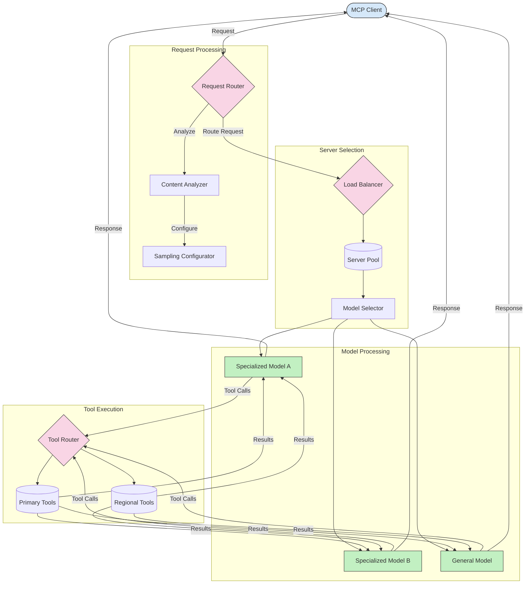

<!--
CO_OP_TRANSLATOR_METADATA:
{
  "original_hash": "2f1b473818b5a6cc9a9bbf777fffa6d4",
  "translation_date": "2025-07-14T21:49:30+00:00",
  "source_file": "05-AdvancedTopics/mcp-routing/README.md",
  "language_code": "id"
}
-->
## Arsitektur Sampling dan Routing dalam MCP

Sampling adalah komponen penting dari Model Context Protocol (MCP) yang memungkinkan pemrosesan dan routing permintaan secara efisien. Ini melibatkan analisis permintaan yang masuk untuk menentukan model atau layanan yang paling tepat untuk menanganinya, berdasarkan berbagai kriteria seperti jenis konten, konteks pengguna, dan beban sistem.

Sampling dan routing dapat digabungkan untuk menciptakan arsitektur yang kuat yang mengoptimalkan pemanfaatan sumber daya dan memastikan ketersediaan tinggi. Proses sampling dapat digunakan untuk mengklasifikasikan permintaan, sementara routing mengarahkan mereka ke model atau layanan yang sesuai.

Diagram di bawah ini menggambarkan bagaimana sampling dan routing bekerja bersama dalam arsitektur MCP yang komprehensif:

## Selanjutnya

- [5.6 Sampling](../mcp-sampling/README.md)

**Penafian**:  
Dokumen ini telah diterjemahkan menggunakan layanan terjemahan AI [Co-op Translator](https://github.com/Azure/co-op-translator). Meskipun kami berupaya untuk mencapai akurasi, harap diperhatikan bahwa terjemahan otomatis mungkin mengandung kesalahan atau ketidakakuratan. Dokumen asli dalam bahasa aslinya harus dianggap sebagai sumber yang sahih. Untuk informasi penting, disarankan menggunakan terjemahan profesional oleh manusia. Kami tidak bertanggung jawab atas kesalahpahaman atau penafsiran yang keliru yang timbul dari penggunaan terjemahan ini.