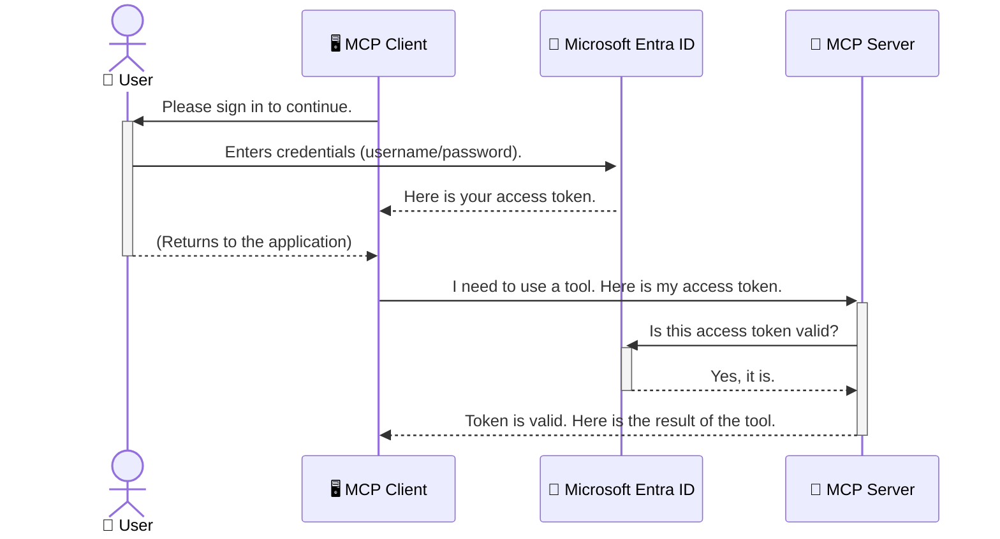

<!--
CO_OP_TRANSLATOR_METADATA:
{
  "original_hash": "9abe1d303ab126f9a8b87f03cebe5213",
  "translation_date": "2025-06-26T14:54:38+00:00",
  "source_file": "05-AdvancedTopics/mcp-security-entra/README.md",
  "language_code": "id"
}
-->
# Mengamankan Alur Kerja AI: Otentikasi Entra ID untuk Server Model Context Protocol

## Pendahuluan  
Mengamankan server Model Context Protocol (MCP) Anda sama pentingnya dengan mengunci pintu depan rumah Anda. Membiarkan server MCP terbuka membuat alat dan data Anda rentan terhadap akses tidak sah, yang dapat menyebabkan pelanggaran keamanan. Microsoft Entra ID menyediakan solusi manajemen identitas dan akses berbasis cloud yang kuat, membantu memastikan hanya pengguna dan aplikasi yang berwenang yang dapat berinteraksi dengan server MCP Anda. Pada bagian ini, Anda akan belajar cara melindungi alur kerja AI Anda menggunakan otentikasi Entra ID.

## Tujuan Pembelajaran  
Setelah menyelesaikan bagian ini, Anda akan dapat:

- Memahami pentingnya mengamankan server MCP.  
- Menjelaskan dasar-dasar Microsoft Entra ID dan otentikasi OAuth 2.0.  
- Mengenali perbedaan antara klien publik dan klien rahasia.  
- Menerapkan otentikasi Entra ID pada skenario server MCP lokal (klien publik) dan jarak jauh (klien rahasia).  
- Menerapkan praktik keamanan terbaik saat mengembangkan alur kerja AI.

# Mengamankan Alur Kerja AI: Otentikasi Entra ID untuk Server Model Context Protocol

Sama seperti Anda tidak akan membiarkan pintu depan rumah Anda terbuka, Anda juga tidak boleh membiarkan server MCP Anda dapat diakses oleh siapa saja. Mengamankan alur kerja AI Anda sangat penting untuk membangun aplikasi yang kuat, dapat dipercaya, dan aman. Bab ini akan memperkenalkan Anda pada penggunaan Microsoft Entra ID untuk mengamankan server MCP Anda, memastikan hanya pengguna dan aplikasi yang berwenang yang dapat mengakses alat dan data Anda.

## Mengapa Keamanan Penting untuk Server MCP

Bayangkan server MCP Anda memiliki alat yang bisa mengirim email atau mengakses database pelanggan. Server yang tidak aman berarti siapa saja bisa menggunakan alat tersebut, yang berpotensi menyebabkan akses data tanpa izin, spam, atau aktivitas berbahaya lainnya.

Dengan menerapkan otentikasi, Anda memastikan setiap permintaan ke server Anda diverifikasi, mengonfirmasi identitas pengguna atau aplikasi yang membuat permintaan tersebut. Ini adalah langkah pertama dan paling penting dalam mengamankan alur kerja AI Anda.

## Pengenalan Microsoft Entra ID

**Microsoft Entra ID** adalah layanan manajemen identitas dan akses berbasis cloud. Anggaplah ini sebagai penjaga keamanan universal untuk aplikasi Anda. Entra ID menangani proses kompleks dalam memverifikasi identitas pengguna (otentikasi) dan menentukan apa yang boleh mereka lakukan (otorisasi).

Dengan menggunakan Entra ID, Anda dapat:

- Mengaktifkan masuk yang aman bagi pengguna.  
- Melindungi API dan layanan.  
- Mengelola kebijakan akses dari satu lokasi pusat.

Untuk server MCP, Entra ID menyediakan solusi yang kuat dan terpercaya untuk mengatur siapa yang dapat mengakses kemampuan server Anda.

---

## Memahami Cara Kerja: Bagaimana Otentikasi Entra ID Bekerja

Entra ID menggunakan standar terbuka seperti **OAuth 2.0** untuk menangani otentikasi. Meskipun detailnya bisa rumit, konsep inti sangat sederhana dan bisa dipahami melalui analogi.

### Pengenalan Sederhana ke OAuth 2.0: Kunci Valet

Bayangkan OAuth 2.0 seperti layanan valet untuk mobil Anda. Ketika Anda tiba di restoran, Anda tidak memberikan kunci utama mobil Anda ke valet. Sebaliknya, Anda memberikan **kunci valet** yang memiliki izin terbatas—bisa menyalakan mobil dan mengunci pintu, tapi tidak bisa membuka bagasi atau kompartemen glovebox.

Dalam analogi ini:

- **Anda** adalah **Pengguna**.  
- **Mobil Anda** adalah **Server MCP** dengan alat dan data berharga.  
- **Valet** adalah **Microsoft Entra ID**.  
- **Petugas Parkir** adalah **Klien MCP** (aplikasi yang mencoba mengakses server).  
- **Kunci Valet** adalah **Access Token**.

Access token adalah string teks yang aman yang diterima klien MCP dari Entra ID setelah Anda masuk. Klien kemudian menyajikan token ini ke server MCP setiap kali membuat permintaan. Server dapat memverifikasi token untuk memastikan permintaan sah dan klien memiliki izin yang diperlukan, tanpa harus menangani kredensial asli Anda (seperti kata sandi).

### Alur Otentikasi

Berikut cara proses ini bekerja secara praktis:



### Memperkenalkan Microsoft Authentication Library (MSAL)

Sebelum kita masuk ke kode, penting untuk mengenalkan komponen utama yang akan Anda temui dalam contoh: **Microsoft Authentication Library (MSAL)**.

MSAL adalah perpustakaan yang dikembangkan oleh Microsoft yang memudahkan pengembang menangani otentikasi. Alih-alih Anda menulis kode kompleks untuk mengelola token keamanan, proses masuk, dan penyegaran sesi, MSAL yang mengurus semuanya.

Menggunakan perpustakaan seperti MSAL sangat dianjurkan karena:

- **Aman:** Mengimplementasikan protokol standar industri dan praktik keamanan terbaik, mengurangi risiko kerentanan dalam kode Anda.  
- **Menyederhanakan Pengembangan:** Mengabstraksi kompleksitas protokol OAuth 2.0 dan OpenID Connect, memungkinkan Anda menambahkan otentikasi yang kuat dengan beberapa baris kode saja.  
- **Terawat:** Microsoft secara aktif memelihara dan memperbarui MSAL untuk menghadapi ancaman keamanan baru dan perubahan platform.

MSAL mendukung banyak bahasa dan kerangka aplikasi, termasuk .NET, JavaScript/TypeScript, Python, Java, Go, dan platform mobile seperti iOS dan Android. Ini memungkinkan Anda menggunakan pola otentikasi yang konsisten di seluruh tumpukan teknologi Anda.

Untuk mempelajari lebih lanjut tentang MSAL, Anda dapat melihat dokumentasi resmi [MSAL overview documentation](https://learn.microsoft.com/entra/identity-platform/msal-overview).

---

## Mengamankan Server MCP Anda dengan Entra ID: Panduan Langkah demi Langkah

Sekarang, mari kita bahas cara mengamankan server MCP lokal (yang berkomunikasi melalui `stdio`) using Entra ID. This example uses a **public client**, which is suitable for applications running on a user's machine, like a desktop app or a local development server.

### Scenario 1: Securing a Local MCP Server (with a Public Client)

In this scenario, we'll look at an MCP server that runs locally, communicates over `stdio`, and uses Entra ID to authenticate the user before allowing access to its tools. The server will have a single tool that fetches the user's profile information from the Microsoft Graph API.

#### 1. Setting Up the Application in Entra ID

Before writing any code, you need to register your application in Microsoft Entra ID. This tells Entra ID about your application and grants it permission to use the authentication service.

1. Navigate to the **[Microsoft Entra portal](https://entra.microsoft.com/)**.
2. Go to **App registrations** and click **New registration**.
3. Give your application a name (e.g., "My Local MCP Server").
4. For **Supported account types**, select **Accounts in this organizational directory only**.
5. You can leave the **Redirect URI** blank for this example.
6. Click **Register**.

Once registered, take note of the **Application (client) ID** and **Directory (tenant) ID**. You'll need these in your code.

#### 2. The Code: A Breakdown

Let's look at the key parts of the code that handle authentication. The full code for this example is available in the [Entra ID - Local - WAM](https://github.com/Azure-Samples/mcp-auth-servers/tree/main/src/entra-id-local-wam) folder of the [mcp-auth-servers GitHub repository](https://github.com/Azure-Samples/mcp-auth-servers).

**`AuthenticationService.cs`**

This class is responsible for handling the interaction with Entra ID.

- **`CreateAsync`**: This method initializes the `PublicClientApplication` from the MSAL (Microsoft Authentication Library). It's configured with your application's `clientId` and `tenantId`.
- **`WithBroker`**: This enables the use of a broker (like the Windows Web Account Manager), which provides a more secure and seamless single sign-on experience.
- **`AcquireTokenAsync`**: Ini adalah metode inti. Pertama mencoba mendapatkan token secara diam-diam (silent), artinya pengguna tidak perlu masuk ulang jika sudah memiliki sesi yang valid. Jika token silent tidak bisa diperoleh, pengguna akan diminta untuk masuk secara interaktif.

```csharp
// Simplified for clarity
public static async Task<AuthenticationService> CreateAsync(ILogger<AuthenticationService> logger)
{
    var msalClient = PublicClientApplicationBuilder
        .Create(_clientId) // Your Application (client) ID
        .WithAuthority(AadAuthorityAudience.AzureAdMyOrg)
        .WithTenantId(_tenantId) // Your Directory (tenant) ID
        .WithBroker(new BrokerOptions(BrokerOptions.OperatingSystems.Windows))
        .Build();

    // ... cache registration ...

    return new AuthenticationService(logger, msalClient);
}

public async Task<string> AcquireTokenAsync()
{
    try
    {
        // Try silent authentication first
        var accounts = await _msalClient.GetAccountsAsync();
        var account = accounts.FirstOrDefault();

        AuthenticationResult? result = null;

        if (account != null)
        {
            result = await _msalClient.AcquireTokenSilent(_scopes, account).ExecuteAsync();
        }
        else
        {
            // If no account, or silent fails, go interactive
            result = await _msalClient.AcquireTokenInteractive(_scopes).ExecuteAsync();
        }

        return result.AccessToken;
    }
    catch (Exception ex)
    {
        _logger.LogError(ex, "An error occurred while acquiring the token.");
        throw; // Optionally rethrow the exception for higher-level handling
    }
}
```

**`Program.cs`**

This is where the MCP server is set up and the authentication service is integrated.

- **`AddSingleton<AuthenticationService>`**: This registers the `AuthenticationService` with the dependency injection container, so it can be used by other parts of the application (like our tool).
- **`GetUserDetailsFromGraph` tool**: This tool requires an instance of `AuthenticationService`. Before it does anything, it calls `authService.AcquireTokenAsync()` untuk mendapatkan token akses yang valid. Jika otentikasi berhasil, token tersebut digunakan untuk memanggil Microsoft Graph API dan mengambil detail pengguna.

```csharp
// Simplified for clarity
[McpServerTool(Name = "GetUserDetailsFromGraph")]
public static async Task<string> GetUserDetailsFromGraph(
    AuthenticationService authService)
{
    try
    {
        // This will trigger the authentication flow
        var accessToken = await authService.AcquireTokenAsync();

        // Use the token to create a GraphServiceClient
        var graphClient = new GraphServiceClient(
            new BaseBearerTokenAuthenticationProvider(new TokenProvider(authService)));

        var user = await graphClient.Me.GetAsync();

        return System.Text.Json.JsonSerializer.Serialize(user);
    }
    catch (Exception ex)
    {
        return $"Error: {ex.Message}";
    }
}
```

#### 3. Cara Kerja Keseluruhan

1. Ketika klien MCP mencoba menggunakan `GetUserDetailsFromGraph` tool, the tool first calls `AcquireTokenAsync`.
2. `AcquireTokenAsync` triggers the MSAL library to check for a valid token.
3. If no token is found, MSAL, through the broker, will prompt the user to sign in with their Entra ID account.
4. Once the user signs in, Entra ID issues an access token.
5. The tool receives the token and uses it to make a secure call to the Microsoft Graph API.
6. The user's details are returned to the MCP client.

This process ensures that only authenticated users can use the tool, effectively securing your local MCP server.

### Scenario 2: Securing a Remote MCP Server (with a Confidential Client)

When your MCP server is running on a remote machine (like a cloud server) and communicates over a protocol like HTTP Streaming, the security requirements are different. In this case, you should use a **confidential client** and the **Authorization Code Flow**. This is a more secure method because the application's secrets are never exposed to the browser.

This example uses a TypeScript-based MCP server that uses Express.js to handle HTTP requests.

#### 1. Setting Up the Application in Entra ID

The setup in Entra ID is similar to the public client, but with one key difference: you need to create a **client secret**.

1. Navigate to the **[Microsoft Entra portal](https://entra.microsoft.com/)**.
2. In your app registration, go to the **Certificates & secrets** tab.
3. Click **New client secret**, give it a description, and click **Add**.
4. **Important:** Copy the secret value immediately. You will not be able to see it again.
5. You also need to configure a **Redirect URI**. Go to the **Authentication** tab, click **Add a platform**, select **Web**, and enter the redirect URI for your application (e.g., `http://localhost:3001/auth/callback`).

> **⚠️ Important Security Note:** For production applications, Microsoft strongly recommends using **secretless authentication** methods such as **Managed Identity** or **Workload Identity Federation** instead of client secrets. Client secrets pose security risks as they can be exposed or compromised. Managed identities provide a more secure approach by eliminating the need to store credentials in your code or configuration.
>
> For more information about managed identities and how to implement them, see the [Managed identities for Azure resources overview](https://learn.microsoft.com/entra/identity/managed-identities-azure-resources/overview).

#### 2. The Code: A Breakdown

This example uses a session-based approach. When the user authenticates, the server stores the access token and refresh token in a session and gives the user a session token. This session token is then used for subsequent requests. The full code for this example is available in the [Entra ID - Confidential client](https://github.com/Azure-Samples/mcp-auth-servers/tree/main/src/entra-id-cca-session) folder of the [mcp-auth-servers GitHub repository](https://github.com/Azure-Samples/mcp-auth-servers).

**`Server.ts`**

This file sets up the Express server and the MCP transport layer.

- **`requireBearerAuth`**: This is middleware that protects the `/sse` and `/message` endpoints. It checks for a valid bearer token in the `Authorization` header of the request.
- **`EntraIdServerAuthProvider`**: This is a custom class that implements the `McpServerAuthorizationProvider` interface. It's responsible for handling the OAuth 2.0 flow.
- **`/auth/callback`**: Endpoint ini menangani pengalihan dari Entra ID setelah pengguna berhasil otentikasi. Endpoint ini menukar kode otorisasi dengan access token dan refresh token.

```typescript
// Simplified for clarity
const app = express();
const { server } = createServer();
const provider = new EntraIdServerAuthProvider();

// Protect the SSE endpoint
app.get("/sse", requireBearerAuth({
  provider,
  requiredScopes: ["User.Read"]
}), async (req, res) => {
  // ... connect to the transport ...
});

// Protect the message endpoint
app.post("/message", requireBearerAuth({
  provider,
  requiredScopes: ["User.Read"]
}), async (req, res) => {
  // ... handle the message ...
});

// Handle the OAuth 2.0 callback
app.get("/auth/callback", (req, res) => {
  provider.handleCallback(req.query.code, req.query.state)
    .then(result => {
      // ... handle success or failure ...
    });
});
```

**`Tools.ts`**

This file defines the tools that the MCP server provides. The `getUserDetails` tool serupa dengan contoh sebelumnya, namun mengambil access token dari sesi.

```typescript
// Simplified for clarity
server.setRequestHandler(CallToolRequestSchema, async (request) => {
  const { name } = request.params;
  const context = request.params?.context as { token?: string } | undefined;
  const sessionToken = context?.token;

  if (name === ToolName.GET_USER_DETAILS) {
    if (!sessionToken) {
      throw new AuthenticationError("Authentication token is missing or invalid. Ensure the token is provided in the request context.");
    }

    // Get the Entra ID token from the session store
    const tokenData = tokenStore.getToken(sessionToken);
    const entraIdToken = tokenData.accessToken;

    const graphClient = Client.init({
      authProvider: (done) => {
        done(null, entraIdToken);
      }
    });

    const user = await graphClient.api('/me').get();

    // ... return user details ...
  }
});
```

**`auth/EntraIdServerAuthProvider.ts`**

This class handles the logic for:

- Redirecting the user to the Entra ID sign-in page.
- Exchanging the authorization code for an access token.
- Storing the tokens in the `tokenStore`.
- Refreshing the access token when it expires.

#### 3. How It All Works Together

1. When a user first tries to connect to the MCP server, the `requireBearerAuth` middleware will see that they don't have a valid session and will redirect them to the Entra ID sign-in page.
2. The user signs in with their Entra ID account.
3. Entra ID redirects the user back to the `/auth/callback` endpoint with an authorization code.
4. The server exchanges the code for an access token and a refresh token, stores them, and creates a session token which is sent to the client.
5. The client can now use this session token in the `Authorization` header for all future requests to the MCP server.
6. When the `getUserDetails` tool dipanggil, menggunakan token sesi untuk mencari access token Entra ID dan kemudian memanggil Microsoft Graph API.

Alur ini lebih kompleks dibandingkan dengan alur klien publik, tapi diperlukan untuk endpoint yang dapat diakses melalui internet. Karena server MCP jarak jauh dapat diakses lewat internet publik, mereka membutuhkan langkah keamanan yang lebih kuat untuk melindungi dari akses tidak sah dan potensi serangan.

## Praktik Keamanan Terbaik

- **Selalu gunakan HTTPS**: Enkripsi komunikasi antara klien dan server untuk melindungi token dari penyadapan.  
- **Terapkan Kontrol Akses Berbasis Peran (RBAC)**: Jangan hanya memeriksa *apakah* pengguna sudah otentikasi; periksa juga *apa* yang mereka diizinkan lakukan. Anda dapat mendefinisikan peran di Entra ID dan memeriksanya di server MCP.  
- **Pantau dan audit**: Catat semua kejadian otentikasi agar Anda bisa mendeteksi dan merespons aktivitas mencurigakan.  
- **Tangani pembatasan laju dan throttling**: Microsoft Graph dan API lain menerapkan pembatasan laju untuk mencegah penyalahgunaan. Terapkan logika exponential backoff dan retry di server MCP Anda untuk menangani respons HTTP 429 (Terlalu Banyak Permintaan) dengan baik. Pertimbangkan caching data yang sering diakses untuk mengurangi panggilan API.  
- **Simpan token dengan aman**: Simpan access token dan refresh token dengan aman. Untuk aplikasi lokal, gunakan mekanisme penyimpanan aman sistem. Untuk aplikasi server, pertimbangkan penyimpanan terenkripsi atau layanan manajemen kunci yang aman seperti Azure Key Vault.  
- **Tangani masa berlaku token**: Access token memiliki masa berlaku terbatas. Terapkan penyegaran token otomatis menggunakan refresh token agar pengalaman pengguna tetap lancar tanpa perlu otentikasi ulang.  
- **Pertimbangkan menggunakan Azure API Management**: Walaupun menerapkan keamanan langsung di server MCP memberi kontrol granular, API Gateway seperti Azure API Management dapat menangani banyak masalah keamanan secara otomatis, termasuk otentikasi, otorisasi, pembatasan laju, dan pemantauan. Mereka menyediakan lapisan keamanan terpusat antara klien dan server MCP Anda. Untuk informasi lebih lanjut tentang penggunaan API Gateway dengan MCP, lihat [Azure API Management Your Auth Gateway For MCP Servers](https://techcommunity.microsoft.com/blog/integrationsonazureblog/azure-api-management-your-auth-gateway-for-mcp-servers/4402690).

## Poin Penting

- Mengamankan server MCP sangat penting untuk melindungi data dan alat Anda.  
- Microsoft Entra ID menyediakan solusi otentikasi dan otorisasi yang kuat dan skalabel.  
- Gunakan **klien publik** untuk aplikasi lokal dan **klien rahasia** untuk server jarak jauh.  
- **Authorization Code Flow** adalah opsi paling aman untuk aplikasi web.

## Latihan

1. Pikirkan tentang server MCP yang mungkin Anda bangun. Apakah itu server lokal atau server jarak jauh?  
2. Berdasarkan jawaban Anda, apakah Anda akan menggunakan klien publik atau klien rahasia?  
3. Izin apa yang akan diminta server MCP Anda untuk melakukan aksi terhadap Microsoft Graph?

## Latihan Praktik

### Latihan 1: Daftarkan Aplikasi di Entra ID  
Buka portal Microsoft Entra.  
Daftarkan aplikasi baru untuk server MCP Anda.  
Catat Application (client) ID dan Directory (tenant) ID.

### Latihan 2: Amankan Server MCP Lokal (Klien Publik)  
Ikuti contoh kode untuk mengintegrasikan MSAL (Microsoft Authentication Library) untuk otentikasi pengguna.  
Uji alur otentikasi dengan memanggil alat MCP yang mengambil detail pengguna dari Microsoft Graph.

### Latihan 3: Amankan Server MCP Jarak Jauh (Klien Rahasia)  
Daftarkan klien rahasia di Entra ID dan buat client secret.  
Konfigurasikan server MCP Express.js Anda untuk menggunakan Authorization Code Flow.  
Uji endpoint yang dilindungi dan pastikan akses berbasis token berhasil.

### Latihan 4: Terapkan Praktik Keamanan Terbaik  
Aktifkan HTTPS untuk server lokal atau jarak jauh Anda.  
Terapkan kontrol akses berbasis peran (RBAC) dalam logika server.  
Tambahkan penanganan masa berlaku token dan penyimpanan token yang aman.

## Sumber Daya

1. **Dokumentasi MSAL Overview**  
   Pelajari bagaimana Microsoft Authentication Library (MSAL) memungkinkan akuisisi token yang aman di berbagai platform:  
   [MSAL Overview on Microsoft Learn](https://learn.microsoft.com/en-gb/entra/msal/overview)

2. **Repositori GitHub Azure-Samples/mcp-auth-servers**  
   Implementasi referensi server MCP yang menunjukkan alur otentikasi:  
   [Azure-Samples/mcp-auth-servers on GitHub](https://github.com/Azure-Samples/mcp-auth-servers)

3. **Overview Managed Identities untuk Azure Resources**  
   Pelajari cara menghilangkan penggunaan rahasia dengan menggunakan managed identities yang ditetapkan sistem atau pengguna:  
   [Managed Identities Overview on Microsoft Learn](https://learn.microsoft.com/en-us/entra/identity/managed-identities-azure-resources/)

4. **Azure API Management: Your Auth Gateway for MCP Servers**  
   Penjelasan mendalam tentang penggunaan APIM sebagai gateway OAuth2 yang aman untuk server MCP:  
   [Azure API Management Your Auth Gateway For MCP Servers](https://techcommunity.microsoft.com/blog/integrationsonazureblog/azure-api-management-your-auth-gateway-for-mcp-servers/4402690)

5. **Referensi Izin Microsoft Graph**  
   Daftar lengkap izin delegasi dan aplikasi untuk Microsoft Graph:  
   [Microsoft Graph Permissions Reference](https://learn.microsoft.com/zh-tw/graph/permissions-reference)

## Hasil Pembelajaran  
Setelah menyelesaikan bagian ini, Anda akan mampu:

- Menjelaskan mengapa otentikasi sangat penting untuk server MCP dan alur kerja AI.  
- Mengatur dan mengonfigurasi otentikasi Entra ID untuk skenario server MCP lokal dan jarak jauh.  
- Memilih tipe klien yang tepat (publik atau rahasia) berdasarkan deployment server Anda.  
- Menerapkan praktik pengkodean aman, termasuk penyimpanan token dan otorisasi berbasis peran.  
- Melindungi server MCP dan alatnya dari akses tidak sah dengan percaya diri.

## Selanjutnya

- [6. Kontribusi Komunitas](../../06-CommunityContributions/README.md)

**Penafian**:  
Dokumen ini telah diterjemahkan menggunakan layanan terjemahan AI [Co-op Translator](https://github.com/Azure/co-op-translator). Meskipun kami berupaya untuk mencapai akurasi, harap diperhatikan bahwa terjemahan otomatis mungkin mengandung kesalahan atau ketidakakuratan. Dokumen asli dalam bahasa aslinya harus dianggap sebagai sumber yang otoritatif. Untuk informasi penting, disarankan menggunakan terjemahan profesional oleh manusia. Kami tidak bertanggung jawab atas kesalahpahaman atau penafsiran yang salah yang timbul dari penggunaan terjemahan ini.