<!--
CO_OP_TRANSLATOR_METADATA:
{
  "original_hash": "6e562d7e5a77c8982da4aa8f762ad1d8",
  "translation_date": "2025-07-14T03:10:20+00:00",
  "source_file": "05-AdvancedTopics/mcp-security-entra/README.md",
  "language_code": "id"
}
-->
# Mengamankan Alur Kerja AI: Otentikasi Entra ID untuk Server Model Context Protocol

## Pendahuluan  
Mengamankan server Model Context Protocol (MCP) Anda sama pentingnya dengan mengunci pintu depan rumah Anda. Membiarkan server MCP terbuka berarti alat dan data Anda rentan diakses tanpa izin, yang dapat menyebabkan pelanggaran keamanan. Microsoft Entra ID menyediakan solusi manajemen identitas dan akses berbasis cloud yang kuat, membantu memastikan hanya pengguna dan aplikasi yang berwenang yang dapat berinteraksi dengan server MCP Anda. Di bagian ini, Anda akan belajar cara melindungi alur kerja AI Anda menggunakan otentikasi Entra ID.

## Tujuan Pembelajaran  
Setelah menyelesaikan bagian ini, Anda akan dapat:

- Memahami pentingnya mengamankan server MCP.  
- Menjelaskan dasar-dasar Microsoft Entra ID dan otentikasi OAuth 2.0.  
- Mengenali perbedaan antara klien publik dan klien rahasia.  
- Menerapkan otentikasi Entra ID pada skenario server MCP lokal (klien publik) dan jarak jauh (klien rahasia).  
- Menerapkan praktik keamanan terbaik saat mengembangkan alur kerja AI.

## Keamanan dan MCP  

Sama seperti Anda tidak akan membiarkan pintu depan rumah terbuka, Anda juga tidak boleh membiarkan server MCP Anda dapat diakses siapa saja. Mengamankan alur kerja AI sangat penting untuk membangun aplikasi yang kuat, dapat dipercaya, dan aman. Bab ini akan memperkenalkan Anda pada penggunaan Microsoft Entra ID untuk mengamankan server MCP Anda, memastikan hanya pengguna dan aplikasi yang berwenang yang dapat mengakses alat dan data Anda.

## Mengapa Keamanan Penting untuk Server MCP  

Bayangkan server MCP Anda memiliki alat yang dapat mengirim email atau mengakses database pelanggan. Server yang tidak aman berarti siapa saja bisa menggunakan alat tersebut, yang berpotensi menyebabkan akses data tanpa izin, spam, atau aktivitas berbahaya lainnya.

Dengan menerapkan otentikasi, Anda memastikan setiap permintaan ke server Anda diverifikasi, mengonfirmasi identitas pengguna atau aplikasi yang membuat permintaan tersebut. Ini adalah langkah pertama dan paling penting dalam mengamankan alur kerja AI Anda.

## Pengenalan Microsoft Entra ID  

[**Microsoft Entra ID**](https://adoption.microsoft.com/microsoft-security/entra/) adalah layanan manajemen identitas dan akses berbasis cloud. Anggaplah ini sebagai penjaga keamanan universal untuk aplikasi Anda. Layanan ini menangani proses kompleks verifikasi identitas pengguna (otentikasi) dan menentukan apa yang boleh mereka lakukan (otorisasi).

Dengan menggunakan Entra ID, Anda dapat:

- Mengaktifkan masuk yang aman untuk pengguna.  
- Melindungi API dan layanan.  
- Mengelola kebijakan akses dari satu tempat pusat.

Untuk server MCP, Entra ID menyediakan solusi yang kuat dan terpercaya secara luas untuk mengelola siapa yang dapat mengakses kemampuan server Anda.

---

## Memahami Cara Kerja Otentikasi Entra ID  

Entra ID menggunakan standar terbuka seperti **OAuth 2.0** untuk menangani otentikasi. Meskipun detailnya bisa rumit, konsep dasarnya sederhana dan bisa dipahami lewat analogi.

### Pengenalan Ringan ke OAuth 2.0: Kunci Valet  

Bayangkan OAuth 2.0 seperti layanan valet untuk mobil Anda. Saat Anda tiba di restoran, Anda tidak memberikan kunci utama mobil Anda kepada valet. Sebaliknya, Anda memberikan **kunci valet** yang memiliki izin terbatas—bisa menyalakan mobil dan mengunci pintu, tapi tidak bisa membuka bagasi atau kompartemen sarung tangan.

Dalam analogi ini:

- **Anda** adalah **Pengguna**.  
- **Mobil Anda** adalah **Server MCP** dengan alat dan data berharga.  
- **Valet** adalah **Microsoft Entra ID**.  
- **Petugas Parkir** adalah **Klien MCP** (aplikasi yang mencoba mengakses server).  
- **Kunci Valet** adalah **Access Token**.

Access token adalah string teks aman yang diterima klien MCP dari Entra ID setelah Anda masuk. Klien kemudian menyertakan token ini ke server MCP setiap kali mengirim permintaan. Server dapat memverifikasi token untuk memastikan permintaan sah dan klien memiliki izin yang diperlukan, tanpa harus menangani kredensial asli Anda (seperti kata sandi).

### Alur Otentikasi  

Berikut cara kerja proses ini secara praktis:

```mermaid
sequenceDiagram
    actor User as 👤 User
    participant Client as 🖥️ MCP Client
    participant Entra as 🔐 Microsoft Entra ID
    participant Server as 🔧 MCP Server

    Client->>+User: Please sign in to continue.
    User->>+Entra: Enters credentials (username/password).
    Entra-->>Client: Here is your access token.
    User-->>-Client: (Returns to the application)

    Client->>+Server: I need to use a tool. Here is my access token.
    Server->>+Entra: Is this access token valid?
    Entra-->>-Server: Yes, it is.
    Server-->>-Client: Token is valid. Here is the result of the tool.
```



### Memperkenalkan Microsoft Authentication Library (MSAL)  

Sebelum masuk ke kode, penting untuk mengenalkan komponen utama yang akan Anda lihat dalam contoh: **Microsoft Authentication Library (MSAL)**.

MSAL adalah pustaka yang dikembangkan Microsoft yang memudahkan pengembang dalam menangani otentikasi. Alih-alih Anda harus menulis kode rumit untuk mengelola token keamanan, proses masuk, dan penyegaran sesi, MSAL mengurus semua itu.

Menggunakan pustaka seperti MSAL sangat dianjurkan karena:

- **Aman:** Menerapkan protokol standar industri dan praktik keamanan terbaik, mengurangi risiko kerentanan dalam kode Anda.  
- **Menyederhanakan Pengembangan:** Mengabstraksi kompleksitas protokol OAuth 2.0 dan OpenID Connect, memungkinkan Anda menambahkan otentikasi yang kuat dengan beberapa baris kode saja.  
- **Terawat:** Microsoft secara aktif memelihara dan memperbarui MSAL untuk mengatasi ancaman keamanan baru dan perubahan platform.

MSAL mendukung berbagai bahasa dan kerangka aplikasi, termasuk .NET, JavaScript/TypeScript, Python, Java, Go, serta platform mobile seperti iOS dan Android. Ini berarti Anda dapat menggunakan pola otentikasi yang konsisten di seluruh tumpukan teknologi Anda.

Untuk mempelajari lebih lanjut tentang MSAL, Anda dapat melihat dokumentasi resmi [MSAL overview](https://learn.microsoft.com/entra/identity-platform/msal-overview).

---

## Mengamankan Server MCP Anda dengan Entra ID: Panduan Langkah demi Langkah  

Sekarang, mari kita lihat cara mengamankan server MCP lokal (yang berkomunikasi melalui `stdio`) menggunakan Entra ID. Contoh ini menggunakan **klien publik**, yang cocok untuk aplikasi yang berjalan di mesin pengguna, seperti aplikasi desktop atau server pengembangan lokal.

### Skenario 1: Mengamankan Server MCP Lokal (dengan Klien Publik)  

Dalam skenario ini, kita akan melihat server MCP yang berjalan secara lokal, berkomunikasi melalui `stdio`, dan menggunakan Entra ID untuk mengotentikasi pengguna sebelum mengizinkan akses ke alatnya. Server ini memiliki satu alat yang mengambil informasi profil pengguna dari Microsoft Graph API.

#### 1. Menyiapkan Aplikasi di Entra ID  

Sebelum menulis kode, Anda perlu mendaftarkan aplikasi Anda di Microsoft Entra ID. Ini memberi tahu Entra ID tentang aplikasi Anda dan memberikan izin untuk menggunakan layanan otentikasi.

1. Buka **[portal Microsoft Entra](https://entra.microsoft.com/)**.  
2. Pergi ke **App registrations** dan klik **New registration**.  
3. Beri nama aplikasi Anda (misalnya, "My Local MCP Server").  
4. Untuk **Supported account types**, pilih **Accounts in this organizational directory only**.  
5. Anda bisa membiarkan **Redirect URI** kosong untuk contoh ini.  
6. Klik **Register**.

Setelah terdaftar, catat **Application (client) ID** dan **Directory (tenant) ID**. Anda akan membutuhkannya dalam kode.

#### 2. Kode: Penjelasan  

Mari kita lihat bagian utama kode yang menangani otentikasi. Kode lengkap untuk contoh ini tersedia di folder [Entra ID - Local - WAM](https://github.com/Azure-Samples/mcp-auth-servers/tree/main/src/entra-id-local-wam) dari [repositori GitHub mcp-auth-servers](https://github.com/Azure-Samples/mcp-auth-servers).

**`AuthenticationService.cs`**  

Kelas ini bertanggung jawab mengelola interaksi dengan Entra ID.

- **`CreateAsync`**: Metode ini menginisialisasi `PublicClientApplication` dari MSAL. Dikonfigurasi dengan `clientId` dan `tenantId` aplikasi Anda.  
- **`WithBroker`**: Mengaktifkan penggunaan broker (seperti Windows Web Account Manager), yang memberikan pengalaman single sign-on yang lebih aman dan mulus.  
- **`AcquireTokenAsync`**: Metode inti. Pertama mencoba mendapatkan token secara diam-diam (silent), artinya pengguna tidak perlu masuk lagi jika sudah memiliki sesi yang valid. Jika token silent tidak tersedia, akan meminta pengguna masuk secara interaktif.

```csharp
// Simplified for clarity
public static async Task<AuthenticationService> CreateAsync(ILogger<AuthenticationService> logger)
{
    var msalClient = PublicClientApplicationBuilder
        .Create(_clientId) // Your Application (client) ID
        .WithAuthority(AadAuthorityAudience.AzureAdMyOrg)
        .WithTenantId(_tenantId) // Your Directory (tenant) ID
        .WithBroker(new BrokerOptions(BrokerOptions.OperatingSystems.Windows))
        .Build();

    // ... cache registration ...

    return new AuthenticationService(logger, msalClient);
}

public async Task<string> AcquireTokenAsync()
{
    try
    {
        // Try silent authentication first
        var accounts = await _msalClient.GetAccountsAsync();
        var account = accounts.FirstOrDefault();

        AuthenticationResult? result = null;

        if (account != null)
        {
            result = await _msalClient.AcquireTokenSilent(_scopes, account).ExecuteAsync();
        }
        else
        {
            // If no account, or silent fails, go interactive
            result = await _msalClient.AcquireTokenInteractive(_scopes).ExecuteAsync();
        }

        return result.AccessToken;
    }
    catch (Exception ex)
    {
        _logger.LogError(ex, "An error occurred while acquiring the token.");
        throw; // Optionally rethrow the exception for higher-level handling
    }
}
```

**`Program.cs`**  

Di sini server MCP disiapkan dan layanan otentikasi diintegrasikan.

- **`AddSingleton<AuthenticationService>`**: Mendaftarkan `AuthenticationService` ke container dependency injection, sehingga dapat digunakan bagian lain aplikasi (seperti alat kita).  
- **Alat `GetUserDetailsFromGraph`**: Alat ini membutuhkan instance `AuthenticationService`. Sebelum melakukan apa pun, ia memanggil `authService.AcquireTokenAsync()` untuk mendapatkan token akses yang valid. Jika otentikasi berhasil, token digunakan untuk memanggil Microsoft Graph API dan mengambil detail pengguna.

```csharp
// Simplified for clarity
[McpServerTool(Name = "GetUserDetailsFromGraph")]
public static async Task<string> GetUserDetailsFromGraph(
    AuthenticationService authService)
{
    try
    {
        // This will trigger the authentication flow
        var accessToken = await authService.AcquireTokenAsync();

        // Use the token to create a GraphServiceClient
        var graphClient = new GraphServiceClient(
            new BaseBearerTokenAuthenticationProvider(new TokenProvider(authService)));

        var user = await graphClient.Me.GetAsync();

        return System.Text.Json.JsonSerializer.Serialize(user);
    }
    catch (Exception ex)
    {
        return $"Error: {ex.Message}";
    }
}
```

#### 3. Cara Kerja Keseluruhan  

1. Ketika klien MCP mencoba menggunakan alat `GetUserDetailsFromGraph`, alat tersebut pertama memanggil `AcquireTokenAsync`.  
2. `AcquireTokenAsync` memicu pustaka MSAL untuk memeriksa token yang valid.  
3. Jika tidak ada token, MSAL melalui broker akan meminta pengguna masuk dengan akun Entra ID mereka.  
4. Setelah pengguna masuk, Entra ID mengeluarkan access token.  
5. Alat menerima token dan menggunakannya untuk melakukan panggilan aman ke Microsoft Graph API.  
6. Detail pengguna dikembalikan ke klien MCP.

Proses ini memastikan hanya pengguna yang terotentikasi yang dapat menggunakan alat tersebut, sehingga mengamankan server MCP lokal Anda secara efektif.

### Skenario 2: Mengamankan Server MCP Jarak Jauh (dengan Klien Rahasia)  

Ketika server MCP Anda berjalan di mesin jarak jauh (seperti server cloud) dan berkomunikasi melalui protokol seperti HTTP Streaming, kebutuhan keamanannya berbeda. Dalam kasus ini, Anda harus menggunakan **klien rahasia** dan **Authorization Code Flow**. Ini adalah metode yang lebih aman karena rahasia aplikasi tidak pernah terekspos ke browser.

Contoh ini menggunakan server MCP berbasis TypeScript yang memakai Express.js untuk menangani permintaan HTTP.

#### 1. Menyiapkan Aplikasi di Entra ID  

Pengaturan di Entra ID mirip dengan klien publik, tapi dengan satu perbedaan utama: Anda perlu membuat **client secret**.

1. Buka **[portal Microsoft Entra](https://entra.microsoft.com/)**.  
2. Di pendaftaran aplikasi Anda, buka tab **Certificates & secrets**.  
3. Klik **New client secret**, beri deskripsi, lalu klik **Add**.  
4. **Penting:** Salin nilai secret segera. Anda tidak akan bisa melihatnya lagi.  
5. Anda juga perlu mengonfigurasi **Redirect URI**. Buka tab **Authentication**, klik **Add a platform**, pilih **Web**, dan masukkan redirect URI aplikasi Anda (misalnya, `http://localhost:3001/auth/callback`).

> **⚠️ Catatan Keamanan Penting:** Untuk aplikasi produksi, Microsoft sangat menyarankan menggunakan metode otentikasi tanpa rahasia seperti **Managed Identity** atau **Workload Identity Federation** daripada client secret. Client secret berisiko karena bisa terekspos atau disusupi. Managed identity memberikan pendekatan yang lebih aman dengan menghilangkan kebutuhan menyimpan kredensial dalam kode atau konfigurasi Anda.  
>  
> Untuk informasi lebih lanjut tentang managed identities dan cara mengimplementasikannya, lihat [Managed identities for Azure resources overview](https://learn.microsoft.com/entra/identity/managed-identities-azure-resources/overview).

#### 2. Kode: Penjelasan  

Contoh ini menggunakan pendekatan berbasis sesi. Ketika pengguna mengotentikasi, server menyimpan access token dan refresh token dalam sesi dan memberikan token sesi kepada pengguna. Token sesi ini kemudian digunakan untuk permintaan berikutnya. Kode lengkap tersedia di folder [Entra ID - Confidential client](https://github.com/Azure-Samples/mcp-auth-servers/tree/main/src/entra-id-cca-session) dari [repositori GitHub mcp-auth-servers](https://github.com/Azure-Samples/mcp-auth-servers).

**`Server.ts`**  

File ini menyiapkan server Express dan lapisan transport MCP.

- **`requireBearerAuth`**: Middleware yang melindungi endpoint `/sse` dan `/message`. Memeriksa token bearer yang valid di header `Authorization` permintaan.  
- **`EntraIdServerAuthProvider`**: Kelas kustom yang mengimplementasikan interface `McpServerAuthorizationProvider`. Bertanggung jawab menangani alur OAuth 2.0.  
- **`/auth/callback`**: Endpoint yang menangani redirect dari Entra ID setelah pengguna mengotentikasi. Endpoint ini menukar authorization code dengan access token dan refresh token.

```typescript
// Simplified for clarity
const app = express();
const { server } = createServer();
const provider = new EntraIdServerAuthProvider();

// Protect the SSE endpoint
app.get("/sse", requireBearerAuth({
  provider,
  requiredScopes: ["User.Read"]
}), async (req, res) => {
  // ... connect to the transport ...
});

// Protect the message endpoint
app.post("/message", requireBearerAuth({
  provider,
  requiredScopes: ["User.Read"]
}), async (req, res) => {
  // ... handle the message ...
});

// Handle the OAuth 2.0 callback
app.get("/auth/callback", (req, res) => {
  provider.handleCallback(req.query.code, req.query.state)
    .then(result => {
      // ... handle success or failure ...
    });
});
```

**`Tools.ts`**  

File ini mendefinisikan alat yang disediakan server MCP. Alat `getUserDetails` mirip dengan contoh sebelumnya, tapi mengambil access token dari sesi.

```typescript
// Simplified for clarity
server.setRequestHandler(CallToolRequestSchema, async (request) => {
  const { name } = request.params;
  const context = request.params?.context as { token?: string } | undefined;
  const sessionToken = context?.token;

  if (name === ToolName.GET_USER_DETAILS) {
    if (!sessionToken) {
      throw new AuthenticationError("Authentication token is missing or invalid. Ensure the token is provided in the request context.");
    }

    // Get the Entra ID token from the session store
    const tokenData = tokenStore.getToken(sessionToken);
    const entraIdToken = tokenData.accessToken;

    const graphClient = Client.init({
      authProvider: (done) => {
        done(null, entraIdToken);
      }
    });

    const user = await graphClient.api('/me').get();

    // ... return user details ...
  }
});
```

**`auth/EntraIdServerAuthProvider.ts`**  

Kelas ini menangani logika untuk:

- Mengarahkan pengguna ke halaman masuk Entra ID.  
- Menukar authorization code dengan access token.  
- Menyimpan token di `tokenStore`.  
- Menyegarkan access token saat kadaluarsa.

#### 3. Cara Kerja Keseluruhan  

1. Ketika pengguna pertama kali mencoba terhubung ke server MCP, middleware `requireBearerAuth` akan mendeteksi bahwa mereka tidak memiliki sesi yang valid dan mengarahkan mereka ke halaman masuk Entra ID.  
2. Pengguna masuk dengan akun Entra ID mereka.  
3. Entra ID mengarahkan pengguna kembali ke endpoint `/auth/callback` dengan authorization code.
4. Server menukar kode dengan access token dan refresh token, menyimpannya, dan membuat session token yang dikirim ke klien.  
5. Klien sekarang dapat menggunakan session token ini di header `Authorization` untuk semua permintaan berikutnya ke server MCP.  
6. Ketika tool `getUserDetails` dipanggil, tool tersebut menggunakan session token untuk mencari access token Entra ID dan kemudian menggunakan token tersebut untuk memanggil Microsoft Graph API.

Alur ini lebih kompleks dibandingkan alur public client, tetapi diperlukan untuk endpoint yang dapat diakses dari internet. Karena server MCP jarak jauh dapat diakses melalui internet publik, mereka memerlukan langkah keamanan yang lebih kuat untuk melindungi dari akses tidak sah dan potensi serangan.


## Praktik Terbaik Keamanan

- **Selalu gunakan HTTPS**: Enkripsi komunikasi antara klien dan server untuk melindungi token agar tidak disadap.  
- **Terapkan Role-Based Access Control (RBAC)**: Jangan hanya memeriksa *apakah* pengguna sudah terautentikasi; periksa *apa* yang mereka diizinkan untuk lakukan. Anda dapat mendefinisikan peran di Entra ID dan memeriksanya di server MCP Anda.  
- **Pantau dan audit**: Catat semua kejadian autentikasi agar Anda dapat mendeteksi dan merespons aktivitas mencurigakan.  
- **Tangani pembatasan dan pengaturan laju (rate limiting dan throttling)**: Microsoft Graph dan API lainnya menerapkan pembatasan laju untuk mencegah penyalahgunaan. Terapkan exponential backoff dan logika retry di server MCP Anda untuk menangani respons HTTP 429 (Too Many Requests) dengan baik. Pertimbangkan untuk menyimpan data yang sering diakses dalam cache agar mengurangi panggilan API.  
- **Simpan token dengan aman**: Simpan access token dan refresh token dengan aman. Untuk aplikasi lokal, gunakan mekanisme penyimpanan aman sistem. Untuk aplikasi server, pertimbangkan menggunakan penyimpanan terenkripsi atau layanan manajemen kunci yang aman seperti Azure Key Vault.  
- **Tangani masa berlaku token**: Access token memiliki masa berlaku terbatas. Terapkan pembaruan token otomatis menggunakan refresh token agar pengalaman pengguna tetap mulus tanpa perlu autentikasi ulang.  
- **Pertimbangkan menggunakan Azure API Management**: Meskipun menerapkan keamanan langsung di server MCP memberi Anda kontrol yang detail, API Gateway seperti Azure API Management dapat menangani banyak masalah keamanan secara otomatis, termasuk autentikasi, otorisasi, pembatasan laju, dan pemantauan. Mereka menyediakan lapisan keamanan terpusat yang berada di antara klien dan server MCP Anda. Untuk detail lebih lanjut tentang penggunaan API Gateway dengan MCP, lihat [Azure API Management Your Auth Gateway For MCP Servers](https://techcommunity.microsoft.com/blog/integrationsonazureblog/azure-api-management-your-auth-gateway-for-mcp-servers/4402690).


## Poin Penting

- Mengamankan server MCP Anda sangat penting untuk melindungi data dan tool Anda.  
- Microsoft Entra ID menyediakan solusi yang kuat dan skalabel untuk autentikasi dan otorisasi.  
- Gunakan **public client** untuk aplikasi lokal dan **confidential client** untuk server jarak jauh.  
- **Authorization Code Flow** adalah opsi paling aman untuk aplikasi web.


## Latihan

1. Pikirkan tentang server MCP yang mungkin Anda buat. Apakah itu server lokal atau server jarak jauh?  
2. Berdasarkan jawaban Anda, apakah Anda akan menggunakan public client atau confidential client?  
3. Izin apa yang akan diminta server MCP Anda untuk melakukan aksi terhadap Microsoft Graph?


## Latihan Praktik

### Latihan 1: Daftarkan Aplikasi di Entra ID  
Buka portal Microsoft Entra.  
Daftarkan aplikasi baru untuk server MCP Anda.  
Catat Application (client) ID dan Directory (tenant) ID.

### Latihan 2: Amankan Server MCP Lokal (Public Client)  
- Ikuti contoh kode untuk mengintegrasikan MSAL (Microsoft Authentication Library) untuk autentikasi pengguna.  
- Uji alur autentikasi dengan memanggil tool MCP yang mengambil detail pengguna dari Microsoft Graph.

### Latihan 3: Amankan Server MCP Jarak Jauh (Confidential Client)  
- Daftarkan confidential client di Entra ID dan buat client secret.  
- Konfigurasikan server MCP Express.js Anda untuk menggunakan Authorization Code Flow.  
- Uji endpoint yang dilindungi dan pastikan akses berbasis token berfungsi.

### Latihan 4: Terapkan Praktik Terbaik Keamanan  
- Aktifkan HTTPS untuk server lokal atau jarak jauh Anda.  
- Terapkan role-based access control (RBAC) dalam logika server Anda.  
- Tambahkan penanganan masa berlaku token dan penyimpanan token yang aman.

## Sumber Daya

1. **Dokumentasi MSAL Overview**  
   Pelajari bagaimana Microsoft Authentication Library (MSAL) memungkinkan pengambilan token yang aman di berbagai platform:  
   [MSAL Overview on Microsoft Learn](https://learn.microsoft.com/en-gb/entra/msal/overview)

2. **Repositori GitHub Azure-Samples/mcp-auth-servers**  
   Implementasi referensi server MCP yang menunjukkan alur autentikasi:  
   [Azure-Samples/mcp-auth-servers on GitHub](https://github.com/Azure-Samples/mcp-auth-servers)

3. **Overview Managed Identities for Azure Resources**  
   Pahami cara menghilangkan penggunaan rahasia dengan menggunakan managed identities yang ditugaskan sistem atau pengguna:  
   [Managed Identities Overview on Microsoft Learn](https://learn.microsoft.com/en-us/entra/identity/managed-identities-azure-resources/)

4. **Azure API Management: Your Auth Gateway for MCP Servers**  
   Penjelasan mendalam tentang penggunaan APIM sebagai gateway OAuth2 yang aman untuk server MCP:  
   [Azure API Management Your Auth Gateway For MCP Servers](https://techcommunity.microsoft.com/blog/integrationsonazureblog/azure-api-management-your-auth-gateway-for-mcp-servers/4402690)

5. **Referensi Izin Microsoft Graph**  
   Daftar lengkap izin delegasi dan aplikasi untuk Microsoft Graph:  
   [Microsoft Graph Permissions Reference](https://learn.microsoft.com/zh-tw/graph/permissions-reference)


## Hasil Pembelajaran  
Setelah menyelesaikan bagian ini, Anda akan dapat:

- Menjelaskan mengapa autentikasi sangat penting untuk server MCP dan alur kerja AI.  
- Mengatur dan mengonfigurasi autentikasi Entra ID untuk skenario server MCP lokal dan jarak jauh.  
- Memilih tipe client yang tepat (public atau confidential) berdasarkan deployment server Anda.  
- Menerapkan praktik pengkodean aman, termasuk penyimpanan token dan otorisasi berbasis peran.  
- Melindungi server MCP dan tool-nya dari akses tidak sah dengan percaya diri.

## Selanjutnya

- [5.13 Model Context Protocol (MCP) Integration with Azure AI Foundry](../mcp-foundry-agent-integration/README.md)

**Penafian**:  
Dokumen ini telah diterjemahkan menggunakan layanan terjemahan AI [Co-op Translator](https://github.com/Azure/co-op-translator). Meskipun kami berupaya untuk akurasi, harap diketahui bahwa terjemahan otomatis mungkin mengandung kesalahan atau ketidakakuratan. Dokumen asli dalam bahasa aslinya harus dianggap sebagai sumber yang sah. Untuk informasi penting, disarankan menggunakan terjemahan profesional oleh manusia. Kami tidak bertanggung jawab atas kesalahpahaman atau penafsiran yang keliru yang timbul dari penggunaan terjemahan ini.