<!--
CO_OP_TRANSLATOR_METADATA:
{
  "original_hash": "6e562d7e5a77c8982da4aa8f762ad1d8",
  "translation_date": "2025-07-02T09:43:27+00:00",
  "source_file": "05-AdvancedTopics/mcp-security-entra/README.md",
  "language_code": "id"
}
-->
# Mengamankan Alur Kerja AI: Autentikasi Entra ID untuk Server Model Context Protocol

## Pendahuluan  
Mengamankan server Model Context Protocol (MCP) Anda sama pentingnya dengan mengunci pintu depan rumah Anda. Membiarkan server MCP terbuka berarti alat dan data Anda rentan diakses oleh pihak yang tidak berwenang, yang dapat menyebabkan pelanggaran keamanan. Microsoft Entra ID menyediakan solusi manajemen identitas dan akses berbasis cloud yang kuat, membantu memastikan hanya pengguna dan aplikasi yang berwenang yang dapat berinteraksi dengan server MCP Anda. Pada bagian ini, Anda akan mempelajari cara melindungi alur kerja AI Anda menggunakan autentikasi Entra ID.

## Tujuan Pembelajaran  
Setelah menyelesaikan bagian ini, Anda akan dapat:

- Memahami pentingnya mengamankan server MCP.  
- Menjelaskan dasar-dasar Microsoft Entra ID dan autentikasi OAuth 2.0.  
- Mengenali perbedaan antara public client dan confidential client.  
- Menerapkan autentikasi Entra ID pada skenario server MCP lokal (public client) dan jarak jauh (confidential client).  
- Menerapkan praktik keamanan terbaik saat mengembangkan alur kerja AI.

## Keamanan dan MCP  

Sama seperti Anda tidak akan membiarkan pintu depan rumah terbuka, Anda juga tidak boleh membiarkan server MCP Anda terbuka untuk diakses siapa saja. Mengamankan alur kerja AI sangat penting untuk membangun aplikasi yang kuat, dapat dipercaya, dan aman. Bab ini akan memperkenalkan cara menggunakan Microsoft Entra ID untuk mengamankan server MCP Anda, memastikan hanya pengguna dan aplikasi yang berwenang yang dapat mengakses alat dan data Anda.

## Mengapa Keamanan Penting untuk Server MCP  

Bayangkan server MCP Anda memiliki alat yang dapat mengirim email atau mengakses database pelanggan. Server yang tidak aman berarti siapa saja bisa menggunakan alat tersebut, yang dapat menyebabkan akses data tidak sah, spam, atau aktivitas berbahaya lainnya.

Dengan menerapkan autentikasi, Anda memastikan setiap permintaan ke server diverifikasi, mengonfirmasi identitas pengguna atau aplikasi yang membuat permintaan tersebut. Ini adalah langkah pertama dan paling krusial dalam mengamankan alur kerja AI Anda.

## Pengenalan Microsoft Entra ID  

[**Microsoft Entra ID**](https://adoption.microsoft.com/microsoft-security/entra/) adalah layanan manajemen identitas dan akses berbasis cloud. Anggaplah ini sebagai penjaga keamanan universal untuk aplikasi Anda. Layanan ini menangani proses kompleks dalam memverifikasi identitas pengguna (autentikasi) dan menentukan apa yang mereka izinkan untuk dilakukan (otorisasi).

Dengan menggunakan Entra ID, Anda dapat:

- Mengaktifkan proses masuk yang aman untuk pengguna.  
- Melindungi API dan layanan.  
- Mengelola kebijakan akses dari satu lokasi pusat.

Untuk server MCP, Entra ID menyediakan solusi yang kuat dan terpercaya untuk mengelola siapa yang dapat mengakses kemampuan server Anda.

---

## Memahami Cara Kerja: Bagaimana Autentikasi Entra ID Bekerja  

Entra ID menggunakan standar terbuka seperti **OAuth 2.0** untuk menangani autentikasi. Walaupun rinciannya bisa kompleks, konsep dasarnya sederhana dan dapat dipahami melalui analogi.

### Pengenalan Ringan ke OAuth 2.0: Kunci Valet  

Bayangkan OAuth 2.0 seperti layanan valet untuk mobil Anda. Saat Anda tiba di restoran, Anda tidak memberikan kunci utama mobil Anda kepada valet. Sebaliknya, Anda memberikan **kunci valet** yang memiliki izin terbatas—kunci ini bisa menyalakan mobil dan mengunci pintu, tapi tidak bisa membuka bagasi atau kompartemen sarung tangan.

Dalam analogi ini:

- **Anda** adalah **User** (Pengguna).  
- **Mobil Anda** adalah **Server MCP** dengan alat dan data berharga.  
- **Valet** adalah **Microsoft Entra ID**.  
- **Petugas Parkir** adalah **MCP Client** (aplikasi yang mencoba mengakses server).  
- **Kunci Valet** adalah **Access Token**.

Access token adalah string teks yang aman yang diterima MCP client dari Entra ID setelah Anda masuk. Client kemudian menggunakan token ini untuk setiap permintaan ke server MCP. Server dapat memverifikasi token tersebut untuk memastikan permintaan sah dan client memiliki izin yang diperlukan, tanpa perlu menangani kredensial asli Anda (seperti kata sandi).

### Alur Autentikasi  

Berikut cara kerja proses ini secara praktis:

```mermaid
sequenceDiagram
    actor User as 👤 User
    participant Client as 🖥️ MCP Client
    participant Entra as 🔐 Microsoft Entra ID
    participant Server as 🔧 MCP Server

    Client->>+User: Please sign in to continue.
    User->>+Entra: Enters credentials (username/password).
    Entra-->>Client: Here is your access token.
    User-->>-Client: (Returns to the application)

    Client->>+Server: I need to use a tool. Here is my access token.
    Server->>+Entra: Is this access token valid?
    Entra-->>-Server: Yes, it is.
    Server-->>-Client: Token is valid. Here is the result of the tool.
```



### Memperkenalkan Microsoft Authentication Library (MSAL)  

Sebelum kita masuk ke kode, penting untuk memperkenalkan komponen utama yang akan Anda temui dalam contoh: **Microsoft Authentication Library (MSAL)**.

MSAL adalah pustaka yang dikembangkan Microsoft yang memudahkan pengembang dalam menangani autentikasi. Alih-alih menulis kode kompleks untuk mengelola token keamanan, proses masuk, dan pembaruan sesi, MSAL mengurus semuanya.

Menggunakan pustaka seperti MSAL sangat disarankan karena:

- **Aman:** Mengimplementasikan protokol standar industri dan praktik keamanan terbaik, mengurangi risiko kerentanan di kode Anda.  
- **Menyederhanakan Pengembangan:** Mengabstraksi kompleksitas protokol OAuth 2.0 dan OpenID Connect, memungkinkan Anda menambahkan autentikasi yang kuat ke aplikasi hanya dengan beberapa baris kode.  
- **Terawat:** Microsoft secara aktif memelihara dan memperbarui MSAL untuk mengatasi ancaman keamanan baru dan perubahan platform.

MSAL mendukung berbagai bahasa dan framework aplikasi, termasuk .NET, JavaScript/TypeScript, Python, Java, Go, serta platform mobile seperti iOS dan Android. Ini berarti Anda dapat menggunakan pola autentikasi yang konsisten di seluruh tumpukan teknologi Anda.

Untuk mempelajari lebih lanjut tentang MSAL, Anda dapat melihat dokumentasi resmi [MSAL overview documentation](https://learn.microsoft.com/entra/identity-platform/msal-overview).

---

## Mengamankan Server MCP Anda dengan Entra ID: Panduan Langkah demi Langkah  

Sekarang, mari kita bahas cara mengamankan server MCP lokal (yang berkomunikasi melalui `stdio`) using Entra ID. This example uses a **public client**, which is suitable for applications running on a user's machine, like a desktop app or a local development server.

### Scenario 1: Securing a Local MCP Server (with a Public Client)

In this scenario, we'll look at an MCP server that runs locally, communicates over `stdio`, and uses Entra ID to authenticate the user before allowing access to its tools. The server will have a single tool that fetches the user's profile information from the Microsoft Graph API.

#### 1. Setting Up the Application in Entra ID

Before writing any code, you need to register your application in Microsoft Entra ID. This tells Entra ID about your application and grants it permission to use the authentication service.

1. Navigate to the **[Microsoft Entra portal](https://entra.microsoft.com/)**.
2. Go to **App registrations** and click **New registration**.
3. Give your application a name (e.g., "My Local MCP Server").
4. For **Supported account types**, select **Accounts in this organizational directory only**.
5. You can leave the **Redirect URI** blank for this example.
6. Click **Register**.

Once registered, take note of the **Application (client) ID** and **Directory (tenant) ID**. You'll need these in your code.

#### 2. The Code: A Breakdown

Let's look at the key parts of the code that handle authentication. The full code for this example is available in the [Entra ID - Local - WAM](https://github.com/Azure-Samples/mcp-auth-servers/tree/main/src/entra-id-local-wam) folder of the [mcp-auth-servers GitHub repository](https://github.com/Azure-Samples/mcp-auth-servers).

**`AuthenticationService.cs`**

This class is responsible for handling the interaction with Entra ID.

- **`CreateAsync`**: This method initializes the `PublicClientApplication` from the MSAL (Microsoft Authentication Library). It's configured with your application's `clientId` and `tenantId`.
- **`WithBroker`**: This enables the use of a broker (like the Windows Web Account Manager), which provides a more secure and seamless single sign-on experience.
- **`AcquireTokenAsync`**: Ini adalah metode inti. Pertama, mencoba mendapatkan token secara diam-diam (silent) — artinya pengguna tidak perlu masuk lagi jika sudah memiliki sesi yang valid. Jika token silent tidak bisa diperoleh, pengguna akan diminta untuk masuk secara interaktif.

```csharp
// Simplified for clarity
public static async Task<AuthenticationService> CreateAsync(ILogger<AuthenticationService> logger)
{
    var msalClient = PublicClientApplicationBuilder
        .Create(_clientId) // Your Application (client) ID
        .WithAuthority(AadAuthorityAudience.AzureAdMyOrg)
        .WithTenantId(_tenantId) // Your Directory (tenant) ID
        .WithBroker(new BrokerOptions(BrokerOptions.OperatingSystems.Windows))
        .Build();

    // ... cache registration ...

    return new AuthenticationService(logger, msalClient);
}

public async Task<string> AcquireTokenAsync()
{
    try
    {
        // Try silent authentication first
        var accounts = await _msalClient.GetAccountsAsync();
        var account = accounts.FirstOrDefault();

        AuthenticationResult? result = null;

        if (account != null)
        {
            result = await _msalClient.AcquireTokenSilent(_scopes, account).ExecuteAsync();
        }
        else
        {
            // If no account, or silent fails, go interactive
            result = await _msalClient.AcquireTokenInteractive(_scopes).ExecuteAsync();
        }

        return result.AccessToken;
    }
    catch (Exception ex)
    {
        _logger.LogError(ex, "An error occurred while acquiring the token.");
        throw; // Optionally rethrow the exception for higher-level handling
    }
}
```

**`Program.cs`**

This is where the MCP server is set up and the authentication service is integrated.

- **`AddSingleton<AuthenticationService>`**: This registers the `AuthenticationService` with the dependency injection container, so it can be used by other parts of the application (like our tool).
- **`GetUserDetailsFromGraph` tool**: This tool requires an instance of `AuthenticationService`. Before it does anything, it calls `authService.AcquireTokenAsync()` untuk mendapatkan token akses yang valid. Jika autentikasi berhasil, token ini digunakan untuk memanggil Microsoft Graph API dan mengambil detail pengguna.

```csharp
// Simplified for clarity
[McpServerTool(Name = "GetUserDetailsFromGraph")]
public static async Task<string> GetUserDetailsFromGraph(
    AuthenticationService authService)
{
    try
    {
        // This will trigger the authentication flow
        var accessToken = await authService.AcquireTokenAsync();

        // Use the token to create a GraphServiceClient
        var graphClient = new GraphServiceClient(
            new BaseBearerTokenAuthenticationProvider(new TokenProvider(authService)));

        var user = await graphClient.Me.GetAsync();

        return System.Text.Json.JsonSerializer.Serialize(user);
    }
    catch (Exception ex)
    {
        return $"Error: {ex.Message}";
    }
}
```

#### 3. Cara Kerja Keseluruhan  

1. Ketika MCP client mencoba menggunakan `GetUserDetailsFromGraph` tool, the tool first calls `AcquireTokenAsync`.
2. `AcquireTokenAsync` triggers the MSAL library to check for a valid token.
3. If no token is found, MSAL, through the broker, will prompt the user to sign in with their Entra ID account.
4. Once the user signs in, Entra ID issues an access token.
5. The tool receives the token and uses it to make a secure call to the Microsoft Graph API.
6. The user's details are returned to the MCP client.

This process ensures that only authenticated users can use the tool, effectively securing your local MCP server.

### Scenario 2: Securing a Remote MCP Server (with a Confidential Client)

When your MCP server is running on a remote machine (like a cloud server) and communicates over a protocol like HTTP Streaming, the security requirements are different. In this case, you should use a **confidential client** and the **Authorization Code Flow**. This is a more secure method because the application's secrets are never exposed to the browser.

This example uses a TypeScript-based MCP server that uses Express.js to handle HTTP requests.

#### 1. Setting Up the Application in Entra ID

The setup in Entra ID is similar to the public client, but with one key difference: you need to create a **client secret**.

1. Navigate to the **[Microsoft Entra portal](https://entra.microsoft.com/)**.
2. In your app registration, go to the **Certificates & secrets** tab.
3. Click **New client secret**, give it a description, and click **Add**.
4. **Important:** Copy the secret value immediately. You will not be able to see it again.
5. You also need to configure a **Redirect URI**. Go to the **Authentication** tab, click **Add a platform**, select **Web**, and enter the redirect URI for your application (e.g., `http://localhost:3001/auth/callback`).

> **⚠️ Important Security Note:** For production applications, Microsoft strongly recommends using **secretless authentication** methods such as **Managed Identity** or **Workload Identity Federation** instead of client secrets. Client secrets pose security risks as they can be exposed or compromised. Managed identities provide a more secure approach by eliminating the need to store credentials in your code or configuration.
>
> For more information about managed identities and how to implement them, see the [Managed identities for Azure resources overview](https://learn.microsoft.com/entra/identity/managed-identities-azure-resources/overview).

#### 2. The Code: A Breakdown

This example uses a session-based approach. When the user authenticates, the server stores the access token and refresh token in a session and gives the user a session token. This session token is then used for subsequent requests. The full code for this example is available in the [Entra ID - Confidential client](https://github.com/Azure-Samples/mcp-auth-servers/tree/main/src/entra-id-cca-session) folder of the [mcp-auth-servers GitHub repository](https://github.com/Azure-Samples/mcp-auth-servers).

**`Server.ts`**

This file sets up the Express server and the MCP transport layer.

- **`requireBearerAuth`**: This is middleware that protects the `/sse` and `/message` endpoints. It checks for a valid bearer token in the `Authorization` header of the request.
- **`EntraIdServerAuthProvider`**: This is a custom class that implements the `McpServerAuthorizationProvider` interface. It's responsible for handling the OAuth 2.0 flow.
- **`/auth/callback`**: Endpoint ini menangani pengalihan (redirect) dari Entra ID setelah pengguna berhasil autentikasi. Endpoint ini menukar authorization code dengan access token dan refresh token.

```typescript
// Simplified for clarity
const app = express();
const { server } = createServer();
const provider = new EntraIdServerAuthProvider();

// Protect the SSE endpoint
app.get("/sse", requireBearerAuth({
  provider,
  requiredScopes: ["User.Read"]
}), async (req, res) => {
  // ... connect to the transport ...
});

// Protect the message endpoint
app.post("/message", requireBearerAuth({
  provider,
  requiredScopes: ["User.Read"]
}), async (req, res) => {
  // ... handle the message ...
});

// Handle the OAuth 2.0 callback
app.get("/auth/callback", (req, res) => {
  provider.handleCallback(req.query.code, req.query.state)
    .then(result => {
      // ... handle success or failure ...
    });
});
```

**`Tools.ts`**

This file defines the tools that the MCP server provides. The `getUserDetails` alat ini mirip dengan contoh sebelumnya, namun token akses diambil dari sesi.

```typescript
// Simplified for clarity
server.setRequestHandler(CallToolRequestSchema, async (request) => {
  const { name } = request.params;
  const context = request.params?.context as { token?: string } | undefined;
  const sessionToken = context?.token;

  if (name === ToolName.GET_USER_DETAILS) {
    if (!sessionToken) {
      throw new AuthenticationError("Authentication token is missing or invalid. Ensure the token is provided in the request context.");
    }

    // Get the Entra ID token from the session store
    const tokenData = tokenStore.getToken(sessionToken);
    const entraIdToken = tokenData.accessToken;

    const graphClient = Client.init({
      authProvider: (done) => {
        done(null, entraIdToken);
      }
    });

    const user = await graphClient.api('/me').get();

    // ... return user details ...
  }
});
```

**`auth/EntraIdServerAuthProvider.ts`**

This class handles the logic for:

- Redirecting the user to the Entra ID sign-in page.
- Exchanging the authorization code for an access token.
- Storing the tokens in the `tokenStore`.
- Refreshing the access token when it expires.

#### 3. How It All Works Together

1. When a user first tries to connect to the MCP server, the `requireBearerAuth` middleware will see that they don't have a valid session and will redirect them to the Entra ID sign-in page.
2. The user signs in with their Entra ID account.
3. Entra ID redirects the user back to the `/auth/callback` endpoint with an authorization code.
4. The server exchanges the code for an access token and a refresh token, stores them, and creates a session token which is sent to the client.
5. The client can now use this session token in the `Authorization` header for all future requests to the MCP server.
6. When the `getUserDetails` saat alat ini dipanggil, ia menggunakan token sesi untuk mencari token akses Entra ID dan kemudian menggunakan token tersebut untuk memanggil Microsoft Graph API.

Alur ini lebih kompleks dibandingkan alur public client, namun diperlukan untuk endpoint yang dapat diakses melalui internet. Karena server MCP jarak jauh dapat diakses secara publik, mereka membutuhkan langkah keamanan yang lebih kuat untuk melindungi dari akses tidak sah dan potensi serangan.

## Praktik Keamanan Terbaik  

- **Selalu gunakan HTTPS**: Enkripsi komunikasi antara client dan server untuk melindungi token dari penyadapan.  
- **Terapkan Role-Based Access Control (RBAC)**: Jangan hanya memeriksa *apakah* pengguna sudah autentikasi; periksa juga *apa* yang mereka izinkan untuk lakukan. Anda bisa mendefinisikan peran di Entra ID dan memeriksanya di server MCP Anda.  
- **Pantau dan audit**: Catat semua kejadian autentikasi agar Anda dapat mendeteksi dan merespon aktivitas mencurigakan.  
- **Tangani pembatasan laju dan throttling**: Microsoft Graph dan API lain menerapkan pembatasan laju untuk mencegah penyalahgunaan. Terapkan exponential backoff dan logika retry di server MCP Anda untuk menangani respons HTTP 429 (Terlalu Banyak Permintaan) dengan baik. Pertimbangkan caching data yang sering diakses untuk mengurangi panggilan API.  
- **Simpan token dengan aman**: Simpan access token dan refresh token secara aman. Untuk aplikasi lokal, gunakan mekanisme penyimpanan aman sistem. Untuk aplikasi server, pertimbangkan menggunakan penyimpanan terenkripsi atau layanan manajemen kunci aman seperti Azure Key Vault.  
- **Tangani masa berlaku token**: Access token memiliki masa berlaku terbatas. Terapkan pembaruan token otomatis menggunakan refresh token agar pengalaman pengguna tetap lancar tanpa perlu autentikasi ulang.  
- **Pertimbangkan menggunakan Azure API Management**: Walaupun menerapkan keamanan langsung di server MCP memberi Anda kontrol detail, API Gateway seperti Azure API Management dapat menangani banyak masalah keamanan secara otomatis, termasuk autentikasi, otorisasi, pembatasan laju, dan pemantauan. Mereka menyediakan lapisan keamanan terpusat di antara client dan server MCP Anda. Untuk detail lebih lanjut tentang menggunakan API Gateway dengan MCP, lihat [Azure API Management Your Auth Gateway For MCP Servers](https://techcommunity.microsoft.com/blog/integrationsonazureblog/azure-api-management-your-auth-gateway-for-mcp-servers/4402690).

## Poin Penting  

- Mengamankan server MCP sangat penting untuk melindungi data dan alat Anda.  
- Microsoft Entra ID menyediakan solusi autentikasi dan otorisasi yang kuat dan dapat diskalakan.  
- Gunakan **public client** untuk aplikasi lokal dan **confidential client** untuk server jarak jauh.  
- **Authorization Code Flow** adalah opsi paling aman untuk aplikasi web.

## Latihan  

1. Pikirkan tentang server MCP yang mungkin Anda buat. Apakah itu server lokal atau jarak jauh?  
2. Berdasarkan jawaban Anda, apakah Anda akan menggunakan public client atau confidential client?  
3. Izin apa yang akan diminta server MCP Anda untuk melakukan aksi terhadap Microsoft Graph?

## Latihan Praktis  

### Latihan 1: Mendaftarkan Aplikasi di Entra ID  
Buka portal Microsoft Entra.  
Daftarkan aplikasi baru untuk server MCP Anda.  
Catat Application (client) ID dan Directory (tenant) ID.

### Latihan 2: Amankan Server MCP Lokal (Public Client)  
- Ikuti contoh kode untuk mengintegrasikan MSAL (Microsoft Authentication Library) untuk autentikasi pengguna.  
- Uji alur autentikasi dengan memanggil alat MCP yang mengambil detail pengguna dari Microsoft Graph.

### Latihan 3: Amankan Server MCP Jarak Jauh (Confidential Client)  
- Daftarkan confidential client di Entra ID dan buat client secret.  
- Konfigurasikan server MCP Express.js Anda untuk menggunakan Authorization Code Flow.  
- Uji endpoint yang dilindungi dan konfirmasi akses berbasis token.

### Latihan 4: Terapkan Praktik Keamanan Terbaik  
- Aktifkan HTTPS untuk server lokal atau jarak jauh Anda.  
- Terapkan kontrol akses berbasis peran (RBAC) dalam logika server Anda.  
- Tambahkan penanganan masa berlaku token dan penyimpanan token yang aman.

## Sumber Daya  

1. **Dokumentasi MSAL Overview**  
   Pelajari bagaimana Microsoft Authentication Library (MSAL) memungkinkan pengambilan token yang aman di berbagai platform:  
   [MSAL Overview on Microsoft Learn](https://learn.microsoft.com/en-gb/entra/msal/overview)

2. **Repositori GitHub Azure-Samples/mcp-auth-servers**  
   Implementasi referensi server MCP yang menunjukkan alur autentikasi:  
   [Azure-Samples/mcp-auth-servers on GitHub](https://github.com/Azure-Samples/mcp-auth-servers)

3. **Overview Managed Identities untuk Azure Resources**  
   Pahami cara menghilangkan penggunaan rahasia dengan menggunakan managed identities yang ditetapkan sistem atau pengguna:  
   [Managed Identities Overview on Microsoft Learn](https://learn.microsoft.com/en-us/entra/identity/managed-identities-azure-resources/)

4. **Azure API Management: Your Auth Gateway for MCP Servers**  
   Penjelasan mendalam tentang penggunaan APIM sebagai gateway OAuth2 yang aman untuk server MCP:  
   [Azure API Management Your Auth Gateway For MCP Servers](https://techcommunity.microsoft.com/blog/integrationsonazureblog/azure-api-management-your-auth-gateway-for-mcp-servers/4402690)

5. **Referensi Izin Microsoft Graph**  
   Daftar lengkap izin delegasi dan aplikasi untuk Microsoft Graph:  
   [Microsoft Graph Permissions Reference](https://learn.microsoft.com/zh-tw/graph/permissions-reference)

## Hasil Pembelajaran  
Setelah menyelesaikan bagian ini, Anda akan dapat:

- Menjelaskan mengapa autentikasi sangat penting untuk server MCP dan alur kerja AI.  
- Mengatur dan mengonfigurasi autentikasi Entra ID untuk skenario server MCP lokal dan jarak jauh.  
- Memilih jenis client yang tepat (public atau confidential) berdasarkan penyebaran server Anda.  
- Menerapkan praktik pengkodean aman, termasuk penyimpanan token dan otorisasi berbasis peran.  
- Melindungi server MCP dan alatnya dari akses tidak sah dengan percaya diri.

## Selanjutnya  

- [5.13 Integrasi Model Context Protocol (MCP) dengan Azure AI Foundry](../mcp-foundry-agent-integration/README.md)

**Penafian**:  
Dokumen ini telah diterjemahkan menggunakan layanan terjemahan AI [Co-op Translator](https://github.com/Azure/co-op-translator). Meskipun kami berusaha untuk akurasi, harap diketahui bahwa terjemahan otomatis mungkin mengandung kesalahan atau ketidakakuratan. Dokumen asli dalam bahasa aslinya harus dianggap sebagai sumber yang otoritatif. Untuk informasi penting, disarankan menggunakan terjemahan profesional oleh manusia. Kami tidak bertanggung jawab atas kesalahpahaman atau penafsiran yang salah yang timbul dari penggunaan terjemahan ini.