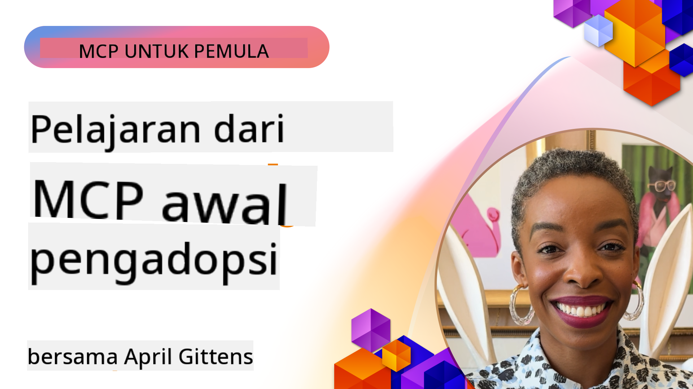

<!--
CO_OP_TRANSLATOR_METADATA:
{
  "original_hash": "41f16dac486d2086a53bc644a01cbe42",
  "translation_date": "2025-08-18T17:30:47+00:00",
  "source_file": "07-LessonsfromEarlyAdoption/README.md",
  "language_code": "id"
}
-->
# 🌟 Pelajaran dari Pengadopsi Awal

[](https://youtu.be/jds7dSmNptE)

_(Klik gambar di atas untuk menonton video pelajaran ini)_

## 🎯 Apa yang Dibahas dalam Modul Ini

Modul ini membahas bagaimana organisasi dan pengembang nyata memanfaatkan Model Context Protocol (MCP) untuk mengatasi tantangan nyata dan mendorong inovasi. Melalui studi kasus mendalam dan proyek langsung, Anda akan menemukan bagaimana MCP memungkinkan integrasi AI yang aman dan skalabel yang menghubungkan model bahasa, alat, dan data perusahaan.

### 📚 Lihat MCP dalam Aksi

Ingin melihat prinsip-prinsip ini diterapkan pada alat yang siap produksi? Lihat [**10 Microsoft MCP Servers yang Mengubah Produktivitas Pengembang**](microsoft-mcp-servers.md), yang menampilkan server MCP Microsoft nyata yang dapat Anda gunakan hari ini.

## Ikhtisar

Pelajaran ini mengeksplorasi bagaimana pengadopsi awal memanfaatkan Model Context Protocol (MCP) untuk mengatasi tantangan dunia nyata dan mendorong inovasi di berbagai industri. Melalui studi kasus mendalam dan proyek langsung, Anda akan melihat bagaimana MCP memungkinkan integrasi AI yang terstandarisasi, aman, dan skalabel—menghubungkan model bahasa besar, alat, dan data perusahaan dalam kerangka kerja yang terpadu. Anda akan mendapatkan pengalaman praktis dalam merancang dan membangun solusi berbasis MCP, belajar dari pola implementasi yang terbukti, dan menemukan praktik terbaik untuk menerapkan MCP di lingkungan produksi. Pelajaran ini juga menyoroti tren yang muncul, arah masa depan, dan sumber daya open-source untuk membantu Anda tetap berada di garis depan teknologi MCP dan ekosistemnya yang terus berkembang.

## Tujuan Pembelajaran

- Menganalisis implementasi MCP dunia nyata di berbagai industri
- Merancang dan membangun aplikasi berbasis MCP yang lengkap
- Mengeksplorasi tren yang muncul dan arah masa depan dalam teknologi MCP
- Menerapkan praktik terbaik dalam skenario pengembangan nyata

## Implementasi MCP Dunia Nyata

### Studi Kasus 1: Otomasi Dukungan Pelanggan Perusahaan

Sebuah perusahaan multinasional mengimplementasikan solusi berbasis MCP untuk menstandarisasi interaksi AI di seluruh sistem dukungan pelanggan mereka. Hal ini memungkinkan mereka untuk:

- Membuat antarmuka terpadu untuk beberapa penyedia LLM
- Mempertahankan manajemen prompt yang konsisten di seluruh departemen
- Menerapkan kontrol keamanan dan kepatuhan yang kuat
- Dengan mudah beralih antara model AI yang berbeda berdasarkan kebutuhan spesifik

**Implementasi Teknis:**

```python
# Python MCP server implementation for customer support
import logging
import asyncio
from modelcontextprotocol import create_server, ServerConfig
from modelcontextprotocol.server import MCPServer
from modelcontextprotocol.transports import create_http_transport
from modelcontextprotocol.resources import ResourceDefinition
from modelcontextprotocol.prompts import PromptDefinition
from modelcontextprotocol.tool import ToolDefinition

# Configure logging
logging.basicConfig(level=logging.INFO)

async def main():
    # Create server configuration
    config = ServerConfig(
        name="Enterprise Customer Support Server",
        version="1.0.0",
        description="MCP server for handling customer support inquiries"
    )
    
    # Initialize MCP server
    server = create_server(config)
    
    # Register knowledge base resources
    server.resources.register(
        ResourceDefinition(
            name="customer_kb",
            description="Customer knowledge base documentation"
        ),
        lambda params: get_customer_documentation(params)
    )
    
    # Register prompt templates
    server.prompts.register(
        PromptDefinition(
            name="support_template",
            description="Templates for customer support responses"
        ),
        lambda params: get_support_templates(params)
    )
    
    # Register support tools
    server.tools.register(
        ToolDefinition(
            name="ticketing",
            description="Create and update support tickets"
        ),
        handle_ticketing_operations
    )
    
    # Start server with HTTP transport
    transport = create_http_transport(port=8080)
    await server.run(transport)

if __name__ == "__main__":
    asyncio.run(main())
```

**Hasil:** Pengurangan biaya model sebesar 30%, peningkatan konsistensi respons sebesar 45%, dan kepatuhan yang lebih baik di seluruh operasi global.

### Studi Kasus 2: Asisten Diagnostik Kesehatan

Penyedia layanan kesehatan mengembangkan infrastruktur MCP untuk mengintegrasikan beberapa model AI medis khusus sambil memastikan data pasien yang sensitif tetap terlindungi:

- Pergantian mulus antara model medis generalis dan spesialis
- Kontrol privasi yang ketat dan jejak audit
- Integrasi dengan sistem Rekam Medis Elektronik (EHR) yang ada
- Rekayasa prompt yang konsisten untuk terminologi medis

**Implementasi Teknis:**

```csharp
// C# MCP host application implementation in healthcare application
using Microsoft.Extensions.DependencyInjection;
using ModelContextProtocol.SDK.Client;
using ModelContextProtocol.SDK.Security;
using ModelContextProtocol.SDK.Resources;

public class DiagnosticAssistant
{
    private readonly MCPHostClient _mcpClient;
    private readonly PatientContext _patientContext;
    
    public DiagnosticAssistant(PatientContext patientContext)
    {
        _patientContext = patientContext;
        
        // Configure MCP client with healthcare-specific settings
        var clientOptions = new ClientOptions
        {
            Name = "Healthcare Diagnostic Assistant",
            Version = "1.0.0",
            Security = new SecurityOptions
            {
                Encryption = EncryptionLevel.Medical,
                AuditEnabled = true
            }
        };
        
        _mcpClient = new MCPHostClientBuilder()
            .WithOptions(clientOptions)
            .WithTransport(new HttpTransport("https://healthcare-mcp.example.org"))
            .WithAuthentication(new HIPAACompliantAuthProvider())
            .Build();
    }
    
    public async Task<DiagnosticSuggestion> GetDiagnosticAssistance(
        string symptoms, string patientHistory)
    {
        // Create request with appropriate resources and tool access
        var resourceRequest = new ResourceRequest
        {
            Name = "patient_records",
            Parameters = new Dictionary<string, object>
            {
                ["patientId"] = _patientContext.PatientId,
                ["requestingProvider"] = _patientContext.ProviderId
            }
        };
        
        // Request diagnostic assistance using appropriate prompt
        var response = await _mcpClient.SendPromptRequestAsync(
            promptName: "diagnostic_assistance",
            parameters: new Dictionary<string, object>
            {
                ["symptoms"] = symptoms,
                patientHistory = patientHistory,
                relevantGuidelines = _patientContext.GetRelevantGuidelines()
            });
            
        return DiagnosticSuggestion.FromMCPResponse(response);
    }
}
```

**Hasil:** Saran diagnostik yang lebih baik untuk dokter sambil mempertahankan kepatuhan penuh terhadap HIPAA dan pengurangan signifikan dalam pergantian konteks antar sistem.

### Studi Kasus 3: Analisis Risiko Layanan Keuangan

Sebuah institusi keuangan mengimplementasikan MCP untuk menstandarisasi proses analisis risiko mereka di berbagai departemen:

- Membuat antarmuka terpadu untuk model risiko kredit, deteksi penipuan, dan risiko investasi
- Menerapkan kontrol akses yang ketat dan versi model
- Memastikan auditabilitas semua rekomendasi AI
- Mempertahankan format data yang konsisten di berbagai sistem

**Implementasi Teknis:**

```java
// Java MCP server for financial risk assessment
import org.mcp.server.*;
import org.mcp.security.*;

public class FinancialRiskMCPServer {
    public static void main(String[] args) {
        // Create MCP server with financial compliance features
        MCPServer server = new MCPServerBuilder()
            .withModelProviders(
                new ModelProvider("risk-assessment-primary", new AzureOpenAIProvider()),
                new ModelProvider("risk-assessment-audit", new LocalLlamaProvider())
            )
            .withPromptTemplateDirectory("./compliance/templates")
            .withAccessControls(new SOCCompliantAccessControl())
            .withDataEncryption(EncryptionStandard.FINANCIAL_GRADE)
            .withVersionControl(true)
            .withAuditLogging(new DatabaseAuditLogger())
            .build();
            
        server.addRequestValidator(new FinancialDataValidator());
        server.addResponseFilter(new PII_RedactionFilter());
        
        server.start(9000);
        
        System.out.println("Financial Risk MCP Server running on port 9000");
    }
}
```

**Hasil:** Kepatuhan regulasi yang lebih baik, siklus penerapan model 40% lebih cepat, dan konsistensi penilaian risiko yang lebih baik di seluruh departemen.

### Studi Kasus 4: Microsoft Playwright MCP Server untuk Otomasi Browser

Microsoft mengembangkan [Playwright MCP server](https://github.com/microsoft/playwright-mcp) untuk memungkinkan otomasi browser yang aman dan terstandarisasi melalui Model Context Protocol. Server siap produksi ini memungkinkan agen AI dan LLM untuk berinteraksi dengan browser web dengan cara yang terkontrol, dapat diaudit, dan dapat diperluas—memungkinkan kasus penggunaan seperti pengujian web otomatis, ekstraksi data, dan alur kerja ujung ke ujung.

> **🎯 Alat Siap Produksi**
> 
> Studi kasus ini menampilkan server MCP nyata yang dapat Anda gunakan hari ini! Pelajari lebih lanjut tentang Playwright MCP Server dan 9 server MCP Microsoft siap produksi lainnya di [**Panduan Server MCP Microsoft**](microsoft-mcp-servers.md#8--playwright-mcp-server).

**Fitur Utama:**
- Menyediakan kemampuan otomasi browser (navigasi, pengisian formulir, pengambilan tangkapan layar, dll.) sebagai alat MCP
- Menerapkan kontrol akses yang ketat dan sandboxing untuk mencegah tindakan yang tidak sah
- Menyediakan log audit terperinci untuk semua interaksi browser
- Mendukung integrasi dengan Azure OpenAI dan penyedia LLM lainnya untuk otomasi berbasis agen
- Mendukung kemampuan penelusuran web GitHub Copilot's Coding Agent

**Implementasi Teknis:**

```typescript
// TypeScript: Registering Playwright browser automation tools in an MCP server
import { createServer, ToolDefinition } from 'modelcontextprotocol';
import { launch } from 'playwright';

const server = createServer({
  name: 'Playwright MCP Server',
  version: '1.0.0',
  description: 'MCP server for browser automation using Playwright'
});

// Register a tool for navigating to a URL and capturing a screenshot
server.tools.register(
  new ToolDefinition({
    name: 'navigate_and_screenshot',
    description: 'Navigate to a URL and capture a screenshot',
    parameters: {
      url: { type: 'string', description: 'The URL to visit' }
    }
  }),
  async ({ url }) => {
    const browser = await launch();
    const page = await browser.newPage();
    await page.goto(url);
    const screenshot = await page.screenshot();
    await browser.close();
    return { screenshot };
  }
);

// Start the MCP server
server.listen(8080);
```

**Hasil:**

- Memungkinkan otomasi browser yang aman dan terprogram untuk agen AI dan LLM
- Mengurangi upaya pengujian manual dan meningkatkan cakupan pengujian untuk aplikasi web
- Menyediakan kerangka kerja yang dapat digunakan kembali dan diperluas untuk integrasi alat berbasis browser di lingkungan perusahaan
- Mendukung kemampuan penelusuran web GitHub Copilot

**Referensi:**

- [Repositori GitHub Playwright MCP Server](https://github.com/microsoft/playwright-mcp)
- [Solusi AI dan Otomasi Microsoft](https://azure.microsoft.com/en-us/products/ai-services/)

### Studi Kasus 5: Azure MCP – Model Context Protocol Tingkat Perusahaan sebagai Layanan

Azure MCP Server ([https://aka.ms/azmcp](https://aka.ms/azmcp)) adalah implementasi MCP tingkat perusahaan yang dikelola oleh Microsoft, dirancang untuk menyediakan kemampuan server MCP yang skalabel, aman, dan sesuai sebagai layanan cloud. Azure MCP memungkinkan organisasi untuk dengan cepat menerapkan, mengelola, dan mengintegrasikan server MCP dengan layanan AI, data, dan keamanan Azure, mengurangi beban operasional dan mempercepat adopsi AI.

> **🎯 Alat Siap Produksi**
> 
> Ini adalah server MCP nyata yang dapat Anda gunakan hari ini! Pelajari lebih lanjut tentang Azure AI Foundry MCP Server di [**Panduan Server MCP Microsoft**](microsoft-mcp-servers.md).

- Hosting server MCP yang sepenuhnya dikelola dengan penskalaan, pemantauan, dan keamanan bawaan
- Integrasi asli dengan Azure OpenAI, Azure AI Search, dan layanan Azure lainnya
- Otentikasi dan otorisasi perusahaan melalui Microsoft Entra ID
- Dukungan untuk alat khusus, template prompt, dan konektor sumber daya
- Kepatuhan terhadap persyaratan keamanan dan regulasi perusahaan

**Implementasi Teknis:**

```yaml
# Example: Azure MCP server deployment configuration (YAML)
apiVersion: mcp.microsoft.com/v1
kind: McpServer
metadata:
  name: enterprise-mcp-server
spec:
  modelProviders:
    - name: azure-openai
      type: AzureOpenAI
      endpoint: https://<your-openai-resource>.openai.azure.com/
      apiKeySecret: <your-azure-keyvault-secret>
  tools:
    - name: document_search
      type: AzureAISearch
      endpoint: https://<your-search-resource>.search.windows.net/
      apiKeySecret: <your-azure-keyvault-secret>
  authentication:
    type: EntraID
    tenantId: <your-tenant-id>
  monitoring:
    enabled: true
    logAnalyticsWorkspace: <your-log-analytics-id>
```

**Hasil:**  
- Mengurangi waktu untuk mendapatkan nilai pada proyek AI perusahaan dengan menyediakan platform server MCP yang siap digunakan dan sesuai
- Menyederhanakan integrasi LLM, alat, dan sumber data perusahaan
- Meningkatkan keamanan, pengamatan, dan efisiensi operasional untuk beban kerja MCP
- Meningkatkan kualitas kode dengan praktik terbaik SDK Azure dan pola otentikasi terkini

**Referensi:**  
- [Dokumentasi Azure MCP](https://aka.ms/azmcp)
- [Repositori GitHub Azure MCP Server](https://github.com/Azure/azure-mcp)
- [Layanan AI Azure](https://azure.microsoft.com/en-us/products/ai-services/)
- [Microsoft MCP Center](https://mcp.azure.com)

### Studi Kasus 6: NLWeb

MCP (Model Context Protocol) adalah protokol yang sedang berkembang untuk Chatbot dan asisten AI untuk berinteraksi dengan alat. Setiap instance NLWeb juga merupakan server MCP, yang mendukung satu metode inti, ask, yang digunakan untuk mengajukan pertanyaan ke situs web dalam bahasa alami. Respon yang dikembalikan memanfaatkan schema.org, sebuah kosakata yang banyak digunakan untuk mendeskripsikan data web. Secara sederhana, MCP adalah NLWeb seperti Http adalah untuk HTML. NLWeb menggabungkan protokol, format Schema.org, dan kode contoh untuk membantu situs dengan cepat membuat endpoint ini, yang menguntungkan baik manusia melalui antarmuka percakapan maupun mesin melalui interaksi agen-ke-agen alami.

Ada dua komponen utama dalam NLWeb:
- Sebuah protokol, sangat sederhana untuk memulai, untuk berinteraksi dengan situs dalam bahasa alami dan format, memanfaatkan json dan schema.org untuk jawaban yang dikembalikan. Lihat dokumentasi pada REST API untuk detail lebih lanjut.
- Implementasi langsung dari (1) yang memanfaatkan markup yang ada, untuk situs yang dapat diabstraksikan sebagai daftar item (produk, resep, atraksi, ulasan, dll.). Bersama dengan serangkaian widget antarmuka pengguna, situs dapat dengan mudah menyediakan antarmuka percakapan ke konten mereka. Lihat dokumentasi tentang Life of a chat query untuk detail lebih lanjut tentang cara kerjanya.

**Referensi:**  
- [Dokumentasi Azure MCP](https://aka.ms/azmcp)  
- [NLWeb](https://github.com/microsoft/NlWeb)

### Studi Kasus 7: Azure AI Foundry MCP Server – Integrasi Agen AI Perusahaan

Server MCP Azure AI Foundry menunjukkan bagaimana MCP dapat digunakan untuk mengorkestrasi dan mengelola agen AI dan alur kerja di lingkungan perusahaan. Dengan mengintegrasikan MCP dengan Azure AI Foundry, organisasi dapat menstandarisasi interaksi agen, memanfaatkan manajemen alur kerja Foundry, dan memastikan penerapan yang aman dan skalabel.

> **🎯 Alat Siap Produksi**
> 
> Ini adalah server MCP nyata yang dapat Anda gunakan hari ini! Pelajari lebih lanjut tentang Azure AI Foundry MCP Server di [**Panduan Server MCP Microsoft**](microsoft-mcp-servers.md#9--azure-ai-foundry-mcp-server).

**Fitur Utama:**
- Akses komprehensif ke ekosistem AI Azure, termasuk katalog model dan manajemen penerapan
- Pengindeksan pengetahuan dengan Azure AI Search untuk aplikasi RAG
- Alat evaluasi untuk kinerja model AI dan jaminan kualitas
- Integrasi dengan Katalog dan Lab Azure AI Foundry untuk model penelitian mutakhir
- Kemampuan manajemen dan evaluasi agen untuk skenario produksi

**Hasil:**
- Prototipe cepat dan pemantauan yang kuat untuk alur kerja agen AI
- Integrasi mulus dengan layanan AI Azure untuk skenario lanjutan
- Antarmuka terpadu untuk membangun, menerapkan, dan memantau pipeline agen
- Peningkatan keamanan, kepatuhan, dan efisiensi operasional untuk perusahaan
- Percepatan adopsi AI sambil mempertahankan kontrol atas proses berbasis agen yang kompleks

**Referensi:**
- [Repositori GitHub Azure AI Foundry MCP Server](https://github.com/azure-ai-foundry/mcp-foundry)
- [Mengintegrasikan Agen AI Azure dengan MCP (Blog Microsoft Foundry)](https://devblogs.microsoft.com/foundry/integrating-azure-ai-agents-mcp/)

### Studi Kasus 8: Foundry MCP Playground – Eksperimen dan Prototipe

Foundry MCP Playground menawarkan lingkungan siap pakai untuk bereksperimen dengan server MCP dan integrasi Azure AI Foundry. Pengembang dapat dengan cepat membuat prototipe, menguji, dan mengevaluasi model AI serta alur kerja agen menggunakan sumber daya dari Katalog dan Lab Azure AI Foundry. Playground ini menyederhanakan pengaturan, menyediakan proyek contoh, dan mendukung pengembangan kolaboratif, sehingga memudahkan eksplorasi praktik terbaik dan skenario baru dengan overhead minimal. Ini sangat berguna bagi tim yang ingin memvalidasi ide, berbagi eksperimen, dan mempercepat pembelajaran tanpa memerlukan infrastruktur yang kompleks. Dengan menurunkan hambatan masuk, playground ini membantu mendorong inovasi dan kontribusi komunitas dalam ekosistem MCP dan Azure AI Foundry.

**Referensi:**

- [Repositori GitHub Foundry MCP Playground](https://github.com/azure-ai-foundry/foundry-mcp-playground)

### Studi Kasus 9: Microsoft Learn Docs MCP Server – Akses Dokumentasi Bertenaga AI

Microsoft Learn Docs MCP Server adalah layanan cloud-hosted yang menyediakan asisten AI dengan akses real-time ke dokumentasi resmi Microsoft melalui Model Context Protocol. Server siap produksi ini terhubung ke ekosistem Microsoft Learn yang komprehensif dan memungkinkan pencarian semantik di semua sumber resmi Microsoft.
> **🎯 Alat Siap Produksi**
> 
> Ini adalah server MCP nyata yang dapat Anda gunakan hari ini! Pelajari lebih lanjut tentang Microsoft Learn Docs MCP Server di [**Panduan Server MCP Microsoft**](microsoft-mcp-servers.md#1--microsoft-learn-docs-mcp-server).
**Fitur Utama:**
- Akses real-time ke dokumentasi resmi Microsoft, dokumen Azure, dan dokumentasi Microsoft 365
- Kemampuan pencarian semantik canggih yang memahami konteks dan maksud
- Informasi selalu terkini seiring dengan publikasi konten Microsoft Learn
- Cakupan komprehensif di seluruh Microsoft Learn, dokumentasi Azure, dan sumber Microsoft 365
- Mengembalikan hingga 10 potongan konten berkualitas tinggi dengan judul artikel dan URL

**Mengapa Ini Penting:**
- Mengatasi masalah "pengetahuan AI yang usang" untuk teknologi Microsoft
- Memastikan asisten AI memiliki akses ke fitur terbaru .NET, C#, Azure, dan Microsoft 365
- Menyediakan informasi otoritatif dari pihak pertama untuk menghasilkan kode yang akurat
- Penting bagi pengembang yang bekerja dengan teknologi Microsoft yang berkembang pesat

**Hasil:**
- Akurasi kode yang dihasilkan AI untuk teknologi Microsoft meningkat secara dramatis
- Waktu yang dihabiskan untuk mencari dokumentasi terkini dan praktik terbaik berkurang
- Produktivitas pengembang meningkat dengan pengambilan dokumentasi yang kontekstual
- Integrasi mulus dengan alur kerja pengembangan tanpa meninggalkan IDE

**Referensi:**
- [Microsoft Learn Docs MCP Server GitHub Repository](https://github.com/MicrosoftDocs/mcp)
- [Microsoft Learn Documentation](https://learn.microsoft.com/)

## Proyek Praktis

### Proyek 1: Membangun Server MCP Multi-Penyedia

**Tujuan:** Membuat server MCP yang dapat mengarahkan permintaan ke beberapa penyedia model AI berdasarkan kriteria tertentu.

**Persyaratan:**

- Mendukung setidaknya tiga penyedia model yang berbeda (misalnya, OpenAI, Anthropic, model lokal)
- Mengimplementasikan mekanisme routing berdasarkan metadata permintaan
- Membuat sistem konfigurasi untuk mengelola kredensial penyedia
- Menambahkan caching untuk mengoptimalkan kinerja dan biaya
- Membangun dasbor sederhana untuk memantau penggunaan

**Langkah Implementasi:**

1. Menyiapkan infrastruktur dasar server MCP
2. Mengimplementasikan adapter penyedia untuk setiap layanan model AI
3. Membuat logika routing berdasarkan atribut permintaan
4. Menambahkan mekanisme caching untuk permintaan yang sering
5. Mengembangkan dasbor pemantauan
6. Menguji dengan berbagai pola permintaan

**Teknologi:** Pilih dari Python (.NET/Java/Python sesuai preferensi Anda), Redis untuk caching, dan kerangka kerja web sederhana untuk dasbor.

### Proyek 2: Sistem Manajemen Prompt Perusahaan

**Tujuan:** Mengembangkan sistem berbasis MCP untuk mengelola, membuat versi, dan menerapkan template prompt di seluruh organisasi.

**Persyaratan:**

- Membuat repositori terpusat untuk template prompt
- Mengimplementasikan alur kerja versi dan persetujuan
- Membangun kemampuan pengujian template dengan input sampel
- Mengembangkan kontrol akses berbasis peran
- Membuat API untuk pengambilan dan penerapan template

**Langkah Implementasi:**

1. Merancang skema basis data untuk penyimpanan template
2. Membuat API inti untuk operasi CRUD template
3. Mengimplementasikan sistem versi
4. Membangun alur kerja persetujuan
5. Mengembangkan kerangka pengujian
6. Membuat antarmuka web sederhana untuk manajemen
7. Mengintegrasikan dengan server MCP

**Teknologi:** Pilihan kerangka kerja backend, basis data SQL atau NoSQL, dan kerangka kerja frontend untuk antarmuka manajemen.

### Proyek 3: Platform Pembuatan Konten Berbasis MCP

**Tujuan:** Membangun platform pembuatan konten yang memanfaatkan MCP untuk memberikan hasil yang konsisten di berbagai jenis konten.

**Persyaratan:**

- Mendukung berbagai format konten (posting blog, media sosial, salinan pemasaran)
- Mengimplementasikan pembuatan berbasis template dengan opsi kustomisasi
- Membuat sistem tinjauan dan umpan balik konten
- Melacak metrik kinerja konten
- Mendukung versi dan iterasi konten

**Langkah Implementasi:**

1. Menyiapkan infrastruktur klien MCP
2. Membuat template untuk berbagai jenis konten
3. Membangun pipeline pembuatan konten
4. Mengimplementasikan sistem tinjauan
5. Mengembangkan sistem pelacakan metrik
6. Membuat antarmuka pengguna untuk manajemen template dan pembuatan konten

**Teknologi:** Bahasa pemrograman, kerangka kerja web, dan sistem basis data pilihan Anda.

## Arah Masa Depan Teknologi MCP

### Tren yang Muncul

1. **MCP Multi-Modal**
   - Perluasan MCP untuk menstandarkan interaksi dengan model gambar, audio, dan video
   - Pengembangan kemampuan penalaran lintas-modal
   - Format prompt yang distandarkan untuk berbagai modalitas

2. **Infrastruktur MCP Terfederasi**
   - Jaringan MCP terdistribusi yang dapat berbagi sumber daya di seluruh organisasi
   - Protokol yang distandarkan untuk berbagi model secara aman
   - Teknik komputasi yang menjaga privasi

3. **Marketplace MCP**
   - Ekosistem untuk berbagi dan memonetisasi template dan plugin MCP
   - Proses jaminan kualitas dan sertifikasi
   - Integrasi dengan marketplace model

4. **MCP untuk Komputasi Edge**
   - Adaptasi standar MCP untuk perangkat edge dengan sumber daya terbatas
   - Protokol yang dioptimalkan untuk lingkungan dengan bandwidth rendah
   - Implementasi MCP khusus untuk ekosistem IoT

5. **Kerangka Regulasi**
   - Pengembangan ekstensi MCP untuk kepatuhan regulasi
   - Jejak audit yang distandarkan dan antarmuka penjelasan
   - Integrasi dengan kerangka tata kelola AI yang sedang berkembang

### Solusi MCP dari Microsoft

Microsoft dan Azure telah mengembangkan beberapa repositori open-source untuk membantu pengembang mengimplementasikan MCP dalam berbagai skenario:

#### Organisasi Microsoft

1. [playwright-mcp](https://github.com/microsoft/playwright-mcp) - Server MCP Playwright untuk otomatisasi dan pengujian browser
2. [files-mcp-server](https://github.com/microsoft/files-mcp-server) - Implementasi server MCP OneDrive untuk pengujian lokal dan kontribusi komunitas
3. [NLWeb](https://github.com/microsoft/NlWeb) - NLWeb adalah kumpulan protokol terbuka dan alat open-source terkait. Fokus utamanya adalah membangun lapisan dasar untuk Web AI

#### Organisasi Azure-Samples

1. [mcp](https://github.com/Azure-Samples/mcp) - Tautan ke sampel, alat, dan sumber daya untuk membangun dan mengintegrasikan server MCP di Azure menggunakan berbagai bahasa
2. [mcp-auth-servers](https://github.com/Azure-Samples/mcp-auth-servers) - Server MCP referensi yang menunjukkan autentikasi dengan spesifikasi Model Context Protocol saat ini
3. [remote-mcp-functions](https://github.com/Azure-Samples/remote-mcp-functions) - Halaman pendaratan untuk implementasi Server MCP Jarak Jauh di Azure Functions dengan tautan ke repositori spesifik bahasa
4. [remote-mcp-functions-python](https://github.com/Azure-Samples/remote-mcp-functions-python) - Template cepat untuk membangun dan menerapkan server MCP jarak jauh khusus menggunakan Azure Functions dengan Python
5. [remote-mcp-functions-dotnet](https://github.com/Azure-Samples/remote-mcp-functions-dotnet) - Template cepat untuk membangun dan menerapkan server MCP jarak jauh khusus menggunakan Azure Functions dengan .NET/C#
6. [remote-mcp-functions-typescript](https://github.com/Azure-Samples/remote-mcp-functions-typescript) - Template cepat untuk membangun dan menerapkan server MCP jarak jauh khusus menggunakan Azure Functions dengan TypeScript
7. [remote-mcp-apim-functions-python](https://github.com/Azure-Samples/remote-mcp-apim-functions-python) - Azure API Management sebagai AI Gateway ke server MCP jarak jauh menggunakan Python
8. [AI-Gateway](https://github.com/Azure-Samples/AI-Gateway) - Eksperimen APIM ❤️ AI termasuk kemampuan MCP, mengintegrasikan dengan Azure OpenAI dan AI Foundry

Repositori ini menyediakan berbagai implementasi, template, dan sumber daya untuk bekerja dengan Model Context Protocol di berbagai bahasa pemrograman dan layanan Azure. Mereka mencakup berbagai kasus penggunaan mulai dari implementasi server dasar hingga autentikasi, penerapan cloud, dan skenario integrasi perusahaan.

#### Direktori Sumber Daya MCP

Direktori [MCP Resources](https://github.com/microsoft/mcp/tree/main/Resources) di repositori resmi Microsoft MCP menyediakan koleksi sumber daya sampel, template prompt, dan definisi alat yang dikurasi untuk digunakan dengan server Model Context Protocol. Direktori ini dirancang untuk membantu pengembang memulai dengan cepat dengan MCP dengan menawarkan blok bangunan yang dapat digunakan kembali dan contoh praktik terbaik untuk:

- **Template Prompt:** Template prompt siap pakai untuk tugas dan skenario AI umum, yang dapat disesuaikan untuk implementasi server MCP Anda sendiri.
- **Definisi Alat:** Skema alat dan metadata contoh untuk menstandarkan integrasi dan pemanggilan alat di berbagai server MCP.
- **Sampel Sumber Daya:** Definisi sumber daya contoh untuk menghubungkan ke sumber data, API, dan layanan eksternal dalam kerangka MCP.
- **Implementasi Referensi:** Sampel praktis yang menunjukkan cara menyusun dan mengatur sumber daya, prompt, dan alat dalam proyek MCP dunia nyata.

Sumber daya ini mempercepat pengembangan, mempromosikan standarisasi, dan membantu memastikan praktik terbaik saat membangun dan menerapkan solusi berbasis MCP.

#### Direktori Sumber Daya MCP

- [MCP Resources (Sample Prompts, Tools, and Resource Definitions)](https://github.com/microsoft/mcp/tree/main/Resources)

### Peluang Penelitian

- Teknik optimasi prompt yang efisien dalam kerangka MCP
- Model keamanan untuk penerapan MCP multi-penyewa
- Benchmarking kinerja di berbagai implementasi MCP
- Metode verifikasi formal untuk server MCP

## Kesimpulan

Model Context Protocol (MCP) dengan cepat membentuk masa depan integrasi AI yang distandarkan, aman, dan interoperabel di berbagai industri. Melalui studi kasus dan proyek praktis dalam pelajaran ini, Anda telah melihat bagaimana para pengadopsi awal—termasuk Microsoft dan Azure—memanfaatkan MCP untuk menyelesaikan tantangan dunia nyata, mempercepat adopsi AI, dan memastikan kepatuhan, keamanan, serta skalabilitas. Pendekatan modular MCP memungkinkan organisasi untuk menghubungkan model bahasa besar, alat, dan data perusahaan dalam kerangka kerja yang terpadu dan dapat diaudit. Seiring MCP terus berkembang, tetap terlibat dengan komunitas, menjelajahi sumber daya open-source, dan menerapkan praktik terbaik akan menjadi kunci untuk membangun solusi AI yang tangguh dan siap untuk masa depan.

## Sumber Daya Tambahan

- [MCP Foundry GitHub Repository](https://github.com/azure-ai-foundry/mcp-foundry)
- [Foundry MCP Playground](https://github.com/azure-ai-foundry/foundry-mcp-playground)
- [Integrating Azure AI Agents with MCP (Microsoft Foundry Blog)](https://devblogs.microsoft.com/foundry/integrating-azure-ai-agents-mcp/)
- [MCP GitHub Repository (Microsoft)](https://github.com/microsoft/mcp)
- [MCP Resources Directory (Sample Prompts, Tools, and Resource Definitions)](https://github.com/microsoft/mcp/tree/main/Resources)
- [MCP Community & Documentation](https://modelcontextprotocol.io/introduction)
- [Azure MCP Documentation](https://aka.ms/azmcp)
- [Playwright MCP Server GitHub Repository](https://github.com/microsoft/playwright-mcp)
- [Files MCP Server (OneDrive)](https://github.com/microsoft/files-mcp-server)
- [Azure-Samples MCP](https://github.com/Azure-Samples/mcp)
- [MCP Auth Servers (Azure-Samples)](https://github.com/Azure-Samples/mcp-auth-servers)
- [Remote MCP Functions (Azure-Samples)](https://github.com/Azure-Samples/remote-mcp-functions)
- [Remote MCP Functions Python (Azure-Samples)](https://github.com/Azure-Samples/remote-mcp-functions-python)
- [Remote MCP Functions .NET (Azure-Samples)](https://github.com/Azure-Samples/remote-mcp-functions-dotnet)
- [Remote MCP Functions TypeScript (Azure-Samples)](https://github.com/Azure-Samples/remote-mcp-functions-typescript)
- [Remote MCP APIM Functions Python (Azure-Samples)](https://github.com/Azure-Samples/remote-mcp-apim-functions-python)
- [AI-Gateway (Azure-Samples)](https://github.com/Azure-Samples/AI-Gateway)
- [Microsoft AI and Automation Solutions](https://azure.microsoft.com/en-us/products/ai-services/)

## Latihan

1. Analisis salah satu studi kasus dan usulkan pendekatan implementasi alternatif.
2. Pilih salah satu ide proyek dan buat spesifikasi teknis yang terperinci.
3. Teliti industri yang tidak tercakup dalam studi kasus dan uraikan bagaimana MCP dapat mengatasi tantangan spesifiknya.
4. Jelajahi salah satu arah masa depan dan buat konsep untuk ekstensi MCP baru yang mendukungnya.

Selanjutnya: [Microsoft MCP Server](../07-LessonsfromEarlyAdoption/microsoft-mcp-servers.md)

**Penafian**:  
Dokumen ini telah diterjemahkan menggunakan layanan penerjemahan AI [Co-op Translator](https://github.com/Azure/co-op-translator). Meskipun kami berupaya untuk memberikan hasil yang akurat, harap diperhatikan bahwa terjemahan otomatis mungkin mengandung kesalahan atau ketidakakuratan. Dokumen asli dalam bahasa aslinya harus dianggap sebagai sumber yang berwenang. Untuk informasi yang bersifat kritis, disarankan menggunakan jasa penerjemahan manusia profesional. Kami tidak bertanggung jawab atas kesalahpahaman atau penafsiran yang keliru yang timbul dari penggunaan terjemahan ini.