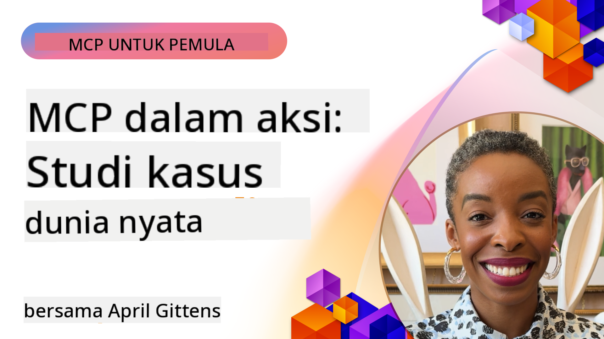

<!--
CO_OP_TRANSLATOR_METADATA:
{
  "original_hash": "1611dc5f6a2a35a789fc4c95fc5bfbe8",
  "translation_date": "2025-09-26T18:46:53+00:00",
  "source_file": "09-CaseStudy/README.md",
  "language_code": "id"
}
-->
# MCP dalam Aksi: Studi Kasus Dunia Nyata

_(Klik gambar di atas untuk menonton video pelajaran ini)_

Model Context Protocol (MCP) sedang mengubah cara aplikasi AI berinteraksi dengan data, alat, dan layanan. Bagian ini menyajikan studi kasus dunia nyata yang menunjukkan penerapan praktis MCP dalam berbagai skenario perusahaan.

## Ikhtisar

Bagian ini menampilkan contoh konkret implementasi MCP, menyoroti bagaimana organisasi memanfaatkan protokol ini untuk menyelesaikan tantangan bisnis yang kompleks. Dengan mempelajari studi kasus ini, Anda akan mendapatkan wawasan tentang fleksibilitas, skalabilitas, dan manfaat praktis MCP dalam skenario dunia nyata.

## Tujuan Pembelajaran Utama

Dengan menjelajahi studi kasus ini, Anda akan:

- Memahami bagaimana MCP dapat diterapkan untuk menyelesaikan masalah bisnis tertentu
- Mempelajari pola integrasi dan pendekatan arsitektur yang berbeda
- Mengenali praktik terbaik untuk mengimplementasikan MCP di lingkungan perusahaan
- Mendapatkan wawasan tentang tantangan dan solusi yang dihadapi dalam implementasi dunia nyata
- Mengidentifikasi peluang untuk menerapkan pola serupa dalam proyek Anda sendiri

## Studi Kasus Unggulan

### 1. [Azure AI Travel Agents – Implementasi Referensi](./travelagentsample.md)

Studi kasus ini membahas solusi referensi komprehensif dari Microsoft yang menunjukkan cara membangun aplikasi perencanaan perjalanan berbasis AI multi-agen menggunakan MCP, Azure OpenAI, dan Azure AI Search. Proyek ini menampilkan:

- Orkestrasi multi-agen melalui MCP
- Integrasi data perusahaan dengan Azure AI Search
- Arsitektur yang aman dan skalabel menggunakan layanan Azure
- Alat yang dapat diperluas dengan komponen MCP yang dapat digunakan kembali
- Pengalaman pengguna percakapan yang didukung oleh Azure OpenAI

Detail arsitektur dan implementasi memberikan wawasan berharga tentang membangun sistem multi-agen yang kompleks dengan MCP sebagai lapisan koordinasi.

### 2. [Memperbarui Item Azure DevOps dari Data YouTube](./UpdateADOItemsFromYT.md)

Studi kasus ini menunjukkan penerapan praktis MCP untuk mengotomatisasi proses alur kerja. Ini menunjukkan bagaimana alat MCP dapat digunakan untuk:

- Mengekstrak data dari platform online (YouTube)
- Memperbarui item kerja dalam sistem Azure DevOps
- Membuat alur kerja otomatis yang dapat diulang
- Mengintegrasikan data di berbagai sistem yang berbeda

Contoh ini menggambarkan bagaimana implementasi MCP yang relatif sederhana dapat memberikan peningkatan efisiensi yang signifikan dengan mengotomatisasi tugas rutin dan meningkatkan konsistensi data di seluruh sistem.

### 3. [Pengambilan Dokumentasi Real-Time dengan MCP](./docs-mcp/README.md)

Studi kasus ini membimbing Anda melalui proses menghubungkan klien konsol Python ke server Model Context Protocol (MCP) untuk mengambil dan mencatat dokumentasi Microsoft yang kontekstual secara real-time. Anda akan belajar cara:

- Menghubungkan ke server MCP menggunakan klien Python dan MCP SDK resmi
- Menggunakan klien HTTP streaming untuk pengambilan data real-time yang efisien
- Memanggil alat dokumentasi di server dan mencatat respons langsung ke konsol
- Mengintegrasikan dokumentasi Microsoft terbaru ke dalam alur kerja Anda tanpa meninggalkan terminal

Bab ini mencakup tugas langsung, contoh kode kerja minimal, dan tautan ke sumber daya tambahan untuk pembelajaran lebih mendalam. Lihat panduan lengkap dan kode dalam bab yang ditautkan untuk memahami bagaimana MCP dapat mengubah akses dokumentasi dan produktivitas pengembang di lingkungan berbasis konsol.

### 4. [Aplikasi Web Generator Rencana Studi Interaktif dengan MCP](./docs-mcp/README.md)

Studi kasus ini menunjukkan cara membangun aplikasi web interaktif menggunakan Chainlit dan Model Context Protocol (MCP) untuk menghasilkan rencana studi yang dipersonalisasi untuk topik apa pun. Pengguna dapat menentukan subjek (seperti "sertifikasi AI-900") dan durasi studi (misalnya, 8 minggu), dan aplikasi akan memberikan rincian konten yang direkomendasikan minggu demi minggu. Chainlit memungkinkan antarmuka obrolan percakapan, membuat pengalaman menjadi menarik dan adaptif.

- Aplikasi web percakapan yang didukung oleh Chainlit
- Permintaan yang digerakkan pengguna untuk topik dan durasi
- Rekomendasi konten minggu demi minggu menggunakan MCP
- Respons adaptif real-time dalam antarmuka obrolan

Proyek ini menggambarkan bagaimana AI percakapan dan MCP dapat digabungkan untuk menciptakan alat pendidikan yang dinamis dan digerakkan pengguna di lingkungan web modern.

### 5. [Dokumentasi Dalam Editor dengan Server MCP di VS Code](./docs-mcp/README.md)

Studi kasus ini menunjukkan bagaimana Anda dapat membawa Microsoft Learn Docs langsung ke lingkungan VS Code Anda menggunakan server MCP—tidak perlu lagi beralih tab browser! Anda akan melihat cara:

- Mencari dan membaca dokumen secara instan di dalam VS Code menggunakan panel MCP atau palet perintah
- Merujuk dokumentasi dan menyisipkan tautan langsung ke file README atau markdown kursus Anda
- Menggunakan GitHub Copilot dan MCP bersama untuk alur kerja dokumentasi dan kode yang didukung AI
- Memvalidasi dan meningkatkan dokumentasi Anda dengan umpan balik real-time dan akurasi yang bersumber dari Microsoft
- Mengintegrasikan MCP dengan alur kerja GitHub untuk validasi dokumentasi berkelanjutan

Implementasi ini mencakup:

- Contoh konfigurasi `.vscode/mcp.json` untuk pengaturan yang mudah
- Panduan berbasis tangkapan layar tentang pengalaman dalam editor
- Tips untuk menggabungkan Copilot dan MCP untuk produktivitas maksimal

Skenario ini ideal untuk penulis kursus, penulis dokumentasi, dan pengembang yang ingin tetap fokus di editor mereka sambil bekerja dengan dokumen, Copilot, dan alat validasi—semuanya didukung oleh MCP.

### 6. [Pembuatan Server MCP APIM](./apimsample.md)

Studi kasus ini memberikan panduan langkah demi langkah tentang cara membuat server MCP menggunakan Azure API Management (APIM). Ini mencakup:

- Menyiapkan server MCP di Azure API Management
- Mengekspos operasi API sebagai alat MCP
- Mengonfigurasi kebijakan untuk pembatasan tingkat dan keamanan
- Menguji server MCP menggunakan Visual Studio Code dan GitHub Copilot

Contoh ini menggambarkan bagaimana memanfaatkan kemampuan Azure untuk membuat server MCP yang tangguh yang dapat digunakan dalam berbagai aplikasi, meningkatkan integrasi sistem AI dengan API perusahaan.

### 7. [Registri MCP GitHub — Mempercepat Integrasi Agen](https://github.com/mcp)

Studi kasus ini membahas bagaimana Registri MCP GitHub, yang diluncurkan pada September 2025, mengatasi tantangan kritis dalam ekosistem AI: penemuan dan penerapan server Model Context Protocol (MCP) yang terfragmentasi.

#### Ikhtisar
**Registri MCP** menyelesaikan masalah yang berkembang dari server MCP yang tersebar di berbagai repositori dan registri, yang sebelumnya membuat integrasi lambat dan rentan terhadap kesalahan. Server ini memungkinkan agen AI berinteraksi dengan sistem eksternal seperti API, basis data, dan sumber dokumentasi.

#### Pernyataan Masalah
Pengembang yang membangun alur kerja agen menghadapi beberapa tantangan:
- **Kesulitan menemukan** server MCP di berbagai platform
- **Pertanyaan pengaturan yang berulang** tersebar di forum dan dokumentasi
- **Risiko keamanan** dari sumber yang tidak diverifikasi dan tidak terpercaya
- **Kurangnya standarisasi** dalam kualitas dan kompatibilitas server

#### Arsitektur Solusi
Registri MCP GitHub memusatkan server MCP yang terpercaya dengan fitur utama:
- **Integrasi instalasi satu klik** melalui VS Code untuk pengaturan yang efisien
- **Penyortiran berdasarkan relevansi** menggunakan bintang, aktivitas, dan validasi komunitas
- **Integrasi langsung** dengan GitHub Copilot dan alat kompatibel MCP lainnya
- **Model kontribusi terbuka** yang memungkinkan komunitas dan mitra perusahaan untuk berkontribusi

#### Dampak Bisnis
Registri ini telah memberikan peningkatan yang terukur:
- **Onboarding lebih cepat** untuk pengembang yang menggunakan alat seperti Microsoft Learn MCP Server, yang mengalirkan dokumentasi resmi langsung ke agen
- **Produktivitas yang meningkat** melalui server khusus seperti `github-mcp-server`, yang memungkinkan otomatisasi GitHub berbasis bahasa alami (pembuatan PR, pengulangan CI, pemindaian kode)
- **Kepercayaan ekosistem yang lebih kuat** melalui daftar yang dikurasi dan standar konfigurasi yang transparan

#### Nilai Strategis
Bagi praktisi yang mengkhususkan diri dalam manajemen siklus hidup agen dan alur kerja yang dapat direproduksi, Registri MCP menyediakan:
- **Kemampuan penerapan agen modular** dengan komponen yang distandarisasi
- **Pipeline evaluasi berbasis registri** untuk pengujian dan validasi yang konsisten
- **Interoperabilitas lintas alat** yang memungkinkan integrasi mulus di berbagai platform AI

Studi kasus ini menunjukkan bahwa Registri MCP bukan hanya direktori—melainkan platform dasar untuk integrasi model yang skalabel dan penerapan sistem agen di dunia nyata.

## Kesimpulan

Tujuh studi kasus komprehensif ini menunjukkan fleksibilitas luar biasa dan penerapan praktis Model Context Protocol di berbagai skenario dunia nyata. Dari sistem perencanaan perjalanan multi-agen yang kompleks dan manajemen API perusahaan hingga alur kerja dokumentasi yang efisien dan Registri MCP GitHub yang revolusioner, contoh-contoh ini menunjukkan bagaimana MCP menyediakan cara yang distandarisasi dan skalabel untuk menghubungkan sistem AI dengan alat, data, dan layanan yang mereka butuhkan untuk memberikan nilai luar biasa.

Studi kasus ini mencakup berbagai dimensi implementasi MCP:
- **Integrasi Perusahaan**: Manajemen API Azure dan otomatisasi Azure DevOps
- **Orkestrasi Multi-Agen**: Perencanaan perjalanan dengan agen AI yang terkoordinasi
- **Produktivitas Pengembang**: Integrasi VS Code dan akses dokumentasi real-time
- **Pengembangan Ekosistem**: Registri MCP GitHub sebagai platform dasar
- **Aplikasi Pendidikan**: Generator rencana studi interaktif dan antarmuka percakapan

Dengan mempelajari implementasi ini, Anda mendapatkan wawasan penting tentang:
- **Pola arsitektur** untuk berbagai skala dan kasus penggunaan
- **Strategi implementasi** yang menyeimbangkan fungsionalitas dengan pemeliharaan
- **Pertimbangan keamanan dan skalabilitas** untuk penerapan produksi
- **Praktik terbaik** untuk pengembangan server MCP dan integrasi klien
- **Pemikiran ekosistem** untuk membangun solusi AI yang saling terhubung

Contoh-contoh ini secara kolektif menunjukkan bahwa MCP bukan hanya kerangka kerja teoretis tetapi protokol yang matang dan siap produksi yang memungkinkan solusi praktis untuk tantangan bisnis yang kompleks. Baik Anda membangun alat otomatisasi sederhana atau sistem multi-agen yang canggih, pola dan pendekatan yang diilustrasikan di sini memberikan dasar yang kuat untuk proyek MCP Anda sendiri.

## Sumber Daya Tambahan

- [Repositori GitHub Azure AI Travel Agents](https://github.com/Azure-Samples/azure-ai-travel-agents)
- [Alat MCP Azure DevOps](https://github.com/microsoft/azure-devops-mcp)
- [Alat MCP Playwright](https://github.com/microsoft/playwright-mcp)
- [Server MCP Microsoft Docs](https://github.com/MicrosoftDocs/mcp)
- [Registri MCP GitHub — Mempercepat Integrasi Agen](https://github.com/mcp)
- [Contoh Komunitas MCP](https://github.com/microsoft/mcp)

Selanjutnya: Lab Praktik [Menyederhanakan Alur Kerja AI: Membangun Server MCP dengan AI Toolkit](../10-StreamliningAIWorkflowsBuildingAnMCPServerWithAIToolkit/README.md)

---

