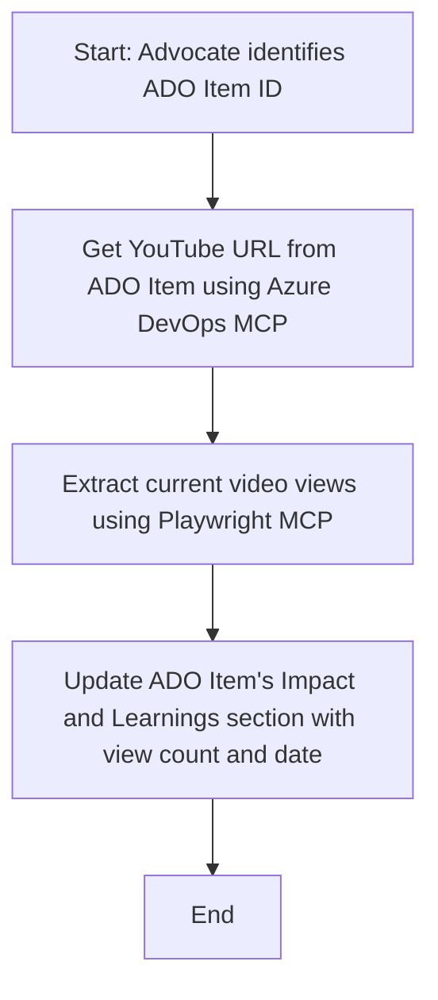

<!--
CO_OP_TRANSLATOR_METADATA:
{
  "original_hash": "14a2dfbea55ef735660a06bd6bdfe5f3",
  "translation_date": "2025-07-14T06:14:08+00:00",
  "source_file": "09-CaseStudy/UpdateADOItemsFromYT.md",
  "language_code": "id"
}
-->
# Studi Kasus: Memperbarui Item Azure DevOps dari Data YouTube dengan MCP

> **Disclaimer:** Sudah ada alat dan laporan online yang dapat mengotomatisasi proses pembaruan item Azure DevOps dengan data dari platform seperti YouTube. Skenario berikut disajikan hanya sebagai contoh penggunaan untuk menggambarkan bagaimana alat MCP dapat diterapkan untuk tugas otomasi dan integrasi.

## Gambaran Umum

Studi kasus ini menunjukkan satu contoh bagaimana Model Context Protocol (MCP) dan alat-alatnya dapat digunakan untuk mengotomatisasi proses pembaruan item kerja Azure DevOps (ADO) dengan informasi yang diambil dari platform online, seperti YouTube. Skenario yang dijelaskan hanyalah salah satu ilustrasi dari kemampuan luas alat ini, yang dapat disesuaikan untuk berbagai kebutuhan otomasi serupa.

Dalam contoh ini, seorang Advocate melacak sesi online menggunakan item ADO, di mana setiap item berisi URL video YouTube. Dengan memanfaatkan alat MCP, Advocate dapat menjaga item ADO tetap terbaru dengan metrik video terkini, seperti jumlah tayangan, secara berulang dan otomatis. Pendekatan ini dapat digeneralisasi ke kasus lain di mana informasi dari sumber online perlu diintegrasikan ke dalam ADO atau sistem lain.

## Skenario

Seorang Advocate bertanggung jawab untuk melacak dampak sesi online dan keterlibatan komunitas. Setiap sesi dicatat sebagai item kerja ADO dalam proyek 'DevRel', dan item kerja tersebut berisi kolom untuk URL video YouTube. Untuk melaporkan jangkauan sesi secara akurat, Advocate perlu memperbarui item ADO dengan jumlah tayangan video saat ini dan tanggal pengambilan informasi tersebut.

## Alat yang Digunakan

- [Azure DevOps MCP](https://github.com/microsoft/azure-devops-mcp): Memungkinkan akses dan pembaruan item kerja ADO secara programatik melalui MCP.
- [Playwright MCP](https://github.com/microsoft/playwright-mcp): Mengotomatisasi tindakan browser untuk mengambil data langsung dari halaman web, seperti statistik video YouTube.

## Alur Kerja Langkah demi Langkah

1. **Identifikasi Item ADO**: Mulai dengan ID item kerja ADO (misalnya, 1234) dalam proyek 'DevRel'.
2. **Ambil URL YouTube**: Gunakan alat Azure DevOps MCP untuk mendapatkan URL YouTube dari item kerja.
3. **Ambil Jumlah Tayangan Video**: Gunakan alat Playwright MCP untuk membuka URL YouTube dan mengambil jumlah tayangan saat ini.
4. **Perbarui Item ADO**: Tulis jumlah tayangan terbaru dan tanggal pengambilan ke dalam bagian 'Impact and Learnings' pada item kerja ADO menggunakan alat Azure DevOps MCP.

## Contoh Prompt

```bash
- Work with the ADO Item ID: 1234
- The project is '2025-Awesome'
- Get the YouTube URL for the ADO item
- Use Playwright to get the current views from the YouTube video
- Update the ADO item with the current video views and the updated date of the information
```

## Diagram Alur Mermaid



## Implementasi Teknis

- **Orkestrasi MCP**: Alur kerja diatur oleh server MCP, yang mengoordinasikan penggunaan alat Azure DevOps MCP dan Playwright MCP.
- **Otomasi**: Proses dapat dijalankan secara manual atau dijadwalkan untuk berjalan secara berkala agar item ADO selalu diperbarui.
- **Ekstensibilitas**: Pola yang sama dapat diperluas untuk memperbarui item ADO dengan metrik online lain (misalnya, likes, komentar) atau dari platform lain.

## Hasil dan Dampak

- **Efisiensi**: Mengurangi upaya manual Advocate dengan mengotomatisasi pengambilan dan pembaruan metrik video.
- **Akurasi**: Memastikan item ADO mencerminkan data terbaru yang tersedia dari sumber online.
- **Repetabilitas**: Menyediakan alur kerja yang dapat digunakan ulang untuk skenario serupa yang melibatkan sumber data atau metrik lain.

## Referensi

- [Azure DevOps MCP](https://github.com/microsoft/azure-devops-mcp)
- [Playwright MCP](https://github.com/microsoft/playwright-mcp)
- [Model Context Protocol (MCP)](https://modelcontextprotocol.io/)

**Penafian**:  
Dokumen ini telah diterjemahkan menggunakan layanan terjemahan AI [Co-op Translator](https://github.com/Azure/co-op-translator). Meskipun kami berupaya untuk mencapai akurasi, harap diperhatikan bahwa terjemahan otomatis mungkin mengandung kesalahan atau ketidakakuratan. Dokumen asli dalam bahasa aslinya harus dianggap sebagai sumber yang sahih. Untuk informasi penting, disarankan menggunakan terjemahan profesional oleh manusia. Kami tidak bertanggung jawab atas kesalahpahaman atau penafsiran yang keliru yang timbul dari penggunaan terjemahan ini.