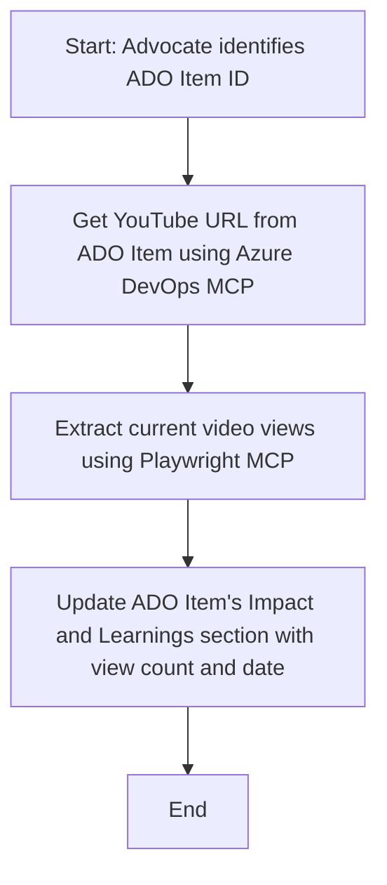

<!--
CO_OP_TRANSLATOR_METADATA:
{
  "original_hash": "14a2dfbea55ef735660a06bd6bdfe5f3",
  "translation_date": "2025-06-13T21:37:12+00:00",
  "source_file": "09-CaseStudy/UpdateADOItemsFromYT.md",
  "language_code": "id"
}
-->
# Studi Kasus: Memperbarui Item Azure DevOps dari Data YouTube dengan MCP

> **Disclaimer:** Ada alat dan laporan online yang sudah ada yang dapat mengotomatisasi proses memperbarui item Azure DevOps dengan data dari platform seperti YouTube. Skenario berikut disediakan murni sebagai contoh kasus untuk menggambarkan bagaimana alat MCP dapat diterapkan untuk tugas otomatisasi dan integrasi.

## Gambaran Umum

Studi kasus ini menunjukkan satu contoh bagaimana Model Context Protocol (MCP) dan alat-alatnya dapat digunakan untuk mengotomatisasi proses memperbarui item kerja Azure DevOps (ADO) dengan informasi yang bersumber dari platform online, seperti YouTube. Skenario yang dijelaskan hanyalah satu ilustrasi dari kemampuan lebih luas alat-alat ini, yang dapat disesuaikan untuk banyak kebutuhan otomatisasi serupa.

Dalam contoh ini, seorang Advocate melacak sesi online menggunakan item ADO, di mana setiap item mencakup URL video YouTube. Dengan memanfaatkan alat MCP, Advocate dapat menjaga item ADO tetap terbaru dengan metrik video terkini, seperti jumlah penayangan, secara berulang dan otomatis. Pendekatan ini dapat digeneralisasi ke kasus lain di mana informasi dari sumber online perlu diintegrasikan ke dalam ADO atau sistem lain.

## Skenario

Seorang Advocate bertanggung jawab untuk melacak dampak sesi online dan keterlibatan komunitas. Setiap sesi dicatat sebagai item kerja ADO dalam proyek 'DevRel', dan item kerja tersebut berisi kolom untuk URL video YouTube. Untuk melaporkan jangkauan sesi secara akurat, Advocate perlu memperbarui item ADO dengan jumlah penayangan video saat ini dan tanggal informasi tersebut diambil.

## Alat yang Digunakan

- [Azure DevOps MCP](https://github.com/microsoft/azure-devops-mcp): Memungkinkan akses programatik dan pembaruan item kerja ADO melalui MCP.
- [Playwright MCP](https://github.com/microsoft/playwright-mcp): Mengotomatisasi aksi browser untuk mengambil data langsung dari halaman web, seperti statistik video YouTube.

## Alur Kerja Langkah demi Langkah

1. **Identifikasi Item ADO**: Mulai dengan ID item kerja ADO (misalnya, 1234) dalam proyek 'DevRel'.
2. **Ambil URL YouTube**: Gunakan alat Azure DevOps MCP untuk mendapatkan URL YouTube dari item kerja.
3. **Ambil Jumlah Penayangan Video**: Gunakan alat Playwright MCP untuk membuka URL YouTube dan mengambil jumlah penayangan saat ini.
4. **Perbarui Item ADO**: Tulis jumlah penayangan terbaru dan tanggal pengambilan ke dalam bagian 'Impact and Learnings' dari item kerja ADO menggunakan alat Azure DevOps MCP.

## Contoh Prompt

```bash
- Work with the ADO Item ID: 1234
- The project is '2025-Awesome'
- Get the YouTube URL for the ADO item
- Use Playwright to get the current views from the YouTube video
- Update the ADO item with the current video views and the updated date of the information
```

## Diagram Alir Mermaid



## Implementasi Teknis

- **Orkestrasi MCP**: Alur kerja diorkestrasi oleh server MCP, yang mengoordinasikan penggunaan alat Azure DevOps MCP dan Playwright MCP.
- **Otomatisasi**: Proses dapat dijalankan secara manual atau dijadwalkan untuk berjalan secara berkala agar item ADO selalu terbaru.
- **Ekstensibilitas**: Pola yang sama dapat diperluas untuk memperbarui item ADO dengan metrik online lainnya (misalnya, likes, komentar) atau dari platform lain.

## Hasil dan Dampak

- **Efisiensi**: Mengurangi usaha manual bagi Advocate dengan mengotomatisasi pengambilan dan pembaruan metrik video.
- **Akurasi**: Memastikan item ADO mencerminkan data paling mutakhir yang tersedia dari sumber online.
- **Repetabilitas**: Menyediakan alur kerja yang dapat digunakan ulang untuk skenario serupa yang melibatkan sumber data atau metrik lain.

## Referensi

- [Azure DevOps MCP](https://github.com/microsoft/azure-devops-mcp)
- [Playwright MCP](https://github.com/microsoft/playwright-mcp)
- [Model Context Protocol (MCP)](https://modelcontextprotocol.io/)

**Penafian**:  
Dokumen ini telah diterjemahkan menggunakan layanan terjemahan AI [Co-op Translator](https://github.com/Azure/co-op-translator). Meskipun kami berupaya untuk akurasi, harap diingat bahwa terjemahan otomatis mungkin mengandung kesalahan atau ketidakakuratan. Dokumen asli dalam bahasa aslinya harus dianggap sebagai sumber yang sahih. Untuk informasi yang penting, disarankan menggunakan terjemahan profesional oleh manusia. Kami tidak bertanggung jawab atas kesalahpahaman atau salah tafsir yang timbul dari penggunaan terjemahan ini.