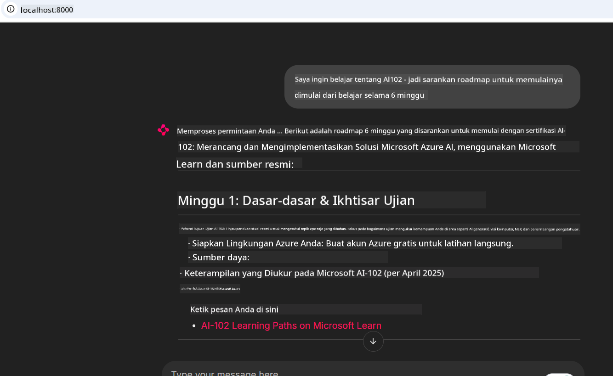
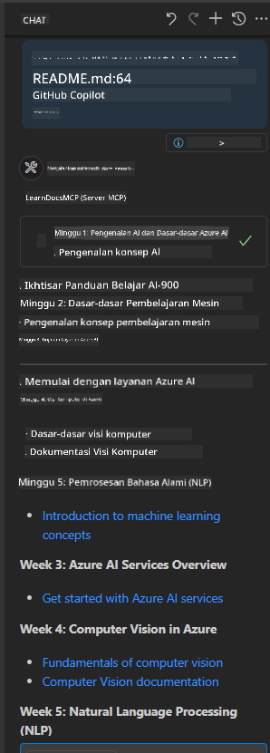

<!--
CO_OP_TRANSLATOR_METADATA:
{
  "original_hash": "4319d291c9d124ecafea52b3d04bfa0e",
  "translation_date": "2025-07-14T06:27:09+00:00",
  "source_file": "09-CaseStudy/docs-mcp/README.md",
  "language_code": "id"
}
-->
# Studi Kasus: Menghubungkan ke Microsoft Learn Docs MCP Server dari Klien

Pernahkah Anda merasa harus bolak-balik antara situs dokumentasi, Stack Overflow, dan tab mesin pencari yang tak berujung, sambil mencoba memecahkan masalah dalam kode Anda? Mungkin Anda punya monitor kedua khusus untuk dokumentasi, atau terus-menerus berganti jendela antara IDE dan browser. Bukankah akan lebih baik jika dokumentasi bisa langsung masuk ke dalam alur kerja Anda—terintegrasi ke dalam aplikasi, IDE, atau bahkan alat kustom Anda sendiri? Dalam studi kasus ini, kita akan mengeksplorasi cara melakukannya dengan menghubungkan langsung ke Microsoft Learn Docs MCP server dari aplikasi klien Anda sendiri.

## Gambaran Umum

Pengembangan modern bukan hanya soal menulis kode—tapi juga menemukan informasi yang tepat pada waktu yang tepat. Dokumentasi ada di mana-mana, tapi jarang berada di tempat yang paling Anda butuhkan: di dalam alat dan alur kerja Anda. Dengan mengintegrasikan pengambilan dokumentasi langsung ke dalam aplikasi Anda, Anda bisa menghemat waktu, mengurangi perpindahan konteks, dan meningkatkan produktivitas. Di bagian ini, kami akan menunjukkan cara menghubungkan klien ke Microsoft Learn Docs MCP server, sehingga Anda dapat mengakses dokumentasi real-time yang peka konteks tanpa harus meninggalkan aplikasi Anda.

Kami akan membimbing Anda melalui proses membangun koneksi, mengirim permintaan, dan menangani respons streaming secara efisien. Pendekatan ini tidak hanya menyederhanakan alur kerja Anda, tapi juga membuka peluang untuk membangun alat pengembang yang lebih cerdas dan membantu.

## Tujuan Pembelajaran

Kenapa kita melakukan ini? Karena pengalaman pengembang terbaik adalah yang menghilangkan hambatan. Bayangkan sebuah dunia di mana editor kode, chatbot, atau aplikasi web Anda bisa langsung menjawab pertanyaan dokumentasi, menggunakan konten terbaru dari Microsoft Learn. Di akhir bab ini, Anda akan bisa:

- Memahami dasar komunikasi server-klien MCP untuk dokumentasi
- Mengimplementasikan aplikasi konsol atau web untuk terhubung ke Microsoft Learn Docs MCP server
- Menggunakan klien HTTP streaming untuk pengambilan dokumentasi secara real-time
- Mencatat dan menginterpretasi respons dokumentasi dalam aplikasi Anda

Anda akan melihat bagaimana keterampilan ini membantu Anda membangun alat yang tidak hanya reaktif, tapi benar-benar interaktif dan peka konteks.

## Skenario 1 - Pengambilan Dokumentasi Real-Time dengan MCP

Dalam skenario ini, kami akan menunjukkan cara menghubungkan klien ke Microsoft Learn Docs MCP server, sehingga Anda dapat mengakses dokumentasi real-time yang peka konteks tanpa meninggalkan aplikasi Anda.

Mari kita praktikkan. Tugas Anda adalah membuat aplikasi yang terhubung ke Microsoft Learn Docs MCP server, memanggil alat `microsoft_docs_search`, dan mencatat respons streaming ke konsol.

### Kenapa menggunakan pendekatan ini?
Karena ini adalah dasar untuk membangun integrasi yang lebih canggih—apakah Anda ingin membuat chatbot, ekstensi IDE, atau dashboard web.

Anda akan menemukan kode dan instruksi untuk skenario ini di folder [`solution`](./solution/README.md) dalam studi kasus ini. Langkah-langkahnya akan memandu Anda dalam menyiapkan koneksi:
- Gunakan SDK MCP resmi dan klien HTTP yang mendukung streaming untuk koneksi
- Panggil alat `microsoft_docs_search` dengan parameter query untuk mengambil dokumentasi
- Terapkan pencatatan dan penanganan error yang tepat
- Buat antarmuka konsol interaktif agar pengguna bisa memasukkan beberapa query pencarian

Skenario ini menunjukkan cara:
- Menghubungkan ke Docs MCP server
- Mengirim query
- Mengurai dan mencetak hasil

Berikut contoh tampilan saat menjalankan solusi:

```
Prompt> What is Azure Key Vault?
Answer> Azure Key Vault is a cloud service for securely storing and accessing secrets. ...
```

Di bawah ini adalah contoh solusi minimal. Kode lengkap dan detail tersedia di folder solusi.

<details>
<summary>Python</summary>

```python
import asyncio
from mcp.client.streamable_http import streamablehttp_client
from mcp import ClientSession

async def main():
    async with streamablehttp_client("https://learn.microsoft.com/api/mcp") as (read_stream, write_stream, _):
        async with ClientSession(read_stream, write_stream) as session:
            await session.initialize()
            result = await session.call_tool("microsoft_docs_search", {"query": "Azure Functions best practices"})
            print(result.content)

if __name__ == "__main__":
    asyncio.run(main())
```

- Untuk implementasi lengkap dan pencatatan, lihat [`scenario1.py`](../../../../09-CaseStudy/docs-mcp/solution/python/scenario1.py).
- Untuk instruksi instalasi dan penggunaan, lihat file [`README.md`](./solution/python/README.md) di folder yang sama.
</details>

## Skenario 2 - Aplikasi Web Generator Rencana Studi Interaktif dengan MCP

Dalam skenario ini, Anda akan belajar cara mengintegrasikan Docs MCP ke dalam proyek pengembangan web. Tujuannya adalah memungkinkan pengguna mencari dokumentasi Microsoft Learn langsung dari antarmuka web, sehingga dokumentasi bisa diakses secara instan dalam aplikasi atau situs Anda.

Anda akan melihat cara:
- Menyiapkan aplikasi web
- Menghubungkan ke Docs MCP server
- Menangani input pengguna dan menampilkan hasil

Berikut contoh tampilan saat menjalankan solusi:

```
User> I want to learn about AI102 - so suggest the roadmap to get it started from learn for 6 weeks

Assistant> Here’s a detailed 6-week roadmap to start your preparation for the AI-102: Designing and Implementing a Microsoft Azure AI Solution certification, using official Microsoft resources and focusing on exam skills areas:

---
## Week 1: Introduction & Fundamentals
- **Understand the Exam**: Review the [AI-102 exam skills outline](https://learn.microsoft.com/en-us/credentials/certifications/exams/ai-102/).
- **Set up Azure**: Sign up for a free Azure account if you don't have one.
- **Learning Path**: [Introduction to Azure AI services](https://learn.microsoft.com/en-us/training/modules/intro-to-azure-ai/)
- **Focus**: Get familiar with Azure portal, AI capabilities, and necessary tools.

....more weeks of the roadmap...

Let me know if you want module-specific recommendations or need more customized weekly tasks!
```

Di bawah ini adalah contoh solusi minimal. Kode lengkap dan detail tersedia di folder solusi.



<details>
<summary>Python (Chainlit)</summary>

Chainlit adalah framework untuk membangun aplikasi web AI percakapan. Framework ini memudahkan pembuatan chatbot dan asisten interaktif yang dapat memanggil alat MCP dan menampilkan hasil secara real-time. Cocok untuk prototipe cepat dan antarmuka yang ramah pengguna.

```python
import chainlit as cl
import requests

MCP_URL = "https://learn.microsoft.com/api/mcp"

@cl.on_message
def handle_message(message):
    query = {"question": message}
    response = requests.post(MCP_URL, json=query)
    if response.ok:
        result = response.json()
        cl.Message(content=result.get("answer", "No answer found.")).send()
    else:
        cl.Message(content="Error: " + response.text).send()
```

- Untuk implementasi lengkap, lihat [`scenario2.py`](../../../../09-CaseStudy/docs-mcp/solution/python/scenario2.py).
- Untuk instruksi setup dan menjalankan, lihat [`README.md`](./solution/python/README.md).
</details>

## Skenario 3: Dokumentasi Dalam Editor dengan MCP Server di VS Code

Jika Anda ingin mendapatkan Microsoft Learn Docs langsung di dalam VS Code (tanpa harus berganti tab browser), Anda bisa menggunakan MCP server di editor Anda. Ini memungkinkan Anda untuk:
- Mencari dan membaca dokumentasi di VS Code tanpa meninggalkan lingkungan pengkodean.
- Mereferensikan dokumentasi dan menyisipkan tautan langsung ke README atau file kursus Anda.
- Memanfaatkan GitHub Copilot dan MCP bersama-sama untuk alur kerja dokumentasi yang mulus dan didukung AI.

**Anda akan belajar cara:**
- Menambahkan file `.vscode/mcp.json` yang valid ke root workspace Anda (lihat contoh di bawah).
- Membuka panel MCP atau menggunakan command palette di VS Code untuk mencari dan menyisipkan dokumentasi.
- Mereferensikan dokumentasi langsung di file markdown saat Anda bekerja.
- Menggabungkan alur kerja ini dengan GitHub Copilot untuk produktivitas yang lebih tinggi.

Berikut contoh cara menyiapkan MCP server di VS Code:

```json
{
  "servers": {
    "LearnDocsMCP": {
      "url": "https://learn.microsoft.com/api/mcp"
    }
  }
}
```

</details>

> Untuk panduan lengkap dengan tangkapan layar dan langkah demi langkah, lihat [`README.md`](./solution/scenario3/README.md).



Pendekatan ini sangat cocok untuk siapa saja yang membangun kursus teknis, menulis dokumentasi, atau mengembangkan kode dengan kebutuhan referensi yang sering.

## Poin Penting

Mengintegrasikan dokumentasi langsung ke dalam alat Anda bukan hanya soal kenyamanan—ini adalah perubahan besar untuk produktivitas. Dengan menghubungkan ke Microsoft Learn Docs MCP server dari klien Anda, Anda bisa:

- Menghilangkan perpindahan konteks antara kode dan dokumentasi
- Mengambil dokumentasi yang up-to-date dan peka konteks secara real-time
- Membangun alat pengembang yang lebih cerdas dan interaktif

Keterampilan ini akan membantu Anda menciptakan solusi yang tidak hanya efisien, tapi juga menyenangkan untuk digunakan.

## Sumber Daya Tambahan

Untuk memperdalam pemahaman Anda, jelajahi sumber resmi berikut:

- [Microsoft Learn Docs MCP Server (GitHub)](https://github.com/MicrosoftDocs/mcp)
- [Memulai dengan Azure MCP Server (mcp-python)](https://learn.microsoft.com/en-us/azure/developer/azure-mcp-server/get-started#create-the-python-app)
- [Apa itu Azure MCP Server?](https://learn.microsoft.com/en-us/azure/developer/azure-mcp-server/)
- [Pengenalan Model Context Protocol (MCP)](https://modelcontextprotocol.io/introduction)
- [Menambahkan plugin dari MCP Server (Python)](https://learn.microsoft.com/en-us/semantic-kernel/concepts/plugins/adding-mcp-plugins)

**Penafian**:  
Dokumen ini telah diterjemahkan menggunakan layanan terjemahan AI [Co-op Translator](https://github.com/Azure/co-op-translator). Meskipun kami berupaya untuk mencapai akurasi, harap diperhatikan bahwa terjemahan otomatis mungkin mengandung kesalahan atau ketidakakuratan. Dokumen asli dalam bahasa aslinya harus dianggap sebagai sumber yang sahih. Untuk informasi penting, disarankan menggunakan terjemahan profesional oleh manusia. Kami tidak bertanggung jawab atas kesalahpahaman atau penafsiran yang keliru yang timbul dari penggunaan terjemahan ini.