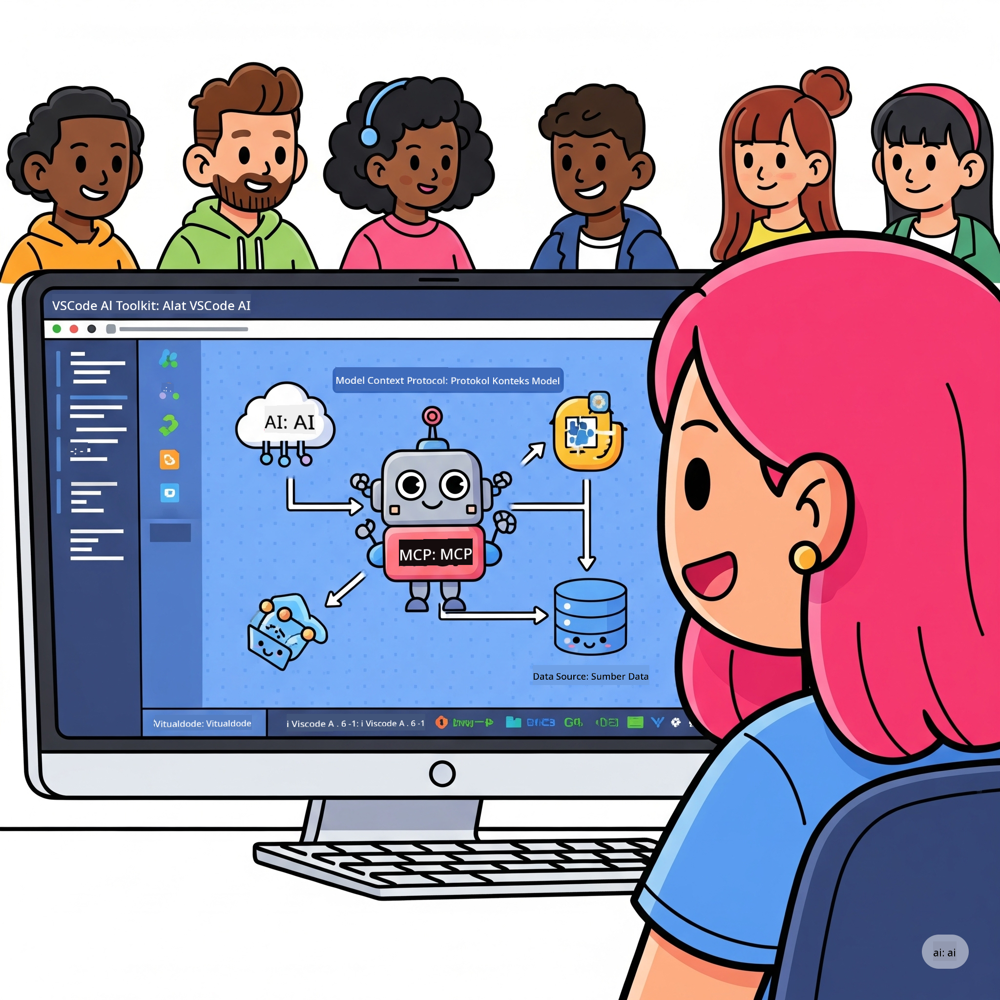
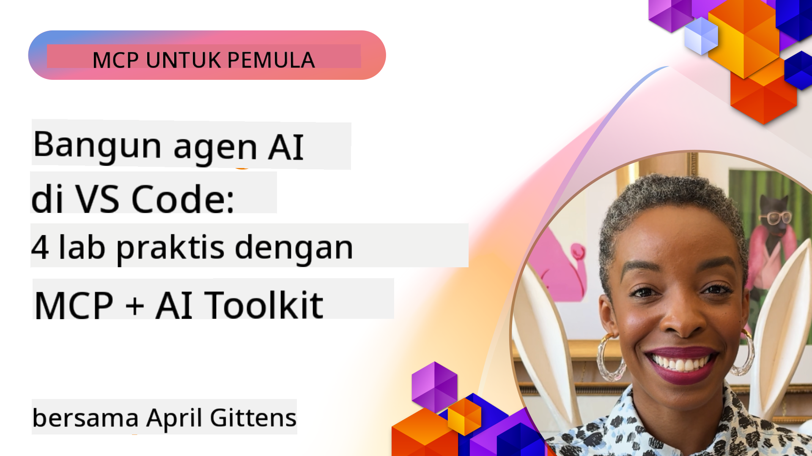

<!--
CO_OP_TRANSLATOR_METADATA:
{
  "original_hash": "1b000fd6e1b04c047578bfc5d07d54eb",
  "translation_date": "2025-08-18T17:46:21+00:00",
  "source_file": "10-StreamliningAIWorkflowsBuildingAnMCPServerWithAIToolkit/README.md",
  "language_code": "id"
}
-->
# Menyederhanakan Alur Kerja AI: Membangun Server MCP dengan AI Toolkit

## 🎯 Gambaran Umum

_(Klik gambar di atas untuk menonton video pelajaran ini)_

Selamat datang di **Workshop Model Context Protocol (MCP)**! Workshop praktis ini menggabungkan dua teknologi mutakhir untuk merevolusi pengembangan aplikasi AI:

- **🔗 Model Context Protocol (MCP)**: Standar terbuka untuk integrasi alat AI yang mulus
- **🛠️ AI Toolkit untuk Visual Studio Code (AITK)**: Ekstensi pengembangan AI yang kuat dari Microsoft

### 🎓 Apa yang Akan Anda Pelajari

Di akhir workshop ini, Anda akan menguasai seni membangun aplikasi cerdas yang menghubungkan model AI dengan alat dan layanan dunia nyata. Mulai dari pengujian otomatis hingga integrasi API khusus, Anda akan mendapatkan keterampilan praktis untuk menyelesaikan tantangan bisnis yang kompleks.

## 🏗️ Teknologi yang Digunakan

### 🔌 Model Context Protocol (MCP)

MCP adalah **"USB-C untuk AI"** - standar universal yang menghubungkan model AI dengan alat dan sumber data eksternal.

**✨ Fitur Utama:**

- 🔄 **Integrasi Standar**: Antarmuka universal untuk koneksi alat AI
- 🏛️ **Arsitektur Fleksibel**: Server lokal & jarak jauh melalui transport stdio/SSE
- 🧰 **Ekosistem Kaya**: Alat, prompt, dan sumber daya dalam satu protokol
- 🔒 **Siap untuk Perusahaan**: Keamanan dan keandalan bawaan

**🎯 Mengapa MCP Penting:**
Seperti USB-C yang menghilangkan kekacauan kabel, MCP menghilangkan kompleksitas integrasi AI. Satu protokol, kemungkinan tak terbatas.

### 🤖 AI Toolkit untuk Visual Studio Code (AITK)

Ekstensi pengembangan AI unggulan dari Microsoft yang mengubah VS Code menjadi pusat kekuatan AI.

**🚀 Kemampuan Inti:**

- 📦 **Katalog Model**: Akses model dari Azure AI, GitHub, Hugging Face, Ollama
- ⚡ **Inferensi Lokal**: Eksekusi CPU/GPU/NPU yang dioptimalkan ONNX
- 🏗️ **Pembangun Agen**: Pengembangan agen AI visual dengan integrasi MCP
- 🎭 **Multi-Modal**: Dukungan teks, visi, dan keluaran terstruktur

**💡 Manfaat Pengembangan:**

- Penerapan model tanpa konfigurasi
- Rekayasa prompt visual
- Playground pengujian real-time
- Integrasi server MCP yang mulus

## 📚 Perjalanan Belajar

### [🚀 Modul 1: Dasar-Dasar AI Toolkit](./lab1/README.md)

**Durasi**: 15 menit

- 🛠️ Instal dan konfigurasikan AI Toolkit untuk VS Code
- 🗂️ Jelajahi Katalog Model (100+ model dari GitHub, ONNX, OpenAI, Anthropic, Google)
- 🎮 Kuasai Playground Interaktif untuk pengujian model real-time
- 🤖 Bangun agen AI pertama Anda dengan Pembangun Agen
- 📊 Evaluasi kinerja model dengan metrik bawaan (F1, relevansi, kesamaan, koherensi)
- ⚡ Pelajari kemampuan pemrosesan batch dan dukungan multi-modal

**🎯 Hasil Belajar**: Membuat agen AI fungsional dengan pemahaman komprehensif tentang kemampuan AITK

### [🌐 Modul 2: Dasar-Dasar MCP dengan AI Toolkit](./lab2/README.md)

**Durasi**: 20 menit

- 🧠 Kuasai arsitektur dan konsep Model Context Protocol (MCP)
- 🌐 Jelajahi ekosistem server MCP dari Microsoft
- 🤖 Bangun agen otomatisasi browser menggunakan server MCP Playwright
- 🔧 Integrasikan server MCP dengan Pembangun Agen AI Toolkit
- 📊 Konfigurasikan dan uji alat MCP dalam agen Anda
- 🚀 Ekspor dan terapkan agen bertenaga MCP untuk penggunaan produksi

**🎯 Hasil Belajar**: Menerapkan agen AI yang diperkuat dengan alat eksternal melalui MCP

### [🔧 Modul 3: Pengembangan MCP Lanjutan dengan AI Toolkit](./lab3/README.md)

**Durasi**: 20 menit

- 💻 Buat server MCP khusus menggunakan AI Toolkit
- 🐍 Konfigurasikan dan gunakan SDK Python MCP terbaru (v1.9.3)
- 🔍 Siapkan dan gunakan MCP Inspector untuk debugging
- 🛠️ Bangun Server MCP Cuaca dengan alur kerja debugging profesional
- 🧪 Debug server MCP di lingkungan Pembangun Agen dan Inspector

**🎯 Hasil Belajar**: Mengembangkan dan mendebug server MCP khusus dengan alat modern

### [🐙 Modul 4: Pengembangan MCP Praktis - Server Klon GitHub Kustom](./lab4/README.md)

**Durasi**: 30 menit

- 🏗️ Bangun Server MCP Klon GitHub dunia nyata untuk alur kerja pengembangan
- 🔄 Terapkan kloning repositori cerdas dengan validasi dan penanganan kesalahan
- 📁 Buat manajemen direktori cerdas dan integrasi VS Code
- 🤖 Gunakan Mode Agen GitHub Copilot dengan alat MCP khusus
- 🛡️ Terapkan keandalan siap produksi dan kompatibilitas lintas platform

**🎯 Hasil Belajar**: Menerapkan server MCP siap produksi yang menyederhanakan alur kerja pengembangan nyata

## 💡 Aplikasi Dunia Nyata & Dampaknya

### 🏢 Kasus Penggunaan Perusahaan

#### 🔄 Otomasi DevOps

Ubah alur kerja pengembangan Anda dengan otomatisasi cerdas:

- **Manajemen Repositori Cerdas**: Tinjauan kode berbasis AI dan keputusan penggabungan
- **CI/CD Cerdas**: Optimalisasi pipeline otomatis berdasarkan perubahan kode
- **Triage Masalah**: Klasifikasi dan penugasan bug otomatis

#### 🧪 Revolusi Jaminan Kualitas

Tingkatkan pengujian dengan otomatisasi berbasis AI:

- **Pembuatan Tes Cerdas**: Buat suite pengujian yang komprehensif secara otomatis
- **Pengujian Regresi Visual**: Deteksi perubahan UI berbasis AI
- **Pemantauan Kinerja**: Identifikasi dan penyelesaian masalah secara proaktif

#### 📊 Kecerdasan Alur Data

Bangun alur kerja pemrosesan data yang lebih cerdas:

- **Proses ETL Adaptif**: Transformasi data yang mengoptimalkan diri
- **Deteksi Anomali**: Pemantauan kualitas data real-time
- **Pengelolaan Alur Data Cerdas**: Manajemen aliran data yang pintar

#### 🎧 Peningkatan Pengalaman Pelanggan

Ciptakan interaksi pelanggan yang luar biasa:

- **Dukungan Kontekstual**: Agen AI dengan akses ke riwayat pelanggan
- **Penyelesaian Masalah Proaktif**: Layanan pelanggan prediktif
- **Integrasi Multi-Saluran**: Pengalaman AI terpadu di berbagai platform

## 🛠️ Prasyarat & Pengaturan

### 💻 Persyaratan Sistem

| Komponen | Persyaratan | Catatan |
|-----------|-------------|-------|
| **Sistem Operasi** | Windows 10+, macOS 10.15+, Linux | Sistem operasi modern apa pun |
| **Visual Studio Code** | Versi stabil terbaru | Diperlukan untuk AITK |
| **Node.js** | v18.0+ dan npm | Untuk pengembangan server MCP |
| **Python** | 3.10+ | Opsional untuk server MCP Python |
| **Memori** | Minimal 8GB RAM | 16GB direkomendasikan untuk model lokal |

### 🔧 Lingkungan Pengembangan

#### Ekstensi VS Code yang Direkomendasikan

- **AI Toolkit** (ms-windows-ai-studio.windows-ai-studio)
- **Python** (ms-python.python)
- **Python Debugger** (ms-python.debugpy)
- **GitHub Copilot** (GitHub.copilot) - Opsional tetapi berguna

#### Alat Opsional

- **uv**: Pengelola paket Python modern
- **MCP Inspector**: Alat debugging visual untuk server MCP
- **Playwright**: Untuk contoh otomatisasi web

## 🎖️ Hasil Belajar & Jalur Sertifikasi

### 🏆 Daftar Periksa Penguasaan Keterampilan

Dengan menyelesaikan workshop ini, Anda akan mencapai penguasaan dalam:

#### 🎯 Kompetensi Inti

- [ ] **Penguasaan Protokol MCP**: Pemahaman mendalam tentang arsitektur dan pola implementasi
- [ ] **Kemahiran AITK**: Penggunaan tingkat ahli AI Toolkit untuk pengembangan cepat
- [ ] **Pengembangan Server Kustom**: Membangun, menerapkan, dan memelihara server MCP produksi
- [ ] **Keunggulan Integrasi Alat**: Menghubungkan AI dengan alur kerja pengembangan yang ada secara mulus
- [ ] **Aplikasi Pemecahan Masalah**: Menerapkan keterampilan yang dipelajari untuk tantangan bisnis nyata

#### 🔧 Keterampilan Teknis

- [ ] Menyiapkan dan mengonfigurasi AI Toolkit di VS Code
- [ ] Merancang dan mengimplementasikan server MCP kustom
- [ ] Mengintegrasikan Model GitHub dengan arsitektur MCP
- [ ] Membangun alur kerja pengujian otomatis dengan Playwright
- [ ] Menerapkan agen AI untuk penggunaan produksi
- [ ] Mendebug dan mengoptimalkan kinerja server MCP

#### 🚀 Kemampuan Lanjutan

- [ ] Merancang integrasi AI skala perusahaan
- [ ] Menerapkan praktik keamanan terbaik untuk aplikasi AI
- [ ] Merancang arsitektur server MCP yang skalabel
- [ ] Membuat rantai alat khusus untuk domain tertentu
- [ ] Membimbing orang lain dalam pengembangan berbasis AI

## 📖 Sumber Daya Tambahan

- [Spesifikasi MCP](https://modelcontextprotocol.io/docs)
- [Repositori GitHub AI Toolkit](https://github.com/microsoft/vscode-ai-toolkit)
- [Koleksi Server MCP Contoh](https://github.com/modelcontextprotocol/servers)
- [Panduan Praktik Terbaik](https://modelcontextprotocol.io/docs/best-practices)

---

**🚀 Siap merevolusi alur kerja pengembangan AI Anda?**

Mari kita bangun masa depan aplikasi cerdas bersama dengan MCP dan AI Toolkit!

**Penafian**:  
Dokumen ini telah diterjemahkan menggunakan layanan penerjemahan AI [Co-op Translator](https://github.com/Azure/co-op-translator). Meskipun kami berupaya untuk memberikan hasil yang akurat, harap diperhatikan bahwa terjemahan otomatis mungkin mengandung kesalahan atau ketidakakuratan. Dokumen asli dalam bahasa aslinya harus dianggap sebagai sumber yang berwenang. Untuk informasi yang bersifat kritis, disarankan menggunakan jasa penerjemahan manusia profesional. Kami tidak bertanggung jawab atas kesalahpahaman atau penafsiran yang keliru yang timbul dari penggunaan terjemahan ini.