<!--
CO_OP_TRANSLATOR_METADATA:
{
  "original_hash": "a22b7dd11cd7690f99f9195877cafdc3",
  "translation_date": "2025-07-14T07:57:32+00:00",
  "source_file": "10-StreamliningAIWorkflowsBuildingAnMCPServerWithAIToolkit/lab2/README.md",
  "language_code": "id"
}
-->
# 🌐 Modul 2: Dasar-dasar MCP dengan AI Toolkit

[]()
[]()
[]()

## 📋 Tujuan Pembelajaran

Pada akhir modul ini, Anda akan mampu:
- ✅ Memahami arsitektur dan manfaat Model Context Protocol (MCP)
- ✅ Menjelajahi ekosistem server MCP Microsoft
- ✅ Mengintegrasikan server MCP dengan AI Toolkit Agent Builder
- ✅ Membangun agen otomatisasi browser fungsional menggunakan Playwright MCP
- ✅ Mengonfigurasi dan menguji alat MCP dalam agen Anda
- ✅ Mengekspor dan menerapkan agen bertenaga MCP untuk penggunaan produksi

## 🎯 Melanjutkan dari Modul 1

Di Modul 1, kita telah menguasai dasar-dasar AI Toolkit dan membuat Python Agent pertama kita. Sekarang kita akan **meningkatkan** agen Anda dengan menghubungkannya ke alat dan layanan eksternal melalui **Model Context Protocol (MCP)** yang revolusioner.

Bayangkan ini seperti meng-upgrade dari kalkulator sederhana ke komputer lengkap - agen AI Anda akan mendapatkan kemampuan untuk:
- 🌐 Menjelajah dan berinteraksi dengan situs web
- 📁 Mengakses dan memanipulasi file
- 🔧 Terintegrasi dengan sistem perusahaan
- 📊 Memproses data real-time dari API

## 🧠 Memahami Model Context Protocol (MCP)

### 🔍 Apa itu MCP?

Model Context Protocol (MCP) adalah **"USB-C untuk aplikasi AI"** - standar terbuka revolusioner yang menghubungkan Large Language Models (LLM) dengan alat eksternal, sumber data, dan layanan. Sama seperti USB-C yang menghilangkan kekacauan kabel dengan menyediakan satu konektor universal, MCP menghilangkan kompleksitas integrasi AI dengan satu protokol standar.

### 🎯 Masalah yang Diselesaikan MCP

**Sebelum MCP:**
- 🔧 Integrasi khusus untuk setiap alat
- 🔄 Ketergantungan vendor dengan solusi proprietary  
- 🔒 Kerentanan keamanan dari koneksi ad-hoc
- ⏱️ Berbulan-bulan pengembangan untuk integrasi dasar

**Dengan MCP:**
- ⚡ Integrasi alat plug-and-play
- 🔄 Arsitektur vendor-agnostik
- 🛡️ Praktik keamanan terbaik bawaan
- 🚀 Penambahan kemampuan baru dalam hitungan menit

### 🏗️ Penjelasan Mendalam Arsitektur MCP

MCP mengikuti arsitektur **client-server** yang menciptakan ekosistem yang aman dan skalabel:

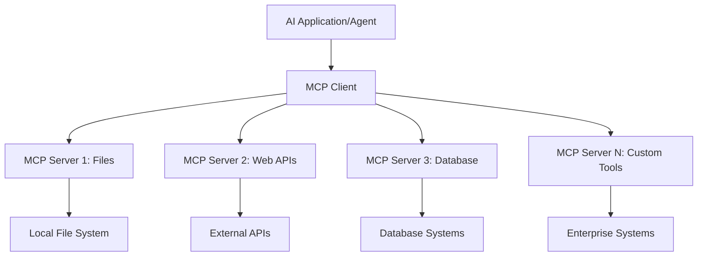

**🔧 Komponen Utama:**

| Komponen | Peran | Contoh |
|-----------|------|----------|
| **MCP Hosts** | Aplikasi yang menggunakan layanan MCP | Claude Desktop, VS Code, AI Toolkit |
| **MCP Clients** | Penangan protokol (1:1 dengan server) | Terintegrasi dalam aplikasi host |
| **MCP Servers** | Menyediakan kemampuan melalui protokol standar | Playwright, Files, Azure, GitHub |
| **Transport Layer** | Metode komunikasi | stdio, HTTP, WebSockets |


## 🏢 Ekosistem Server MCP Microsoft

Microsoft memimpin ekosistem MCP dengan rangkaian server kelas enterprise yang lengkap untuk memenuhi kebutuhan bisnis nyata.

### 🌟 Server MCP Unggulan Microsoft

#### 1. ☁️ Azure MCP Server  
**🔗 Repository**: [azure/azure-mcp](https://github.com/azure/azure-mcp)  
**🎯 Tujuan**: Manajemen sumber daya Azure yang komprehensif dengan integrasi AI

**✨ Fitur Utama:**
- Penyediaan infrastruktur deklaratif
- Pemantauan sumber daya real-time
- Rekomendasi optimasi biaya
- Pemeriksaan kepatuhan keamanan

**🚀 Kasus Penggunaan:**
- Infrastruktur sebagai Kode dengan bantuan AI
- Skalabilitas sumber daya otomatis
- Optimasi biaya cloud
- Otomatisasi alur kerja DevOps

#### 2. 📊 Microsoft Dataverse MCP  
**📚 Dokumentasi**: [Microsoft Dataverse Integration](https://go.microsoft.com/fwlink/?linkid=2320176)  
**🎯 Tujuan**: Antarmuka bahasa alami untuk data bisnis

**✨ Fitur Utama:**
- Query database dengan bahasa alami
- Pemahaman konteks bisnis
- Template prompt kustom
- Tata kelola data enterprise

**🚀 Kasus Penggunaan:**
- Pelaporan intelijen bisnis
- Analisis data pelanggan
- Insight pipeline penjualan
- Query data kepatuhan

#### 3. 🌐 Playwright MCP Server  
**🔗 Repository**: [microsoft/playwright-mcp](https://github.com/microsoft/playwright-mcp)  
**🎯 Tujuan**: Otomatisasi browser dan kemampuan interaksi web

**✨ Fitur Utama:**
- Otomatisasi lintas browser (Chrome, Firefox, Safari)
- Deteksi elemen cerdas
- Pembuatan screenshot dan PDF
- Pemantauan lalu lintas jaringan

**🚀 Kasus Penggunaan:**
- Alur kerja pengujian otomatis
- Web scraping dan ekstraksi data
- Pemantauan UI/UX
- Otomatisasi analisis kompetitif

#### 4. 📁 Files MCP Server  
**🔗 Repository**: [microsoft/files-mcp-server](https://github.com/microsoft/files-mcp-server)  
**🎯 Tujuan**: Operasi sistem file cerdas

**✨ Fitur Utama:**
- Manajemen file deklaratif
- Sinkronisasi konten
- Integrasi kontrol versi
- Ekstraksi metadata

**🚀 Kasus Penggunaan:**
- Manajemen dokumentasi
- Organisasi repositori kode
- Alur kerja penerbitan konten
- Penanganan file pipeline data

#### 5. 📝 MarkItDown MCP Server  
**🔗 Repository**: [microsoft/markitdown](https://github.com/microsoft/markitdown)  
**🎯 Tujuan**: Pemrosesan dan manipulasi Markdown tingkat lanjut

**✨ Fitur Utama:**
- Parsing Markdown kaya fitur
- Konversi format (MD ↔ HTML ↔ PDF)
- Analisis struktur konten
- Pemrosesan template

**🚀 Kasus Penggunaan:**
- Alur kerja dokumentasi teknis
- Sistem manajemen konten
- Pembuatan laporan
- Otomatisasi basis pengetahuan

#### 6. 📈 Clarity MCP Server  
**📦 Paket**: [@microsoft/clarity-mcp-server](https://www.npmjs.com/package/@microsoft/clarity-mcp-server)  
**🎯 Tujuan**: Analitik web dan wawasan perilaku pengguna

**✨ Fitur Utama:**
- Analisis data heatmap
- Rekaman sesi pengguna
- Metrik performa
- Analisis funnel konversi

**🚀 Kasus Penggunaan:**
- Optimasi situs web
- Riset pengalaman pengguna
- Analisis A/B testing
- Dashboard intelijen bisnis

### 🌍 Ekosistem Komunitas

Selain server Microsoft, ekosistem MCP mencakup:  
- **🐙 GitHub MCP**: Manajemen repositori dan analisis kode  
- **🗄️ Database MCPs**: Integrasi PostgreSQL, MySQL, MongoDB  
- **☁️ Cloud Provider MCPs**: Alat AWS, GCP, Digital Ocean  
- **📧 Communication MCPs**: Integrasi Slack, Teams, Email  

## 🛠️ Lab Praktik: Membangun Agen Otomatisasi Browser

**🎯 Tujuan Proyek**: Membuat agen otomatisasi browser cerdas menggunakan Playwright MCP server yang dapat menavigasi situs web, mengekstrak informasi, dan melakukan interaksi web kompleks.

### 🚀 Fase 1: Persiapan Dasar Agen

#### Langkah 1: Inisialisasi Agen Anda
1. **Buka AI Toolkit Agent Builder**  
2. **Buat Agen Baru** dengan konfigurasi berikut:  
   - **Nama**: `BrowserAgent`  
   - **Model**: Pilih GPT-4o  

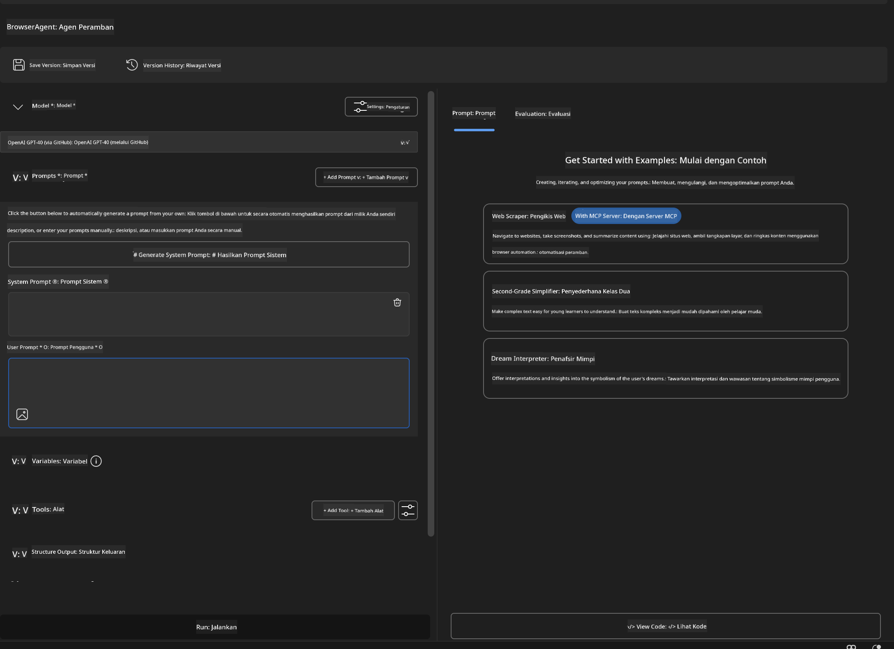


### 🔧 Fase 2: Alur Kerja Integrasi MCP

#### Langkah 3: Tambahkan Integrasi Server MCP
1. **Masuk ke Bagian Tools** di Agent Builder  
2. **Klik "Add Tool"** untuk membuka menu integrasi  
3. **Pilih "MCP Server"** dari opsi yang tersedia  

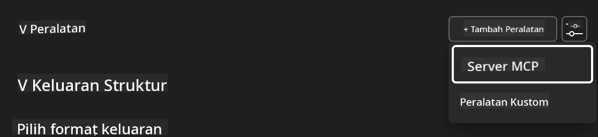

**🔍 Memahami Jenis Alat:**
- **Built-in Tools**: Fungsi AI Toolkit yang sudah dikonfigurasi  
- **MCP Servers**: Integrasi layanan eksternal  
- **Custom APIs**: Endpoint layanan milik Anda sendiri  
- **Function Calling**: Akses langsung fungsi model  

#### Langkah 4: Pilih Server MCP
1. **Pilih opsi "MCP Server"** untuk melanjutkan  
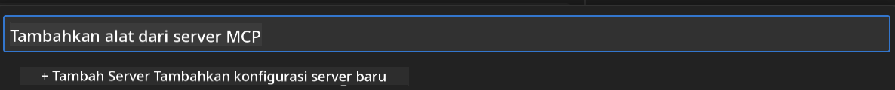

2. **Jelajahi Katalog MCP** untuk melihat integrasi yang tersedia  
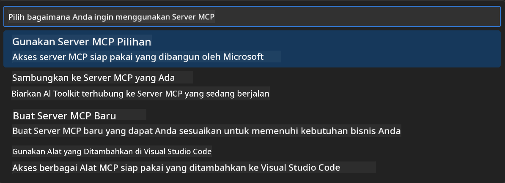


### 🎮 Fase 3: Konfigurasi Playwright MCP

#### Langkah 5: Pilih dan Konfigurasikan Playwright
1. **Klik "Use Featured MCP Servers"** untuk mengakses server Microsoft yang terverifikasi  
2. **Pilih "Playwright"** dari daftar unggulan  
3. **Terima MCP ID Default** atau sesuaikan untuk lingkungan Anda  

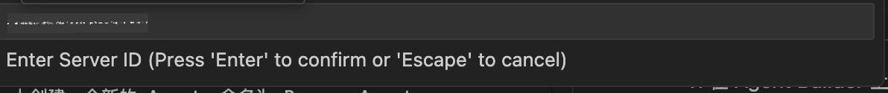

#### Langkah 6: Aktifkan Kemampuan Playwright
**🔑 Langkah Penting**: Pilih **SEMUA** metode Playwright yang tersedia untuk fungsi maksimal  

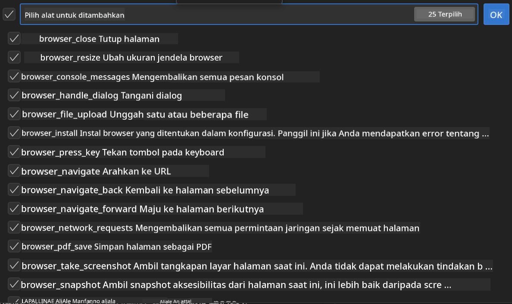

**🛠️ Alat Playwright Esensial:**
- **Navigasi**: `goto`, `goBack`, `goForward`, `reload`  
- **Interaksi**: `click`, `fill`, `press`, `hover`, `drag`  
- **Ekstraksi**: `textContent`, `innerHTML`, `getAttribute`  
- **Validasi**: `isVisible`, `isEnabled`, `waitForSelector`  
- **Tangkap**: `screenshot`, `pdf`, `video`  
- **Jaringan**: `setExtraHTTPHeaders`, `route`, `waitForResponse`  

#### Langkah 7: Verifikasi Keberhasilan Integrasi
**✅ Indikator Keberhasilan:**
- Semua alat muncul di antarmuka Agent Builder  
- Tidak ada pesan error di panel integrasi  
- Status server Playwright menunjukkan "Connected"  

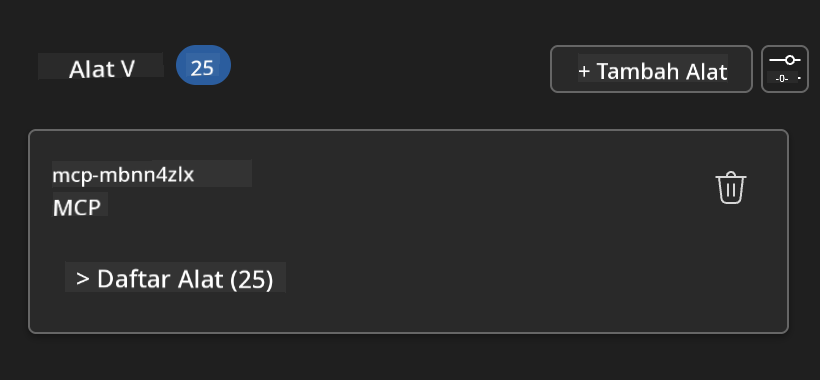

**🔧 Pemecahan Masalah Umum:**
- **Koneksi Gagal**: Periksa koneksi internet dan pengaturan firewall  
- **Alat Hilang**: Pastikan semua kemampuan dipilih saat setup  
- **Error Izin**: Verifikasi VS Code memiliki izin sistem yang diperlukan  

### 🎯 Fase 4: Rekayasa Prompt Lanjutan

#### Langkah 8: Rancang Prompt Sistem Cerdas
Buat prompt canggih yang memanfaatkan kemampuan penuh Playwright:

```markdown
# Web Automation Expert System Prompt

## Core Identity
You are an advanced web automation specialist with deep expertise in browser automation, web scraping, and user experience analysis. You have access to Playwright tools for comprehensive browser control.

## Capabilities & Approach
### Navigation Strategy
- Always start with screenshots to understand page layout
- Use semantic selectors (text content, labels) when possible
- Implement wait strategies for dynamic content
- Handle single-page applications (SPAs) effectively

### Error Handling
- Retry failed operations with exponential backoff
- Provide clear error descriptions and solutions
- Suggest alternative approaches when primary methods fail
- Always capture diagnostic screenshots on errors

### Data Extraction
- Extract structured data in JSON format when possible
- Provide confidence scores for extracted information
- Validate data completeness and accuracy
- Handle pagination and infinite scroll scenarios

### Reporting
- Include step-by-step execution logs
- Provide before/after screenshots for verification
- Suggest optimizations and alternative approaches
- Document any limitations or edge cases encountered

## Ethical Guidelines
- Respect robots.txt and rate limiting
- Avoid overloading target servers
- Only extract publicly available information
- Follow website terms of service
```

#### Langkah 9: Buat Prompt Pengguna Dinamis
Rancang prompt yang menunjukkan berbagai kemampuan:

**🌐 Contoh Analisis Web:**  
```markdown
Navigate to github.com/kinfey and provide a comprehensive analysis including:
1. Repository structure and organization
2. Recent activity and contribution patterns  
3. Documentation quality assessment
4. Technology stack identification
5. Community engagement metrics
6. Notable projects and their purposes

Include screenshots at key steps and provide actionable insights.
```

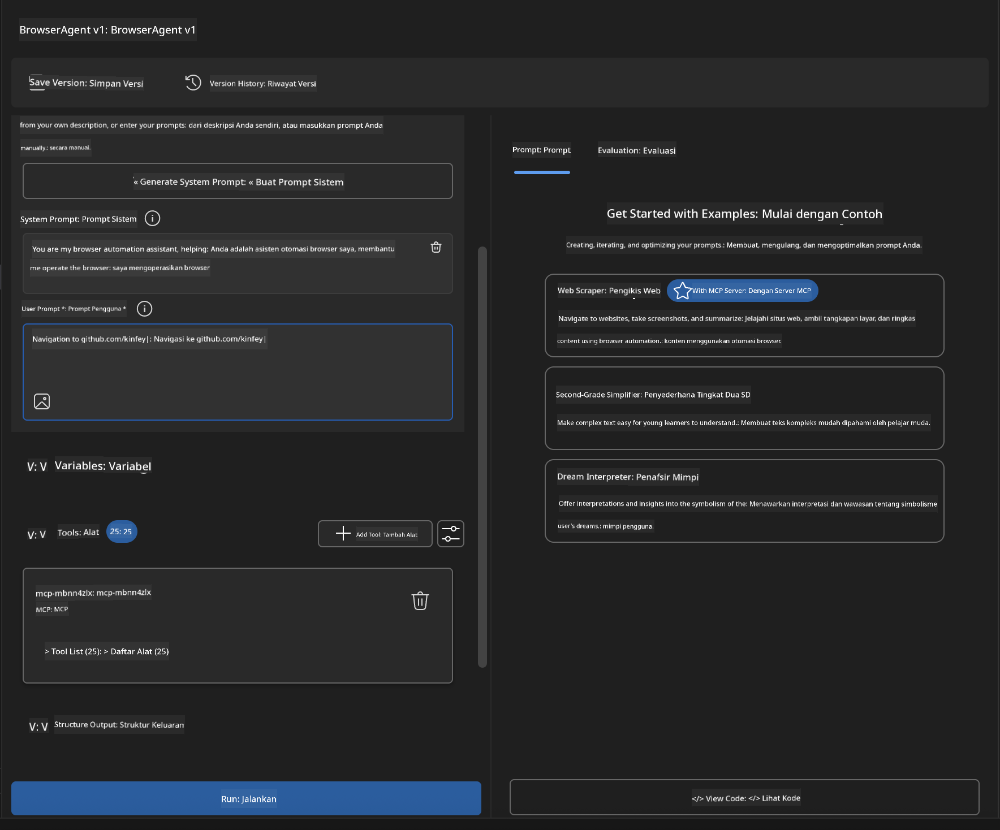

### 🚀 Fase 5: Eksekusi dan Pengujian

#### Langkah 10: Jalankan Otomatisasi Pertama Anda
1. **Klik "Run"** untuk memulai urutan otomatisasi  
2. **Pantau Eksekusi Real-time**:  
   - Browser Chrome terbuka otomatis  
   - Agen menavigasi ke situs target  
   - Screenshot menangkap setiap langkah utama  
   - Hasil analisis mengalir secara real-time  


#### Langkah 11: Analisis Hasil dan Insight
Tinjau analisis lengkap di antarmuka Agent Builder:

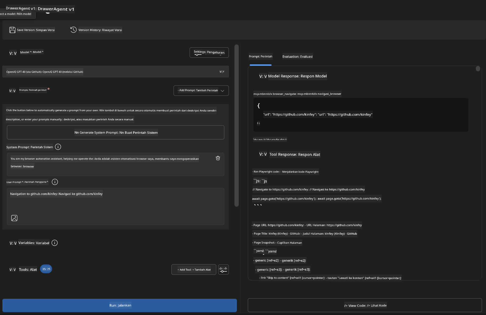

### 🌟 Fase 6: Kemampuan Lanjutan dan Deployment

#### Langkah 12: Ekspor dan Deployment Produksi
Agent Builder mendukung berbagai opsi deployment:

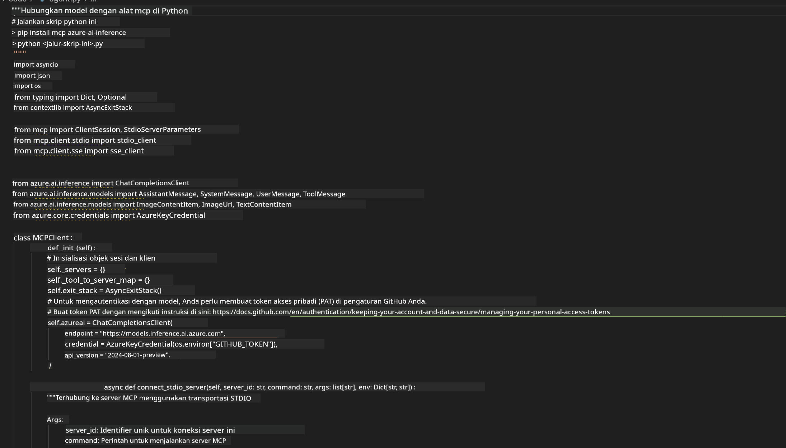

## 🎓 Ringkasan Modul 2 & Langkah Selanjutnya

### 🏆 Pencapaian Terbuka: Master Integrasi MCP

**✅ Keterampilan yang Dikuasai:**
- [ ] Memahami arsitektur dan manfaat MCP  
- [ ] Menavigasi ekosistem server MCP Microsoft  
- [ ] Mengintegrasikan Playwright MCP dengan AI Toolkit  
- [ ] Membangun agen otomatisasi browser yang canggih  
- [ ] Rekayasa prompt lanjutan untuk otomatisasi web  

### 📚 Sumber Daya Tambahan

- **🔗 Spesifikasi MCP**: [Dokumentasi Protokol Resmi](https://modelcontextprotocol.io/)  
- **🛠️ Playwright API**: [Referensi Metode Lengkap](https://playwright.dev/docs/api/class-playwright)  
- **🏢 Server MCP Microsoft**: [Panduan Integrasi Enterprise](https://github.com/microsoft/mcp-servers)  
- **🌍 Contoh Komunitas**: [Galeri Server MCP](https://github.com/modelcontextprotocol/servers)  

**🎉 Selamat!** Anda telah berhasil menguasai integrasi MCP dan kini dapat membangun agen AI siap produksi dengan kemampuan alat eksternal!

### 🔜 Lanjut ke Modul Berikutnya

Siap meningkatkan keterampilan MCP Anda? Lanjutkan ke **[Modul 3: Pengembangan MCP Lanjutan dengan AI Toolkit](../lab3/README.md)** di mana Anda akan belajar cara:  
- Membuat server MCP kustom Anda sendiri  
- Mengonfigurasi dan menggunakan SDK MCP Python terbaru  
- Menyiapkan MCP Inspector untuk debugging  
- Menguasai alur kerja pengembangan server MCP lanjutan
- Membangun Server Weather MCP dari nol

**Penafian**:  
Dokumen ini telah diterjemahkan menggunakan layanan terjemahan AI [Co-op Translator](https://github.com/Azure/co-op-translator). Meskipun kami berupaya untuk mencapai akurasi, harap diingat bahwa terjemahan otomatis mungkin mengandung kesalahan atau ketidakakuratan. Dokumen asli dalam bahasa aslinya harus dianggap sebagai sumber yang sahih. Untuk informasi penting, disarankan menggunakan terjemahan profesional oleh manusia. Kami tidak bertanggung jawab atas kesalahpahaman atau penafsiran yang keliru yang timbul dari penggunaan terjemahan ini.