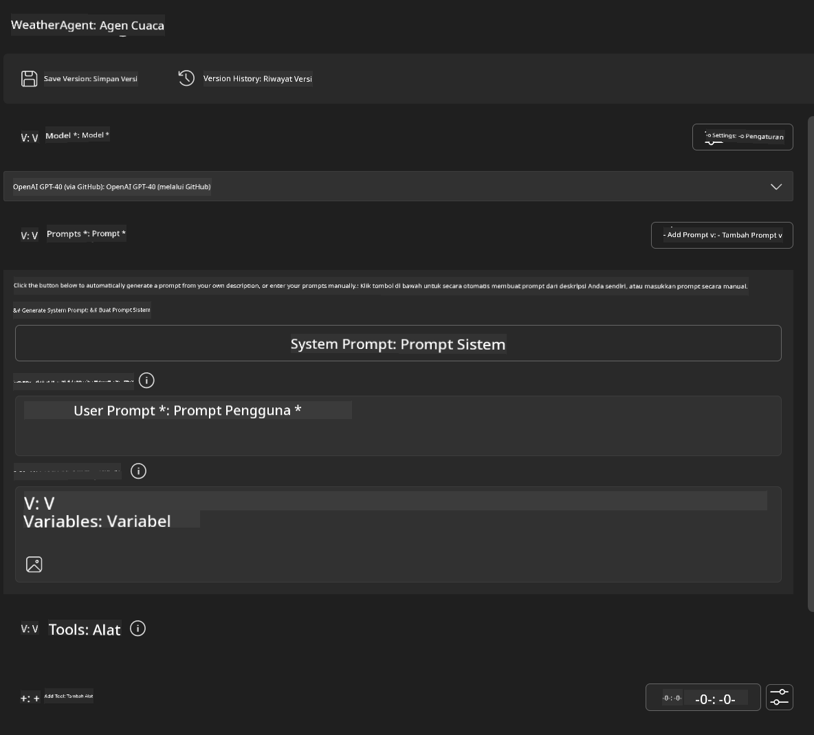
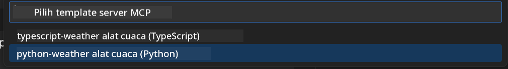
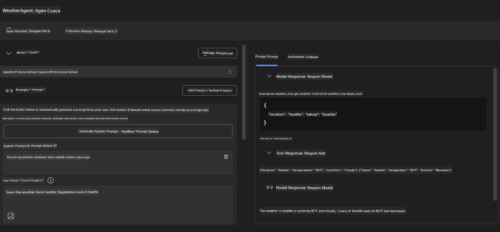
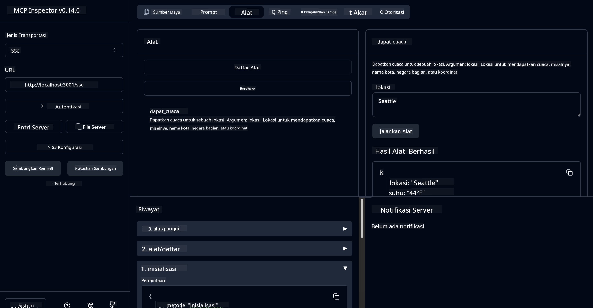

<!--
CO_OP_TRANSLATOR_METADATA:
{
  "original_hash": "dd8da3f75addcef453fe11f02a270217",
  "translation_date": "2025-06-10T06:15:58+00:00",
  "source_file": "10-StreamliningAIWorkflowsBuildingAnMCPServerWithAIToolkit/lab3/README.md",
  "language_code": "id"
}
-->
# 🔧 Modul 3: Pengembangan MCP Lanjutan dengan AI Toolkit

  
  
  
  
  

## 🎯 Tujuan Pembelajaran

Di akhir lab ini, kamu akan bisa:

- ✅ Membuat server MCP kustom menggunakan AI Toolkit  
- ✅ Mengonfigurasi dan menggunakan MCP Python SDK terbaru (v1.9.3)  
- ✅ Menyiapkan dan memanfaatkan MCP Inspector untuk debugging  
- ✅ Melakukan debugging server MCP di lingkungan Agent Builder dan Inspector  
- ✅ Memahami alur kerja pengembangan server MCP tingkat lanjut  

## 📋 Prasyarat

- Menyelesaikan Lab 2 (Dasar MCP)  
- VS Code dengan ekstensi AI Toolkit terpasang  
- Lingkungan Python 3.10+  
- Node.js dan npm untuk pengaturan Inspector  

## 🏗️ Apa yang Akan Kamu Bangun

Dalam lab ini, kamu akan membuat **Weather MCP Server** yang menunjukkan:  
- Implementasi server MCP kustom  
- Integrasi dengan AI Toolkit Agent Builder  
- Alur kerja debugging profesional  
- Pola penggunaan MCP SDK modern  

---

## 🔧 Gambaran Komponen Utama

### 🐍 MCP Python SDK  
Model Context Protocol Python SDK menyediakan dasar untuk membangun server MCP kustom. Kamu akan menggunakan versi 1.9.3 dengan kemampuan debugging yang ditingkatkan.  

### 🔍 MCP Inspector  
Alat debugging yang kuat yang menyediakan:  
- Pemantauan server secara real-time  
- Visualisasi eksekusi alat  
- Inspeksi permintaan/respon jaringan  
- Lingkungan pengujian interaktif  

---

## 📖 Implementasi Langkah demi Langkah

### Langkah 1: Buat WeatherAgent di Agent Builder

1. **Buka Agent Builder** di VS Code melalui ekstensi AI Toolkit  
2. **Buat agen baru** dengan konfigurasi berikut:  
   - Nama Agen: `WeatherAgent`  

  

### Langkah 2: Inisialisasi Proyek Server MCP

1. **Pergi ke Tools** → **Add Tool** di Agent Builder  
2. **Pilih "MCP Server"** dari opsi yang tersedia  
3. **Pilih "Create A new MCP Server"**  
4. **Pilih template `python-weather`**  
5. **Beri nama server kamu:** `weather_mcp`  

  

### Langkah 3: Buka dan Periksa Proyek

1. **Buka proyek yang telah dibuat** di VS Code  
2. **Tinjau struktur proyek:**  
   ```
   weather_mcp/
   ├── src/
   │   ├── __init__.py
   │   └── server.py
   ├── inspector/
   │   ├── package.json
   │   └── package-lock.json
   ├── .vscode/
   │   ├── launch.json
   │   └── tasks.json
   ├── pyproject.toml
   └── README.md
   ```  

### Langkah 4: Upgrade ke MCP SDK Terbaru

> **🔍 Kenapa Upgrade?** Kita ingin menggunakan MCP SDK terbaru (v1.9.3) dan layanan Inspector (0.14.0) untuk fitur yang lebih baik dan kemampuan debugging yang lebih canggih.  

#### 4a. Perbarui Dependensi Python

**Edit `pyproject.toml`:** update [./code/weather_mcp/pyproject.toml](../../../../10-StreamliningAIWorkflowsBuildingAnMCPServerWithAIToolkit/lab3/code/weather_mcp/pyproject.toml)


#### 4b. Update Inspector Configuration

**Edit `inspector/package.json`:** update [./code/weather_mcp/inspector/package.json](../../../../10-StreamliningAIWorkflowsBuildingAnMCPServerWithAIToolkit/lab3/code/weather_mcp/inspector/package.json)

#### 4c. Update Inspector Dependencies

**Edit `inspector/package-lock.json`:** update [./code/weather_mcp/inspector/package-lock.json](../../../../10-StreamliningAIWorkflowsBuildingAnMCPServerWithAIToolkit/lab3/code/weather_mcp/inspector/package-lock.json)

> **📝 Note:** This file contains extensive dependency definitions. Below is the essential structure - the full content ensures proper dependency resolution.


> **⚡ Full Package Lock:** The complete package-lock.json contains ~3000 lines of dependency definitions. The above shows the key structure - use the provided file for complete dependency resolution.

### Step 5: Configure VS Code Debugging

*Note: Please copy the file in the specified path to replace the corresponding local file*

#### 5a. Update Launch Configuration

**Edit `.vscode/launch.json`:**  

```json
{
  "version": "0.2.0",
  "configurations": [
    {
      "name": "Attach to Local MCP",
      "type": "debugpy",
      "request": "attach",
      "connect": {
        "host": "localhost",
        "port": 5678
      },
      "presentation": {
        "hidden": true
      },
      "internalConsoleOptions": "neverOpen",
      "postDebugTask": "Terminate All Tasks"
    },
    {
      "name": "Launch Inspector (Edge)",
      "type": "msedge",
      "request": "launch",
      "url": "http://localhost:6274?timeout=60000&serverUrl=http://localhost:3001/sse#tools",
      "cascadeTerminateToConfigurations": [
        "Attach to Local MCP"
      ],
      "presentation": {
        "hidden": true
      },
      "internalConsoleOptions": "neverOpen"
    },
    {
      "name": "Launch Inspector (Chrome)",
      "type": "chrome",
      "request": "launch",
      "url": "http://localhost:6274?timeout=60000&serverUrl=http://localhost:3001/sse#tools",
      "cascadeTerminateToConfigurations": [
        "Attach to Local MCP"
      ],
      "presentation": {
        "hidden": true
      },
      "internalConsoleOptions": "neverOpen"
    }
  ],
  "compounds": [
    {
      "name": "Debug in Agent Builder",
      "configurations": [
        "Attach to Local MCP"
      ],
      "preLaunchTask": "Open Agent Builder",
    },
    {
      "name": "Debug in Inspector (Edge)",
      "configurations": [
        "Launch Inspector (Edge)",
        "Attach to Local MCP"
      ],
      "preLaunchTask": "Start MCP Inspector",
      "stopAll": true
    },
    {
      "name": "Debug in Inspector (Chrome)",
      "configurations": [
        "Launch Inspector (Chrome)",
        "Attach to Local MCP"
      ],
      "preLaunchTask": "Start MCP Inspector",
      "stopAll": true
    }
  ]
}
```  

**Edit `.vscode/tasks.json`:**  

```
{
  "version": "2.0.0",
  "tasks": [
    {
      "label": "Start MCP Server",
      "type": "shell",
      "command": "python -m debugpy --listen 127.0.0.1:5678 src/__init__.py sse",
      "isBackground": true,
      "options": {
        "cwd": "${workspaceFolder}",
        "env": {
          "PORT": "3001"
        }
      },
      "problemMatcher": {
        "pattern": [
          {
            "regexp": "^.*$",
            "file": 0,
            "location": 1,
            "message": 2
          }
        ],
        "background": {
          "activeOnStart": true,
          "beginsPattern": ".*",
          "endsPattern": "Application startup complete|running"
        }
      }
    },
    {
      "label": "Start MCP Inspector",
      "type": "shell",
      "command": "npm run dev:inspector",
      "isBackground": true,
      "options": {
        "cwd": "${workspaceFolder}/inspector",
        "env": {
          "CLIENT_PORT": "6274",
          "SERVER_PORT": "6277",
        }
      },
      "problemMatcher": {
        "pattern": [
          {
            "regexp": "^.*$",
            "file": 0,
            "location": 1,
            "message": 2
          }
        ],
        "background": {
          "activeOnStart": true,
          "beginsPattern": "Starting MCP inspector",
          "endsPattern": "Proxy server listening on port"
        }
      },
      "dependsOn": [
        "Start MCP Server"
      ]
    },
    {
      "label": "Open Agent Builder",
      "type": "shell",
      "command": "echo ${input:openAgentBuilder}",
      "presentation": {
        "reveal": "never"
      },
      "dependsOn": [
        "Start MCP Server"
      ],
    },
    {
      "label": "Terminate All Tasks",
      "command": "echo ${input:terminate}",
      "type": "shell",
      "problemMatcher": []
    }
  ],
  "inputs": [
    {
      "id": "openAgentBuilder",
      "type": "command",
      "command": "ai-mlstudio.agentBuilder",
      "args": {
        "initialMCPs": [ "local-server-weather_mcp" ],
        "triggeredFrom": "vsc-tasks"
      }
    },
    {
      "id": "terminate",
      "type": "command",
      "command": "workbench.action.tasks.terminate",
      "args": "terminateAll"
    }
  ]
}
```  


---

## 🚀 Menjalankan dan Menguji Server MCP Kamu

### Langkah 6: Instal Dependensi

Setelah melakukan perubahan konfigurasi, jalankan perintah berikut:  

**Instal dependensi Python:**  
```bash
uv sync
```  

**Instal dependensi Inspector:**  
```bash
cd inspector
npm install
```  

### Langkah 7: Debug dengan Agent Builder

1. **Tekan F5** atau gunakan konfigurasi **"Debug in Agent Builder"**  
2. **Pilih konfigurasi compound** dari panel debug  
3. **Tunggu server berjalan** dan Agent Builder terbuka  
4. **Uji server weather MCP kamu** dengan pertanyaan dalam bahasa alami  

Masukkan prompt seperti ini  

SYSTEM_PROMPT  

```
You are my weather assistant
```  

USER_PROMPT  

```
How's the weather like in Seattle
```  

  

### Langkah 8: Debug dengan MCP Inspector

1. **Gunakan konfigurasi "Debug in Inspector"** (Edge atau Chrome)  
2. **Buka antarmuka Inspector** di `http://localhost:6274`  
3. **Jelajahi lingkungan pengujian interaktif:**  
   - Lihat alat yang tersedia  
   - Uji eksekusi alat  
   - Pantau permintaan jaringan  
   - Debug respon server  

  

---

## 🎯 Hasil Pembelajaran Utama

Dengan menyelesaikan lab ini, kamu telah:

- [x] **Membuat server MCP kustom** menggunakan template AI Toolkit  
- [x] **Meng-upgrade ke MCP SDK terbaru** (v1.9.3) untuk fungsi yang lebih baik  
- [x] **Mengonfigurasi alur kerja debugging profesional** untuk Agent Builder dan Inspector  
- [x] **Menyiapkan MCP Inspector** untuk pengujian server interaktif  
- [x] **Menguasai konfigurasi debugging VS Code** untuk pengembangan MCP  

## 🔧 Fitur Lanjutan yang Dieksplorasi

| Fitur | Deskripsi | Kasus Penggunaan |  
|---------|-------------|----------|  
| **MCP Python SDK v1.9.3** | Implementasi protokol terbaru | Pengembangan server modern |  
| **MCP Inspector 0.14.0** | Alat debugging interaktif | Pengujian server real-time |  
| **VS Code Debugging** | Lingkungan pengembangan terintegrasi | Alur kerja debugging profesional |  
| **Integrasi Agent Builder** | Koneksi langsung dengan AI Toolkit | Pengujian agen end-to-end |  

## 📚 Sumber Tambahan

- [MCP Python SDK Documentation](https://modelcontextprotocol.io/docs/sdk/python)  
- [AI Toolkit Extension Guide](https://code.visualstudio.com/docs/ai/ai-toolkit)  
- [VS Code Debugging Documentation](https://code.visualstudio.com/docs/editor/debugging)  
- [Model Context Protocol Specification](https://modelcontextprotocol.io/docs/concepts/architecture)  

---

**🎉 Selamat!** Kamu telah berhasil menyelesaikan Lab 3 dan sekarang dapat membuat, debug, dan menerapkan server MCP kustom menggunakan alur kerja pengembangan profesional.  

### 🔜 Lanjut ke Modul Berikutnya

Siap menerapkan keterampilan MCP kamu ke alur kerja pengembangan nyata? Lanjutkan ke **[Modul 4: Pengembangan MCP Praktis - Server Klon GitHub Kustom](../lab4/README.md)** di mana kamu akan:  
- Membangun server MCP siap produksi yang mengotomatisasi operasi repositori GitHub  
- Mengimplementasikan fungsi kloning repositori GitHub lewat MCP  
- Mengintegrasikan server MCP kustom dengan VS Code dan GitHub Copilot Agent Mode  
- Menguji dan menerapkan server MCP kustom di lingkungan produksi  
- Mempelajari otomatisasi alur kerja praktis untuk pengembang

**Penafian**:  
Dokumen ini telah diterjemahkan menggunakan layanan terjemahan AI [Co-op Translator](https://github.com/Azure/co-op-translator). Meskipun kami berusaha untuk akurasi, harap diingat bahwa terjemahan otomatis mungkin mengandung kesalahan atau ketidakakuratan. Dokumen asli dalam bahasa aslinya harus dianggap sebagai sumber yang otoritatif. Untuk informasi penting, disarankan menggunakan terjemahan manusia profesional. Kami tidak bertanggung jawab atas kesalahpahaman atau salah tafsir yang timbul dari penggunaan terjemahan ini.