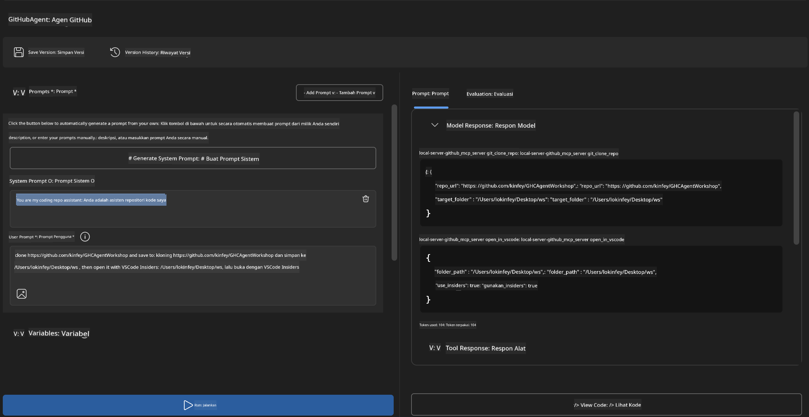
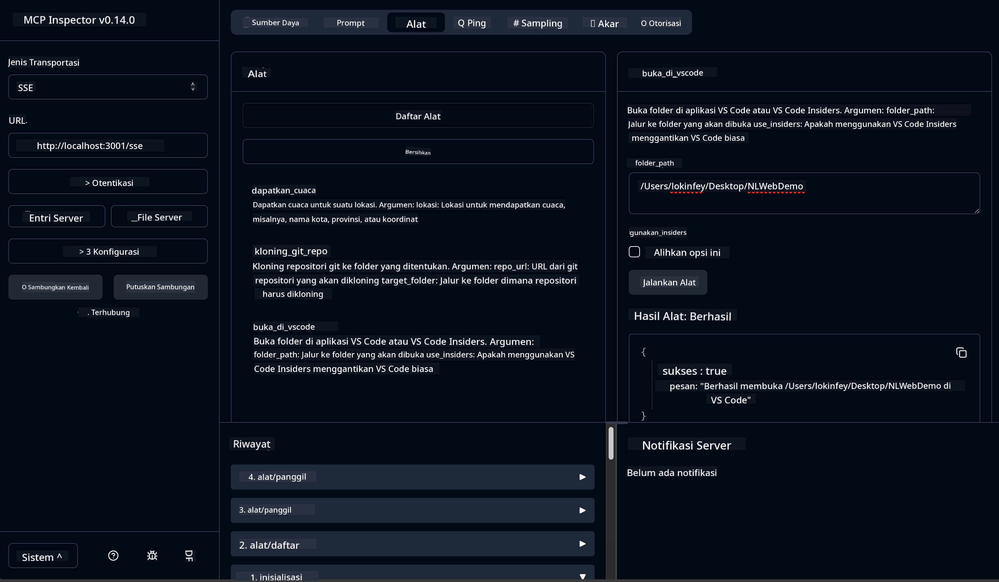

<!--
CO_OP_TRANSLATOR_METADATA:
{
  "original_hash": "f83bc722dc758efffd68667d6a1db470",
  "translation_date": "2025-07-14T08:45:05+00:00",
  "source_file": "10-StreamliningAIWorkflowsBuildingAnMCPServerWithAIToolkit/lab4/README.md",
  "language_code": "id"
}
-->
# 🐙 Modul 4: Pengembangan MCP Praktis - Server Kloning GitHub Kustom


> **⚡ Mulai Cepat:** Bangun server MCP siap produksi yang mengotomatisasi kloning repositori GitHub dan integrasi VS Code hanya dalam 30 menit!

## 🎯 Tujuan Pembelajaran

Di akhir lab ini, Anda akan mampu:

- ✅ Membuat server MCP kustom untuk alur kerja pengembangan dunia nyata
- ✅ Mengimplementasikan fungsi kloning repositori GitHub melalui MCP
- ✅ Mengintegrasikan server MCP kustom dengan VS Code dan Agent Builder
- ✅ Menggunakan GitHub Copilot Agent Mode dengan alat MCP kustom
- ✅ Menguji dan menerapkan server MCP kustom di lingkungan produksi

## 📋 Prasyarat

- Menyelesaikan Lab 1-3 (fundamental MCP dan pengembangan lanjutan)
- Langganan GitHub Copilot ([pendaftaran gratis tersedia](https://github.com/github-copilot/signup))
- VS Code dengan ekstensi AI Toolkit dan GitHub Copilot
- Git CLI terpasang dan terkonfigurasi

## 🏗️ Gambaran Proyek

### **Tantangan Pengembangan Dunia Nyata**
Sebagai pengembang, kita sering menggunakan GitHub untuk mengkloning repositori dan membukanya di VS Code atau VS Code Insiders. Proses manual ini meliputi:
1. Membuka terminal/command prompt
2. Menavigasi ke direktori yang diinginkan
3. Menjalankan perintah `git clone`
4. Membuka VS Code di direktori hasil kloning

**Solusi MCP kami menyederhanakan ini menjadi satu perintah cerdas!**

### **Apa yang Akan Anda Bangun**
Sebuah **GitHub Clone MCP Server** (`git_mcp_server`) yang menyediakan:

| Fitur | Deskripsi | Manfaat |
|---------|-------------|---------|
| 🔄 **Kloning Repositori Pintar** | Kloning repositori GitHub dengan validasi | Pemeriksaan kesalahan otomatis |
| 📁 **Manajemen Direktori Cerdas** | Memeriksa dan membuat direktori dengan aman | Mencegah penimpaan data |
| 🚀 **Integrasi VS Code Lintas Platform** | Membuka proyek di VS Code/Insiders | Transisi alur kerja yang mulus |
| 🛡️ **Penanganan Kesalahan Tangguh** | Menangani masalah jaringan, izin, dan jalur | Keandalan siap produksi |

---

## 📖 Implementasi Langkah demi Langkah

### Langkah 1: Buat GitHub Agent di Agent Builder

1. **Buka Agent Builder** melalui ekstensi AI Toolkit
2. **Buat agent baru** dengan konfigurasi berikut:
   ```
   Agent Name: GitHubAgent
   ```

3. **Inisialisasi server MCP kustom:**
   - Pergi ke **Tools** → **Add Tool** → **MCP Server**
   - Pilih **"Create A new MCP Server"**
   - Pilih **template Python** untuk fleksibilitas maksimal
   - **Nama Server:** `git_mcp_server`

### Langkah 2: Konfigurasikan GitHub Copilot Agent Mode

1. **Buka GitHub Copilot** di VS Code (Ctrl/Cmd + Shift + P → "GitHub Copilot: Open")
2. **Pilih Model Agent** di antarmuka Copilot
3. **Pilih model Claude 3.7** untuk kemampuan penalaran yang lebih baik
4. **Aktifkan integrasi MCP** untuk akses alat

> **💡 Tips Pro:** Claude 3.7 memberikan pemahaman yang lebih baik tentang alur kerja pengembangan dan pola penanganan kesalahan.

### Langkah 3: Implementasikan Fungsi Inti Server MCP

**Gunakan prompt detail berikut dengan GitHub Copilot Agent Mode:**

```
Create two MCP tools with the following comprehensive requirements:

🔧 TOOL A: clone_repository
Requirements:
- Clone any GitHub repository to a specified local folder
- Return the absolute path of the successfully cloned project
- Implement comprehensive validation:
  ✓ Check if target directory already exists (return error if exists)
  ✓ Validate GitHub URL format (https://github.com/user/repo)
  ✓ Verify git command availability (prompt installation if missing)
  ✓ Handle network connectivity issues
  ✓ Provide clear error messages for all failure scenarios

🚀 TOOL B: open_in_vscode
Requirements:
- Open specified folder in VS Code or VS Code Insiders
- Cross-platform compatibility (Windows/Linux/macOS)
- Use direct application launch (not terminal commands)
- Auto-detect available VS Code installations
- Handle cases where VS Code is not installed
- Provide user-friendly error messages

Additional Requirements:
- Follow MCP 1.9.3 best practices
- Include proper type hints and documentation
- Implement logging for debugging purposes
- Add input validation for all parameters
- Include comprehensive error handling
```

### Langkah 4: Uji Server MCP Anda

#### 4a. Uji di Agent Builder

1. **Jalankan konfigurasi debug** untuk Agent Builder
2. **Konfigurasikan agent Anda dengan system prompt ini:**

```
SYSTEM_PROMPT:
You are my intelligent coding repository assistant. You help developers efficiently clone GitHub repositories and set up their development environment. Always provide clear feedback about operations and handle errors gracefully.
```

3. **Uji dengan skenario pengguna realistis:**

```
USER_PROMPT EXAMPLES:

Scenario : Basic Clone and Open
"Clone {Your GitHub Repo link such as https://github.com/kinfey/GHCAgentWorkshop
 } and save to {The global path you specify}, then open it with VS Code Insiders"
```



**Hasil yang Diharapkan:**
- ✅ Kloning berhasil dengan konfirmasi jalur
- ✅ VS Code otomatis terbuka
- ✅ Pesan kesalahan jelas untuk skenario tidak valid
- ✅ Penanganan kasus tepi yang tepat

#### 4b. Uji di MCP Inspector



---

**🎉 Selamat!** Anda telah berhasil membuat server MCP praktis dan siap produksi yang menyelesaikan tantangan alur kerja pengembangan nyata. Server kloning GitHub kustom Anda menunjukkan kekuatan MCP dalam mengotomatisasi dan meningkatkan produktivitas pengembang.

### 🏆 Pencapaian Terbuka:
- ✅ **Pengembang MCP** - Membuat server MCP kustom
- ✅ **Automator Alur Kerja** - Menyederhanakan proses pengembangan  
- ✅ **Ahli Integrasi** - Menghubungkan berbagai alat pengembangan
- ✅ **Siap Produksi** - Membangun solusi yang dapat diterapkan

---

## 🎓 Penyelesaian Workshop: Perjalanan Anda dengan Model Context Protocol

**Peserta Workshop yang Terhormat,**

Selamat telah menyelesaikan keempat modul workshop Model Context Protocol! Anda telah menempuh perjalanan jauh dari memahami konsep dasar AI Toolkit hingga membangun server MCP siap produksi yang menyelesaikan tantangan pengembangan dunia nyata.

### 🚀 Rekap Jalur Pembelajaran Anda:

**[Modul 1](../lab1/README.md)**: Anda memulai dengan mengeksplorasi dasar-dasar AI Toolkit, pengujian model, dan membuat agent AI pertama Anda.

**[Modul 2](../lab2/README.md)**: Anda mempelajari arsitektur MCP, mengintegrasikan Playwright MCP, dan membangun agent otomatisasi browser pertama.

**[Modul 3](../lab3/README.md)**: Anda maju ke pengembangan server MCP kustom dengan Weather MCP server dan menguasai alat debugging.

**[Modul 4](../lab4/README.md)**: Kini Anda menerapkan semuanya untuk membuat alat otomatisasi alur kerja repositori GitHub yang praktis.

### 🌟 Apa yang Telah Anda Kuasai:

- ✅ **Ekosistem AI Toolkit**: Model, agent, dan pola integrasi
- ✅ **Arsitektur MCP**: Desain client-server, protokol transport, dan keamanan
- ✅ **Alat Pengembang**: Dari Playground ke Inspector hingga penerapan produksi
- ✅ **Pengembangan Kustom**: Membangun, menguji, dan menerapkan server MCP sendiri
- ✅ **Aplikasi Praktis**: Menyelesaikan tantangan alur kerja nyata dengan AI

### 🔮 Langkah Selanjutnya:

1. **Bangun Server MCP Anda Sendiri**: Terapkan keterampilan ini untuk mengotomatisasi alur kerja unik Anda
2. **Bergabung dengan Komunitas MCP**: Bagikan karya Anda dan belajar dari yang lain
3. **Jelajahi Integrasi Lanjutan**: Hubungkan server MCP ke sistem perusahaan
4. **Kontribusi ke Open Source**: Bantu tingkatkan alat dan dokumentasi MCP

Ingat, workshop ini baru permulaan. Ekosistem Model Context Protocol berkembang pesat, dan Anda kini siap berada di garis depan alat pengembangan berbasis AI.

**Terima kasih atas partisipasi dan semangat belajar Anda!**

Kami berharap workshop ini memicu ide-ide yang akan mengubah cara Anda membangun dan berinteraksi dengan alat AI dalam perjalanan pengembangan Anda.

**Selamat berkoding!**

---

**Penafian**:  
Dokumen ini telah diterjemahkan menggunakan layanan terjemahan AI [Co-op Translator](https://github.com/Azure/co-op-translator). Meskipun kami berupaya untuk mencapai akurasi, harap diperhatikan bahwa terjemahan otomatis mungkin mengandung kesalahan atau ketidakakuratan. Dokumen asli dalam bahasa aslinya harus dianggap sebagai sumber yang sahih. Untuk informasi penting, disarankan menggunakan terjemahan profesional oleh manusia. Kami tidak bertanggung jawab atas kesalahpahaman atau penafsiran yang keliru yang timbul dari penggunaan terjemahan ini.