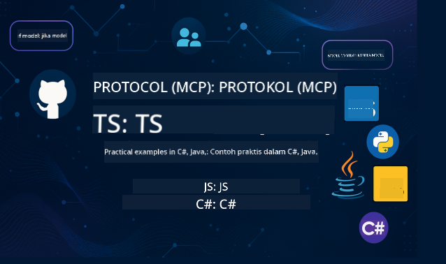

<!--
CO_OP_TRANSLATOR_METADATA:
{
  "original_hash": "866c8877136cb03e1efb9ad633a2f0a6",
  "translation_date": "2025-08-26T18:02:28+00:00",
  "source_file": "README.md",
  "language_code": "id"
}
-->
 

Ikuti langkah-langkah berikut untuk mulai menggunakan sumber daya ini:
1. **Fork Repositori**: Klik 
2. **Clone Repositori**:   `git clone https://github.com/microsoft/mcp-for-beginners.git`
3. [**Bergabunglah dengan Azure AI Foundry Discord dan temui para ahli serta pengembang lainnya**](https://discord.com/invite/ByRwuEEgH4)

### 🌐 Dukungan Multi-Bahasa

#### Didukung melalui GitHub Action (Otomatis & Selalu Terbaru)

 [Arabic](../ar/README.md) | [Bengali](../bn/README.md) | [Bulgarian](../bg/README.md) | [Burmese (Myanmar)](../my/README.md) | [Chinese (Simplified)](../zh/README.md) | [Chinese (Traditional, Hong Kong)](../hk/README.md) | [Chinese (Traditional, Macau)](../mo/README.md) | [Chinese (Traditional, Taiwan)](../tw/README.md) | [Croatian](../hr/README.md) | [Czech](../cs/README.md) | [Danish](../da/README.md) | [Dutch](../nl/README.md) | [Finnish](../fi/README.md) | [French](../fr/README.md) | [German](../de/README.md) | [Greek](../el/README.md) | [Hebrew](../he/README.md) | [Hindi](../hi/README.md) | [Hungarian](../hu/README.md) | [Indonesian](./README.md) | [Italian](../it/README.md) | [Japanese](../ja/README.md) | [Korean](../ko/README.md) | [Malay](../ms/README.md) | [Marathi](../mr/README.md) | [Nepali](../ne/README.md) | [Norwegian](../no/README.md) | [Persian (Farsi)](../fa/README.md) | [Polish](../pl/README.md) | [Portuguese (Brazil)](../br/README.md) | [Portuguese (Portugal)](../pt/README.md) | [Punjabi (Gurmukhi)](../pa/README.md) | [Romanian](../ro/README.md) | [Russian](../ru/README.md) | [Serbian (Cyrillic)](../sr/README.md) | [Slovak](../sk/README.md) | [Slovenian](../sl/README.md) | [Spanish](../es/README.md) | [Swahili](../sw/README.md) | [Swedish](../sv/README.md) | [Tagalog (Filipino)](../tl/README.md) | [Thai](../th/README.md) | [Turkish](../tr/README.md) | [Ukrainian](../uk/README.md) | [Urdu](../ur/README.md) | [Vietnamese](../vi/README.md)

# 🚀 Kurikulum Model Context Protocol (MCP) untuk Pemula

## **Pelajari MCP dengan Contoh Kode Praktis dalam C#, Java, JavaScript, Rust, Python, dan TypeScript**

## 🧠 Gambaran Umum Kurikulum Model Context Protocol

**Model Context Protocol (MCP)** adalah kerangka kerja mutakhir yang dirancang untuk menstandarisasi interaksi antara model AI dan aplikasi klien. Kurikulum open-source ini menawarkan jalur pembelajaran terstruktur, lengkap dengan contoh kode praktis dan kasus penggunaan dunia nyata, dalam berbagai bahasa pemrograman populer seperti C#, Java, JavaScript, TypeScript, dan Python.

Apakah Anda seorang pengembang AI, arsitek sistem, atau insinyur perangkat lunak, panduan ini adalah sumber daya komprehensif Anda untuk menguasai dasar-dasar MCP dan strategi implementasinya.

## 🔗 Sumber Daya Resmi MCP

- 📘 [Dokumentasi MCP](https://modelcontextprotocol.io/) – Tutorial dan panduan pengguna yang mendetail  
- 📜 [Spesifikasi MCP](https://modelcontextprotocol.io/docs/) – Arsitektur protokol dan referensi teknis  
- 📜 [Spesifikasi MCP Asli](https://spec.modelcontextprotocol.io/) – Referensi teknis lama (mungkin berisi detail tambahan)  
- 🧑‍💻 [Repositori GitHub MCP](https://github.com/modelcontextprotocol) – SDK open-source, alat, dan contoh kode
- 🌐 [Komunitas MCP](https://github.com/orgs/modelcontextprotocol/discussions) – Bergabunglah dalam diskusi dan berkontribusi pada komunitas

## 🧭 Gambaran Umum Kurikulum MCP

### 📚 Struktur Kurikulum Lengkap

| Modul | Topik | Deskripsi | Tautan |
|-------|-------|-----------|--------|
| **Modul 1-3: Dasar-Dasar** | | | |
| 00 | Pengantar MCP | Gambaran umum Model Context Protocol dan pentingnya dalam pipeline AI | [Baca lebih lanjut](./00-Introduction/README.md) |
| 01 | Penjelasan Konsep Inti | Eksplorasi mendalam tentang konsep inti MCP | [Baca lebih lanjut](./01-CoreConcepts/README.md) |
| 02 | Keamanan dalam MCP | Ancaman keamanan dan praktik terbaik | [Baca lebih lanjut](./02-Security/README.md) |
| 03 | Memulai dengan MCP | Pengaturan lingkungan, server/klien dasar, integrasi | [Baca lebih lanjut](./03-GettingStarted/README.md) |
| **Modul 3: Membangun Server & Klien Pertama Anda** | | | |
| 3.1 | Server Pertama | Buat server MCP pertama Anda | [Panduan](./03-GettingStarted/01-first-server/README.md) |
| 3.2 | Klien Pertama | Kembangkan klien MCP dasar | [Panduan](./03-GettingStarted/02-client/README.md) |
| 3.3 | Klien dengan LLM | Integrasikan model bahasa besar | [Panduan](./03-GettingStarted/03-llm-client/README.md) |
| 3.4 | Integrasi VS Code | Konsumsi server MCP di VS Code | [Panduan](./03-GettingStarted/04-vscode/README.md) |
| 3.5 | Server stdio | Buat server menggunakan transportasi stdio | [Panduan](./03-GettingStarted/05-stdio-server/README.md) |
| 3.6 | Streaming HTTP | Implementasikan streaming HTTP dalam MCP | [Panduan](./03-GettingStarted/06-http-streaming/README.md) |
| 3.7 | AI Toolkit | Gunakan AI Toolkit dengan MCP | [Panduan](./03-GettingStarted/07-aitk/README.md) |
| 3.8 | Pengujian | Uji implementasi server MCP Anda | [Panduan](./03-GettingStarted/08-testing/README.md) |
| 3.9 | Deployment | Deploy server MCP ke produksi | [Panduan](./03-GettingStarted/09-deployment/README.md) |
| **Modul 4-5: Praktis & Lanjutan** | | | |
| 04 | Implementasi Praktis | SDK, debugging, pengujian, template prompt yang dapat digunakan kembali | [Baca lebih lanjut](./04-PracticalImplementation/README.md) |
| 05 | Topik Lanjutan dalam MCP | AI multi-modal, skala besar, penggunaan perusahaan | [Baca lebih lanjut](./05-AdvancedTopics/README.md) |
| 5.1 | Integrasi Azure | Integrasi MCP dengan Azure | [Panduan](./05-AdvancedTopics/mcp-integration/README.md) |
| 5.2 | Multi-modalitas | Bekerja dengan berbagai modalitas | [Panduan](./05-AdvancedTopics/mcp-multi-modality/README.md) |
| 5.3 | Demo OAuth2 | Implementasikan autentikasi OAuth2 | [Panduan](./05-AdvancedTopics/mcp-oauth2-demo/README.md) |
| 5.4 | Root Contexts | Pahami dan implementasikan root contexts | [Panduan](./05-AdvancedTopics/mcp-root-contexts/README.md) |
| 5.5 | Routing | Strategi routing MCP | [Panduan](./05-AdvancedTopics/mcp-routing/README.md) |
| 5.6 | Sampling | Teknik sampling dalam MCP | [Panduan](./05-AdvancedTopics/mcp-sampling/README.md) |
| 5.7 | Scaling | Skala implementasi MCP | [Panduan](./05-AdvancedTopics/mcp-scaling/README.md) |
| 5.8 | Keamanan | Pertimbangan keamanan lanjutan | [Panduan](./05-AdvancedTopics/mcp-security/README.md) |
| 5.9 | Pencarian Web | Implementasikan kemampuan pencarian web | [Panduan](./05-AdvancedTopics/web-search-mcp/README.md) |
| 5.10 | Streaming Realtime | Bangun fungsionalitas streaming realtime | [Panduan](./05-AdvancedTopics/mcp-realtimestreaming/README.md) |
| 5.11 | Pencarian Realtime | Implementasikan pencarian realtime | [Panduan](./05-AdvancedTopics/mcp-realtimesearch/README.md) |
| 5.12 | Autentikasi Entra ID | Autentikasi dengan Microsoft Entra ID | [Panduan](./05-AdvancedTopics/mcp-security-entra/README.md) |
| 5.13 | Integrasi Foundry | Integrasi dengan Azure AI Foundry | [Panduan](./05-AdvancedTopics/mcp-foundry-agent-integration/README.md) |
| 5.14 | Rekayasa Konteks | Teknik untuk rekayasa konteks yang efektif | [Panduan](./05-AdvancedTopics/mcp-contextengineering/README.md) |
| **Modul 6-10: Komunitas & Praktik Terbaik** | | | |
| 06 | Kontribusi Komunitas | Cara berkontribusi pada ekosistem MCP | [Panduan](./06-CommunityContributions/README.md) |
| 07 | Wawasan dari Adopsi Awal | Cerita implementasi dunia nyata | [Panduan](./07-LessonsFromEarlyAdoption/README.md) |
| 08 | Praktik Terbaik untuk MCP | Performa, toleransi kesalahan, ketahanan | [Panduan](./08-BestPractices/README.md) |
| 09 | Studi Kasus MCP | Contoh implementasi praktis | [Panduan](./09-CaseStudy/README.md) |
| 10 | Lokakarya Praktis | Membangun Server MCP dengan AI Toolkit | [Lab](./10-StreamliningAIWorkflowsBuildingAnMCPServerWithAIToolkit/README.md) |

### 💻 Proyek Contoh Kode

#### Contoh Kalkulator MCP Dasar

| Bahasa | Deskripsi | Tautan |
|--------|-----------|--------|
| C# | Contoh Server MCP | [Lihat Kode](./03-GettingStarted/samples/csharp/README.md) |
| Java | Kalkulator MCP | [Lihat Kode](./03-GettingStarted/samples/java/calculator/README.md) |
| JavaScript | Demo MCP | [Lihat Kode](./03-GettingStarted/samples/javascript/README.md) |
| Python | Server MCP | [Lihat Kode](../../03-GettingStarted/samples/python/mcp_calculator_server.py) |
| TypeScript | Contoh MCP | [Lihat Kode](./03-GettingStarted/samples/typescript/README.md) |
| Rust | Contoh MCP | [Lihat Kode](./03-GettingStarted/samples/rust/README.md) |

#### Implementasi MCP Lanjutan

| Bahasa | Deskripsi | Tautan |
|--------|-----------|--------|
| C# | Contoh Lanjutan | [Lihat Kode](./04-PracticalImplementation/samples/csharp/README.md) |
| Java dengan Spring | Contoh Aplikasi Container | [Lihat Kode](./04-PracticalImplementation/samples/java/containerapp/README.md) |
| JavaScript | Contoh Lanjutan | [Lihat Kode](./04-PracticalImplementation/samples/javascript/README.md) |
| Python | Implementasi Kompleks | [Lihat Kode](../../04-PracticalImplementation/samples/python/READMEmd) |
| TypeScript | Contoh Container | [Lihat Kode](./04-PracticalImplementation/samples/typescript/README.md) |

## 🎯 Prasyarat untuk Belajar MCP

Untuk mendapatkan manfaat maksimal dari kurikulum ini, Anda sebaiknya memiliki:

- Pengetahuan dasar pemrograman dalam setidaknya salah satu bahasa berikut: C#, Java, JavaScript, Python, atau TypeScript
- Pemahaman tentang model client-server dan API
- Familiaritas dengan konsep REST dan HTTP
- (Opsional) Latar belakang dalam konsep AI/ML

- Bergabung dalam diskusi komunitas kami untuk mendapatkan dukungan

## 📚 Panduan Belajar & Sumber Daya

Repositori ini mencakup berbagai sumber daya untuk membantu Anda belajar dengan efektif:

### Panduan Belajar

Sebuah [Panduan Belajar](./study_guide.md) yang komprehensif tersedia untuk membantu Anda menavigasi repositori ini dengan baik. Panduan ini mencakup:

- Peta kurikulum visual yang menunjukkan semua topik yang dibahas
- Rincian mendalam dari setiap bagian repositori
- Panduan tentang cara menggunakan proyek sampel
- Jalur pembelajaran yang direkomendasikan untuk berbagai tingkat keahlian
- Sumber daya tambahan untuk melengkapi perjalanan belajar Anda

### Changelog

Kami memelihara [Changelog](./changelog.md) yang mendetail untuk mencatat semua pembaruan signifikan pada materi kurikulum, termasuk:

- Penambahan konten baru
- Perubahan struktur
- Peningkatan fitur
- Pembaruan dokumentasi

## 🛠️ Cara Menggunakan Kurikulum Ini dengan Efektif

Setiap pelajaran dalam panduan ini mencakup:

1. Penjelasan yang jelas tentang konsep MCP  
2. Contoh kode langsung dalam berbagai bahasa  
3. Latihan untuk membangun aplikasi MCP nyata  
4. Sumber daya tambahan untuk pembelajar tingkat lanjut  

## Acara 

### [MCP Dev Days Juli 2025](https://developer.microsoft.com/en-us/reactor/series/S-1563/)
#### [➡️Tonton Sesuai Permintaan - MCP Dev Days](https://developer.microsoft.com/en-us/reactor/series/S-1563/)
Bersiaplah untuk dua hari wawasan teknis mendalam, koneksi komunitas, dan pembelajaran langsung di MCP Dev Days, sebuah acara virtual yang didedikasikan untuk Model Context Protocol (MCP) — standar baru yang menjembatani model AI dan alat yang mereka gunakan.  
Anda dapat menonton MCP Dev Days dengan mendaftar di halaman acara kami: https://aka.ms/mcpdevdays.  

#### [Hari 1: Produktivitas MCP, DevTools, & Komunitas:](https://developer.microsoft.com/en-us/reactor/series/S-1563/)

Berfokus pada memberdayakan pengembang untuk menggunakan MCP dalam alur kerja pengembang mereka dan merayakan komunitas MCP yang luar biasa. Kami akan bergabung dengan anggota komunitas dan mitra seperti Arcade, Block, Okta, dan Neon untuk melihat bagaimana mereka berkolaborasi dengan Microsoft untuk membentuk ekosistem MCP yang terbuka dan dapat diperluas.  
Demo dunia nyata di VS Code, Visual Studio, GitHub Copilot, dan alat komunitas populer  
Alur kerja pengembang berbasis konteks yang praktis  
Sesi dan wawasan yang dipimpin komunitas  
Baik Anda baru memulai dengan MCP atau sudah membangunnya, Hari 1 akan memberikan inspirasi dan langkah-langkah yang dapat diambil.

#### [Hari 2: Bangun Server MCP dengan Percaya Diri](https://developer.microsoft.com/en-us/reactor/series/S-1563/)

Ditujukan untuk pembangun MCP. Kami akan mendalami strategi implementasi dan praktik terbaik untuk membuat server MCP dan mengintegrasikan MCP ke dalam alur kerja AI Anda.

#### Topik meliputi:

- Membangun Server MCP dan mengintegrasikannya ke dalam pengalaman agen
- Pengembangan berbasis prompt
- Praktik terbaik keamanan
- Menggunakan blok bangunan seperti Functions, ACA, dan API Management
- Penyelarasan registri dan alat (1P + 3P)

Jika Anda seorang pengembang, pembuat alat, atau ahli strategi produk AI, hari ini penuh dengan wawasan yang Anda butuhkan untuk membangun solusi MCP yang skalabel, aman, dan siap untuk masa depan.

### MCP Boot Camp Agustus 2025
Pelajari melalui sesi video intensif cara membuat server MCP, mengintegrasikan dengan VS Code, dan menerapkan secara profesional di Azure berdasarkan konten dari kurikulum MCP untuk Pemula. Dapatkan keterampilan praktis dalam teknologi yang sudah digunakan oleh perusahaan besar.

#### [➡️Tonton Sesuai Permintaan MCP Bootcamp | Bahasa Inggris](https://developer.microsoft.com/en-us/reactor/series/s-1568/)
#### [➡️Tonton Sesuai Permintaan MCP Bootcamp | Brasil](https://developer.microsoft.com/en-us/reactor/series/S-1566/)
#### [➡️Tonton Sesuai Permintaan MCP Bootcamp | Spanyol](https://developer.microsoft.com/en-us/reactor/series/S-1567/)

## 🌟 Terima Kasih Komunitas

Terima kasih kepada Microsoft Valued Professional [Shivam Goyal](https://www.linkedin.com/in/shivam2003/) atas kontribusi sampel kode pentingnya.

## 📜 Informasi Lisensi

Konten ini dilisensikan di bawah **MIT License**. Untuk syarat dan ketentuan, lihat [LICENSE](../../LICENSE).

## 🤝 Panduan Kontribusi

Proyek ini menyambut kontribusi dan saran. Sebagian besar kontribusi mengharuskan Anda menyetujui
Perjanjian Lisensi Kontributor (CLA) yang menyatakan bahwa Anda memiliki hak untuk, dan benar-benar memberikan kami
hak untuk menggunakan kontribusi Anda. Untuk detailnya, kunjungi 
<https://cla.opensource.microsoft.com>.

Saat Anda mengirimkan pull request, bot CLA akan secara otomatis menentukan apakah Anda perlu memberikan
CLA dan menghias PR dengan tepat (misalnya, status check, komentar). Cukup ikuti instruksi
yang diberikan oleh bot. Anda hanya perlu melakukannya sekali di semua repositori yang menggunakan CLA kami.

Proyek ini telah mengadopsi [Microsoft Open Source Code of Conduct](https://opensource.microsoft.com/codeofconduct/).
Untuk informasi lebih lanjut, lihat [Code of Conduct FAQ](https://opensource.microsoft.com/codeofconduct/faq/) atau
hubungi [opencode@microsoft.com](mailto:opencode@microsoft.com) untuk pertanyaan atau komentar tambahan.

## 📂 Struktur Repositori

Repositori ini diatur sebagai berikut:

- **Kurikulum Inti (00-10)**: Konten utama yang diatur dalam sepuluh modul berurutan
- **images/**: Diagram dan ilustrasi yang digunakan di seluruh kurikulum
- **translations/**: Dukungan multi-bahasa dengan terjemahan otomatis
- **translated_images/**: Versi lokal dari diagram dan ilustrasi
- **study_guide.md**: Panduan komprehensif untuk menavigasi repositori
- **changelog.md**: Catatan semua perubahan signifikan pada materi kurikulum
- **mcp.json**: File konfigurasi untuk spesifikasi MCP
- **CODE_OF_CONDUCT.md, LICENSE, SECURITY.md, SUPPORT.md**: Dokumen tata kelola proyek

## 🎒 Kursus Lainnya
Tim kami juga memproduksi kursus lainnya! Lihat:

- [AI Agents For Beginners](https://github.com/microsoft/ai-agents-for-beginners?WT.mc_id=academic-105485-koreyst)
- [Generative AI for Beginners using .NET](https://github.com/microsoft/Generative-AI-for-beginners-dotnet?WT.mc_id=academic-105485-koreyst)
- [Generative AI for Beginners using JavaScript](https://github.com/microsoft/generative-ai-with-javascript?WT.mc_id=academic-105485-koreyst)
- [Generative AI for Beginners](https://github.com/microsoft/generative-ai-for-beginners?WT.mc_id=academic-105485-koreyst)
- [Generative AI for Beginners using Java](https://github.com/microsoft/generative-ai-for-beginners-java?WT.mc_id=academic-105485-koreyst)
- [ML for Beginners](https://aka.ms/ml-beginners?WT.mc_id=academic-105485-koreyst)
- [Data Science for Beginners](https://aka.ms/datascience-beginners?WT.mc_id=academic-105485-koreyst)
- [AI for Beginners](https://aka.ms/ai-beginners?WT.mc_id=academic-105485-koreyst)
- [Cybersecurity for Beginners](https://github.com/microsoft/Security-101?WT.mc_id=academic-96948-sayoung)
- [Web Dev for Beginners](https://aka.ms/webdev-beginners?WT.mc_id=academic-105485-koreyst)
- [IoT for Beginners](https://aka.ms/iot-beginners?WT.mc_id=academic-105485-koreyst)
- [XR Development for Beginners](https://github.com/microsoft/xr-development-for-beginners?WT.mc_id=academic-105485-koreyst)
- [Mastering GitHub Copilot for AI Paired Programming](https://aka.ms/GitHubCopilotAI?WT.mc_id=academic-105485-koreyst)
- [Mastering GitHub Copilot for C#/.NET Developers](https://github.com/microsoft/mastering-github-copilot-for-dotnet-csharp-developers?WT.mc_id=academic-105485-koreyst)
- [Choose Your Own Copilot Adventure](https://github.com/microsoft/CopilotAdventures?WT.mc_id=academic-105485-koreyst)

## ™️ Pemberitahuan Merek Dagang

Proyek ini mungkin mengandung merek dagang atau logo untuk proyek, produk, atau layanan. Penggunaan merek dagang atau logo Microsoft yang diizinkan harus tunduk pada dan mengikuti [Panduan Merek & Merek Dagang Microsoft](https://www.microsoft.com/legal/intellectualproperty/trademarks/usage/general).  
Penggunaan merek dagang atau logo Microsoft dalam versi modifikasi dari proyek ini tidak boleh menyebabkan kebingungan atau menyiratkan sponsor Microsoft.  
Setiap penggunaan merek dagang atau logo pihak ketiga tunduk pada kebijakan pihak ketiga tersebut.

---

**Penafian**:  
Dokumen ini telah diterjemahkan menggunakan layanan penerjemahan AI [Co-op Translator](https://github.com/Azure/co-op-translator). Meskipun kami berusaha untuk memberikan hasil yang akurat, harap diperhatikan bahwa terjemahan otomatis mungkin mengandung kesalahan atau ketidakakuratan. Dokumen asli dalam bahasa aslinya harus dianggap sebagai sumber yang otoritatif. Untuk informasi yang bersifat kritis, disarankan menggunakan jasa penerjemahan profesional oleh manusia. Kami tidak bertanggung jawab atas kesalahpahaman atau penafsiran yang timbul dari penggunaan terjemahan ini.