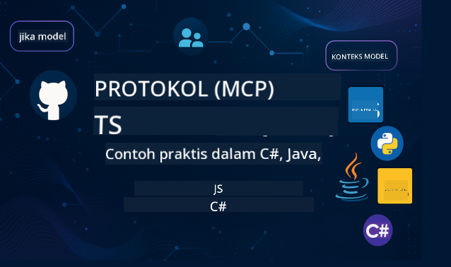

<!--
CO_OP_TRANSLATOR_METADATA:
{
  "original_hash": "2a21391378c12ecfef50f866329dfde0",
  "translation_date": "2025-05-17T05:30:40+00:00",
  "source_file": "README.md",
  "language_code": "id"
}
-->

Ikuti langkah-langkah ini untuk memulai menggunakan sumber daya ini:
1. **Fork Repositori**: Klik 
2. **Clone Repositori**: `git clone https://github.com/microsoft/mcp-for-beginners.git`
3. [**Bergabunglah dengan Microsoft Azure AI Foundry Discord dan temui para ahli serta pengembang lainnya**](https://discord.com/invite/ByRwuEEgH4)

### 🌐 Dukungan Multi-Bahasa

#### Didukung melalui GitHub Action (Otomatis & Selalu Terbaru)
[Prancis](../fr/README.md) | [Spanyol](../es/README.md) | [Jerman](../de/README.md) | [Rusia](../ru/README.md) | [Arab](../ar/README.md) | [Persia (Farsi)](../fa/README.md) | [Urdu](../ur/README.md) | [Cina (Sederhana)](../zh/README.md) | [Cina (Tradisional, Makau)](../mo/README.md) | [Cina (Tradisional, Hong Kong)](../hk/README.md) | [Cina (Tradisional, Taiwan)](../tw/README.md) | [Jepang](../ja/README.md) | [Korea](../ko/README.md) | [Hindi](../hi/README.md) | [Bengali](../bn/README.md) | [Marathi](../mr/README.md) | [Nepali](../ne/README.md) | [Punjabi (Gurmukhi)](../pa/README.md) | [Portugis (Portugal)](../pt/README.md) | [Portugis (Brasil)](../br/README.md) | [Italia](../it/README.md) | [Polandia](../pl/README.md) | [Turki](../tr/README.md) | [Yunani](../el/README.md) | [Thai](../th/README.md) | [Swedia](../sv/README.md) | [Denmark](../da/README.md) | [Norwegia](../no/README.md) | [Finlandia](../fi/README.md) | [Belanda](../nl/README.md) | [Ibrani](../he/README.md) | [Vietnam](../vi/README.md) | [Indonesia](./README.md) | [Melayu](../ms/README.md) | [Tagalog (Filipina)](../tl/README.md) | [Swahili](../sw/README.md) | [Hungaria](../hu/README.md) | [Ceko](../cs/README.md) | [Slovakia](../sk/README.md) | [Rumania](../ro/README.md) | [Bulgaria](../bg/README.md) | [Serbia (Sirilik)](../sr/README.md) | [Kroasia](../hr/README.md) | [Slovenia](../sl/README.md)
# 🚀 Panduan Utama untuk Kurikulum Model Context Protocol (MCP) bagi Pemula

## **Belajar MCP dengan Contoh Kode Praktis dalam C#, Java, JavaScript, Python, dan TypeScript**

## 🧠 Ikhtisar Kurikulum Model Context Protocol

**Model Context Protocol (MCP)** adalah kerangka kerja mutakhir yang dirancang untuk menstandarisasi interaksi antara model AI dan aplikasi klien. Kurikulum sumber terbuka ini menawarkan jalur pembelajaran yang terstruktur, lengkap dengan contoh kode praktis dan kasus penggunaan dunia nyata, dalam bahasa pemrograman populer termasuk C#, Java, JavaScript, TypeScript, dan Python.

Apakah Anda seorang pengembang AI, arsitek sistem, atau insinyur perangkat lunak, panduan ini adalah sumber daya lengkap Anda untuk menguasai dasar-dasar MCP dan strategi implementasinya.

## 🔗 Sumber Daya Resmi MCP

- 📘 [Dokumentasi MCP](https://modelcontextprotocol.io/) – Tutorial dan panduan pengguna yang terperinci  
- 📜 [Spesifikasi MCP](https://spec.modelcontextprotocol.io/) – Arsitektur protokol dan referensi teknis  
- 🧑‍💻 [Repositori GitHub MCP](https://github.com/modelcontextprotocol) – SDK sumber terbuka, alat, dan contoh kode  

## 🧭 Struktur Kurikulum MCP Lengkap

### 📌 [Pengenalan MCP](./00-Introduction/README.md)

- Apa itu Model Context Protocol?
- Mengapa standarisasi penting dalam pipeline AI
- Kasus penggunaan praktis dan manfaat MCP

### 🧩 [Konsep Inti Dijelaskan](./01-CoreConcepts/README.md)

- Memahami arsitektur klien-server dalam MCP
- Komponen protokol utama: permintaan, respons, dan skema
- Pola pesan dan pertukaran data MCP

### 🔐 [Keamanan dalam MCP](./02-Security/readme.md)

- Mengidentifikasi ancaman keamanan dalam sistem berbasis MCP
- Teknik dan praktik terbaik untuk mengamankan implementasi

### 🚀 [Memulai dengan MCP](./03-GettingStarted/README.md)

- Pengaturan dan konfigurasi lingkungan
- Membuat server dan klien MCP dasar
- Mengintegrasikan MCP dengan aplikasi yang ada

#### 🧮 Proyek Contoh Kalkulator MCP:

  
<strong>Jelajahi Implementasi Kode Berdasarkan Bahasa</strong>

  - [Contoh Server MCP C#](./03-GettingStarted/samples/csharp/README.md)
  - [Kalkulator MCP Java](./03-GettingStarted/samples/java/calculator/README.md)
  - [Demo MCP JavaScript](./03-GettingStarted/samples/javascript/README.md)
  - [Server MCP Python](../../03-GettingStarted/samples/python/mcp_calculator_server.py)
  - [Contoh MCP TypeScript](./03-GettingStarted/samples/typescript/README.md)

### 🛠️ [Implementasi Praktis](./04-PracticalImplementation/README.md)

- Menggunakan SDK di berbagai bahasa
- Debugging, pengujian, dan validasi
- Membuat template prompt dan alur kerja yang dapat digunakan kembali

#### 💡 Proyek Kalkulator MCP Lanjutan:

  
<strong>Jelajahi Contoh Lanjutan</strong>

  - [Contoh Lanjutan C#](./04-PracticalImplementation/samples/csharp/README.md)
  - [Contoh Aplikasi Kontainer Java](./04-PracticalImplementation/samples/java/containerapp/README.md)
  - [Contoh Lanjutan JavaScript](./04-PracticalImplementation/samples/javascript/README.md)
  - [Implementasi Kompleks Python](../../04-PracticalImplementation/samples/python/mcp_sample.py)
  - [Contoh Kontainer TypeScript](./04-PracticalImplementation/samples/typescript/README.md)

### 🎓 [Topik Lanjutan dalam MCP](./05-AdvancedTopics/README.md)

- Alur kerja AI multi-modal dan ekstensi
- Strategi skala aman
- MCP dalam ekosistem perusahaan

### 🌍 [Kontribusi Komunitas](./06-CommunityContributions/README.md)

- Cara berkontribusi pada kode dan dokumentasi
- Berkolaborasi melalui GitHub
- Peningkatan dan umpan balik yang didorong oleh komunitas

### 📈 [Wawasan dari Adopsi Awal](./07-CaseStudies/README.md)

- Implementasi dunia nyata dan apa yang berhasil
- Membangun dan menyebarkan solusi berbasis MCP
- Tren dan peta jalan masa depan

### 📏 [Praktik Terbaik untuk MCP](./08-BestPractices/README.md)

- Penyempurnaan dan optimisasi kinerja
- Merancang sistem MCP yang toleran kesalahan
- Strategi pengujian dan ketahanan

### 📊 [Studi Kasus MCP](./09-CaseStudy/Readme.md)

- Pendalaman arsitektur solusi MCP
- Cetak biru penyebaran dan tips integrasi
- Diagram beranotasi dan panduan proyek

## 🎯 Prasyarat untuk Belajar MCP

Untuk mendapatkan manfaat maksimal dari kurikulum ini, Anda sebaiknya memiliki:

- Pengetahuan dasar tentang C#, Java, atau Python
- Pemahaman tentang model klien-server dan API
- (Opsional) Pemahaman tentang konsep pembelajaran mesin

## 🛠️ Cara Menggunakan Kurikulum Ini Secara Efektif

Setiap pelajaran dalam panduan ini mencakup:

1. Penjelasan yang jelas tentang konsep MCP  
2. Contoh kode langsung dalam berbagai bahasa  
3. Latihan untuk membangun aplikasi MCP nyata  
4. Sumber daya tambahan untuk pembelajar lanjutan  

## 📜 Informasi Lisensi

Konten ini dilisensikan di bawah **Lisensi MIT**. Untuk syarat dan ketentuan, lihat [LICENSE](../../LICENSE).

## 🤝 Pedoman Kontribusi

Proyek ini menerima kontribusi dan saran. Sebagian besar kontribusi mengharuskan Anda menyetujui
Perjanjian Lisensi Kontributor (CLA) yang menyatakan bahwa Anda memiliki hak untuk, dan benar-benar memberikan kami
hak untuk menggunakan kontribusi Anda. Untuk detail, kunjungi <https://cla.opensource.microsoft.com>.

Ketika Anda mengajukan pull request, bot CLA akan secara otomatis menentukan apakah Anda perlu memberikan
CLA dan menghias PR dengan tepat (misalnya, pemeriksaan status, komentar). Cukup ikuti instruksi
yang diberikan oleh bot. Anda hanya perlu melakukan ini sekali di semua repositori yang menggunakan CLA kami.

Proyek ini telah mengadopsi [Kode Etik Sumber Terbuka Microsoft](https://opensource.microsoft.com/codeofconduct/).
Untuk informasi lebih lanjut lihat [FAQ Kode Etik](https://opensource.microsoft.com/codeofconduct/faq/) atau
hubungi [opencode@microsoft.com](mailto:opencode@microsoft.com) untuk pertanyaan atau komentar tambahan.

## ™️ Pemberitahuan Merek Dagang

Proyek ini mungkin berisi merek dagang atau logo untuk proyek, produk, atau layanan. Penggunaan merek dagang atau logo Microsoft yang diizinkan tunduk pada dan harus mengikuti
[Pedoman Merek & Merek Dagang Microsoft](https://www.microsoft.com/legal/intellectualproperty/trademarks/usage/general).
Penggunaan merek dagang atau logo Microsoft dalam versi yang dimodifikasi dari proyek ini tidak boleh menimbulkan kebingungan atau menyiratkan sponsor Microsoft.
Setiap penggunaan merek dagang atau logo pihak ketiga tunduk pada kebijakan pihak ketiga tersebut.

**Penafian**:  
Dokumen ini telah diterjemahkan menggunakan layanan terjemahan AI [Co-op Translator](https://github.com/Azure/co-op-translator). Meskipun kami berusaha untuk mencapai ketepatan, harap diperhatikan bahwa terjemahan otomatis mungkin mengandung kesalahan atau ketidakakuratan. Dokumen asli dalam bahasa aslinya harus dianggap sebagai sumber yang berwenang. Untuk informasi penting, disarankan menggunakan terjemahan manusia profesional. Kami tidak bertanggung jawab atas kesalahpahaman atau salah tafsir yang timbul dari penggunaan terjemahan ini.