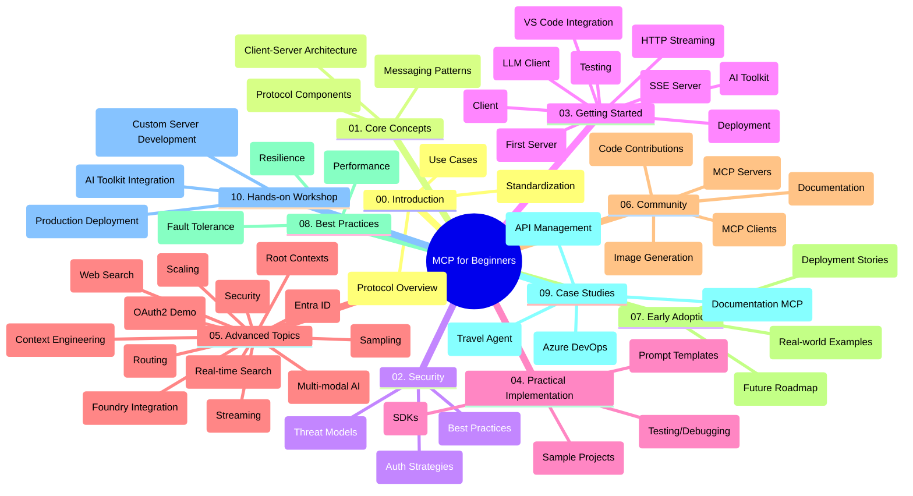

<!--
CO_OP_TRANSLATOR_METADATA:
{
  "original_hash": "5f321ea583cf087a94e47ee74c62b504",
  "translation_date": "2025-07-17T07:46:49+00:00",
  "source_file": "study_guide.md",
  "language_code": "id"
}
-->
# Model Context Protocol (MCP) untuk Pemula - Panduan Belajar

Panduan belajar ini memberikan gambaran tentang struktur dan isi repositori untuk kurikulum "Model Context Protocol (MCP) untuk Pemula". Gunakan panduan ini untuk menavigasi repositori dengan efisien dan memanfaatkan sumber daya yang tersedia secara maksimal.

## Gambaran Umum Repositori

Model Context Protocol (MCP) adalah kerangka kerja standar untuk interaksi antara model AI dan aplikasi klien. Awalnya dibuat oleh Anthropic, MCP kini dikelola oleh komunitas MCP yang lebih luas melalui organisasi resmi di GitHub. Repositori ini menyediakan kurikulum lengkap dengan contoh kode praktis dalam C#, Java, JavaScript, Python, dan TypeScript, yang dirancang untuk pengembang AI, arsitek sistem, dan insinyur perangkat lunak.

## Peta Kurikulum Visual

## Struktur Repositori

Repositori ini diorganisir menjadi sepuluh bagian utama, masing-masing fokus pada aspek berbeda dari MCP:

1. **Introduction (00-Introduction/)**
   - Gambaran umum Model Context Protocol
   - Mengapa standarisasi penting dalam pipeline AI
   - Kasus penggunaan praktis dan manfaatnya

2. **Core Concepts (01-CoreConcepts/)**
   - Arsitektur client-server
   - Komponen utama protokol
   - Pola pengiriman pesan dalam MCP

3. **Security (02-Security/)**
   - Ancaman keamanan dalam sistem berbasis MCP
   - Praktik terbaik untuk mengamankan implementasi
   - Strategi autentikasi dan otorisasi

4. **Getting Started (03-GettingStarted/)**
   - Pengaturan dan konfigurasi lingkungan
   - Membuat server dan klien MCP dasar
   - Integrasi dengan aplikasi yang sudah ada
   - Termasuk bagian untuk:
     - Implementasi server pertama
     - Pengembangan klien
     - Integrasi klien LLM
     - Integrasi VS Code
     - Server Server-Sent Events (SSE)
     - Streaming HTTP
     - Integrasi AI Toolkit
     - Strategi pengujian
     - Panduan deployment

5. **Practical Implementation (04-PracticalImplementation/)**
   - Menggunakan SDK di berbagai bahasa pemrograman
   - Teknik debugging, pengujian, dan validasi
   - Membuat template prompt dan workflow yang dapat digunakan ulang
   - Proyek contoh dengan contoh implementasi

6. **Advanced Topics (05-AdvancedTopics/)**
   - Teknik rekayasa konteks
   - Integrasi agen Foundry
   - Workflow AI multi-modal
   - Demo autentikasi OAuth2
   - Kemampuan pencarian real-time
   - Streaming real-time
   - Implementasi root contexts
   - Strategi routing
   - Teknik sampling
   - Pendekatan scaling
   - Pertimbangan keamanan
   - Integrasi keamanan Entra ID
   - Integrasi pencarian web

7. **Community Contributions (06-CommunityContributions/)**
   - Cara berkontribusi kode dan dokumentasi
   - Kolaborasi melalui GitHub
   - Peningkatan dan umpan balik yang digerakkan komunitas
   - Menggunakan berbagai klien MCP (Claude Desktop, Cline, VSCode)
   - Bekerja dengan server MCP populer termasuk generasi gambar

8. **Lessons from Early Adoption (07-LessonsfromEarlyAdoption/)**
   - Implementasi nyata dan kisah sukses
   - Membangun dan menerapkan solusi berbasis MCP
   - Tren dan roadmap masa depan

9. **Best Practices (08-BestPractices/)**
   - Penyempurnaan performa dan optimasi
   - Merancang sistem MCP yang tahan kesalahan
   - Strategi pengujian dan ketahanan

10. **Case Studies (09-CaseStudy/)**
    - Studi kasus: integrasi Azure API Management
    - Studi kasus: implementasi agen perjalanan
    - Studi kasus: integrasi Azure DevOps dengan YouTube
    - Contoh implementasi dengan dokumentasi rinci

11. **Hands-on Workshop (10-StreamliningAIWorkflowsBuildingAnMCPServerWithAIToolkit/)**
    - Workshop praktis lengkap yang menggabungkan MCP dengan AI Toolkit
    - Membangun aplikasi cerdas yang menghubungkan model AI dengan alat dunia nyata
    - Modul praktis yang mencakup dasar-dasar, pengembangan server kustom, dan strategi deployment produksi
    - Pendekatan pembelajaran berbasis lab dengan instruksi langkah demi langkah

## Sumber Daya Tambahan

Repositori ini juga menyertakan sumber daya pendukung:

- **Folder Images**: Berisi diagram dan ilustrasi yang digunakan sepanjang kurikulum
- **Translations**: Dukungan multi-bahasa dengan terjemahan otomatis dokumentasi
- **Sumber Resmi MCP**:
  - [MCP Documentation](https://modelcontextprotocol.io/)
  - [MCP Specification](https://spec.modelcontextprotocol.io/)
  - [MCP GitHub Repository](https://github.com/modelcontextprotocol)

## Cara Menggunakan Repositori Ini

1. **Pembelajaran Berurutan**: Ikuti bab secara berurutan (00 sampai 10) untuk pengalaman belajar yang terstruktur.
2. **Fokus Bahasa Tertentu**: Jika tertarik pada bahasa pemrograman tertentu, jelajahi direktori contoh untuk implementasi dalam bahasa pilihan Anda.
3. **Implementasi Praktis**: Mulailah dengan bagian "Getting Started" untuk menyiapkan lingkungan dan membuat server serta klien MCP pertama Anda.
4. **Eksplorasi Lanjutan**: Setelah memahami dasar, dalami topik lanjutan untuk memperluas pengetahuan.
5. **Keterlibatan Komunitas**: Bergabunglah dengan komunitas MCP melalui diskusi GitHub dan saluran Discord untuk terhubung dengan para ahli dan pengembang lain.

## Klien dan Alat MCP

Kurikulum mencakup berbagai klien dan alat MCP:

1. **Klien Resmi**:
   - Visual Studio Code
   - MCP di Visual Studio Code
   - Claude Desktop
   - Claude di VSCode
   - Claude API

2. **Klien Komunitas**:
   - Cline (berbasis terminal)
   - Cursor (editor kode)
   - ChatMCP
   - Windsurf

3. **Alat Manajemen MCP**:
   - MCP CLI
   - MCP Manager
   - MCP Linker
   - MCP Router

## Server MCP Populer

Repositori ini memperkenalkan berbagai server MCP, termasuk:

1. **Server Referensi Resmi**:
   - Filesystem
   - Fetch
   - Memory
   - Sequential Thinking

2. **Generasi Gambar**:
   - Azure OpenAI DALL-E 3
   - Stable Diffusion WebUI
   - Replicate

3. **Alat Pengembangan**:
   - Git MCP
   - Terminal Control
   - Code Assistant

4. **Server Khusus**:
   - Salesforce
   - Microsoft Teams
   - Jira & Confluence

## Kontribusi

Repositori ini menyambut kontribusi dari komunitas. Lihat bagian Community Contributions untuk panduan cara berkontribusi secara efektif ke ekosistem MCP.

## Changelog

| Tanggal | Perubahan |
|---------|-----------|
| 16 Juli 2025 | - Memperbarui struktur repositori sesuai isi terkini - Menambahkan bagian Klien dan Alat MCP - Menambahkan bagian Server MCP Populer - Memperbarui Peta Kurikulum Visual dengan semua topik terkini - Memperkuat bagian Topik Lanjutan dengan semua area khusus - Memperbarui Studi Kasus dengan contoh nyata - Menjelaskan asal-usul MCP yang dibuat oleh Anthropic |
| 11 Juni 2025 | - Pembuatan awal panduan belajar - Menambahkan Peta Kurikulum Visual - Menguraikan struktur repositori - Menyertakan proyek contoh dan sumber daya tambahan |

---

*Panduan belajar ini diperbarui pada 16 Juli 2025, dan memberikan gambaran repositori hingga tanggal tersebut. Isi repositori dapat diperbarui setelah tanggal ini.*

**Penafian**:  
Dokumen ini telah diterjemahkan menggunakan layanan terjemahan AI [Co-op Translator](https://github.com/Azure/co-op-translator). Meskipun kami berupaya untuk mencapai akurasi, harap diketahui bahwa terjemahan otomatis mungkin mengandung kesalahan atau ketidakakuratan. Dokumen asli dalam bahasa aslinya harus dianggap sebagai sumber yang sahih. Untuk informasi penting, disarankan menggunakan terjemahan profesional oleh manusia. Kami tidak bertanggung jawab atas kesalahpahaman atau penafsiran yang keliru yang timbul dari penggunaan terjemahan ini.