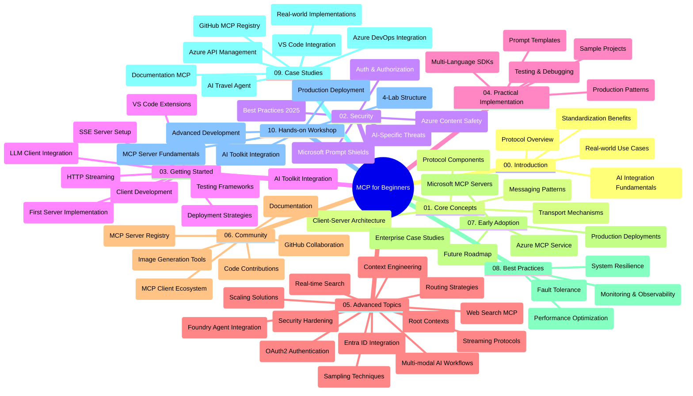

<!--
CO_OP_TRANSLATOR_METADATA:
{
  "original_hash": "719117a0a5f34ade7b5dfb61ee06fb13",
  "translation_date": "2025-09-26T18:46:25+00:00",
  "source_file": "study_guide.md",
  "language_code": "id"
}
-->
# Panduan Belajar Model Context Protocol (MCP) untuk Pemula

Panduan belajar ini memberikan gambaran umum tentang struktur dan konten repositori untuk kurikulum "Model Context Protocol (MCP) untuk Pemula". Gunakan panduan ini untuk menavigasi repositori dengan efisien dan memanfaatkan sumber daya yang tersedia secara maksimal.

## Gambaran Umum Repositori

Model Context Protocol (MCP) adalah kerangka kerja standar untuk interaksi antara model AI dan aplikasi klien. Awalnya dibuat oleh Anthropic, MCP kini dikelola oleh komunitas MCP yang lebih luas melalui organisasi GitHub resmi. Repositori ini menyediakan kurikulum komprehensif dengan contoh kode langsung dalam C#, Java, JavaScript, Python, dan TypeScript, yang dirancang untuk pengembang AI, arsitek sistem, dan insinyur perangkat lunak.

## Peta Kurikulum Visual

## Struktur Repositori

Repositori ini terdiri dari sepuluh bagian utama, masing-masing berfokus pada aspek berbeda dari MCP:

1. **Pendahuluan (00-Introduction/)**
   - Gambaran umum tentang Model Context Protocol
   - Mengapa standarisasi penting dalam pipeline AI
   - Kasus penggunaan praktis dan manfaatnya

2. **Konsep Inti (01-CoreConcepts/)**
   - Arsitektur client-server
   - Komponen utama protokol
   - Pola pesan dalam MCP

3. **Keamanan (02-Security/)**
   - Ancaman keamanan dalam sistem berbasis MCP
   - Praktik terbaik untuk mengamankan implementasi
   - Strategi autentikasi dan otorisasi
   - **Dokumentasi Keamanan Komprehensif**:
     - Praktik Terbaik Keamanan MCP 2025
     - Panduan Implementasi Keamanan Konten Azure
     - Kontrol dan Teknik Keamanan MCP
     - Referensi Cepat Praktik Terbaik MCP
   - **Topik Keamanan Utama**:
     - Serangan injeksi prompt dan peracunan alat
     - Pembajakan sesi dan masalah deputi bingung
     - Kerentanan token passthrough
     - Izin berlebihan dan kontrol akses
     - Keamanan rantai pasokan untuk komponen AI
     - Integrasi Microsoft Prompt Shields

4. **Memulai (03-GettingStarted/)**
   - Pengaturan dan konfigurasi lingkungan
   - Membuat server dan klien MCP dasar
   - Integrasi dengan aplikasi yang sudah ada
   - Termasuk bagian untuk:
     - Implementasi server pertama
     - Pengembangan klien
     - Integrasi klien LLM
     - Integrasi VS Code
     - Server Server-Sent Events (SSE)
     - Streaming HTTP
     - Integrasi AI Toolkit
     - Strategi pengujian
     - Panduan penerapan

5. **Implementasi Praktis (04-PracticalImplementation/)**
   - Menggunakan SDK dalam berbagai bahasa pemrograman
   - Teknik debugging, pengujian, dan validasi
   - Membuat template prompt dan alur kerja yang dapat digunakan kembali
   - Proyek contoh dengan implementasi

6. **Topik Lanjutan (05-AdvancedTopics/)**
   - Teknik rekayasa konteks
   - Integrasi agen Foundry
   - Alur kerja AI multi-modal
   - Demo autentikasi OAuth2
   - Kemampuan pencarian real-time
   - Streaming real-time
   - Implementasi konteks root
   - Strategi routing
   - Teknik sampling
   - Pendekatan scaling
   - Pertimbangan keamanan
   - Integrasi keamanan Entra ID
   - Integrasi pencarian web

7. **Kontribusi Komunitas (06-CommunityContributions/)**
   - Cara berkontribusi kode dan dokumentasi
   - Kolaborasi melalui GitHub
   - Peningkatan dan umpan balik yang didorong oleh komunitas
   - Menggunakan berbagai klien MCP (Claude Desktop, Cline, VSCode)
   - Bekerja dengan server MCP populer termasuk generasi gambar

8. **Pelajaran dari Adopsi Awal (07-LessonsfromEarlyAdoption/)**
   - Implementasi dunia nyata dan kisah sukses
   - Membangun dan menerapkan solusi berbasis MCP
   - Tren dan peta jalan masa depan
   - **Panduan Server MCP Microsoft**: Panduan komprehensif untuk 10 server MCP Microsoft siap produksi termasuk:
     - Server MCP Microsoft Learn Docs
     - Server MCP Azure (15+ konektor khusus)
     - Server MCP GitHub
     - Server MCP Azure DevOps
     - Server MCP MarkItDown
     - Server MCP SQL Server
     - Server MCP Playwright
     - Server MCP Dev Box
     - Server MCP Azure AI Foundry
     - Server MCP Microsoft 365 Agents Toolkit

9. **Praktik Terbaik (08-BestPractices/)**
   - Penyempurnaan dan optimasi kinerja
   - Merancang sistem MCP yang tahan gangguan
   - Strategi pengujian dan ketahanan

10. **Studi Kasus (09-CaseStudy/)**
    - **Tujuh studi kasus komprehensif** yang menunjukkan fleksibilitas MCP dalam berbagai skenario:
    - **Azure AI Travel Agents**: Orkestrasi multi-agen dengan Azure OpenAI dan AI Search
    - **Integrasi Azure DevOps**: Mengotomatisasi proses alur kerja dengan pembaruan data YouTube
    - **Pengambilan Dokumentasi Real-Time**: Klien konsol Python dengan streaming HTTP
    - **Generator Rencana Studi Interaktif**: Aplikasi web Chainlit dengan AI percakapan
    - **Dokumentasi Dalam Editor**: Integrasi VS Code dengan alur kerja GitHub Copilot
    - **Manajemen API Azure**: Integrasi API perusahaan dengan pembuatan server MCP
    - **Registri MCP GitHub**: Pengembangan ekosistem dan platform integrasi agen
    - Contoh implementasi mencakup integrasi perusahaan, produktivitas pengembang, dan pengembangan ekosistem

11. **Workshop Praktis (10-StreamliningAIWorkflowsBuildingAnMCPServerWithAIToolkit/)**
    - Workshop praktis komprehensif yang menggabungkan MCP dengan AI Toolkit
    - Membangun aplikasi cerdas yang menghubungkan model AI dengan alat dunia nyata
    - Modul praktis mencakup dasar-dasar, pengembangan server khusus, dan strategi penerapan produksi
    - **Struktur Lab**:
      - Lab 1: Dasar-Dasar Server MCP
      - Lab 2: Pengembangan Server MCP Lanjutan
      - Lab 3: Integrasi AI Toolkit
      - Lab 4: Penerapan Produksi dan Scaling
    - Pendekatan pembelajaran berbasis lab dengan instruksi langkah demi langkah

## Sumber Daya Tambahan

Repositori ini mencakup sumber daya pendukung:

- **Folder gambar**: Berisi diagram dan ilustrasi yang digunakan di seluruh kurikulum
- **Terjemahan**: Dukungan multi-bahasa dengan terjemahan dokumentasi otomatis
- **Sumber Daya Resmi MCP**:
  - [Dokumentasi MCP](https://modelcontextprotocol.io/)
  - [Spesifikasi MCP](https://spec.modelcontextprotocol.io/)
  - [Repositori GitHub MCP](https://github.com/modelcontextprotocol)

## Cara Menggunakan Repositori Ini

1. **Pembelajaran Berurutan**: Ikuti bab-bab secara berurutan (00 hingga 10) untuk pengalaman belajar yang terstruktur.
2. **Fokus Bahasa Spesifik**: Jika Anda tertarik pada bahasa pemrograman tertentu, jelajahi direktori sampel untuk implementasi dalam bahasa pilihan Anda.
3. **Implementasi Praktis**: Mulailah dengan bagian "Memulai" untuk mengatur lingkungan Anda dan membuat server serta klien MCP pertama Anda.
4. **Eksplorasi Lanjutan**: Setelah memahami dasar-dasarnya, jelajahi topik lanjutan untuk memperluas pengetahuan Anda.
5. **Keterlibatan Komunitas**: Bergabunglah dengan komunitas MCP melalui diskusi GitHub dan saluran Discord untuk terhubung dengan para ahli dan pengembang lainnya.

## Klien dan Alat MCP

Kurikulum ini mencakup berbagai klien dan alat MCP:

1. **Klien Resmi**:
   - Visual Studio Code 
   - MCP di Visual Studio Code
   - Claude Desktop
   - Claude di VSCode 
   - Claude API

2. **Klien Komunitas**:
   - Cline (berbasis terminal)
   - Cursor (editor kode)
   - ChatMCP
   - Windsurf

3. **Alat Manajemen MCP**:
   - MCP CLI
   - MCP Manager
   - MCP Linker
   - MCP Router

## Server MCP Populer

Repositori ini memperkenalkan berbagai server MCP, termasuk:

1. **Server MCP Microsoft Resmi**:
   - Server MCP Microsoft Learn Docs
   - Server MCP Azure (15+ konektor khusus)
   - Server MCP GitHub
   - Server MCP Azure DevOps
   - Server MCP MarkItDown
   - Server MCP SQL Server
   - Server MCP Playwright
   - Server MCP Dev Box
   - Server MCP Azure AI Foundry
   - Server MCP Microsoft 365 Agents Toolkit

2. **Server Referensi Resmi**:
   - Filesystem
   - Fetch
   - Memory
   - Sequential Thinking

3. **Generasi Gambar**:
   - Azure OpenAI DALL-E 3
   - Stable Diffusion WebUI
   - Replicate

4. **Alat Pengembangan**:
   - Git MCP
   - Terminal Control
   - Code Assistant

5. **Server Khusus**:
   - Salesforce
   - Microsoft Teams
   - Jira & Confluence

## Kontribusi

Repositori ini menyambut kontribusi dari komunitas. Lihat bagian Kontribusi Komunitas untuk panduan tentang cara berkontribusi secara efektif ke ekosistem MCP.

## Catatan Perubahan

| Tanggal | Perubahan |
|--------|-----------|
| 26 September 2025 | - Menambahkan studi kasus Registri MCP GitHub ke bagian 09-CaseStudy - Memperbarui Studi Kasus untuk mencerminkan tujuh studi kasus komprehensif - Meningkatkan deskripsi studi kasus dengan detail implementasi spesifik - Memperbarui Peta Kurikulum Visual untuk menyertakan Registri MCP GitHub - Merevisi struktur panduan belajar untuk mencerminkan fokus pengembangan ekosistem |
| 18 Juli 2025 | - Memperbarui struktur repositori untuk menyertakan Panduan Server MCP Microsoft - Menambahkan daftar komprehensif 10 server MCP Microsoft siap produksi - Meningkatkan bagian Server MCP Populer dengan Server MCP Microsoft Resmi - Memperbarui bagian Studi Kasus dengan contoh file aktual - Menambahkan detail Struktur Lab untuk Workshop Praktis |
| 16 Juli 2025 | - Memperbarui struktur repositori untuk mencerminkan konten terkini - Menambahkan bagian Klien dan Alat MCP - Menambahkan bagian Server MCP Populer - Memperbarui Peta Kurikulum Visual dengan semua topik terkini - Meningkatkan bagian Topik Lanjutan dengan semua area khusus - Memperbarui Studi Kasus untuk mencerminkan contoh aktual - Menjelaskan asal MCP sebagai ciptaan Anthropic |
| 11 Juni 2025 | - Pembuatan awal panduan belajar - Menambahkan Peta Kurikulum Visual - Menguraikan struktur repositori - Menyertakan proyek contoh dan sumber daya tambahan |

---

*Panduan belajar ini diperbarui pada 26 September 2025 dan memberikan gambaran umum tentang repositori hingga tanggal tersebut. Konten repositori dapat diperbarui setelah tanggal ini.*

---

