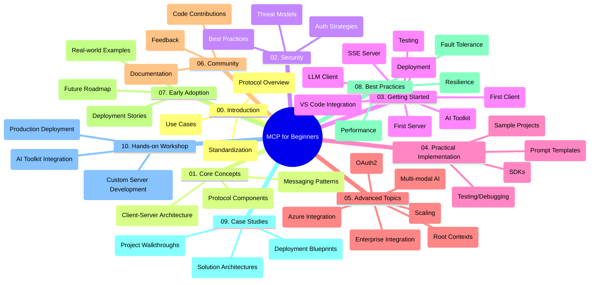

<!--
CO_OP_TRANSLATOR_METADATA:
{
  "original_hash": "a607d4febc94caee9a12b77795f7fc9a",
  "translation_date": "2025-06-11T16:47:49+00:00",
  "source_file": "study_guide.md",
  "language_code": "id"
}
-->
# Model Context Protocol (MCP) untuk Pemula - Panduan Belajar

Panduan belajar ini memberikan gambaran tentang struktur dan isi repositori untuk kurikulum "Model Context Protocol (MCP) untuk Pemula". Gunakan panduan ini untuk menavigasi repositori dengan efisien dan memanfaatkan sumber daya yang tersedia secara maksimal.

## Gambaran Repositori

Model Context Protocol (MCP) adalah kerangka kerja standar untuk interaksi antara model AI dan aplikasi klien. Repositori ini menyediakan kurikulum komprehensif dengan contoh kode praktis dalam C#, Java, JavaScript, Python, dan TypeScript, yang dirancang untuk pengembang AI, arsitek sistem, dan insinyur perangkat lunak.

## Peta Kurikulum Visual

## Struktur Repositori

Repositori ini diorganisasi ke dalam sepuluh bagian utama, masing-masing fokus pada aspek berbeda dari MCP:

1. **Introduction (00-Introduction/)**
   - Gambaran umum Model Context Protocol
   - Mengapa standardisasi penting dalam pipeline AI
   - Kasus penggunaan praktis dan manfaatnya

2. **Core Concepts (01-CoreConcepts/)**
   - Arsitektur client-server
   - Komponen utama protokol
   - Pola pesan dalam MCP

3. **Security (02-Security/)**
   - Ancaman keamanan dalam sistem berbasis MCP
   - Praktik terbaik untuk mengamankan implementasi
   - Strategi autentikasi dan otorisasi

4. **Getting Started (03-GettingStarted/)**
   - Pengaturan dan konfigurasi lingkungan
   - Membuat server dan klien MCP dasar
   - Integrasi dengan aplikasi yang sudah ada
   - Subbagian untuk server pertama, klien pertama, klien LLM, integrasi VS Code, server SSE, AI Toolkit, pengujian, dan deployment

5. **Practical Implementation (04-PracticalImplementation/)**
   - Menggunakan SDK di berbagai bahasa pemrograman
   - Teknik debugging, pengujian, dan validasi
   - Membuat template prompt dan workflow yang dapat digunakan ulang
   - Proyek contoh dengan contoh implementasi

6. **Advanced Topics (05-AdvancedTopics/)**
   - Workflow AI multi-modal dan kemampuan perluasan
   - Strategi scaling yang aman
   - MCP dalam ekosistem perusahaan
   - Topik khusus termasuk integrasi Azure, multi-modalitas, OAuth2, root context, routing, sampling, scaling, keamanan, integrasi pencarian web, dan streaming.

7. **Community Contributions (06-CommunityContributions/)**
   - Cara berkontribusi kode dan dokumentasi
   - Kolaborasi melalui GitHub
   - Peningkatan dan masukan yang didorong komunitas

8. **Lessons from Early Adoption (07-LessonsfromEarlyAdoption/)**
   - Implementasi nyata dan kisah sukses
   - Membangun dan menerapkan solusi berbasis MCP
   - Tren dan peta jalan masa depan

9. **Best Practices (08-BestPractices/)**
   - Penyempurnaan performa dan optimasi
   - Merancang sistem MCP yang tahan kesalahan
   - Strategi pengujian dan ketahanan

10. **Case Studies (09-CaseStudy/)**
    - Analisis mendalam arsitektur solusi MCP
    - Cetak biru deployment dan tips integrasi
    - Diagram beranotasi dan walkthrough proyek

11. **Hands-on Workshop (10-StreamliningAIWorkflowsBuildingAnMCPServerWithAIToolkit/)**
    - Workshop praktis komprehensif menggabungkan MCP dengan AI Toolkit Microsoft untuk VS Code
    - Membangun aplikasi cerdas yang menghubungkan model AI dengan alat dunia nyata
    - Modul praktis yang mencakup dasar-dasar, pengembangan server kustom, dan strategi deployment produksi

## Proyek Contoh

Repositori ini mencakup beberapa proyek contoh yang menunjukkan implementasi MCP di berbagai bahasa pemrograman:

### Contoh Kalkulator MCP Dasar
- Contoh Server MCP C#
- Kalkulator MCP Java
- Demo MCP JavaScript
- Server MCP Python
- Contoh MCP TypeScript

### Proyek Kalkulator MCP Lanjutan
- Contoh Lanjutan C#
- Contoh Aplikasi Kontainer Java
- Contoh Lanjutan JavaScript
- Implementasi Kompleks Python
- Contoh Kontainer TypeScript

## Sumber Daya Tambahan

Repositori ini juga menyediakan sumber daya pendukung:

- **Folder Images**: Berisi diagram dan ilustrasi yang digunakan sepanjang kurikulum
- **Translations**: Dukungan multi-bahasa dengan terjemahan otomatis dokumentasi
- **Sumber Resmi MCP**:
  - [MCP Documentation](https://modelcontextprotocol.io/)
  - [MCP Specification](https://spec.modelcontextprotocol.io/)
  - [MCP GitHub Repository](https://github.com/modelcontextprotocol)

## Cara Menggunakan Repositori Ini

1. **Pembelajaran Berurutan**: Ikuti bab-bab secara berurutan (00 sampai 10) untuk pengalaman belajar yang terstruktur.
2. **Fokus Bahasa Tertentu**: Jika tertarik pada bahasa pemrograman tertentu, jelajahi direktori contoh untuk implementasi dalam bahasa pilihan Anda.
3. **Implementasi Praktis**: Mulailah dengan bagian "Getting Started" untuk menyiapkan lingkungan dan membuat server serta klien MCP pertama Anda.
4. **Eksplorasi Lanjutan**: Setelah memahami dasar, dalami topik lanjutan untuk memperluas pengetahuan Anda.
5. **Keterlibatan Komunitas**: Bergabunglah dengan [Azure AI Foundry Discord](https://discord.com/invite/ByRwuEEgH4) untuk terhubung dengan para ahli dan pengembang lain.

## Berkontribusi

Repositori ini menyambut kontribusi dari komunitas. Lihat bagian Community Contributions untuk panduan cara berkontribusi.

---

*Panduan belajar ini dibuat pada 11 Juni 2025, dan memberikan gambaran repositori pada tanggal tersebut. Isi repositori mungkin telah diperbarui sejak saat itu.*

**Penafian**:  
Dokumen ini telah diterjemahkan menggunakan layanan terjemahan AI [Co-op Translator](https://github.com/Azure/co-op-translator). Meskipun kami berusaha untuk akurasi, harap diketahui bahwa terjemahan otomatis mungkin mengandung kesalahan atau ketidakakuratan. Dokumen asli dalam bahasa aslinya harus dianggap sebagai sumber yang sahih. Untuk informasi penting, disarankan menggunakan terjemahan profesional oleh manusia. Kami tidak bertanggung jawab atas kesalahpahaman atau salah tafsir yang timbul dari penggunaan terjemahan ini.