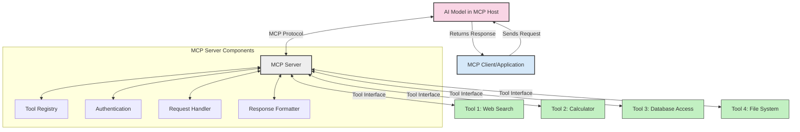
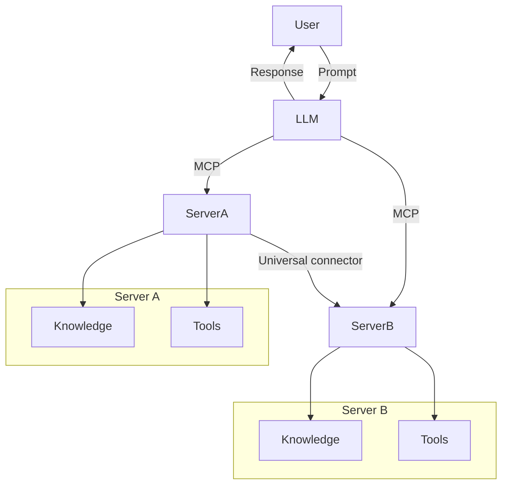

<!--
CO_OP_TRANSLATOR_METADATA:
{
  "original_hash": "1d88dee994dcbb3fa52c271d0c0817b5",
  "translation_date": "2025-05-20T21:19:05+00:00",
  "source_file": "00-Introduction/README.md",
  "language_code": "it"
}
-->
# Introduzione al Model Context Protocol (MCP): Perché è importante per applicazioni AI scalabili

Le applicazioni di Generative AI rappresentano un grande passo avanti poiché spesso permettono all’utente di interagire con l’app tramite comandi in linguaggio naturale. Tuttavia, man mano che si investe più tempo e risorse in queste app, è fondamentale assicurarsi di poter integrare funzionalità e risorse in modo semplice, che sia facile estendere l’app, che possa supportare più modelli contemporaneamente e gestire le varie complessità dei modelli. In breve, costruire app Gen AI è semplice all’inizio, ma con la crescita e l’aumento della complessità, è necessario iniziare a definire un’architettura e probabilmente affidarsi a uno standard per garantire che le app siano sviluppate in modo coerente. Qui entra in gioco MCP per organizzare il tutto e fornire uno standard.

---

## **🔍 Cos’è il Model Context Protocol (MCP)?**

Il **Model Context Protocol (MCP)** è un **interfaccia aperta e standardizzata** che consente ai Large Language Models (LLM) di interagire senza soluzione di continuità con strumenti esterni, API e fonti di dati. Fornisce un’architettura coerente per ampliare le funzionalità dei modelli AI oltre i dati di addestramento, permettendo sistemi AI più intelligenti, scalabili e reattivi.

---

## **🎯 Perché la standardizzazione nell’AI è importante**

Con l’aumento della complessità delle applicazioni generative AI, è essenziale adottare standard che garantiscano **scalabilità, estensibilità** e **manutenibilità**. MCP risponde a queste esigenze:

- Unificando le integrazioni modello-strumento  
- Riducendo soluzioni personalizzate fragili e isolate  
- Permettendo a più modelli di coesistere nello stesso ecosistema  

---

## **📚 Obiettivi di apprendimento**

Al termine di questo articolo, sarai in grado di:

- Definire il **Model Context Protocol (MCP)** e i suoi casi d’uso  
- Comprendere come MCP standardizza la comunicazione modello-strumento  
- Identificare i componenti principali dell’architettura MCP  
- Esplorare applicazioni reali di MCP in ambito enterprise e sviluppo  

---

## **💡 Perché il Model Context Protocol (MCP) è rivoluzionario**

### **🔗 MCP risolve la frammentazione nelle interazioni AI**

Prima di MCP, integrare modelli con strumenti richiedeva:

- Codice personalizzato per ogni coppia modello-strumento  
- API non standard per ogni fornitore  
- Interruzioni frequenti a causa di aggiornamenti  
- Scarsa scalabilità con l’aumentare degli strumenti  

### **✅ Vantaggi della standardizzazione MCP**

| **Vantaggio**             | **Descrizione**                                                               |
|---------------------------|-------------------------------------------------------------------------------|
| Interoperabilità          | Gli LLM funzionano senza problemi con strumenti di diversi fornitori          |
| Coerenza                  | Comportamento uniforme su piattaforme e strumenti                             |
| Riutilizzabilità          | Strumenti costruiti una volta possono essere usati in progetti e sistemi diversi|
| Sviluppo Accelerato       | Riduce i tempi di sviluppo grazie a interfacce standard plug-and-play         |

---

## **🧱 Panoramica dell’architettura MCP ad alto livello**

MCP segue un **modello client-server**, dove:

- **MCP Hosts** eseguono i modelli AI  
- **MCP Clients** avviano le richieste  
- **MCP Servers** forniscono contesto, strumenti e funzionalità  

### **Componenti chiave:**

- **Resources** – Dati statici o dinamici per i modelli  
- **Prompts** – Workflow predefiniti per generazioni guidate  
- **Tools** – Funzioni eseguibili come ricerca, calcoli  
- **Sampling** – Comportamento agentico tramite interazioni ricorsive  

---

## Come funzionano gli MCP Servers

Gli MCP server operano nel modo seguente:

- **Flusso delle richieste**:  
    1. L’MCP Client invia una richiesta al modello AI in esecuzione su un MCP Host.  
    2. Il modello AI individua quando necessita di strumenti o dati esterni.  
    3. Il modello comunica con l’MCP Server utilizzando il protocollo standardizzato.  

- **Funzionalità dell’MCP Server**:  
    - Registro Strumenti: mantiene un catalogo degli strumenti disponibili e delle loro capacità.  
    - Autenticazione: verifica i permessi per l’accesso agli strumenti.  
    - Gestore delle richieste: elabora le richieste di strumenti provenienti dal modello.  
    - Formattatore delle risposte: struttura i risultati degli strumenti in un formato comprensibile dal modello.  

- **Esecuzione degli strumenti**:  
    - Il server indirizza le richieste agli strumenti esterni appropriati  
    - Gli strumenti eseguono le loro funzioni specializzate (ricerca, calcolo, interrogazioni database, ecc.)  
    - I risultati vengono restituiti al modello in un formato coerente.  

- **Completamento della risposta**:  
    - Il modello AI integra i risultati degli strumenti nella sua risposta.  
    - La risposta finale viene inviata all’applicazione client.  

## 👨‍💻 Come costruire un MCP Server (con esempi)

Gli MCP server ti permettono di estendere le capacità degli LLM fornendo dati e funzionalità.

Pronto per provarci? Ecco esempi per creare un semplice MCP server in diversi linguaggi:

- **Esempio Python**: https://github.com/modelcontextprotocol/python-sdk

- **Esempio TypeScript**: https://github.com/modelcontextprotocol/typescript-sdk

- **Esempio Java**: https://github.com/modelcontextprotocol/java-sdk

- **Esempio C#/.NET**: https://github.com/modelcontextprotocol/csharp-sdk

## 🌍 Casi d’uso reali per MCP

MCP abilita una vasta gamma di applicazioni estendendo le capacità AI:

| **Applicazione**           | **Descrizione**                                                               |
|----------------------------|-------------------------------------------------------------------------------|
| Integrazione dati enterprise| Connette LLM a database, CRM o strumenti interni                             |
| Sistemi AI agentici        | Abilita agenti autonomi con accesso a strumenti e flussi decisionali           |
| Applicazioni multimodali   | Combina strumenti di testo, immagine e audio in un’unica app AI               |
| Integrazione dati in tempo reale | Porta dati live nelle interazioni AI per output più precisi e aggiornati |

### 🧠 MCP = Standard universale per le interazioni AI

Il Model Context Protocol (MCP) funziona come uno standard universale per le interazioni AI, proprio come USB-C ha standardizzato le connessioni fisiche tra dispositivi. Nel mondo AI, MCP fornisce un’interfaccia coerente, permettendo ai modelli (client) di integrarsi senza problemi con strumenti esterni e fornitori di dati (server). Questo elimina la necessità di protocolli diversi e personalizzati per ogni API o fonte dati.

Con MCP, uno strumento compatibile (detto MCP server) segue uno standard unificato. Questi server possono elencare gli strumenti o le azioni offerte ed eseguirle quando richiesto da un agente AI. Le piattaforme agenti AI che supportano MCP sono in grado di scoprire gli strumenti disponibili dai server e invocarli tramite questo protocollo standard.

### 💡 Facilita l’accesso alla conoscenza

Oltre a offrire strumenti, MCP facilita anche l’accesso alla conoscenza. Consente alle applicazioni di fornire contesto ai Large Language Models collegandoli a diverse fonti di dati. Per esempio, un MCP server può rappresentare un archivio documentale aziendale, permettendo agli agenti di recuperare informazioni rilevanti su richiesta. Un altro server può gestire azioni specifiche come inviare email o aggiornare record. Dal punto di vista dell’agente, sono semplicemente strumenti utilizzabili: alcuni restituiscono dati (contesto di conoscenza), altri eseguono azioni. MCP gestisce entrambi in modo efficiente.

Un agente che si connette a un MCP server apprende automaticamente le capacità e i dati accessibili del server tramite un formato standard. Questa standardizzazione consente una disponibilità dinamica degli strumenti. Per esempio, aggiungere un nuovo MCP server al sistema di un agente rende immediatamente utilizzabili le sue funzioni senza ulteriori personalizzazioni delle istruzioni dell’agente.

Questa integrazione semplificata si allinea al flusso mostrato nel diagramma mermaid, dove i server forniscono sia strumenti che conoscenza, garantendo una collaborazione fluida tra sistemi.

### 👉 Esempio: soluzione agentica scalabile

## 🔐 Benefici pratici di MCP

Ecco i benefici pratici dell’uso di MCP:

- **Aggiornamento**: i modelli possono accedere a informazioni aggiornate oltre i dati di addestramento  
- **Estensione delle capacità**: i modelli possono sfruttare strumenti specializzati per compiti non previsti dall’addestramento  
- **Riduzione delle allucinazioni**: fonti dati esterne forniscono basi fattuali  
- **Privacy**: dati sensibili possono restare in ambienti sicuri senza essere incorporati nei prompt  

## 📌 Punti chiave

Ecco i punti chiave sull’uso di MCP:

- **MCP** standardizza come i modelli AI interagiscono con strumenti e dati  
- Promuove **estensibilità, coerenza e interoperabilità**  
- MCP aiuta a **ridurre i tempi di sviluppo, migliorare l’affidabilità e ampliare le capacità del modello**  
- L’architettura client-server **consente applicazioni AI flessibili ed estensibili**  

## 🧠 Esercizio

Pensa a un’applicazione AI che ti interessa sviluppare.

- Quali **strumenti o dati esterni** potrebbero migliorarne le capacità?  
- In che modo MCP potrebbe rendere l’integrazione **più semplice e affidabile**?  

## Risorse aggiuntive

- [MCP GitHub Repository](https://github.com/modelcontextprotocol)

## Cosa c’è dopo

Prossimo: [Chapter 1: Core Concepts](/01-CoreConcepts/README.md)

**Disclaimer**:  
Questo documento è stato tradotto utilizzando il servizio di traduzione automatica AI [Co-op Translator](https://github.com/Azure/co-op-translator). Pur impegnandoci per l'accuratezza, si prega di notare che le traduzioni automatiche possono contenere errori o inesattezze. Il documento originale nella sua lingua madre deve essere considerato la fonte autorevole. Per informazioni critiche, si raccomanda una traduzione professionale effettuata da un umano. Non ci assumiamo alcuna responsabilità per eventuali malintesi o interpretazioni errate derivanti dall'uso di questa traduzione.