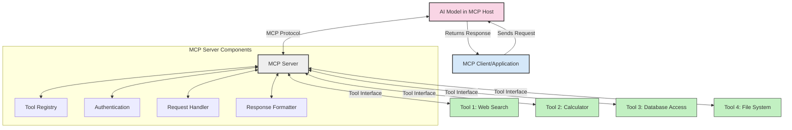
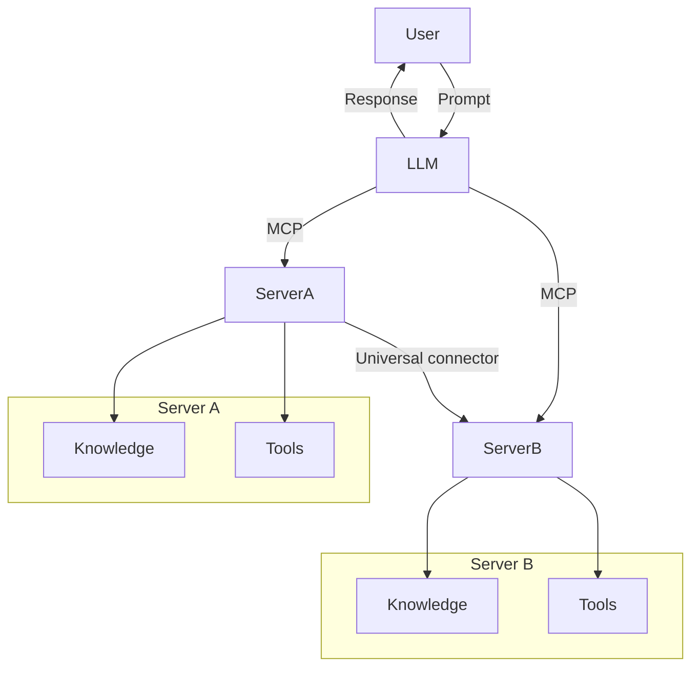
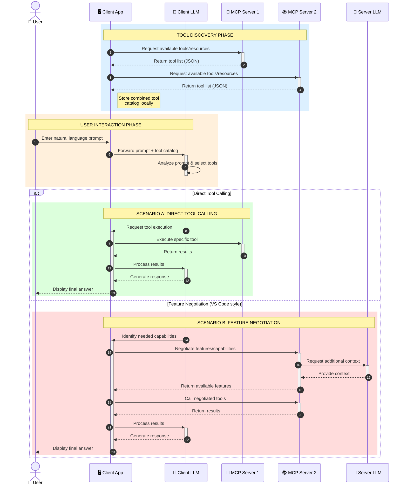

<!--
CO_OP_TRANSLATOR_METADATA:
{
  "original_hash": "25a94c681cf43612ff394d8cf78a74de",
  "translation_date": "2025-05-27T16:03:06+00:00",
  "source_file": "00-Introduction/README.md",
  "language_code": "it"
}
-->
# Introduzione al Model Context Protocol (MCP): Perché è importante per applicazioni AI scalabili

Le applicazioni di AI generativa rappresentano un grande passo avanti, poiché spesso consentono all’utente di interagire con l’app tramite prompt in linguaggio naturale. Tuttavia, man mano che si investe più tempo e risorse in queste app, è fondamentale assicurarsi di poter integrare facilmente funzionalità e risorse in modo che sia semplice estenderle, che l’app possa supportare più modelli contemporaneamente e gestire le varie complessità dei modelli. In breve, costruire app di Gen AI è facile all’inizio, ma quando crescono e diventano più complesse, bisogna iniziare a definire un’architettura e probabilmente affidarsi a uno standard per garantire che le app siano sviluppate in modo coerente. Qui entra in gioco MCP per organizzare il tutto e fornire uno standard.

---

## **🔍 Cos’è il Model Context Protocol (MCP)?**

Il **Model Context Protocol (MCP)** è un’**interfaccia aperta e standardizzata** che permette ai Large Language Models (LLM) di interagire senza soluzione di continuità con strumenti esterni, API e fonti dati. Fornisce un’architettura coerente per potenziare le funzionalità dei modelli AI oltre i dati di addestramento, abilitando sistemi AI più intelligenti, scalabili e reattivi.

---

## **🎯 Perché la standardizzazione nell’AI è importante**

Man mano che le applicazioni di AI generativa diventano più complesse, è essenziale adottare standard che garantiscano **scalabilità, estensibilità** e **manutenibilità**. MCP risponde a queste esigenze:

- Unificando le integrazioni tra modelli e strumenti
- Riducendo soluzioni personalizzate fragili e isolate
- Consentendo la convivenza di più modelli all’interno di un unico ecosistema

---

## **📚 Obiettivi di apprendimento**

Al termine di questo articolo, sarai in grado di:

- Definire **Model Context Protocol (MCP)** e i suoi casi d’uso
- Comprendere come MCP standardizza la comunicazione tra modello e strumenti
- Identificare i componenti principali dell’architettura MCP
- Esplorare applicazioni reali di MCP in contesti aziendali e di sviluppo

---

## **💡 Perché il Model Context Protocol (MCP) è una svolta**

### **🔗 MCP risolve la frammentazione nelle interazioni AI**

Prima di MCP, integrare modelli con strumenti richiedeva:

- Codice personalizzato per ogni coppia strumento-modello
- API non standard per ogni fornitore
- Interruzioni frequenti a causa di aggiornamenti
- Scarsa scalabilità con l’aumentare degli strumenti

### **✅ Vantaggi della standardizzazione MCP**

| **Vantaggio**            | **Descrizione**                                                              |
|--------------------------|------------------------------------------------------------------------------|
| Interoperabilità         | Gli LLM lavorano senza problemi con strumenti di diversi fornitori          |
| Coerenza                 | Comportamento uniforme su piattaforme e strumenti                           |
| Riutilizzabilità         | Strumenti costruiti una volta possono essere usati in progetti e sistemi diversi |
| Sviluppo accelerato      | Riduce i tempi di sviluppo grazie a interfacce standard plug-and-play       |

---

## **🧱 Panoramica ad alto livello dell’architettura MCP**

MCP segue un **modello client-server**, dove:

- **MCP Hosts** eseguono i modelli AI
- **MCP Clients** avviano le richieste
- **MCP Servers** forniscono contesto, strumenti e funzionalità

### **Componenti chiave:**

- **Resources** – Dati statici o dinamici per i modelli  
- **Prompts** – Flussi di lavoro predefiniti per generazioni guidate  
- **Tools** – Funzioni eseguibili come ricerca, calcoli  
- **Sampling** – Comportamento agentico tramite interazioni ricorsive

---

## Come funzionano gli MCP Server

Gli MCP server operano nel modo seguente:

- **Flusso di richiesta**:  
    1. L’MCP Client invia una richiesta al modello AI in esecuzione su un MCP Host.  
    2. Il modello AI individua quando ha bisogno di strumenti o dati esterni.  
    3. Il modello comunica con l’MCP Server usando il protocollo standardizzato.

- **Funzionalità dell’MCP Server**:  
    - Registro degli strumenti: Mantiene un catalogo degli strumenti disponibili e delle loro capacità.  
    - Autenticazione: Verifica i permessi per l’accesso agli strumenti.  
    - Gestore delle richieste: Elabora le richieste di strumenti provenienti dal modello.  
    - Formattatore delle risposte: Organizza gli output degli strumenti in un formato comprensibile dal modello.

- **Esecuzione degli strumenti**:  
    - Il server indirizza le richieste agli strumenti esterni appropriati  
    - Gli strumenti eseguono le loro funzioni specializzate (ricerca, calcolo, interrogazioni database, ecc.)  
    - I risultati vengono restituiti al modello in un formato coerente.

- **Completamento della risposta**:  
    - Il modello AI incorpora gli output degli strumenti nella sua risposta.  
    - La risposta finale viene inviata all’applicazione client.

## 👨‍💻 Come costruire un MCP Server (con esempi)

Gli MCP server ti permettono di estendere le capacità degli LLM fornendo dati e funzionalità.

Pronto a provarlo? Ecco esempi per creare un semplice MCP server in diversi linguaggi:

- **Esempio Python**: https://github.com/modelcontextprotocol/python-sdk

- **Esempio TypeScript**: https://github.com/modelcontextprotocol/typescript-sdk

- **Esempio Java**: https://github.com/modelcontextprotocol/java-sdk

- **Esempio C#/.NET**: https://github.com/modelcontextprotocol/csharp-sdk

## 🌍 Casi d’uso reali per MCP

MCP abilita una vasta gamma di applicazioni estendendo le capacità AI:

| **Applicazione**           | **Descrizione**                                                                |
|----------------------------|--------------------------------------------------------------------------------|
| Integrazione dati aziendali| Collegare LLM a database, CRM o strumenti interni                              |
| Sistemi AI agentici        | Abilitare agenti autonomi con accesso a strumenti e flussi decisionali         |
| Applicazioni multimodali   | Combinare strumenti di testo, immagini e audio in un’unica app AI unificata    |
| Integrazione dati in tempo reale | Integrare dati live nelle interazioni AI per output più accurati e aggiornati |

### 🧠 MCP = Standard universale per le interazioni AI

Il Model Context Protocol (MCP) funge da standard universale per le interazioni AI, proprio come USB-C ha standardizzato le connessioni fisiche tra dispositivi. Nel mondo AI, MCP fornisce un’interfaccia coerente, permettendo ai modelli (client) di integrarsi senza problemi con strumenti esterni e fornitori di dati (server). Questo elimina la necessità di protocolli diversi e personalizzati per ogni API o fonte dati.

Con MCP, uno strumento compatibile (chiamato MCP server) segue uno standard unificato. Questi server possono elencare gli strumenti o le azioni offerte ed eseguirle quando richiesto da un agente AI. Le piattaforme agenti AI che supportano MCP sono in grado di scoprire gli strumenti disponibili dai server e invocarli tramite questo protocollo standard.

### 💡 Facilita l’accesso alla conoscenza

Oltre a fornire strumenti, MCP facilita anche l’accesso alla conoscenza. Consente alle applicazioni di fornire contesto ai Large Language Models collegandoli a varie fonti dati. Per esempio, un MCP server potrebbe rappresentare il repository documentale di un’azienda, permettendo agli agenti di recuperare informazioni rilevanti su richiesta. Un altro server potrebbe gestire azioni specifiche come inviare email o aggiornare record. Dal punto di vista dell’agente, questi sono semplicemente strumenti utilizzabili: alcuni restituiscono dati (contesto di conoscenza), altri eseguono azioni. MCP gestisce entrambi in modo efficiente.

Un agente che si collega a un MCP server apprende automaticamente le capacità disponibili e i dati accessibili tramite un formato standard. Questa standardizzazione permette la disponibilità dinamica degli strumenti. Per esempio, aggiungendo un nuovo MCP server al sistema di un agente, le sue funzioni diventano immediatamente utilizzabili senza necessità di ulteriori personalizzazioni delle istruzioni dell’agente.

Questa integrazione semplificata si allinea al flusso mostrato nel diagramma mermaid, dove i server forniscono sia strumenti che conoscenza, garantendo una collaborazione fluida tra i sistemi.

### 👉 Esempio: Soluzione agente scalabile

### 🔄 Scenari avanzati MCP con integrazione LLM lato client

Oltre all’architettura base MCP, esistono scenari avanzati in cui sia client che server contengono LLM, permettendo interazioni più sofisticate:

## 🔐 Vantaggi pratici di MCP

Ecco i vantaggi concreti dell’uso di MCP:

- **Aggiornamento continuo**: I modelli possono accedere a informazioni aggiornate oltre i dati di addestramento  
- **Estensione delle capacità**: I modelli possono sfruttare strumenti specializzati per compiti non previsti in fase di training  
- **Riduzione delle allucinazioni**: Le fonti dati esterne offrono basi fattuali  
- **Privacy**: I dati sensibili restano in ambienti sicuri senza essere incorporati nei prompt

## 📌 Punti chiave

Ecco i punti chiave sull’uso di MCP:

- **MCP** standardizza come i modelli AI interagiscono con strumenti e dati  
- Promuove **estensibilità, coerenza e interoperabilità**  
- MCP aiuta a **ridurre i tempi di sviluppo, migliorare l’affidabilità ed estendere le capacità dei modelli**  
- L’architettura client-server **consente applicazioni AI flessibili e estensibili**

## 🧠 Esercizio

Pensa a un’applicazione AI che ti interessa sviluppare.

- Quali **strumenti esterni o dati** potrebbero potenziarne le capacità?  
- In che modo MCP potrebbe rendere l’integrazione **più semplice e affidabile**?

## Risorse aggiuntive

- [MCP GitHub Repository](https://github.com/modelcontextprotocol)

## Cosa c’è dopo

Prossimo: [Chapter 1: Core Concepts](/01-CoreConcepts/README.md)

**Disclaimer**:  
Questo documento è stato tradotto utilizzando il servizio di traduzione automatica AI [Co-op Translator](https://github.com/Azure/co-op-translator). Pur impegnandoci per garantire accuratezza, si prega di notare che le traduzioni automatiche possono contenere errori o inesattezze. Il documento originale nella sua lingua nativa deve essere considerato la fonte autorevole. Per informazioni critiche, si raccomanda la traduzione professionale umana. Non siamo responsabili per eventuali incomprensioni o interpretazioni errate derivanti dall'uso di questa traduzione.