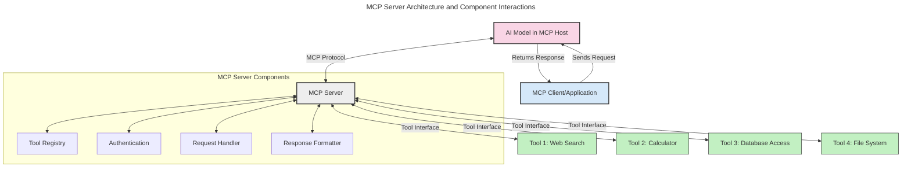
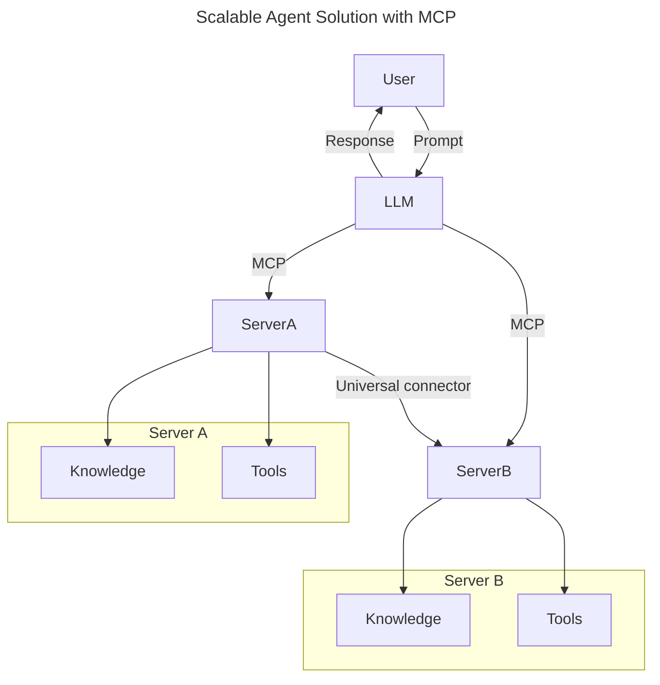
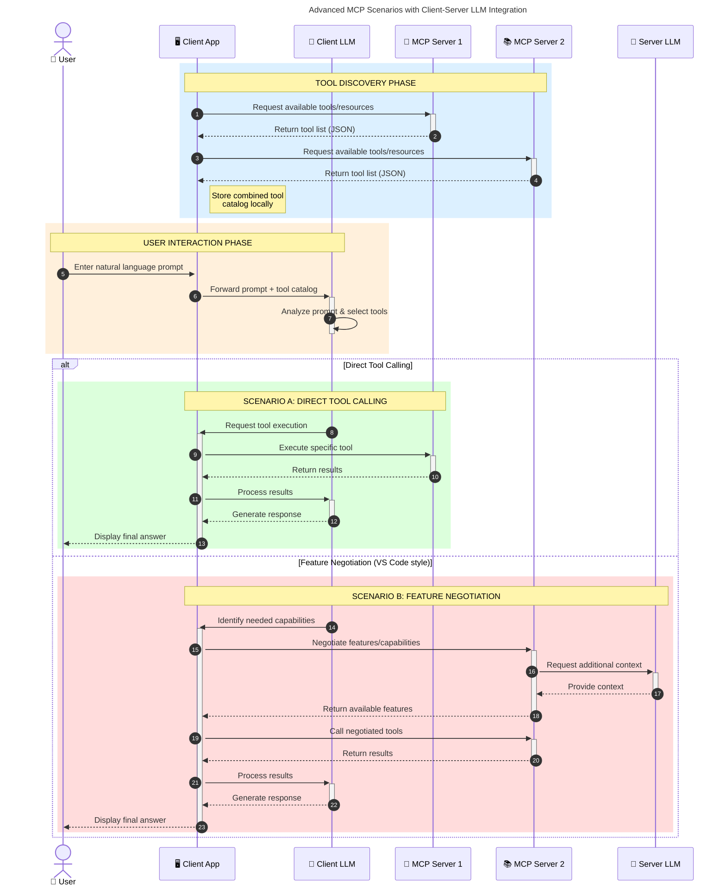

<!--
CO_OP_TRANSLATOR_METADATA:
{
  "original_hash": "1446979020432f512c883848d7eca144",
  "translation_date": "2025-05-29T21:47:13+00:00",
  "source_file": "00-Introduction/README.md",
  "language_code": "it"
}
-->
# Introduzione al Model Context Protocol (MCP): Perché è importante per applicazioni AI scalabili

Le applicazioni di AI generativa rappresentano un grande passo avanti, poiché spesso permettono all’utente di interagire con l’app tramite comandi in linguaggio naturale. Tuttavia, man mano che si investono più tempo e risorse in queste app, è importante assicurarsi che sia facile integrare funzionalità e risorse in modo estendibile, che l’app possa gestire l’uso di più modelli contemporaneamente e affrontare le diverse complessità dei modelli. In breve, costruire app Gen AI è semplice all’inizio, ma con la crescita e la maggiore complessità diventa necessario definire un’architettura e probabilmente affidarsi a uno standard per garantire coerenza nello sviluppo. Qui entra in gioco MCP, per organizzare e fornire uno standard.

---

## **🔍 Cos’è il Model Context Protocol (MCP)?**

Il **Model Context Protocol (MCP)** è un’**interfaccia aperta e standardizzata** che consente ai Large Language Models (LLM) di interagire senza problemi con strumenti esterni, API e fonti dati. Fornisce un’architettura coerente per estendere le funzionalità dei modelli AI oltre i dati di addestramento, abilitando sistemi AI più intelligenti, scalabili e reattivi.

---

## **🎯 Perché la standardizzazione nell’AI è importante**

Con l’aumentare della complessità delle applicazioni AI generativa, è fondamentale adottare standard che garantiscano **scalabilità, estendibilità** e **manutenibilità**. MCP risponde a queste esigenze:

- Unificando le integrazioni tra modelli e strumenti
- Riducendo soluzioni fragili e personalizzate una tantum
- Permettendo la convivenza di più modelli in un unico ecosistema

---

## **📚 Obiettivi di apprendimento**

Al termine di questo articolo sarai in grado di:

- Definire il **Model Context Protocol (MCP)** e i suoi casi d’uso
- Comprendere come MCP standardizza la comunicazione tra modello e strumenti
- Identificare i componenti principali dell’architettura MCP
- Esplorare applicazioni reali di MCP in contesti aziendali e di sviluppo

---

## **💡 Perché il Model Context Protocol (MCP) è rivoluzionario**

### **🔗 MCP risolve la frammentazione nelle interazioni AI**

Prima di MCP, integrare modelli con strumenti richiedeva:

- Codice personalizzato per ogni coppia strumento-modello
- API non standard per ogni fornitore
- Interruzioni frequenti dovute ad aggiornamenti
- Scarsa scalabilità con l’aumentare degli strumenti

### **✅ Vantaggi della standardizzazione MCP**

| **Vantaggio**             | **Descrizione**                                                                 |
|---------------------------|---------------------------------------------------------------------------------|
| Interoperabilità          | Gli LLM lavorano senza problemi con strumenti di diversi fornitori             |
| Coerenza                  | Comportamento uniforme su piattaforme e strumenti                              |
| Riutilizzabilità          | Strumenti costruiti una volta possono essere usati in più progetti e sistemi   |
| Sviluppo accelerato       | Riduce i tempi di sviluppo grazie a interfacce standardizzate plug-and-play    |

---

## **🧱 Panoramica dell’architettura MCP ad alto livello**

MCP segue un **modello client-server**, dove:

- **MCP Hosts** eseguono i modelli AI  
- **MCP Clients** avviano le richieste  
- **MCP Servers** forniscono contesto, strumenti e capacità  

### **Componenti chiave:**

- **Resources** – Dati statici o dinamici per i modelli  
- **Prompts** – Flussi di lavoro predefiniti per generazioni guidate  
- **Tools** – Funzioni eseguibili come ricerca, calcoli  
- **Sampling** – Comportamento agentico tramite interazioni ricorsive  

---

## Come funzionano gli MCP Server

Gli MCP Server operano nel seguente modo:

- **Flusso di richiesta**:  
    1. L’MCP Client invia una richiesta al modello AI in esecuzione su un MCP Host.  
    2. Il modello AI riconosce quando ha bisogno di strumenti o dati esterni.  
    3. Il modello comunica con l’MCP Server usando il protocollo standardizzato.

- **Funzionalità dell’MCP Server**:  
    - Registro strumenti: mantiene un catalogo degli strumenti disponibili e delle loro capacità.  
    - Autenticazione: verifica i permessi per l’accesso agli strumenti.  
    - Gestore richieste: elabora le richieste di strumenti in arrivo dal modello.  
    - Formattatore risposte: struttura l’output degli strumenti in un formato comprensibile dal modello.

- **Esecuzione degli strumenti**:  
    - Il server indirizza le richieste agli strumenti esterni appropriati  
    - Gli strumenti eseguono le loro funzioni specializzate (ricerca, calcolo, interrogazioni database, ecc.)  
    - I risultati vengono restituiti al modello in un formato coerente.

- **Completamento della risposta**:  
    - Il modello AI incorpora gli output degli strumenti nella sua risposta.  
    - La risposta finale viene inviata all’applicazione client.

## 👨‍💻 Come costruire un MCP Server (con esempi)

Gli MCP Server ti permettono di estendere le capacità degli LLM fornendo dati e funzionalità.

Pronto per provarlo? Ecco esempi per creare un semplice MCP server in diversi linguaggi:

- **Esempio Python**: https://github.com/modelcontextprotocol/python-sdk

- **Esempio TypeScript**: https://github.com/modelcontextprotocol/typescript-sdk

- **Esempio Java**: https://github.com/modelcontextprotocol/java-sdk

- **Esempio C#/.NET**: https://github.com/modelcontextprotocol/csharp-sdk

## 🌍 Casi d’uso reali per MCP

MCP abilita un’ampia gamma di applicazioni estendendo le capacità AI:

| **Applicazione**             | **Descrizione**                                                                 |
|-----------------------------|---------------------------------------------------------------------------------|
| Integrazione dati aziendali | Connette LLM a database, CRM o strumenti interni                               |
| Sistemi AI agentici         | Abilita agenti autonomi con accesso a strumenti e flussi decisionali            |
| Applicazioni multi-modali   | Combina strumenti di testo, immagine e audio in un’unica app AI unificata       |
| Integrazione dati in tempo reale | Porta dati live nelle interazioni AI per output più accurati e aggiornati   |

### 🧠 MCP = Standard universale per le interazioni AI

Il Model Context Protocol (MCP) funziona come uno standard universale per le interazioni AI, proprio come USB-C ha standardizzato le connessioni fisiche per i dispositivi. Nel mondo AI, MCP fornisce un’interfaccia coerente, permettendo ai modelli (client) di integrarsi senza problemi con strumenti esterni e fornitori di dati (server). Questo elimina la necessità di protocolli diversi e personalizzati per ogni API o fonte dati.

Con MCP, uno strumento compatibile (detto MCP server) segue uno standard unificato. Questi server possono elencare gli strumenti o le azioni che offrono ed eseguirle quando richieste da un agente AI. Le piattaforme agentiche che supportano MCP sono in grado di scoprire gli strumenti disponibili dai server e invocarli tramite questo protocollo standard.

### 💡 Facilita l’accesso alla conoscenza

Oltre a offrire strumenti, MCP facilita anche l’accesso alla conoscenza. Permette alle applicazioni di fornire contesto ai Large Language Models collegandoli a varie fonti dati. Ad esempio, un MCP server potrebbe rappresentare il repository documentale di un’azienda, consentendo agli agenti di recuperare informazioni rilevanti su richiesta. Un altro server potrebbe gestire azioni specifiche come inviare email o aggiornare record. Dal punto di vista dell’agente, questi sono semplicemente strumenti da usare: alcuni restituiscono dati (contesto di conoscenza), altri eseguono azioni. MCP gestisce entrambi in modo efficiente.

Un agente che si collega a un MCP server apprende automaticamente le capacità disponibili e i dati accessibili tramite un formato standard. Questa standardizzazione abilita la disponibilità dinamica degli strumenti. Ad esempio, aggiungendo un nuovo MCP server al sistema di un agente, le sue funzioni diventano immediatamente utilizzabili senza bisogno di personalizzazioni ulteriori nelle istruzioni dell’agente.

Questa integrazione fluida si allinea al flusso mostrato nel diagramma mermaid, dove i server forniscono sia strumenti che conoscenza, assicurando una collaborazione senza interruzioni tra i sistemi.

### 👉 Esempio: Soluzione agentica scalabile

### 🔄 Scenari avanzati MCP con integrazione LLM lato client

Oltre all’architettura MCP base, esistono scenari avanzati in cui sia client che server contengono LLM, permettendo interazioni più sofisticate:

## 🔐 Vantaggi pratici di MCP

Ecco i vantaggi pratici nell’uso di MCP:

- **Aggiornamento costante**: i modelli possono accedere a informazioni aggiornate oltre i dati di addestramento  
- **Estensione delle capacità**: i modelli possono sfruttare strumenti specializzati per compiti non previsti in fase di training  
- **Riduzione delle allucinazioni**: fonti dati esterne offrono basi fattuali  
- **Privacy**: i dati sensibili rimangono in ambienti sicuri senza essere incorporati nei prompt

## 📌 Punti chiave

Ecco i punti chiave sull’uso di MCP:

- **MCP** standardizza come i modelli AI interagiscono con strumenti e dati  
- Promuove **estendibilità, coerenza e interoperabilità**  
- MCP aiuta a **ridurre i tempi di sviluppo, migliorare l’affidabilità ed estendere le capacità dei modelli**  
- L’architettura client-server **consente applicazioni AI flessibili e estendibili**

## 🧠 Esercizio

Pensa a un’applicazione AI che ti interessa sviluppare.

- Quali **strumenti esterni o dati** potrebbero migliorarne le capacità?  
- In che modo MCP potrebbe rendere l’integrazione **più semplice e affidabile**?

## Risorse aggiuntive

- [MCP GitHub Repository](https://github.com/modelcontextprotocol)

## Cosa c’è dopo

Successivo: [Chapter 1: Core Concepts](/01-CoreConcepts/README.md)

**Disclaimer**:  
Questo documento è stato tradotto utilizzando il servizio di traduzione automatica AI [Co-op Translator](https://github.com/Azure/co-op-translator). Pur impegnandoci per garantire l'accuratezza, si prega di considerare che le traduzioni automatiche possono contenere errori o inesattezze. Il documento originale nella sua lingua nativa deve essere considerato la fonte autorevole. Per informazioni critiche, si raccomanda la traduzione professionale umana. Non ci assumiamo alcuna responsabilità per eventuali malintesi o interpretazioni errate derivanti dall'uso di questa traduzione.