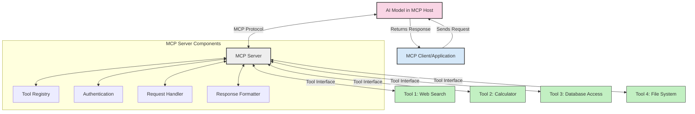
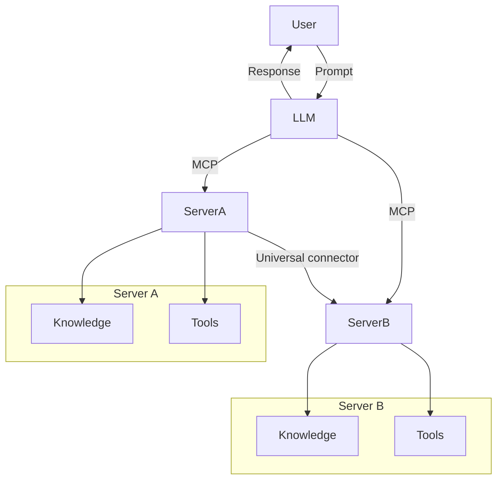

<!--
CO_OP_TRANSLATOR_METADATA:
{
  "original_hash": "02301140adbd807ecf0f17720fa307bc",
  "translation_date": "2025-05-17T05:59:37+00:00",
  "source_file": "00-Introduction/README.md",
  "language_code": "it"
}
-->
# Introduzione al Protocollo di Contesto Modello (MCP): Perché è importante per le applicazioni AI scalabili

Le applicazioni di AI generativa rappresentano un grande passo avanti poiché spesso permettono all'utente di interagire con l'app utilizzando suggerimenti in linguaggio naturale. Tuttavia, man mano che si investe più tempo e risorse in tali app, è importante garantire che sia possibile integrare facilmente funzionalità e risorse in modo che sia facile estendere, che l'app possa gestire più di un modello utilizzato e le sue complessità. In breve, costruire app di AI generativa è facile all'inizio, ma man mano che crescono e diventano più complesse, è necessario iniziare a definire un'architettura e probabilmente sarà necessario affidarsi a uno standard per garantire che le app siano costruite in modo coerente. È qui che entra in gioco MCP per organizzare le cose e fornire uno standard.

---

## **🔍 Cos'è il Protocollo di Contesto Modello (MCP)?**

Il **Protocollo di Contesto Modello (MCP)** è un **interfaccia standardizzata e aperta** che consente ai modelli di linguaggio di grandi dimensioni (LLM) di interagire senza problemi con strumenti esterni, API e fonti di dati. Fornisce un'architettura coerente per migliorare la funzionalità dei modelli AI oltre i loro dati di addestramento, permettendo sistemi AI più intelligenti, scalabili e reattivi.

---

## **🎯 Perché la standardizzazione nell'AI è importante**

Man mano che le applicazioni di AI generativa diventano più complesse, è essenziale adottare standard che garantiscano **scalabilità, estensibilità** e **manutenibilità**. MCP affronta queste esigenze attraverso:

- Unificazione delle integrazioni modello-strumento
- Riduzione di soluzioni personalizzate fragili e isolate
- Permettendo a più modelli di coesistere all'interno di un ecosistema

---

## **📚 Obiettivi di apprendimento**

Alla fine di questo articolo, sarai in grado di:

- Definire **Protocollo di Contesto Modello (MCP)** e i suoi casi d'uso
- Comprendere come MCP standardizza la comunicazione modello-strumento
- Identificare i componenti principali dell'architettura MCP
- Esplorare applicazioni reali di MCP in contesti aziendali e di sviluppo

---

## **💡 Perché il Protocollo di Contesto Modello (MCP) è rivoluzionario**

### **🔗 MCP risolve la frammentazione nelle interazioni AI**

Prima di MCP, l'integrazione dei modelli con gli strumenti richiedeva:

- Codice personalizzato per ogni coppia strumento-modello
- API non standard per ogni fornitore
- Rotture frequenti dovute agli aggiornamenti
- Scarsa scalabilità con più strumenti

### **✅ Vantaggi della standardizzazione MCP**

| **Vantaggio**              | **Descrizione**                                                                |
|----------------------------|--------------------------------------------------------------------------------|
| Interoperabilità           | Gli LLM funzionano senza problemi con strumenti di diversi fornitori           |
| Coerenza                   | Comportamento uniforme tra piattaforme e strumenti                             |
| Riutilizzabilità           | Strumenti costruiti una volta possono essere utilizzati tra progetti e sistemi |
| Sviluppo accelerato        | Ridurre il tempo di sviluppo utilizzando interfacce standardizzate plug-and-play |

---

## **🧱 Panoramica dell'architettura MCP a livello alto**

MCP segue un **modello client-server**, dove:

- **Host MCP** eseguono i modelli AI
- **Client MCP** iniziano le richieste
- **Server MCP** forniscono contesto, strumenti e capacità

### **Componenti chiave:**

- **Risorse** – Dati statici o dinamici per i modelli  
- **Prompt** – Flussi di lavoro predefiniti per generazione guidata  
- **Strumenti** – Funzioni eseguibili come ricerca, calcoli  
- **Campionamento** – Comportamento agentico tramite interazioni ricorsive

---

## Come funzionano i server MCP

I server MCP operano nel seguente modo:

- **Flusso di richiesta**: 
    1. Il Client MCP invia una richiesta al modello AI in esecuzione su un Host MCP.
    2. Il modello AI identifica quando ha bisogno di strumenti o dati esterni.
    3. Il modello comunica con il Server MCP utilizzando il protocollo standardizzato.

- **Funzionalità del Server MCP**:
    - Registro degli strumenti: Mantiene un catalogo degli strumenti disponibili e delle loro capacità.
    - Autenticazione: Verifica i permessi per l'accesso agli strumenti.
    - Gestore delle richieste: Elabora le richieste di strumenti in arrivo dal modello.
    - Formattatore delle risposte: Struttura gli output degli strumenti in un formato che il modello può comprendere.

- **Esecuzione degli strumenti**: 
    - Il server instrada le richieste agli strumenti esterni appropriati
    - Gli strumenti eseguono le loro funzioni specializzate (ricerca, calcolo, query di database, ecc.)
    - I risultati vengono restituiti al modello in un formato coerente.

- **Completamento della risposta**: 
    - Il modello AI incorpora gli output degli strumenti nella sua risposta.
    - La risposta finale viene inviata all'applicazione client.

## 👨‍💻 Come costruire un server MCP (con esempi)

I server MCP ti permettono di estendere le capacità degli LLM fornendo dati e funzionalità. 

Pronto a provarlo? Ecco esempi di creazione di un semplice server MCP in diverse lingue:

- **Esempio Python**: https://github.com/modelcontextprotocol/python-sdk

- **Esempio TypeScript**: https://github.com/modelcontextprotocol/typescript-sdk

- **Esempio Java**: https://github.com/modelcontextprotocol/java-sdk

- **Esempio C#/.NET**: https://github.com/modelcontextprotocol/csharp-sdk

## 🌍 Casi d'uso reali per MCP

MCP abilita una vasta gamma di applicazioni estendendo le capacità dell'AI:

| **Applicazione**               | **Descrizione**                                                              |
|--------------------------------|------------------------------------------------------------------------------|
| Integrazione dati aziendali    | Collegare LLM a database, CRM o strumenti interni                            |
| Sistemi AI agentici            | Abilitare agenti autonomi con accesso agli strumenti e flussi di lavoro decisionali |
| Applicazioni multimodali       | Combinare strumenti di testo, immagini e audio all'interno di un'unica app AI unificata |
| Integrazione dati in tempo reale | Portare dati live nelle interazioni AI per output più accurati e attuali     |

### 🧠 MCP = Standard universale per le interazioni AI

Il Protocollo di Contesto Modello (MCP) agisce come uno standard universale per le interazioni AI, proprio come USB-C ha standardizzato le connessioni fisiche per i dispositivi. Nel mondo dell'AI, MCP fornisce un'interfaccia coerente, permettendo ai modelli (client) di integrarsi senza problemi con strumenti esterni e fornitori di dati (server). Questo elimina la necessità di protocolli diversi e personalizzati per ogni API o fonte di dati.

Sotto MCP, uno strumento compatibile con MCP (riferito come server MCP) segue uno standard unificato. Questi server possono elencare gli strumenti o le azioni che offrono ed eseguire quelle azioni quando richiesto da un agente AI. Le piattaforme di agenti AI che supportano MCP sono in grado di scoprire gli strumenti disponibili dai server e invocarli tramite questo protocollo standard.

### 💡 Facilita l'accesso alla conoscenza

Oltre a offrire strumenti, MCP facilita anche l'accesso alla conoscenza. Consente alle applicazioni di fornire contesto ai modelli di linguaggio di grandi dimensioni (LLM) collegandoli a varie fonti di dati. Ad esempio, un server MCP potrebbe rappresentare un archivio documenti di un'azienda, permettendo agli agenti di recuperare informazioni rilevanti su richiesta. Un altro server potrebbe gestire azioni specifiche come inviare email o aggiornare record. Dal punto di vista dell'agente, questi sono semplicemente strumenti che può utilizzare—alcuni strumenti restituiscono dati (contesto della conoscenza), mentre altri eseguono azioni. MCP gestisce efficacemente entrambi.

Un agente che si connette a un server MCP apprende automaticamente le capacità disponibili del server e i dati accessibili tramite un formato standard. Questa standardizzazione consente la disponibilità dinamica degli strumenti. Ad esempio, aggiungere un nuovo server MCP al sistema di un agente rende immediatamente utilizzabili le sue funzioni senza richiedere ulteriori personalizzazioni delle istruzioni dell'agente.

Questa integrazione semplificata si allinea al flusso raffigurato nel diagramma mermaid, dove i server forniscono sia strumenti che conoscenza, garantendo una collaborazione senza problemi tra i sistemi.

### 👉 Esempio: Soluzione di agente scalabile

## 🔐 Benefici pratici di MCP

Ecco alcuni benefici pratici dell'utilizzo di MCP:

- **Freschezza**: I modelli possono accedere a informazioni aggiornate oltre i loro dati di addestramento
- **Estensione delle capacità**: I modelli possono sfruttare strumenti specializzati per compiti per cui non sono stati addestrati
- **Riduzione delle allucinazioni**: Le fonti di dati esterne forniscono un fondamento fattuale
- **Privacy**: I dati sensibili possono rimanere in ambienti sicuri invece di essere incorporati nei prompt

## 📌 Punti chiave

I seguenti sono punti chiave per l'utilizzo di MCP:

- **MCP** standardizza come i modelli AI interagiscono con strumenti e dati
- Promuove **estensibilità, coerenza e interoperabilità**
- MCP aiuta a **ridurre il tempo di sviluppo, migliorare l'affidabilità e estendere le capacità dei modelli**
- L'architettura client-server **abilita applicazioni AI flessibili ed estensibili**

## 🧠 Esercizio

Pensa a un'applicazione AI che sei interessato a costruire.

- Quali **strumenti o dati esterni** potrebbero migliorare le sue capacità?
- In che modo MCP potrebbe rendere l'integrazione **più semplice e affidabile?**

## Risorse aggiuntive

- [Repository GitHub MCP](https://github.com/modelcontextprotocol)

## Cosa c'è dopo

Prossimo: [Capitolo 1: Concetti fondamentali](/01-CoreConcepts/README.md)

**Disclaimer**:  
Questo documento è stato tradotto utilizzando il servizio di traduzione AI [Co-op Translator](https://github.com/Azure/co-op-translator). Sebbene ci impegniamo per l'accuratezza, si prega di essere consapevoli che le traduzioni automatizzate possono contenere errori o imprecisioni. Il documento originale nella sua lingua nativa dovrebbe essere considerato la fonte autorevole. Per informazioni critiche, si raccomanda una traduzione professionale umana. Non siamo responsabili per eventuali incomprensioni o interpretazioni errate derivanti dall'uso di questa traduzione.