<!--
CO_OP_TRANSLATOR_METADATA:
{
  "original_hash": "0df1ee78a6dd8300f3a040ca5b411c2e",
  "translation_date": "2025-08-18T17:39:01+00:00",
  "source_file": "00-Introduction/README.md",
  "language_code": "it"
}
-->
# Introduzione al Model Context Protocol (MCP): Perché è importante per applicazioni AI scalabili

_(Clicca sull'immagine sopra per vedere il video di questa lezione)_

Le applicazioni di AI generativa rappresentano un grande passo avanti, poiché spesso permettono agli utenti di interagire con l'app utilizzando prompt in linguaggio naturale. Tuttavia, man mano che si investono più tempo e risorse in queste app, è importante garantire che sia facile integrare funzionalità e risorse in modo da poterle estendere facilmente, che l'app possa supportare più modelli e gestire le varie complessità dei modelli. In breve, costruire app di AI generativa è semplice all'inizio, ma con la crescita e l'aumento della complessità, diventa necessario definire un'architettura e probabilmente affidarsi a uno standard per garantire che le app siano costruite in modo coerente. È qui che entra in gioco MCP per organizzare le cose e fornire uno standard.

---

## **🔍 Cos'è il Model Context Protocol (MCP)?**

Il **Model Context Protocol (MCP)** è un'interfaccia **aperta e standardizzata** che consente ai modelli di linguaggio di grandi dimensioni (LLM) di interagire senza problemi con strumenti esterni, API e fonti di dati. Fornisce un'architettura coerente per migliorare le funzionalità dei modelli AI oltre i loro dati di addestramento, rendendo i sistemi AI più intelligenti, scalabili e reattivi.

---

## **🎯 Perché la standardizzazione nell'AI è importante**

Man mano che le applicazioni di AI generativa diventano più complesse, è essenziale adottare standard che garantiscano **scalabilità, estensibilità, manutenibilità** e **evitare il lock-in con i fornitori**. MCP risponde a queste esigenze:

- Unificando le integrazioni tra modelli e strumenti
- Riducendo soluzioni personalizzate fragili e occasionali
- Permettendo a più modelli di fornitori diversi di coesistere in un unico ecosistema

**Nota:** Sebbene MCP si presenti come uno standard aperto, non ci sono piani per standardizzare MCP attraverso organismi di standardizzazione esistenti come IEEE, IETF, W3C, ISO o altri.

---

## **📚 Obiettivi di apprendimento**

Alla fine di questo articolo, sarai in grado di:

- Definire il **Model Context Protocol (MCP)** e i suoi casi d'uso
- Comprendere come MCP standardizza la comunicazione tra modelli e strumenti
- Identificare i componenti principali dell'architettura MCP
- Esplorare applicazioni reali di MCP in contesti aziendali e di sviluppo

---

## **💡 Perché il Model Context Protocol (MCP) è rivoluzionario**

### **🔗 MCP risolve la frammentazione nelle interazioni AI**

Prima di MCP, integrare modelli con strumenti richiedeva:

- Codice personalizzato per ogni coppia modello-strumento
- API non standard per ogni fornitore
- Rotture frequenti a causa di aggiornamenti
- Scarsa scalabilità con l'aumento degli strumenti

### **✅ Vantaggi della standardizzazione MCP**

| **Vantaggio**              | **Descrizione**                                                                |
|----------------------------|--------------------------------------------------------------------------------|
| Interoperabilità           | Gli LLM funzionano senza problemi con strumenti di fornitori diversi           |
| Coerenza                   | Comportamento uniforme su piattaforme e strumenti                              |
| Riutilizzabilità           | Strumenti costruiti una volta possono essere utilizzati in più progetti e sistemi |
| Sviluppo accelerato        | Riduzione dei tempi di sviluppo grazie a interfacce standard plug-and-play     |

---

## **🧱 Panoramica dell'architettura MCP ad alto livello**

MCP segue un modello **client-server**, dove:

- Gli **MCP Host** eseguono i modelli AI
- Gli **MCP Client** avviano richieste
- Gli **MCP Server** forniscono contesto, strumenti e funzionalità

### **Componenti principali:**

- **Risorse** – Dati statici o dinamici per i modelli  
- **Prompt** – Flussi di lavoro predefiniti per generazioni guidate  
- **Strumenti** – Funzioni eseguibili come ricerca, calcoli  
- **Campionamento** – Comportamento agentico tramite interazioni ricorsive

---

## Come funzionano i server MCP

I server MCP operano nel seguente modo:

- **Flusso di richiesta**:
    1. Una richiesta viene avviata da un utente finale o da un software che agisce per suo conto.
    2. Il **MCP Client** invia la richiesta a un **MCP Host**, che gestisce il runtime del modello AI.
    3. Il **modello AI** riceve il prompt dell'utente e può richiedere l'accesso a strumenti o dati esterni tramite una o più chiamate agli strumenti.
    4. L'**MCP Host**, non il modello direttamente, comunica con i relativi **MCP Server** utilizzando il protocollo standardizzato.
- **Funzionalità dell'MCP Host**:
    - **Registro degli strumenti**: Mantiene un catalogo degli strumenti disponibili e delle loro capacità.
    - **Autenticazione**: Verifica i permessi per l'accesso agli strumenti.
    - **Gestore delle richieste**: Elabora le richieste di strumenti in arrivo dal modello.
    - **Formattatore delle risposte**: Struttura i risultati degli strumenti in un formato comprensibile per il modello.
- **Esecuzione del server MCP**:
    - L'**MCP Host** indirizza le chiamate agli strumenti verso uno o più **MCP Server**, ciascuno dei quali espone funzioni specializzate (es. ricerca, calcoli, query di database).
    - Gli **MCP Server** eseguono le rispettive operazioni e restituiscono i risultati all'**MCP Host** in un formato coerente.
    - L'**MCP Host** formatta e inoltra questi risultati al **modello AI**.
- **Completamento della risposta**:
    - Il **modello AI** incorpora i risultati degli strumenti in una risposta finale.
    - L'**MCP Host** invia questa risposta al **MCP Client**, che la consegna all'utente finale o al software chiamante.

## 👨‍💻 Come costruire un server MCP (con esempi)

I server MCP consentono di estendere le capacità degli LLM fornendo dati e funzionalità.

Pronto a provarlo? Ecco SDK specifici per linguaggi e/o stack con esempi di creazione di server MCP semplici in diversi linguaggi/stack:

- **Python SDK**: https://github.com/modelcontextprotocol/python-sdk

- **TypeScript SDK**: https://github.com/modelcontextprotocol/typescript-sdk

- **Java SDK**: https://github.com/modelcontextprotocol/java-sdk

- **C#/.NET SDK**: https://github.com/modelcontextprotocol/csharp-sdk

---

## 🌍 Casi d'uso reali per MCP

MCP abilita una vasta gamma di applicazioni estendendo le capacità dell'AI:

| **Applicazione**              | **Descrizione**                                                                |
|------------------------------|--------------------------------------------------------------------------------|
| Integrazione dati aziendali  | Collegare gli LLM a database, CRM o strumenti interni                          |
| Sistemi AI agentici          | Abilitare agenti autonomi con accesso agli strumenti e flussi decisionali      |
| Applicazioni multimodali     | Combinare strumenti di testo, immagine e audio in un'unica app AI unificata    |
| Integrazione dati in tempo reale | Portare dati live nelle interazioni AI per output più accurati e aggiornati |

---

### 🧠 MCP = Standard universale per le interazioni AI

Il Model Context Protocol (MCP) agisce come uno standard universale per le interazioni AI, proprio come USB-C ha standardizzato le connessioni fisiche per i dispositivi. Nel mondo dell'AI, MCP fornisce un'interfaccia coerente, permettendo ai modelli (client) di integrarsi senza problemi con strumenti esterni e fornitori di dati (server). Questo elimina la necessità di protocolli personalizzati e diversificati per ogni API o fonte di dati.

---

### 💡 Facilita l'accesso alla conoscenza

Oltre a offrire strumenti, MCP facilita anche l'accesso alla conoscenza. Consente alle applicazioni di fornire contesto ai modelli di linguaggio di grandi dimensioni (LLM) collegandoli a varie fonti di dati. Ad esempio, un server MCP potrebbe rappresentare il repository documentale di un'azienda, permettendo agli agenti di recuperare informazioni pertinenti su richiesta. Un altro server potrebbe gestire azioni specifiche come inviare email o aggiornare record. Dal punto di vista dell'agente, questi sono semplicemente strumenti che può utilizzare: alcuni strumenti restituiscono dati (contesto di conoscenza), mentre altri eseguono azioni. MCP gestisce entrambi in modo efficiente.

Un agente che si collega a un server MCP apprende automaticamente le capacità disponibili e i dati accessibili del server tramite un formato standard. Questa standardizzazione consente la disponibilità dinamica degli strumenti. Ad esempio, aggiungere un nuovo server MCP al sistema di un agente rende immediatamente utilizzabili le sue funzioni senza richiedere ulteriori personalizzazioni delle istruzioni dell'agente.

---

### 👉 Esempio: Soluzione scalabile per agenti

---

### 🔄 Scenari avanzati MCP con integrazione LLM lato client

Oltre all'architettura MCP di base, ci sono scenari avanzati in cui sia il client che il server contengono LLM, abilitando interazioni più sofisticate. Nel diagramma seguente, **Client App** potrebbe essere un IDE con una serie di strumenti MCP disponibili per l'uso da parte dell'LLM:

```mermaid
---
title: Advanced MCP Scenarios with Client-Server LLM Integration
description: A sequence diagram showing the detailed interaction flow between user, client application, client LLM, multiple MCP servers, and server LLM, illustrating tool discovery, user interaction, direct tool calling, and feature negotiation phases
---
sequenceDiagram
    autonumber
    actor User as 👤 User
    participant ClientApp as 🖥️ Client App
    participant ClientLLM as 🧠 Client LLM
    participant Server1 as 🔧 MCP Server 1
    participant Server2 as 📚 MCP Server 2
    participant ServerLLM as 🤖 Server LLM
    
    %% Discovery Phase
    rect rgb(220, 240, 255)
        Note over ClientApp, Server2: TOOL DISCOVERY PHASE
        ClientApp->>+Server1: Request available tools/resources
        Server1-->>-ClientApp: Return tool list (JSON)
        ClientApp->>+Server2: Request available tools/resources
        Server2-->>-ClientApp: Return tool list (JSON)
        Note right of ClientApp: Store combined tool<br/>catalog locally
    end
    
    %% User Interaction
    rect rgb(255, 240, 220)
        Note over User, ClientLLM: USER INTERACTION PHASE
        User->>+ClientApp: Enter natural language prompt
        ClientApp->>+ClientLLM: Forward prompt + tool catalog
        ClientLLM->>-ClientLLM: Analyze prompt & select tools
    end
    
    %% Scenario A: Direct Tool Calling
    alt Direct Tool Calling
        rect rgb(220, 255, 220)
            Note over ClientApp, Server1: SCENARIO A: DIRECT TOOL CALLING
            ClientLLM->>+ClientApp: Request tool execution
            ClientApp->>+Server1: Execute specific tool
            Server1-->>-ClientApp: Return results
            ClientApp->>+ClientLLM: Process results
            ClientLLM-->>-ClientApp: Generate response
            ClientApp-->>-User: Display final answer
        end
    
    %% Scenario B: Feature Negotiation (VS Code style)
    else Feature Negotiation (VS Code style)
        rect rgb(255, 220, 220)
            Note over ClientApp, ServerLLM: SCENARIO B: FEATURE NEGOTIATION
            ClientLLM->>+ClientApp: Identify needed capabilities
            ClientApp->>+Server2: Negotiate features/capabilities
            Server2->>+ServerLLM: Request additional context
            ServerLLM-->>-Server2: Provide context
            Server2-->>-ClientApp: Return available features
            ClientApp->>+Server2: Call negotiated tools
            Server2-->>-ClientApp: Return results
            ClientApp->>+ClientLLM: Process results
            ClientLLM-->>-ClientApp: Generate response
            ClientApp-->>-User: Display final answer
        end
    end
```

---

## 🔐 Vantaggi pratici di MCP

Ecco i vantaggi pratici dell'utilizzo di MCP:

- **Aggiornamento**: I modelli possono accedere a informazioni aggiornate oltre i loro dati di addestramento
- **Estensione delle capacità**: I modelli possono sfruttare strumenti specializzati per compiti per cui non sono stati addestrati
- **Riduzione delle allucinazioni**: Le fonti di dati esterne forniscono un fondamento fattuale
- **Privacy**: I dati sensibili possono rimanere in ambienti sicuri invece di essere incorporati nei prompt

---

## 📌 Punti chiave

I seguenti sono i punti chiave per l'utilizzo di MCP:

- **MCP** standardizza il modo in cui i modelli AI interagiscono con strumenti e dati
- Promuove **estensibilità, coerenza e interoperabilità**
- MCP aiuta a **ridurre i tempi di sviluppo, migliorare l'affidabilità e ampliare le capacità dei modelli**
- L'architettura client-server **abilita applicazioni AI flessibili ed estensibili**

---

## 🧠 Esercizio

Pensa a un'applicazione AI che ti interessa costruire.

- Quali **strumenti o dati esterni** potrebbero migliorarne le capacità?
- In che modo MCP potrebbe rendere l'integrazione **più semplice e affidabile?**

---

## Risorse aggiuntive

- [Repository GitHub di MCP](https://github.com/modelcontextprotocol)

---

## Cosa c'è dopo

Prossimo: [Capitolo 1: Concetti fondamentali](../01-CoreConcepts/README.md)

**Disclaimer**:  
Questo documento è stato tradotto utilizzando il servizio di traduzione automatica [Co-op Translator](https://github.com/Azure/co-op-translator). Sebbene ci impegniamo per garantire l'accuratezza, si prega di notare che le traduzioni automatiche possono contenere errori o imprecisioni. Il documento originale nella sua lingua nativa dovrebbe essere considerato la fonte autorevole. Per informazioni critiche, si consiglia una traduzione professionale eseguita da un traduttore umano. Non siamo responsabili per eventuali fraintendimenti o interpretazioni errate derivanti dall'uso di questa traduzione.