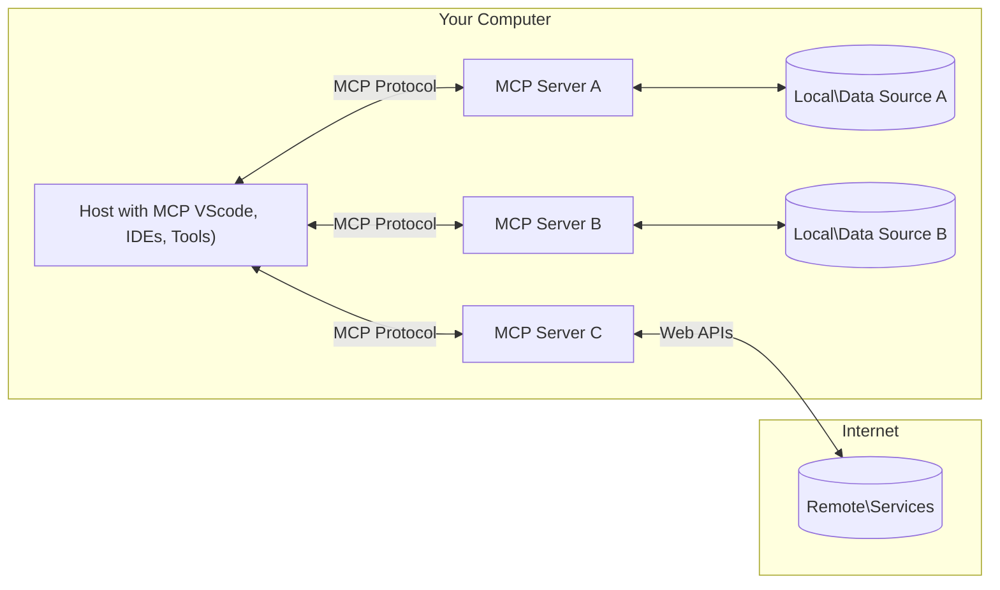

<!--
CO_OP_TRANSLATOR_METADATA:
{
  "original_hash": "355b12a5970c5c9e6db0bee970c751ba",
  "translation_date": "2025-07-04T17:04:09+00:00",
  "source_file": "01-CoreConcepts/README.md",
  "language_code": "it"
}
-->
# 📖 Concetti Fondamentali di MCP: Padroneggiare il Model Context Protocol per l’Integrazione AI

Il [Model Context Protocol (MCP)](https://github.com/modelcontextprotocol) è un framework potente e standardizzato che ottimizza la comunicazione tra Large Language Models (LLM) e strumenti esterni, applicazioni e fonti di dati. Questa guida ottimizzata per SEO ti accompagnerà attraverso i concetti chiave di MCP, assicurandoti di comprendere la sua architettura client-server, i componenti essenziali, i meccanismi di comunicazione e le migliori pratiche di implementazione.

## Panoramica

Questa lezione esplora l’architettura fondamentale e i componenti che costituiscono l’ecosistema del Model Context Protocol (MCP). Imparerai l’architettura client-server, i componenti chiave e i meccanismi di comunicazione che alimentano le interazioni MCP.

## 👩‍🎓 Obiettivi di Apprendimento Principali

Al termine di questa lezione, sarai in grado di:

- Comprendere l’architettura client-server di MCP.
- Identificare ruoli e responsabilità di Hosts, Clients e Servers.
- Analizzare le caratteristiche principali che rendono MCP un livello di integrazione flessibile.
- Apprendere come fluisce l’informazione all’interno dell’ecosistema MCP.
- Ottenere approfondimenti pratici tramite esempi di codice in .NET, Java, Python e JavaScript.

## 🔎 Architettura MCP: Uno Sguardo Approfondito

L’ecosistema MCP si basa su un modello client-server. Questa struttura modulare permette alle applicazioni AI di interagire in modo efficiente con strumenti, database, API e risorse contestuali. Analizziamo questa architettura nei suoi componenti principali.

Alla base, MCP segue un’architettura client-server in cui un’applicazione host può connettersi a più server:



- **MCP Hosts**: Programmi come VSCode, Claude Desktop, IDE o strumenti AI che vogliono accedere ai dati tramite MCP
- **MCP Clients**: Client del protocollo che mantengono connessioni 1:1 con i server
- **MCP Servers**: Programmi leggeri che espongono specifiche funzionalità attraverso il Model Context Protocol standardizzato
- **Fonti di Dati Locali**: File, database e servizi del tuo computer a cui i server MCP possono accedere in modo sicuro
- **Servizi Remoti**: Sistemi esterni disponibili su internet a cui i server MCP possono connettersi tramite API.

Il Protocollo MCP è uno standard in evoluzione, puoi vedere gli ultimi aggiornamenti alla [specifica del protocollo](https://modelcontextprotocol.io/specification/2025-06-18/)

### 1. Hosts

Nel Model Context Protocol (MCP), gli Hosts svolgono un ruolo cruciale come interfaccia principale attraverso cui gli utenti interagiscono con il protocollo. Gli Hosts sono applicazioni o ambienti che avviano connessioni con i server MCP per accedere a dati, strumenti e prompt. Esempi di Hosts includono ambienti di sviluppo integrati (IDE) come Visual Studio Code, strumenti AI come Claude Desktop o agenti personalizzati progettati per compiti specifici.

**Gli Hosts** sono applicazioni LLM che avviano le connessioni. Essi:

- Eseguono o interagiscono con modelli AI per generare risposte.
- Avviano connessioni con i server MCP.
- Gestiscono il flusso della conversazione e l’interfaccia utente.
- Controllano permessi e vincoli di sicurezza.
- Gestiscono il consenso dell’utente per la condivisione dei dati e l’esecuzione degli strumenti.

### 2. Clients

I Clients sono componenti essenziali che facilitano l’interazione tra Hosts e server MCP. I Clients agiscono da intermediari, permettendo agli Hosts di accedere e utilizzare le funzionalità offerte dai server MCP. Svolgono un ruolo fondamentale per garantire una comunicazione fluida e uno scambio dati efficiente all’interno dell’architettura MCP.

**I Clients** sono connettori all’interno dell’applicazione host. Essi:

- Invia richieste ai server con prompt/istruzioni.
- Negoziano le capacità con i server.
- Gestiscono le richieste di esecuzione degli strumenti da parte dei modelli.
- Elaborano e mostrano le risposte agli utenti.

### 3. Servers

I Servers sono responsabili di gestire le richieste dai client MCP e fornire risposte appropriate. Gestiscono varie operazioni come il recupero dati, l’esecuzione di strumenti e la generazione di prompt. I Servers assicurano che la comunicazione tra client e Hosts sia efficiente e affidabile, mantenendo l’integrità del processo di interazione.

**I Servers** sono servizi che forniscono contesto e funzionalità. Essi:

- Registrano le funzionalità disponibili (risorse, prompt, strumenti)
- Ricevono ed eseguono chiamate agli strumenti dal client
- Forniscono informazioni contestuali per migliorare le risposte del modello
- Restituiscono i risultati al client
- Mantengono lo stato tra le interazioni quando necessario

I Servers possono essere sviluppati da chiunque per estendere le capacità del modello con funzionalità specializzate.

### 4. Funzionalità dei Server

I server nel Model Context Protocol (MCP) offrono blocchi fondamentali che permettono interazioni ricche tra client, host e modelli linguistici. Queste funzionalità sono progettate per potenziare MCP offrendo contesto strutturato, strumenti e prompt.

I server MCP possono offrire una o più delle seguenti funzionalità:

#### 📑 Risorse

Le risorse nel Model Context Protocol (MCP) comprendono vari tipi di contesto e dati che possono essere utilizzati dagli utenti o dai modelli AI. Questi includono:

- **Dati Contestuali**: Informazioni e contesto che utenti o modelli AI possono sfruttare per prendere decisioni ed eseguire compiti.
- **Basi di Conoscenza e Archivi Documentali**: Collezioni di dati strutturati e non strutturati, come articoli, manuali e pubblicazioni scientifiche, che forniscono approfondimenti e informazioni preziose.
- **File Locali e Database**: Dati memorizzati localmente su dispositivi o all’interno di database, accessibili per elaborazione e analisi.
- **API e Servizi Web**: Interfacce e servizi esterni che offrono dati e funzionalità aggiuntive, permettendo l’integrazione con varie risorse e strumenti online.

Un esempio di risorsa può essere uno schema di database o un file accessibile in questo modo:

```text
file://log.txt
database://schema
```

### 🤖 Prompt

I prompt nel Model Context Protocol (MCP) includono vari modelli predefiniti e schemi di interazione progettati per semplificare i flussi di lavoro degli utenti e migliorare la comunicazione. Questi includono:

- **Messaggi e Flussi di Lavoro Prestrutturati**: Messaggi e processi predefiniti che guidano gli utenti attraverso compiti e interazioni specifiche.
- **Schemi di Interazione Predefiniti**: Sequenze standardizzate di azioni e risposte che facilitano una comunicazione coerente ed efficiente.
- **Template di Conversazione Specializzati**: Modelli personalizzabili pensati per tipi specifici di conversazioni, garantendo interazioni rilevanti e contestualmente appropriate.

Un template di prompt può apparire così:

```markdown
Generate a product slogan based on the following {{product}} with the following {{keywords}}
```

#### ⛏️ Strumenti

Gli strumenti nel Model Context Protocol (MCP) sono funzioni che il modello AI può eseguire per svolgere compiti specifici. Questi strumenti sono progettati per potenziare le capacità del modello AI fornendo operazioni strutturate e affidabili. Aspetti chiave includono:

- **Funzioni eseguibili dal modello AI**: Gli strumenti sono funzioni eseguibili che il modello AI può invocare per svolgere vari compiti.
- **Nome Unico e Descrizione**: Ogni strumento ha un nome distinto e una descrizione dettagliata che spiega scopo e funzionalità.
- **Parametri e Output**: Gli strumenti accettano parametri specifici e restituiscono output strutturati, garantendo risultati coerenti e prevedibili.
- **Funzioni Discrete**: Gli strumenti eseguono funzioni discrete come ricerche web, calcoli e query su database.

Un esempio di strumento potrebbe essere così:

```typescript
server.tool(
  "GetProducts",
  {
    pageSize: z.string().optional(),
    pageCount: z.string().optional()
  }, () => {
    // return results from API
  }
)
```

## Funzionalità dei Client

Nel Model Context Protocol (MCP), i client offrono diverse funzionalità chiave ai server, migliorando la funzionalità complessiva e l’interazione all’interno del protocollo. Una delle funzionalità più rilevanti è il Sampling.

### 👉 Sampling

- **Comportamenti Agentici Iniziati dal Server**: I client permettono ai server di avviare azioni o comportamenti specifici in modo autonomo, potenziando le capacità dinamiche del sistema.
- **Interazioni Ricorsive con LLM**: Questa funzionalità consente interazioni ricorsive con i large language models (LLM), permettendo elaborazioni più complesse e iterative dei compiti.
- **Richiesta di Completamenti Aggiuntivi del Modello**: I server possono richiedere completamenti aggiuntivi dal modello, assicurando risposte complete e contestualmente rilevanti.

## Flusso di Informazioni in MCP

Il Model Context Protocol (MCP) definisce un flusso strutturato di informazioni tra host, client, server e modelli. Comprendere questo flusso aiuta a chiarire come vengono processate le richieste degli utenti e come strumenti esterni e dati vengono integrati nelle risposte del modello.

- **Host Avvia la Connessione**  
  L’applicazione host (come un IDE o un’interfaccia chat) stabilisce una connessione a un server MCP, tipicamente tramite STDIO, WebSocket o un altro trasporto supportato.

- **Negoziazione delle Capacità**  
  Il client (incorporato nell’host) e il server scambiano informazioni sulle funzionalità supportate, strumenti, risorse e versioni del protocollo. Questo assicura che entrambe le parti comprendano quali capacità sono disponibili per la sessione.

- **Richiesta Utente**  
  L’utente interagisce con l’host (ad esempio inserendo un prompt o un comando). L’host raccoglie questo input e lo passa al client per l’elaborazione.

- **Uso di Risorse o Strumenti**  
  - Il client può richiedere contesto o risorse aggiuntive al server (come file, voci di database o articoli di basi di conoscenza) per arricchire la comprensione del modello.
  - Se il modello determina che è necessario uno strumento (ad esempio per recuperare dati, eseguire un calcolo o chiamare un’API), il client invia una richiesta di invocazione dello strumento al server, specificando nome e parametri dello strumento.

- **Esecuzione da parte del Server**  
  Il server riceve la richiesta di risorsa o strumento, esegue le operazioni necessarie (come eseguire una funzione, interrogare un database o recuperare un file) e restituisce i risultati al client in un formato strutturato.

- **Generazione della Risposta**  
  Il client integra le risposte del server (dati delle risorse, output degli strumenti, ecc.) nell’interazione in corso con il modello. Il modello usa queste informazioni per generare una risposta completa e contestualmente rilevante.

- **Presentazione del Risultato**  
  L’host riceve l’output finale dal client e lo presenta all’utente, spesso includendo sia il testo generato dal modello sia eventuali risultati derivanti dall’esecuzione degli strumenti o dalla consultazione delle risorse.

Questo flusso permette a MCP di supportare applicazioni AI avanzate, interattive e consapevoli del contesto, collegando senza soluzione di continuità modelli con strumenti esterni e fonti di dati.

## Dettagli del Protocollo

MCP (Model Context Protocol) si basa su [JSON-RPC 2.0](https://www.jsonrpc.org/), fornendo un formato di messaggi standardizzato e indipendente dal linguaggio per la comunicazione tra host, client e server. Questa base consente interazioni affidabili, strutturate ed estensibili su piattaforme e linguaggi di programmazione diversi.

### Caratteristiche Chiave del Protocollo

MCP estende JSON-RPC 2.0 con convenzioni aggiuntive per l’invocazione di strumenti, l’accesso alle risorse e la gestione dei prompt. Supporta più livelli di trasporto (STDIO, WebSocket, SSE) e abilita comunicazioni sicure, estensibili e indipendenti dal linguaggio tra i componenti.

#### 🧢 Protocollo Base

- **Formato Messaggi JSON-RPC**: Tutte le richieste e risposte utilizzano la specifica JSON-RPC 2.0, garantendo una struttura coerente per chiamate di metodo, parametri, risultati e gestione degli errori.
- **Connessioni Stateful**: Le sessioni MCP mantengono lo stato attraverso più richieste, supportando conversazioni continue, accumulo di contesto e gestione delle risorse.
- **Negoziazione delle Capacità**: Durante la configurazione della connessione, client e server scambiano informazioni sulle funzionalità supportate, versioni del protocollo, strumenti e risorse disponibili. Questo assicura che entrambe le parti comprendano le capacità reciproche e possano adattarsi di conseguenza.

#### ➕ Utilità Aggiuntive

Di seguito alcune utilità e estensioni del protocollo che MCP offre per migliorare l’esperienza dello sviluppatore e abilitare scenari avanzati:

- **Opzioni di Configurazione**: MCP permette la configurazione dinamica dei parametri di sessione, come permessi sugli strumenti, accesso alle risorse e impostazioni del modello, personalizzate per ogni interazione.
- **Tracciamento del Progresso**: Operazioni di lunga durata possono segnalare aggiornamenti sul progresso, permettendo interfacce utente reattive e una migliore esperienza durante compiti complessi.
- **Cancellazione delle Richieste**: I client possono annullare richieste in corso, consentendo agli utenti di interrompere operazioni non più necessarie o troppo lunghe.
- **Segnalazione degli Errori**: Messaggi e codici di errore standardizzati aiutano a diagnosticare problemi, gestire fallimenti in modo elegante e fornire feedback utili a utenti e sviluppatori.
- **Logging**: Sia client che server possono emettere log strutturati per auditing, debug e monitoraggio delle interazioni del protocollo.

Sfruttando queste funzionalità, MCP garantisce comunicazioni robuste, sicure e flessibili tra modelli linguistici e strumenti o fonti di dati esterni.

### 🔐 Considerazioni sulla Sicurezza

Le implementazioni MCP dovrebbero aderire a diversi principi chiave di sicurezza per garantire interazioni sicure e affidabili:

- **Consenso e Controllo dell’Utente**: Gli utenti devono fornire consenso esplicito prima che qualsiasi dato venga accesso o che operazioni vengano eseguite. Devono avere un controllo chiaro su quali dati vengono condivisi e quali azioni sono autorizzate, supportati da interfacce utente intuitive per la revisione e l’approvazione delle attività.

- **Privacy dei Dati**: I dati degli utenti devono essere esposti solo con consenso esplicito e protetti da adeguati controlli di accesso. Le implementazioni MCP devono prevenire trasmissioni non autorizzate e garantire che la privacy sia mantenuta in tutte le interazioni.

- **Sicurezza degli Strumenti**: Prima di invocare qualsiasi strumento, è richiesto il consenso esplicito dell’utente. Gli utenti devono comprendere chiaramente la funzionalità di ogni strumento e devono essere applicati confini di sicurezza robusti per prevenire esecuzioni non intenzionali o pericolose.

Seguendo questi principi, MCP assicura che fiducia, privacy e sicurezza degli utenti siano mantenute in tutte le interazioni del protocollo.

## Esempi di Codice: Componenti Chiave

Di seguito esempi di codice in diversi linguaggi popolari che illustrano come implementare componenti chiave di un server MCP e strumenti.

### Esempio .NET: Creare un Server MCP Semplice con Strumenti

Ecco un esempio pratico in .NET che mostra come implementare un server MCP semplice con strumenti personalizzati. Questo esempio illustra come definire e registrare strumenti, gestire richieste e connettere il server usando il Model Context Protocol.

```csharp
using System;
using System.Threading.Tasks;
using ModelContextProtocol.Server;
using ModelContextProtocol.Server.Transport;
using ModelContextProtocol.Server.Tools;

public class WeatherServer
{
    public static async Task Main(string[] args)
    {
        // Create an MCP server
        var server = new McpServer(
            name: "Weather MCP Server",
            version: "1.0.0"
        );
        
        // Register our custom weather tool
        server.AddTool<string, WeatherData>("weatherTool", 
            description: "Gets current weather for a location",
            execute: async (location) => {
                // Call weather API (simplified)
                var weatherData = await GetWeatherDataAsync(location);
                return weatherData;
            });
        
        // Connect the server using stdio transport
        var transport = new StdioServerTransport();
        await server.ConnectAsync(transport);
        
        Console.WriteLine("Weather MCP Server started");
        
        // Keep the server running until process is terminated
        await Task.Delay(-1);
    }
    
    private static async Task<WeatherData> GetWeatherDataAsync(string location)
    {
        // This would normally call a weather API
        // Simplified for demonstration
        await Task.Delay(100); // Simulate API call
        return new WeatherData { 
            Temperature = 72.5,
            Conditions = "Sunny",
            Location = location
        };
    }
}

public class WeatherData
{
    public double Temperature { get; set; }
    public string Conditions { get; set; }
    public string Location { get; set; }
}
```

### Esempio Java: Componenti Server MCP

Questo esempio mostra lo stesso server MCP e la registrazione degli strumenti come nell’esempio .NET sopra, ma implementato in Java.

```java
import io.modelcontextprotocol.server.McpServer;
import io.modelcontextprotocol.server.McpToolDefinition;
import io.modelcontextprotocol.server.transport.StdioServerTransport;
import io.modelcontextprotocol.server.tool.ToolExecutionContext;
import io.modelcontextprotocol.server.tool.ToolResponse;

public class WeatherMcpServer {
    public static void main(String[] args) throws Exception {
        // Create an MCP server
        McpServer server = McpServer.builder()
            .name("Weather MCP Server")
            .version("1.0.0")
            .build();
            
        // Register a weather tool
        server.registerTool(McpToolDefinition.builder("weatherTool")
            .description("Gets current weather for a location")
            .parameter("location", String.class)
            .execute((ToolExecutionContext ctx) -> {
                String location = ctx.getParameter("location", String.class);
                
                // Get weather data (simplified)
                WeatherData data = getWeatherData(location);
                
                // Return formatted response
                return ToolResponse.content(
                    String.format("Temperature: %.1f°F, Conditions: %s, Location: %s", 
                    data.getTemperature(), 
                    data.getConditions(), 
                    data.getLocation())
                );
            })
            .build());
        
        // Connect the server using stdio transport
        try (StdioServerTransport transport = new StdioServerTransport()) {
            server.connect(transport);
            System.out.println("Weather MCP Server started");
            // Keep server running until process is terminated
            Thread.currentThread().join();
        }
    }
    
    private static WeatherData getWeatherData(String location) {
        // Implementation would call a weather API
        // Simplified for example purposes
        return new WeatherData(72.5, "Sunny", location);
    }
}

class WeatherData {
    private double temperature;
    private String conditions;
    private String location;
    
    public WeatherData(double temperature, String conditions, String location) {
        this.temperature = temperature;
        this.conditions = conditions;
        this.location = location;
    }
    
    public double getTemperature() {
        return temperature;
    }
    
    public String getConditions() {
        return conditions;
    }
    
    public String getLocation() {
        return location;
    }
}
```

### Esempio Python: Costruire un Server MCP

In questo esempio mostriamo come costruire un server MCP in Python. Vengono mostrati anche due modi diversi per creare strumenti.

```python
#!/usr/bin/env python3
import asyncio
from mcp.server.fastmcp import FastMCP
from mcp.server.transports.stdio import serve_stdio

# Create a FastMCP server
mcp = FastMCP(
    name="Weather MCP Server",
    version="1.0.0"
)

@mcp.tool()
def get_weather(location: str) -> dict:
    """Gets current weather for a location."""
    # This would normally call a weather API
    # Simplified for demonstration
    return {
        "temperature": 72.5,
        "conditions": "Sunny",
        "location": location
    }

# Alternative approach using a class
class WeatherTools:
    @mcp.tool()
    def forecast(self, location: str, days: int = 1) -> dict:
        """Gets weather forecast for a location for the specified number of days."""
        # This would normally call a weather API forecast endpoint
        # Simplified for demonstration
        return {
            "location": location,
            "forecast": [
                {"day": i+1, "temperature": 70 + i, "conditions": "Partly Cloudy"}
                for i in range(days)
            ]
        }

# Instantiate the class to register its tools
weather_tools = WeatherTools()

# Start the server using stdio transport
if __name__ == "__main__":
    asyncio.run(serve_stdio(mcp))
```

### Esempio JavaScript: Creare un Server MCP

Questo esempio mostra la creazione di un server MCP in JavaScript e come registrare due strumenti relativi al meteo.

```javascript
// Using the official Model Context Protocol SDK
import { McpServer } from "@modelcontextprotocol/sdk/server/mcp.js";
import { StdioServerTransport } from "@modelcontextprotocol/sdk/server/stdio.js";
import { z } from "zod"; // For parameter validation

// Create an MCP server
const server = new McpServer({
  name: "Weather MCP Server",
  version: "1.0.0"
});

// Define a weather tool
server.tool(
  "weatherTool",
  {
    location: z.string().describe("The location to get weather for")
  },
  async ({ location }) => {
    // This would normally call a weather API
    // Simplified for demonstration
    const weatherData = await getWeatherData(location);
    
    return {
      content: [
        { 
          type: "text", 
          text: `Temperature: ${weatherData.temperature}°F, Conditions: ${weatherData.conditions}, Location: ${weatherData.location}` 
        }
      ]
    };
  }
);

// Define a forecast tool
server.tool(
  "forecastTool",
  {
    location: z.string(),
    days: z.number().default(3).describe("Number of days for forecast")
  },
  async ({ location, days }) => {
    // This would normally call a weather API
    // Simplified for demonstration
    const forecast = await getForecastData(location, days);
    
    return {
      content: [
        { 
          type: "text", 
          text: `${days}-day forecast for ${location}: ${JSON.stringify(forecast)}` 
        }
      ]
    };
  }
);

// Helper functions
async function getWeatherData(location) {
  // Simulate API call
  return {
    temperature: 72.5,
    conditions: "Sunny",
    location: location
  };
}

async function getForecastData(location, days) {
  // Simulate API call
  return Array.from({ length: days }, (_, i) => ({
    day: i + 1,
    temperature: 70 + Math.floor(Math.random() * 10),
    conditions: i % 2 === 0 ? "Sunny" : "Partly Cloudy"
  }));
}

// Connect the server using stdio transport
const transport = new StdioServerTransport();
server.connect(transport).catch(console.error);

console.log("Weather MCP Server started");
```

Questo esempio JavaScript dimostra come creare un client MCP che si connette a un server, invia un prompt e processa la risposta, inclusi eventuali richiami agli strumenti effettuati.

## Sicurezza e Autorizzazione
MCP include diversi concetti e meccanismi integrati per gestire la sicurezza e l'autorizzazione lungo tutto il protocollo:

1. **Controllo dei Permessi degli Strumenti**:  
  I client possono specificare quali strumenti un modello è autorizzato a utilizzare durante una sessione. Questo garantisce che solo gli strumenti esplicitamente autorizzati siano accessibili, riducendo il rischio di operazioni non intenzionali o non sicure. I permessi possono essere configurati dinamicamente in base alle preferenze dell'utente, alle politiche organizzative o al contesto dell'interazione.

2. **Autenticazione**:  
  I server possono richiedere l'autenticazione prima di concedere l'accesso a strumenti, risorse o operazioni sensibili. Questo può coinvolgere chiavi API, token OAuth o altri schemi di autenticazione. Una corretta autenticazione assicura che solo client e utenti affidabili possano invocare funzionalità lato server.

3. **Validazione**:  
  La validazione dei parametri è applicata a tutte le invocazioni degli strumenti. Ogni strumento definisce i tipi, i formati e i vincoli attesi per i suoi parametri, e il server valida le richieste in arrivo di conseguenza. Questo previene che input malformati o dannosi raggiungano le implementazioni degli strumenti e aiuta a mantenere l'integrità delle operazioni.

4. **Limitazione della Frequenza (Rate Limiting)**:  
  Per prevenire abusi e garantire un uso equo delle risorse del server, i server MCP possono implementare limitazioni sulla frequenza delle chiamate agli strumenti e all'accesso alle risorse. I limiti possono essere applicati per utente, per sessione o globalmente, e aiutano a proteggere da attacchi di tipo denial-of-service o da un consumo eccessivo di risorse.

Combinando questi meccanismi, MCP fornisce una base sicura per integrare modelli linguistici con strumenti esterni e fonti di dati, offrendo agli utenti e agli sviluppatori un controllo granulare su accesso e utilizzo.

## Messaggi del Protocollo

La comunicazione MCP utilizza messaggi JSON strutturati per facilitare interazioni chiare e affidabili tra client, server e modelli. I principali tipi di messaggi includono:

- **Richiesta del Client**  
  Inviata dal client al server, questo messaggio generalmente include:
  - Il prompt o comando dell'utente
  - La cronologia della conversazione per il contesto
  - La configurazione e i permessi degli strumenti
  - Qualsiasi metadato aggiuntivo o informazioni di sessione

- **Risposta del Modello**  
  Restituita dal modello (tramite il client), questo messaggio contiene:
  - Testo generato o completamento basato sul prompt e sul contesto
  - Istruzioni opzionali per la chiamata di uno strumento se il modello decide che uno strumento deve essere invocato
  - Riferimenti a risorse o contesti aggiuntivi se necessario

- **Richiesta dello Strumento**  
  Inviata dal client al server quando è necessario eseguire uno strumento. Questo messaggio include:
  - Il nome dello strumento da invocare
  - I parametri richiesti dallo strumento (validati rispetto allo schema dello strumento)
  - Informazioni contestuali o identificatori per tracciare la richiesta

- **Risposta dello Strumento**  
  Restituita dal server dopo l'esecuzione di uno strumento. Questo messaggio fornisce:
  - I risultati dell'esecuzione dello strumento (dati strutturati o contenuti)
  - Eventuali errori o informazioni sullo stato se la chiamata allo strumento è fallita
  - Facoltativamente, metadati aggiuntivi o log relativi all'esecuzione

Questi messaggi strutturati garantiscono che ogni fase del flusso di lavoro MCP sia esplicita, tracciabile ed estensibile, supportando scenari avanzati come conversazioni multi-turno, concatenamento di strumenti e gestione robusta degli errori.

## Punti Chiave

- MCP utilizza un'architettura client-server per collegare i modelli a capacità esterne
- L'ecosistema è composto da client, host, server, strumenti e fonti di dati
- La comunicazione può avvenire tramite STDIO, SSE o WebSockets
- Gli strumenti sono le unità fondamentali di funzionalità esposte ai modelli
- I protocolli di comunicazione strutturati assicurano interazioni coerenti

## Esercizio

Progetta un semplice strumento MCP che sarebbe utile nel tuo ambito. Definisci:
1. Come si chiamerebbe lo strumento
2. Quali parametri accetterebbe
3. Quale output restituirebbe
4. Come un modello potrebbe usare questo strumento per risolvere problemi degli utenti


---

## Cosa c’è dopo

Successivo: [Chapter 2: Security](../02-Security/README.md)

**Disclaimer**:  
Questo documento è stato tradotto utilizzando il servizio di traduzione automatica [Co-op Translator](https://github.com/Azure/co-op-translator). Pur impegnandoci per garantire accuratezza, si prega di notare che le traduzioni automatiche possono contenere errori o imprecisioni. Il documento originale nella sua lingua nativa deve essere considerato la fonte autorevole. Per informazioni critiche, si raccomanda una traduzione professionale effettuata da un umano. Non ci assumiamo alcuna responsabilità per eventuali malintesi o interpretazioni errate derivanti dall’uso di questa traduzione.