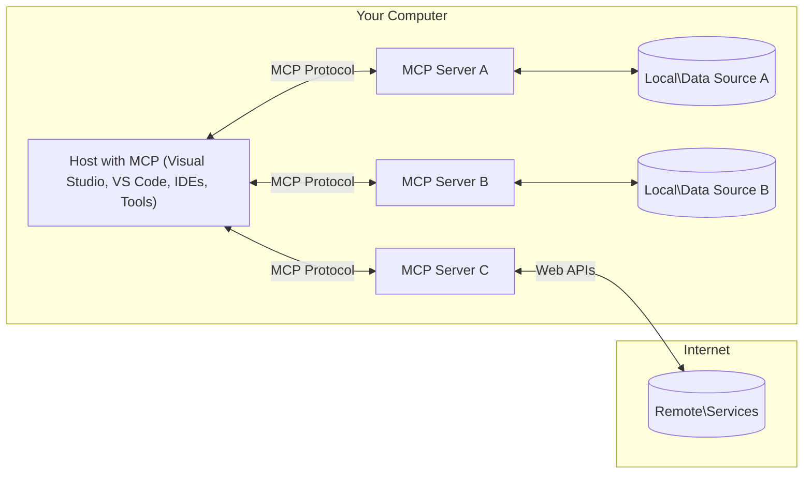

<!--
CO_OP_TRANSLATOR_METADATA:
{
  "original_hash": "904b59de1de9264801242d90a42cdd9d",
  "translation_date": "2025-09-05T10:54:30+00:00",
  "source_file": "01-CoreConcepts/README.md",
  "language_code": "it"
}
-->
# Concetti Fondamentali di MCP: Padroneggiare il Model Context Protocol per l'Integrazione AI

[](https://youtu.be/earDzWGtE84)

_(Clicca sull'immagine sopra per vedere il video di questa lezione)_

Il [Model Context Protocol (MCP)](https://github.com/modelcontextprotocol) è un framework potente e standardizzato che ottimizza la comunicazione tra i Large Language Models (LLMs) e strumenti, applicazioni e fonti di dati esterni. 
Questa guida ti accompagnerà attraverso i concetti fondamentali di MCP. Imparerai la sua architettura client-server, i componenti essenziali, le meccaniche di comunicazione e le migliori pratiche di implementazione.

- **Consenso Esplicito dell'Utente**: Tutti gli accessi ai dati e le operazioni richiedono l'approvazione esplicita dell'utente prima dell'esecuzione. Gli utenti devono comprendere chiaramente quali dati verranno accessi e quali azioni verranno eseguite, con un controllo granulare su permessi e autorizzazioni.

- **Protezione della Privacy dei Dati**: I dati dell'utente vengono esposti solo con consenso esplicito e devono essere protetti da controlli di accesso robusti durante l'intero ciclo di interazione. Le implementazioni devono prevenire trasmissioni non autorizzate di dati e mantenere confini di privacy rigorosi.

- **Sicurezza nell'Esecuzione degli Strumenti**: Ogni invocazione di uno strumento richiede il consenso esplicito dell'utente con una chiara comprensione della funzionalità dello strumento, dei parametri e del potenziale impatto. Confini di sicurezza robusti devono prevenire esecuzioni non intenzionali, non sicure o malevole.

- **Sicurezza del Livello di Trasporto**: Tutti i canali di comunicazione devono utilizzare meccanismi appropriati di crittografia e autenticazione. Le connessioni remote devono implementare protocolli di trasporto sicuri e una gestione adeguata delle credenziali.

#### Linee Guida per l'Implementazione:

- **Gestione dei Permessi**: Implementa sistemi di permessi dettagliati che permettano agli utenti di controllare quali server, strumenti e risorse sono accessibili.
- **Autenticazione e Autorizzazione**: Utilizza metodi di autenticazione sicuri (OAuth, chiavi API) con una gestione corretta dei token e delle scadenze.  
- **Validazione degli Input**: Valida tutti i parametri e gli input di dati secondo schemi definiti per prevenire attacchi di tipo injection.
- **Audit Logging**: Mantieni log completi di tutte le operazioni per il monitoraggio della sicurezza e la conformità.

## Panoramica

Questa lezione esplora l'architettura fondamentale e i componenti che costituiscono l'ecosistema del Model Context Protocol (MCP). Imparerai l'architettura client-server, i componenti chiave e i meccanismi di comunicazione che alimentano le interazioni MCP.

## Obiettivi Principali di Apprendimento

Alla fine di questa lezione, sarai in grado di:

- Comprendere l'architettura client-server di MCP.
- Identificare ruoli e responsabilità di Host, Client e Server.
- Analizzare le caratteristiche principali che rendono MCP uno strato di integrazione flessibile.
- Imparare come fluisce l'informazione all'interno dell'ecosistema MCP.
- Acquisire conoscenze pratiche attraverso esempi di codice in .NET, Java, Python e JavaScript.

## Architettura MCP: Uno Sguardo Approfondito

L'ecosistema MCP è costruito su un modello client-server. Questa struttura modulare consente alle applicazioni AI di interagire in modo efficiente con strumenti, database, API e risorse contestuali. Analizziamo questa architettura nei suoi componenti principali.

Alla base, MCP segue un'architettura client-server in cui un'applicazione host può connettersi a più server:



- **Host MCP**: Programmi come VSCode, Claude Desktop, IDE o strumenti AI che desiderano accedere ai dati tramite MCP.
- **Client MCP**: Client del protocollo che mantengono connessioni 1:1 con i server.
- **Server MCP**: Programmi leggeri che espongono capacità specifiche attraverso il Model Context Protocol standardizzato.
- **Fonti di Dati Locali**: File, database e servizi del tuo computer che i server MCP possono accedere in modo sicuro.
- **Servizi Remoti**: Sistemi esterni disponibili su internet che i server MCP possono connettere tramite API.

Il Protocollo MCP è uno standard in evoluzione che utilizza versioni basate sulla data (formato YYYY-MM-DD). La versione attuale del protocollo è **2025-06-18**. Puoi vedere gli ultimi aggiornamenti alla [specifica del protocollo](https://modelcontextprotocol.io/specification/2025-06-18/).

### 1. Host

Nel Model Context Protocol (MCP), gli **Host** sono applicazioni AI che fungono da interfaccia principale attraverso cui gli utenti interagiscono con il protocollo. Gli Host coordinano e gestiscono le connessioni a più server MCP creando client MCP dedicati per ogni connessione al server. Esempi di Host includono:

- **Applicazioni AI**: Claude Desktop, Visual Studio Code, Claude Code.
- **Ambienti di Sviluppo**: IDE e editor di codice con integrazione MCP.  
- **Applicazioni Personalizzate**: Agenti AI e strumenti costruiti su misura.

Gli **Host** sono applicazioni che coordinano le interazioni con i modelli AI. Essi:

- **Orchestrano Modelli AI**: Eseguono o interagiscono con LLM per generare risposte e coordinare flussi di lavoro AI.
- **Gestiscono Connessioni Client**: Creano e mantengono un client MCP per ogni connessione al server MCP.
- **Controllano l'Interfaccia Utente**: Gestiscono il flusso di conversazione, le interazioni con l'utente e la presentazione delle risposte.  
- **Enforzano la Sicurezza**: Controllano permessi, vincoli di sicurezza e autenticazione.
- **Gestiscono il Consenso dell'Utente**: Amministrano l'approvazione dell'utente per la condivisione dei dati e l'esecuzione degli strumenti.

### 2. Client

I **Client** sono componenti essenziali che mantengono connessioni dedicate uno-a-uno tra Host e server MCP. Ogni client MCP è istanziato dall'Host per connettersi a un server MCP specifico, garantendo canali di comunicazione organizzati e sicuri. Molteplici client permettono agli Host di connettersi a più server simultaneamente.

I **Client** sono componenti connettori all'interno dell'applicazione host. Essi:

- **Comunicazione del Protocollo**: Invia richieste JSON-RPC 2.0 ai server con prompt e istruzioni.
- **Negoziazione delle Capacità**: Negoziano le funzionalità supportate e le versioni del protocollo con i server durante l'inizializzazione.
- **Esecuzione degli Strumenti**: Gestiscono richieste di esecuzione degli strumenti dai modelli e processano le risposte.
- **Aggiornamenti in Tempo Reale**: Gestiscono notifiche e aggiornamenti in tempo reale dai server.
- **Elaborazione delle Risposte**: Processano e formattano le risposte dei server per la visualizzazione agli utenti.

### 3. Server

I **Server** sono programmi che forniscono contesto, strumenti e capacità ai client MCP. Possono essere eseguiti localmente (sulla stessa macchina dell'Host) o remotamente (su piattaforme esterne) e sono responsabili della gestione delle richieste dei client e della fornitura di risposte strutturate. I server espongono funzionalità specifiche attraverso il Model Context Protocol standardizzato.

I **Server** sono servizi che forniscono contesto e capacità. Essi:

- **Registrazione delle Funzionalità**: Registrano ed espongono primitive disponibili (risorse, prompt, strumenti) ai client.
- **Elaborazione delle Richieste**: Ricevono ed eseguono chiamate agli strumenti, richieste di risorse e richieste di prompt dai client.
- **Fornitura di Contesto**: Forniscono informazioni contestuali e dati per migliorare le risposte dei modelli.
- **Gestione dello Stato**: Mantengono lo stato della sessione e gestiscono interazioni stateful quando necessario.
- **Notifiche in Tempo Reale**: Inoltrano notifiche su cambiamenti di capacità e aggiornamenti ai client connessi.

I server possono essere sviluppati da chiunque per estendere le capacità dei modelli con funzionalità specializzate e supportano scenari di distribuzione sia locali che remoti.

### 4. Primitive del Server

I server nel Model Context Protocol (MCP) forniscono tre **primitive** principali che definiscono i blocchi fondamentali per interazioni ricche tra client, host e modelli linguistici. Queste primitive specificano i tipi di informazioni contestuali e azioni disponibili attraverso il protocollo.

I server MCP possono esporre qualsiasi combinazione delle seguenti tre primitive principali:

#### Risorse 

Le **Risorse** sono fonti di dati che forniscono informazioni contestuali alle applicazioni AI. Rappresentano contenuti statici o dinamici che possono migliorare la comprensione e il processo decisionale del modello:

- **Dati Contestuali**: Informazioni strutturate e contesto per il consumo da parte del modello AI.
- **Basi di Conoscenza**: Repository di documenti, articoli, manuali e ricerche.
- **Fonti di Dati Locali**: File, database e informazioni di sistema locale.  
- **Dati Esterni**: Risposte API, servizi web e dati di sistemi remoti.
- **Contenuti Dinamici**: Dati in tempo reale che si aggiornano in base alle condizioni esterne.

Le risorse sono identificate da URI e supportano la scoperta tramite i metodi `resources/list` e il recupero tramite `resources/read`:

```text
file://documents/project-spec.md
database://production/users/schema
api://weather/current
```

#### Prompt

I **Prompt** sono modelli riutilizzabili che aiutano a strutturare le interazioni con i modelli linguistici. Forniscono modelli di interazione standardizzati e flussi di lavoro predefiniti:

- **Interazioni Basate su Modelli**: Messaggi pre-strutturati e avvii di conversazione.
- **Modelli di Flusso di Lavoro**: Sequenze standardizzate per compiti e interazioni comuni.
- **Esempi Few-shot**: Modelli basati su esempi per l'istruzione del modello.
- **Prompt di Sistema**: Prompt fondamentali che definiscono il comportamento e il contesto del modello.
- **Modelli Dinamici**: Prompt parametrizzati che si adattano a contesti specifici.

I prompt supportano la sostituzione di variabili e possono essere scoperti tramite `prompts/list` e recuperati con `prompts/get`:

```markdown
Generate a {{task_type}} for {{product}} targeting {{audience}} with the following requirements: {{requirements}}
```

#### Strumenti

Gli **Strumenti** sono funzioni eseguibili che i modelli AI possono invocare per eseguire azioni specifiche. Rappresentano i "verbi" dell'ecosistema MCP, consentendo ai modelli di interagire con sistemi esterni:

- **Funzioni Eseguibili**: Operazioni discrete che i modelli possono invocare con parametri specifici.
- **Integrazione con Sistemi Esterni**: Chiamate API, query di database, operazioni su file, calcoli.
- **Identità Unica**: Ogni strumento ha un nome, una descrizione e uno schema di parametri distinti.
- **I/O Strutturato**: Gli strumenti accettano parametri validati e restituiscono risposte strutturate e tipizzate.
- **Capacità di Azione**: Consentono ai modelli di eseguire azioni nel mondo reale e recuperare dati live.

Gli strumenti sono definiti con JSON Schema per la validazione dei parametri e scoperti tramite `tools/list` ed eseguiti tramite `tools/call`:

```typescript
server.tool(
  "search_products", 
  {
    query: z.string().describe("Search query for products"),
    category: z.string().optional().describe("Product category filter"),
    max_results: z.number().default(10).describe("Maximum results to return")
  }, 
  async (params) => {
    // Execute search and return structured results
    return await productService.search(params);
  }
);
```

## Primitive del Client

Nel Model Context Protocol (MCP), i **client** possono esporre primitive che consentono ai server di richiedere capacità aggiuntive dall'applicazione host. Queste primitive lato client permettono implementazioni server più ricche e interattive che possono accedere alle capacità del modello AI e alle interazioni con l'utente.

### Sampling

**Sampling** consente ai server di richiedere completamenti del modello linguistico dall'applicazione AI del client. Questa primitiva permette ai server di accedere alle capacità LLM senza incorporare dipendenze proprie del modello:

- **Accesso Indipendente dal Modello**: I server possono richiedere completamenti senza includere SDK LLM o gestire l'accesso al modello.
- **AI Iniziata dal Server**: Consente ai server di generare autonomamente contenuti utilizzando il modello AI del client.
- **Interazioni Ricorsive con LLM**: Supporta scenari complessi in cui i server necessitano di assistenza AI per l'elaborazione.
- **Generazione Dinamica di Contenuti**: Permette ai server di creare risposte contestuali utilizzando il modello dell'host.

Il sampling è avviato tramite il metodo `sampling/complete`, dove i server inviano richieste di completamento ai client.

### Elicitation  

**Elicitation** consente ai server di richiedere informazioni aggiuntive o conferme dagli utenti tramite l'interfaccia del client:

- **Richieste di Input Utente**: I server possono chiedere informazioni aggiuntive necessarie per l'esecuzione degli strumenti.
- **Dialoghi di Conferma**: Richiedono l'approvazione dell'utente per operazioni sensibili o di impatto.
- **Flussi di Lavoro Interattivi**: Consentono ai server di creare interazioni utente passo-passo.
- **Raccolta Dinamica di Parametri**: Raccoglie parametri mancanti o opzionali durante l'esecuzione degli strumenti.

Le richieste di elicitation vengono effettuate utilizzando il metodo `elicitation/request` per raccogliere input utente tramite l'interfaccia del client.

### Logging

**Logging** consente ai server di inviare messaggi di log strutturati ai client per il debugging, il monitoraggio e la visibilità operativa:

- **Supporto al Debugging**: Permette ai server di fornire log dettagliati di esecuzione per la risoluzione dei problemi.
- **Monitoraggio Operativo**: Invia aggiornamenti di stato e metriche di performance ai client.
- **Segnalazione degli Errori**: Fornisce contesto dettagliato sugli errori e informazioni diagnostiche.
- **Tracce di Audit**: Crea log completi delle operazioni e decisioni del server.

I messaggi di logging vengono inviati ai client per fornire trasparenza sulle operazioni del server e facilitare il debugging.

## Flusso di Informazioni in MCP

Il Model Context Protocol (MCP) definisce un flusso strutturato di informazioni tra host, client, server e modelli. Comprendere questo flusso aiuta a chiarire come vengono elaborate le richieste degli utenti e come strumenti e dati esterni vengono integrati nelle risposte del modello.

- **Connessione Iniziata dall'Host**  
  L'applicazione host (come un IDE o un'interfaccia di chat) stabilisce una connessione a un server MCP, tipicamente tramite STDIO, WebSocket o un altro trasporto supportato.

- **Negoziazione delle Capacità**  
  Il client (incorporato nell'host) e il server scambiano informazioni sulle funzionalità supportate, strumenti, risorse e versioni del protocollo. Questo garantisce che entrambe le parti comprendano le capacità disponibili per la sessione.

- **Richiesta dell'Utente**  
  L'utente interagisce con l'host (ad esempio, inserisce un prompt o un comando). L'host raccoglie questo input e lo passa al client per l'elaborazione.

- **Utilizzo di Risorse o Strumenti**  
  - Il client può richiedere contesto o risorse aggiuntive al server (come file, voci di database o articoli di basi di conoscenza) per arricchire la comprensione del modello.
  - Se il modello determina che è necessario uno strumento (ad esempio, per recuperare dati, eseguire un calcolo o chiamare un'API), il client invia una richiesta di invocazione dello strumento al server, specificando il nome dello strumento e i parametri.

- **Esecuzione del Server**  
  Il server riceve la richiesta di risorse o strumenti, esegue le operazioni necessarie (come eseguire una funzione, interrogare un database o recuperare un file) e restituisce i risultati al client in un formato strutturato.

- **Generazione della Risposta**  
  Il client integra le risposte del server (dati delle risorse, output degli strumenti, ecc.) nell'interazione in corso con il modello. Il modello utilizza queste informazioni per generare una risposta completa e contestualmente rilevante.

- **Presentazione del Risultato**  
  L'host riceve l'output finale dal client e lo presenta all'utente, spesso includendo sia il testo generato dal modello che eventuali risultati delle esecuzioni degli strumenti o delle ricerche di risorse.

Questo flusso consente a MCP di supportare applicazioni AI avanzate, interattive e consapevoli del contesto, collegando senza soluzione di continuità modelli con strumenti e fonti di dati esterni.

## Architettura del Protocollo & Livelli

MCP consiste in due livelli architetturali distinti che lavorano insieme per fornire un framework di comunicazione completo:

### Livello Dati

Il **Livello Dati** implementa il protocollo MCP core utilizzando **JSON-RPC 2.0** come fondamento. Questo livello definisce la struttura dei messaggi, la semantica e i modelli di interazione:

#### Componenti Principali:
- **Protocollo JSON-RPC 2.0**: Tutte le comunicazioni utilizzano il formato standardizzato dei messaggi JSON-RPC 2.0 per chiamate di metodo, risposte e notifiche.
- **Gestione del ciclo di vita**: Gestisce l'inizializzazione della connessione, la negoziazione delle capacità e la terminazione della sessione tra client e server.
- **Primitive del server**: Consente ai server di fornire funzionalità principali tramite strumenti, risorse e prompt.
- **Primitive del client**: Consente ai server di richiedere campionamenti da LLM, ottenere input dagli utenti e inviare messaggi di log.
- **Notifiche in tempo reale**: Supporta notifiche asincrone per aggiornamenti dinamici senza polling.

#### Caratteristiche principali:

- **Negoziazione della versione del protocollo**: Utilizza versioni basate su date (YYYY-MM-DD) per garantire la compatibilità.
- **Scoperta delle capacità**: Client e server scambiano informazioni sulle funzionalità supportate durante l'inizializzazione.
- **Sessioni con stato**: Mantiene lo stato della connessione attraverso interazioni multiple per garantire continuità del contesto.

### Livello di trasporto

Il **Livello di trasporto** gestisce i canali di comunicazione, l'incorniciatura dei messaggi e l'autenticazione tra i partecipanti MCP:

#### Meccanismi di trasporto supportati:

1. **Trasporto STDIO**:
   - Utilizza flussi di input/output standard per la comunicazione diretta tra processi.
   - Ottimale per processi locali sulla stessa macchina senza sovraccarico di rete.
   - Comunemente utilizzato per implementazioni di server MCP locali.

2. **Trasporto HTTP Streamable**:
   - Utilizza HTTP POST per i messaggi da client a server.
   - Eventi inviati dal server (SSE) opzionali per lo streaming da server a client.
   - Consente la comunicazione con server remoti attraverso reti.
   - Supporta l'autenticazione HTTP standard (token bearer, chiavi API, intestazioni personalizzate).
   - MCP raccomanda OAuth per un'autenticazione sicura basata su token.

#### Astrazione del trasporto:

Il livello di trasporto astrae i dettagli di comunicazione dal livello dati, consentendo lo stesso formato di messaggi JSON-RPC 2.0 su tutti i meccanismi di trasporto. Questa astrazione permette alle applicazioni di passare senza problemi tra server locali e remoti.

### Considerazioni sulla sicurezza

Le implementazioni MCP devono aderire a diversi principi di sicurezza fondamentali per garantire interazioni sicure, affidabili e protette in tutte le operazioni del protocollo:

- **Consenso e controllo dell'utente**: Gli utenti devono fornire un consenso esplicito prima che qualsiasi dato venga accesso o che vengano eseguite operazioni. Devono avere un controllo chiaro su quali dati vengono condivisi e quali azioni sono autorizzate, supportato da interfacce utente intuitive per la revisione e l'approvazione delle attività.

- **Privacy dei dati**: I dati degli utenti devono essere esposti solo con consenso esplicito e devono essere protetti da controlli di accesso appropriati. Le implementazioni MCP devono prevenire trasmissioni non autorizzate di dati e garantire che la privacy sia mantenuta in tutte le interazioni.

- **Sicurezza degli strumenti**: Prima di invocare qualsiasi strumento, è richiesto il consenso esplicito dell'utente. Gli utenti devono avere una comprensione chiara della funzionalità di ciascuno strumento, e devono essere applicati confini di sicurezza robusti per prevenire esecuzioni involontarie o pericolose degli strumenti.

Seguendo questi principi di sicurezza, MCP garantisce che la fiducia, la privacy e la sicurezza degli utenti siano mantenute in tutte le interazioni del protocollo, consentendo al contempo potenti integrazioni con l'IA.

## Esempi di codice: Componenti chiave

Di seguito sono riportati esempi di codice in diversi linguaggi di programmazione popolari che illustrano come implementare componenti chiave del server MCP e strumenti.

### Esempio .NET: Creazione di un semplice server MCP con strumenti

Ecco un esempio pratico in .NET che dimostra come implementare un semplice server MCP con strumenti personalizzati. Questo esempio mostra come definire e registrare strumenti, gestire richieste e connettere il server utilizzando il Model Context Protocol.

```csharp
using System;
using System.Threading.Tasks;
using ModelContextProtocol.Server;
using ModelContextProtocol.Server.Transport;
using ModelContextProtocol.Server.Tools;

public class WeatherServer
{
    public static async Task Main(string[] args)
    {
        // Create an MCP server
        var server = new McpServer(
            name: "Weather MCP Server",
            version: "1.0.0"
        );
        
        // Register our custom weather tool
        server.AddTool<string, WeatherData>("weatherTool", 
            description: "Gets current weather for a location",
            execute: async (location) => {
                // Call weather API (simplified)
                var weatherData = await GetWeatherDataAsync(location);
                return weatherData;
            });
        
        // Connect the server using stdio transport
        var transport = new StdioServerTransport();
        await server.ConnectAsync(transport);
        
        Console.WriteLine("Weather MCP Server started");
        
        // Keep the server running until process is terminated
        await Task.Delay(-1);
    }
    
    private static async Task<WeatherData> GetWeatherDataAsync(string location)
    {
        // This would normally call a weather API
        // Simplified for demonstration
        await Task.Delay(100); // Simulate API call
        return new WeatherData { 
            Temperature = 72.5,
            Conditions = "Sunny",
            Location = location
        };
    }
}

public class WeatherData
{
    public double Temperature { get; set; }
    public string Conditions { get; set; }
    public string Location { get; set; }
}
```

### Esempio Java: Componenti del server MCP

Questo esempio dimostra lo stesso server MCP e la registrazione degli strumenti dell'esempio .NET sopra, ma implementato in Java.

```java
import io.modelcontextprotocol.server.McpServer;
import io.modelcontextprotocol.server.McpToolDefinition;
import io.modelcontextprotocol.server.transport.StdioServerTransport;
import io.modelcontextprotocol.server.tool.ToolExecutionContext;
import io.modelcontextprotocol.server.tool.ToolResponse;

public class WeatherMcpServer {
    public static void main(String[] args) throws Exception {
        // Create an MCP server
        McpServer server = McpServer.builder()
            .name("Weather MCP Server")
            .version("1.0.0")
            .build();
            
        // Register a weather tool
        server.registerTool(McpToolDefinition.builder("weatherTool")
            .description("Gets current weather for a location")
            .parameter("location", String.class)
            .execute((ToolExecutionContext ctx) -> {
                String location = ctx.getParameter("location", String.class);
                
                // Get weather data (simplified)
                WeatherData data = getWeatherData(location);
                
                // Return formatted response
                return ToolResponse.content(
                    String.format("Temperature: %.1f°F, Conditions: %s, Location: %s", 
                    data.getTemperature(), 
                    data.getConditions(), 
                    data.getLocation())
                );
            })
            .build());
        
        // Connect the server using stdio transport
        try (StdioServerTransport transport = new StdioServerTransport()) {
            server.connect(transport);
            System.out.println("Weather MCP Server started");
            // Keep server running until process is terminated
            Thread.currentThread().join();
        }
    }
    
    private static WeatherData getWeatherData(String location) {
        // Implementation would call a weather API
        // Simplified for example purposes
        return new WeatherData(72.5, "Sunny", location);
    }
}

class WeatherData {
    private double temperature;
    private String conditions;
    private String location;
    
    public WeatherData(double temperature, String conditions, String location) {
        this.temperature = temperature;
        this.conditions = conditions;
        this.location = location;
    }
    
    public double getTemperature() {
        return temperature;
    }
    
    public String getConditions() {
        return conditions;
    }
    
    public String getLocation() {
        return location;
    }
}
```

### Esempio Python: Creazione di un server MCP

Questo esempio utilizza fastmcp, quindi assicurati di installarlo prima:

```python
pip install fastmcp
```  
Esempio di codice:

```python
#!/usr/bin/env python3
import asyncio
from fastmcp import FastMCP
from fastmcp.transports.stdio import serve_stdio

# Create a FastMCP server
mcp = FastMCP(
    name="Weather MCP Server",
    version="1.0.0"
)

@mcp.tool()
def get_weather(location: str) -> dict:
    """Gets current weather for a location."""
    return {
        "temperature": 72.5,
        "conditions": "Sunny",
        "location": location
    }

# Alternative approach using a class
class WeatherTools:
    @mcp.tool()
    def forecast(self, location: str, days: int = 1) -> dict:
        """Gets weather forecast for a location for the specified number of days."""
        return {
            "location": location,
            "forecast": [
                {"day": i+1, "temperature": 70 + i, "conditions": "Partly Cloudy"}
                for i in range(days)
            ]
        }

# Register class tools
weather_tools = WeatherTools()

# Start the server
if __name__ == "__main__":
    asyncio.run(serve_stdio(mcp))
```

### Esempio JavaScript: Creazione di un server MCP

Questo esempio mostra la creazione di un server MCP in JavaScript e come registrare due strumenti relativi al meteo.

```javascript
// Using the official Model Context Protocol SDK
import { McpServer } from "@modelcontextprotocol/sdk/server/mcp.js";
import { StdioServerTransport } from "@modelcontextprotocol/sdk/server/stdio.js";
import { z } from "zod"; // For parameter validation

// Create an MCP server
const server = new McpServer({
  name: "Weather MCP Server",
  version: "1.0.0"
});

// Define a weather tool
server.tool(
  "weatherTool",
  {
    location: z.string().describe("The location to get weather for")
  },
  async ({ location }) => {
    // This would normally call a weather API
    // Simplified for demonstration
    const weatherData = await getWeatherData(location);
    
    return {
      content: [
        { 
          type: "text", 
          text: `Temperature: ${weatherData.temperature}°F, Conditions: ${weatherData.conditions}, Location: ${weatherData.location}` 
        }
      ]
    };
  }
);

// Define a forecast tool
server.tool(
  "forecastTool",
  {
    location: z.string(),
    days: z.number().default(3).describe("Number of days for forecast")
  },
  async ({ location, days }) => {
    // This would normally call a weather API
    // Simplified for demonstration
    const forecast = await getForecastData(location, days);
    
    return {
      content: [
        { 
          type: "text", 
          text: `${days}-day forecast for ${location}: ${JSON.stringify(forecast)}` 
        }
      ]
    };
  }
);

// Helper functions
async function getWeatherData(location) {
  // Simulate API call
  return {
    temperature: 72.5,
    conditions: "Sunny",
    location: location
  };
}

async function getForecastData(location, days) {
  // Simulate API call
  return Array.from({ length: days }, (_, i) => ({
    day: i + 1,
    temperature: 70 + Math.floor(Math.random() * 10),
    conditions: i % 2 === 0 ? "Sunny" : "Partly Cloudy"
  }));
}

// Connect the server using stdio transport
const transport = new StdioServerTransport();
server.connect(transport).catch(console.error);

console.log("Weather MCP Server started");
```

Questo esempio JavaScript dimostra come creare un client MCP che si connette a un server, invia un prompt e processa la risposta, inclusi eventuali strumenti chiamati.

## Sicurezza e autorizzazione

MCP include diversi concetti e meccanismi integrati per gestire la sicurezza e l'autorizzazione in tutto il protocollo:

1. **Controllo dei permessi degli strumenti**:  
   I client possono specificare quali strumenti un modello è autorizzato a utilizzare durante una sessione. Questo garantisce che solo gli strumenti esplicitamente autorizzati siano accessibili, riducendo il rischio di operazioni involontarie o pericolose. I permessi possono essere configurati dinamicamente in base alle preferenze dell'utente, alle politiche organizzative o al contesto dell'interazione.

2. **Autenticazione**:  
   I server possono richiedere l'autenticazione prima di concedere l'accesso a strumenti, risorse o operazioni sensibili. Questo può includere chiavi API, token OAuth o altri schemi di autenticazione. Una corretta autenticazione garantisce che solo client e utenti fidati possano invocare capacità lato server.

3. **Validazione**:  
   La validazione dei parametri è applicata per tutte le invocazioni degli strumenti. Ogni strumento definisce i tipi, i formati e i vincoli previsti per i suoi parametri, e il server valida le richieste in arrivo di conseguenza. Questo previene input malformati o dannosi che potrebbero raggiungere le implementazioni degli strumenti e aiuta a mantenere l'integrità delle operazioni.

4. **Limitazione della velocità**:  
   Per prevenire abusi e garantire un uso equo delle risorse del server, i server MCP possono implementare limitazioni di velocità per le chiamate agli strumenti e l'accesso alle risorse. Le limitazioni di velocità possono essere applicate per utente, per sessione o globalmente, e aiutano a proteggere da attacchi di negazione del servizio o consumo eccessivo di risorse.

Combinando questi meccanismi, MCP fornisce una base sicura per integrare modelli linguistici con strumenti e fonti di dati esterni, offrendo agli utenti e agli sviluppatori un controllo dettagliato sull'accesso e sull'utilizzo.

## Messaggi del protocollo e flusso di comunicazione

La comunicazione MCP utilizza messaggi strutturati **JSON-RPC 2.0** per facilitare interazioni chiare e affidabili tra host, client e server. Il protocollo definisce modelli di messaggi specifici per diversi tipi di operazioni:

### Tipi principali di messaggi:

#### **Messaggi di inizializzazione**
- **Richiesta `initialize`**: Stabilisce la connessione e negozia la versione del protocollo e le capacità.
- **Risposta `initialize`**: Conferma le funzionalità supportate e le informazioni del server.
- **`notifications/initialized`**: Segnala che l'inizializzazione è completa e la sessione è pronta.

#### **Messaggi di scoperta**
- **Richiesta `tools/list`**: Scopre gli strumenti disponibili dal server.
- **Richiesta `resources/list`**: Elenca le risorse disponibili (fonti di dati).
- **Richiesta `prompts/list`**: Recupera i modelli di prompt disponibili.

#### **Messaggi di esecuzione**  
- **Richiesta `tools/call`**: Esegue uno strumento specifico con i parametri forniti.
- **Richiesta `resources/read`**: Recupera contenuti da una risorsa specifica.
- **Richiesta `prompts/get`**: Ottiene un modello di prompt con parametri opzionali.

#### **Messaggi lato client**
- **Richiesta `sampling/complete`**: Il server richiede un completamento LLM dal client.
- **`elicitation/request`**: Il server richiede input dell'utente tramite l'interfaccia del client.
- **Messaggi di log**: Il server invia messaggi di log strutturati al client.

#### **Messaggi di notifica**
- **`notifications/tools/list_changed`**: Il server notifica al client modifiche agli strumenti.
- **`notifications/resources/list_changed`**: Il server notifica al client modifiche alle risorse.
- **`notifications/prompts/list_changed`**: Il server notifica al client modifiche ai prompt.

### Struttura dei messaggi:

Tutti i messaggi MCP seguono il formato JSON-RPC 2.0 con:
- **Messaggi di richiesta**: Includono `id`, `method` e parametri opzionali.
- **Messaggi di risposta**: Includono `id` e `result` o `error`.
- **Messaggi di notifica**: Includono `method` e parametri opzionali (senza `id` o risposta prevista).

Questa comunicazione strutturata garantisce interazioni affidabili, tracciabili ed estensibili, supportando scenari avanzati come aggiornamenti in tempo reale, concatenazione di strumenti e gestione robusta degli errori.

## Punti chiave

- **Architettura**: MCP utilizza un'architettura client-server in cui gli host gestiscono connessioni multiple tra client e server.
- **Partecipanti**: L'ecosistema include host (applicazioni AI), client (connettori del protocollo) e server (fornitori di capacità).
- **Meccanismi di trasporto**: La comunicazione supporta STDIO (locale) e HTTP Streamable con SSE opzionale (remoto).
- **Primitive principali**: I server espongono strumenti (funzioni eseguibili), risorse (fonti di dati) e prompt (modelli).
- **Primitive del client**: I server possono richiedere campionamenti (completamenti LLM), elicitation (input utente) e logging dai client.
- **Fondamenti del protocollo**: Basato su JSON-RPC 2.0 con versioni basate su date (attuale: 2025-06-18).
- **Capacità in tempo reale**: Supporta notifiche per aggiornamenti dinamici e sincronizzazione in tempo reale.
- **Sicurezza prioritaria**: Consenso esplicito dell'utente, protezione della privacy dei dati e trasporto sicuro sono requisiti fondamentali.

## Esercizio

Progetta un semplice strumento MCP che sarebbe utile nel tuo dominio. Definisci:
1. Il nome dello strumento.
2. I parametri che accetterebbe.
3. L'output che restituirebbe.
4. Come un modello potrebbe utilizzare questo strumento per risolvere problemi degli utenti.

---

## Prossimi passi

Prossimo: [Capitolo 2: Sicurezza](../02-Security/README.md)

---

**Disclaimer**:  
Questo documento è stato tradotto utilizzando il servizio di traduzione automatica [Co-op Translator](https://github.com/Azure/co-op-translator). Sebbene ci impegniamo per garantire l'accuratezza, si prega di notare che le traduzioni automatiche potrebbero contenere errori o imprecisioni. Il documento originale nella sua lingua nativa dovrebbe essere considerato la fonte autorevole. Per informazioni critiche, si consiglia una traduzione professionale eseguita da un traduttore umano. Non siamo responsabili per eventuali fraintendimenti o interpretazioni errate derivanti dall'uso di questa traduzione.