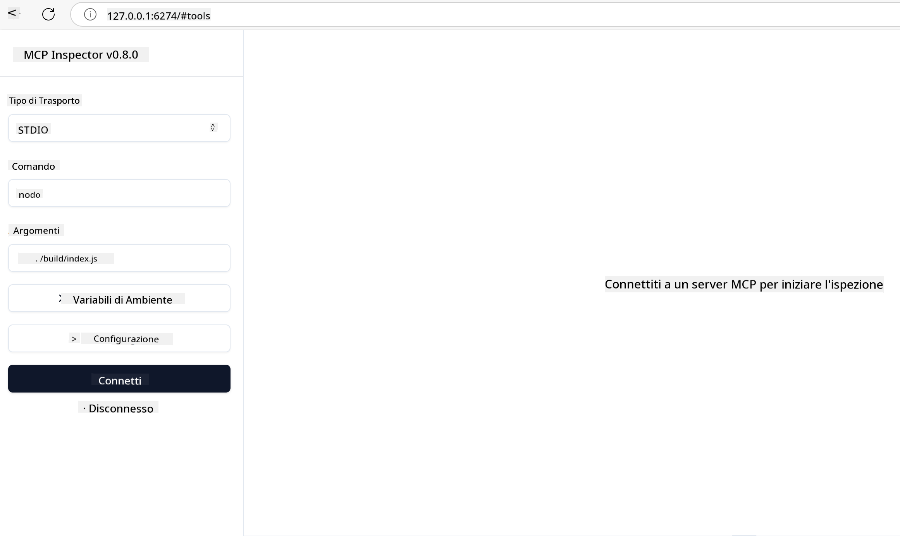
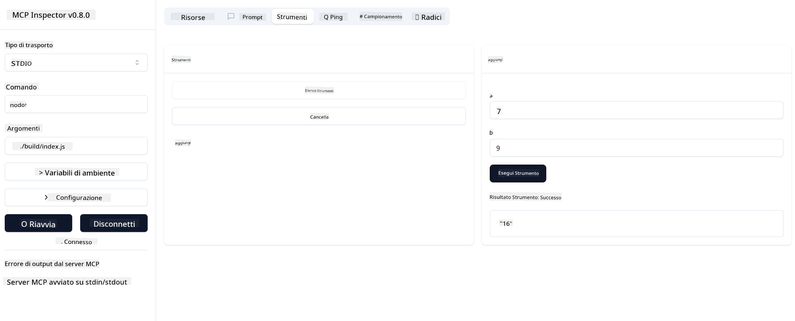

<!--
CO_OP_TRANSLATOR_METADATA:
{
  "original_hash": "5331ffd328a54b90f76706c52b673e27",
  "translation_date": "2025-05-17T08:34:23+00:00",
  "source_file": "03-GettingStarted/01-first-server/README.md",
  "language_code": "it"
}
-->
# Introduzione a MCP

Benvenuto ai tuoi primi passi con il Model Context Protocol (MCP)! Che tu sia nuovo a MCP o desideri approfondire la tua comprensione, questa guida ti accompagnerà attraverso il processo essenziale di configurazione e sviluppo. Scoprirai come MCP consente un'integrazione senza soluzione di continuità tra modelli AI e applicazioni, e imparerai come preparare rapidamente il tuo ambiente per costruire e testare soluzioni basate su MCP.

> In breve; Se costruisci applicazioni AI, sai che puoi aggiungere strumenti e altre risorse al tuo LLM (large language model), per renderlo più informato. Tuttavia, se posizioni quegli strumenti e risorse su un server, le capacità dell'app e del server possono essere utilizzate da qualsiasi client con/senza un LLM.

## Panoramica

Questa lezione fornisce indicazioni pratiche su come configurare ambienti MCP e costruire le tue prime applicazioni MCP. Imparerai a configurare gli strumenti e i framework necessari, costruire server MCP di base, creare applicazioni host e testare le tue implementazioni.

Il Model Context Protocol (MCP) è un protocollo aperto che standardizza il modo in cui le applicazioni forniscono contesto ai LLM. Pensa a MCP come una porta USB-C per applicazioni AI - offre un modo standardizzato per collegare modelli AI a diverse fonti di dati e strumenti.

## Obiettivi di apprendimento

Alla fine di questa lezione, sarai in grado di:

- Configurare ambienti di sviluppo per MCP in C#, Java, Python, TypeScript e JavaScript
- Costruire e distribuire server MCP di base con funzionalità personalizzate (risorse, prompt e strumenti)
- Creare applicazioni host che si connettono ai server MCP
- Testare e debug delle implementazioni MCP

## Configurazione del tuo ambiente MCP

Prima di iniziare a lavorare con MCP, è importante preparare il tuo ambiente di sviluppo e comprendere il flusso di lavoro di base. Questa sezione ti guiderà attraverso i passaggi iniziali di configurazione per garantire un avvio senza problemi con MCP.

### Prerequisiti

Prima di immergerti nello sviluppo MCP, assicurati di avere:

- **Ambiente di sviluppo**: Per il linguaggio scelto (C#, Java, Python, TypeScript o JavaScript)
- **IDE/Editor**: Visual Studio, Visual Studio Code, IntelliJ, Eclipse, PyCharm o qualsiasi editor di codice moderno
- **Gestori di pacchetti**: NuGet, Maven/Gradle, pip o npm/yarn
- **Chiavi API**: Per qualsiasi servizio AI che intendi utilizzare nelle tue applicazioni host

## Struttura di base del server MCP

Un server MCP tipicamente include:

- **Configurazione del server**: Impostazione della porta, autenticazione e altre configurazioni
- **Risorse**: Dati e contesto messi a disposizione dei LLM
- **Strumenti**: Funzionalità che i modelli possono invocare
- **Prompt**: Modelli per generare o strutturare testo

Ecco un esempio semplificato in TypeScript:

```typescript
import { Server, Tool, Resource } from "@modelcontextprotocol/typescript-server-sdk";

// Create a new MCP server
const server = new Server({
  port: 3000,
  name: "Example MCP Server",
  version: "1.0.0"
});

// Register a tool
server.registerTool({
  name: "calculator",
  description: "Performs basic calculations",
  parameters: {
    expression: {
      type: "string",
      description: "The math expression to evaluate"
    }
  },
  handler: async (params) => {
    const result = eval(params.expression);
    return { result };
  }
});

// Start the server
server.start();
```

Nel codice precedente:

- Importiamo le classi necessarie dall'SDK TypeScript di MCP.
- Creiamo e configuriamo una nuova istanza di server MCP.
- Registriamo uno strumento personalizzato (`calculator`) con una funzione gestore.
- Avviamo il server per ascoltare le richieste MCP in arrivo.

## Test e Debug

Prima di iniziare a testare il tuo server MCP, è importante comprendere gli strumenti disponibili e le migliori pratiche per il debug. Un test efficace garantisce che il tuo server si comporti come previsto e ti aiuta a identificare e risolvere rapidamente i problemi. La sezione seguente delinea approcci raccomandati per validare la tua implementazione MCP.

MCP fornisce strumenti per aiutarti a testare e debug i tuoi server:

- **Inspector tool**, questa interfaccia grafica ti permette di connetterti al tuo server e testare i tuoi strumenti, prompt e risorse.
- **curl**, puoi anche connetterti al tuo server utilizzando uno strumento da linea di comando come curl o altri client che possono creare ed eseguire comandi HTTP.

### Utilizzo di MCP Inspector

Il [MCP Inspector](https://github.com/modelcontextprotocol/inspector) è uno strumento di test visivo che ti aiuta a:

1. **Scoprire le capacità del server**: Rilevare automaticamente le risorse, gli strumenti e i prompt disponibili
2. **Testare l'esecuzione degli strumenti**: Provare diversi parametri e vedere le risposte in tempo reale
3. **Visualizzare i metadati del server**: Esaminare le informazioni del server, gli schemi e le configurazioni

```bash
# ex TypeScript, installing and running MCP Inspector
npx @modelcontextprotocol/inspector node build/index.js
```

Quando esegui i comandi sopra, il MCP Inspector lancerà un'interfaccia web locale nel tuo browser. Puoi aspettarti di vedere un cruscotto che visualizza i tuoi server MCP registrati, i loro strumenti, risorse e prompt disponibili. L'interfaccia ti permette di testare interattivamente l'esecuzione degli strumenti, ispezionare i metadati del server e visualizzare le risposte in tempo reale, rendendo più facile validare e debug le tue implementazioni del server MCP.

Ecco uno screenshot di come potrebbe apparire:


## Problemi comuni di configurazione e soluzioni

| Problema | Soluzione possibile |
|-------|-------------------|
| Connessione rifiutata | Controlla se il server è in esecuzione e la porta è corretta |
| Errori di esecuzione degli strumenti | Rivedi la validazione dei parametri e la gestione degli errori |
| Fallimenti di autenticazione | Verifica le chiavi API e i permessi |
| Errori di validazione dello schema | Assicurati che i parametri corrispondano allo schema definito |
| Server non avviato | Controlla conflitti di porta o dipendenze mancanti |
| Errori CORS | Configura correttamente le intestazioni CORS per richieste cross-origin |
| Problemi di autenticazione | Verifica la validità del token e i permessi |

## Sviluppo locale

Per lo sviluppo e il test locale, puoi eseguire i server MCP direttamente sulla tua macchina:

1. **Avvia il processo del server**: Esegui la tua applicazione server MCP
2. **Configura il networking**: Assicurati che il server sia accessibile sulla porta prevista
3. **Collega i client**: Usa URL di connessione locale come `http://localhost:3000`

```bash
# Example: Running a TypeScript MCP server locally
npm run start
# Server running at http://localhost:3000
```

## Costruire il tuo primo server MCP

Abbiamo trattato [Concetti fondamentali](/01-CoreConcepts/README.md) in una lezione precedente, ora è il momento di mettere in pratica quella conoscenza.

### Cosa può fare un server

Prima di iniziare a scrivere codice, ricordiamoci cosa può fare un server:

Un server MCP può, per esempio:

- Accedere a file e database locali
- Collegarsi a API remote
- Eseguire calcoli
- Integrarsi con altri strumenti e servizi
- Fornire un'interfaccia utente per l'interazione

Perfetto, ora che sappiamo cosa possiamo fare per esso, iniziamo a programmare.

## Esercizio: Creare un server

Per creare un server, devi seguire questi passaggi:

- Installa l'SDK MCP.
- Crea un progetto e configura la struttura del progetto.
- Scrivi il codice del server.
- Testa il server.

### -1- Installa l'SDK

Questo varia leggermente a seconda del runtime scelto, quindi scegli uno dei runtime qui sotto:

L'AI generativa può generare testo, immagini e persino codice.
Sei addestrato su dati fino a ottobre 2023.

### -2- Crea il progetto

Ora che hai installato il tuo SDK, creiamo un progetto:

### -3- Crea i file del progetto

### -4- Crea il codice del server

### -5- Aggiungere uno strumento e una risorsa

Aggiungi uno strumento e una risorsa aggiungendo il seguente codice:

### -6 Codice finale

Aggiungiamo l'ultimo codice necessario affinché il server possa avviarsi:

### -7- Testa il server

Avvia il server con il seguente comando:

### -8- Esegui usando l'inspector

L'inspector è un ottimo strumento che può avviare il tuo server e ti consente di interagire con esso in modo da poter testare che funzioni. Avviamolo:

> [!NOTE]
> potrebbe apparire diverso nel campo "comando" poiché contiene il comando per eseguire un server con il tuo runtime specifico

Dovresti vedere la seguente interfaccia utente:



1. Connettiti al server selezionando il pulsante Connect
   Una volta connesso al server, dovresti vedere quanto segue:

   

1. Seleziona "Tools" e "listTools", dovresti vedere "Add" comparire, seleziona "Add" e compila i valori dei parametri.

   Dovresti vedere la seguente risposta, cioè un risultato dallo strumento "add":

   

Congratulazioni, sei riuscito a creare e eseguire il tuo primo server!

### SDK ufficiali

MCP fornisce SDK ufficiali per più linguaggi:
- [C# SDK](https://github.com/modelcontextprotocol/csharp-sdk) - Mantenuto in collaborazione con Microsoft
- [Java SDK](https://github.com/modelcontextprotocol/java-sdk) - Mantenuto in collaborazione con Spring AI
- [TypeScript SDK](https://github.com/modelcontextprotocol/typescript-sdk) - L'implementazione ufficiale di TypeScript
- [Python SDK](https://github.com/modelcontextprotocol/python-sdk) - L'implementazione ufficiale di Python
- [Kotlin SDK](https://github.com/modelcontextprotocol/kotlin-sdk) - L'implementazione ufficiale di Kotlin
- [Swift SDK](https://github.com/modelcontextprotocol/swift-sdk) - Mantenuto in collaborazione con Loopwork AI
- [Rust SDK](https://github.com/modelcontextprotocol/rust-sdk) - L'implementazione ufficiale di Rust

## Punti chiave

- Configurare un ambiente di sviluppo MCP è semplice con SDK specifici per linguaggio
- Costruire server MCP implica la creazione e la registrazione di strumenti con schemi chiari
- Test e debug sono essenziali per implementazioni MCP affidabili

## Esempi

- [Java Calculator](../samples/java/calculator/README.md)
- [.Net Calculator](../../../../03-GettingStarted/samples/csharp)
- [JavaScript Calculator](../samples/javascript/README.md)
- [TypeScript Calculator](../samples/typescript/README.md)
- [Python Calculator](../../../../03-GettingStarted/samples/python)

## Compito

Crea un semplice server MCP con uno strumento a tua scelta:
1. Implementa lo strumento nel tuo linguaggio preferito (.NET, Java, Python o JavaScript).
2. Definisci i parametri di input e i valori di ritorno.
3. Esegui lo strumento inspector per assicurarti che il server funzioni come previsto.
4. Testa l'implementazione con vari input.

## Soluzione

[Soluzione](./solution/README.md)

## Risorse aggiuntive

- [Repository GitHub MCP](https://github.com/microsoft/mcp-for-beginners)

## Cosa succede dopo

Prossimo: [Introduzione ai Client MCP](/03-GettingStarted/02-client/README.md)

**Disclaimer**:  
Questo documento è stato tradotto utilizzando il servizio di traduzione AI [Co-op Translator](https://github.com/Azure/co-op-translator). Sebbene ci impegniamo per l'accuratezza, si prega di essere consapevoli che le traduzioni automatiche possono contenere errori o imprecisioni. Il documento originale nella sua lingua nativa dovrebbe essere considerato la fonte autorevole. Per informazioni critiche, si raccomanda una traduzione professionale umana. Non siamo responsabili per eventuali malintesi o interpretazioni errate derivanti dall'uso di questa traduzione.