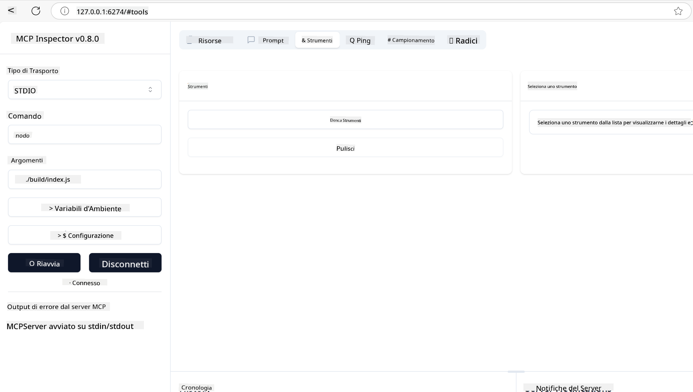
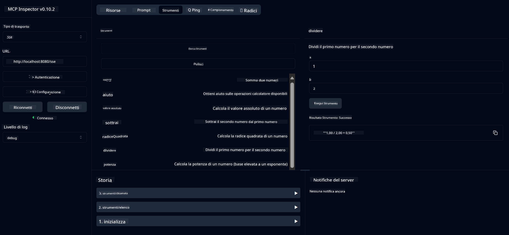

<!--
CO_OP_TRANSLATOR_METADATA:
{
  "original_hash": "ec11ee93f31fdadd94facd3e3d22f9e6",
  "translation_date": "2025-09-09T21:46:54+00:00",
  "source_file": "03-GettingStarted/01-first-server/README.md",
  "language_code": "it"
}
-->
# Introduzione a MCP

Benvenuto nei tuoi primi passi con il Model Context Protocol (MCP)! Che tu sia nuovo a MCP o desideri approfondire la tua comprensione, questa guida ti accompagnerà attraverso il processo essenziale di configurazione e sviluppo. Scoprirai come MCP consente un'integrazione fluida tra modelli di intelligenza artificiale e applicazioni, e imparerai a preparare rapidamente il tuo ambiente per costruire e testare soluzioni basate su MCP.

> TLDR; Se sviluppi applicazioni AI, sai che puoi aggiungere strumenti e altre risorse al tuo LLM (large language model) per renderlo più informato. Tuttavia, se posizioni questi strumenti e risorse su un server, le capacità dell'app e del server possono essere utilizzate da qualsiasi client con/senza un LLM.

## Panoramica

Questa lezione fornisce indicazioni pratiche su come configurare ambienti MCP e costruire le tue prime applicazioni MCP. Imparerai a configurare gli strumenti e i framework necessari, costruire server MCP di base, creare applicazioni host e testare le tue implementazioni.

Il Model Context Protocol (MCP) è un protocollo aperto che standardizza il modo in cui le applicazioni forniscono contesto ai LLM. Pensa a MCP come una porta USB-C per le applicazioni AI: offre un modo standardizzato per connettere modelli di intelligenza artificiale a diverse fonti di dati e strumenti.

## Obiettivi di apprendimento

Alla fine di questa lezione, sarai in grado di:

- Configurare ambienti di sviluppo per MCP in C#, Java, Python, TypeScript e Rust
- Costruire e distribuire server MCP di base con funzionalità personalizzate (risorse, prompt e strumenti)
- Creare applicazioni host che si connettono ai server MCP
- Testare e debug delle implementazioni MCP

## Configurazione dell'ambiente MCP

Prima di iniziare a lavorare con MCP, è importante preparare il tuo ambiente di sviluppo e comprendere il flusso di lavoro di base. Questa sezione ti guiderà attraverso i passaggi iniziali di configurazione per garantire un avvio senza problemi con MCP.

### Prerequisiti

Prima di immergerti nello sviluppo MCP, assicurati di avere:

- **Ambiente di sviluppo**: Per il linguaggio scelto (C#, Java, Python, TypeScript o Rust)
- **IDE/Editor**: Visual Studio, Visual Studio Code, IntelliJ, Eclipse, PyCharm o qualsiasi editor di codice moderno
- **Gestori di pacchetti**: NuGet, Maven/Gradle, pip, npm/yarn o Cargo
- **Chiavi API**: Per qualsiasi servizio AI che intendi utilizzare nelle tue applicazioni host

## Struttura di base di un server MCP

Un server MCP include tipicamente:

- **Configurazione del server**: Impostazione di porta, autenticazione e altre configurazioni
- **Risorse**: Dati e contesto resi disponibili ai LLM
- **Strumenti**: Funzionalità che i modelli possono invocare
- **Prompt**: Modelli per generare o strutturare testo

Ecco un esempio semplificato in TypeScript:

```typescript
import { McpServer, ResourceTemplate } from "@modelcontextprotocol/sdk/server/mcp.js";
import { StdioServerTransport } from "@modelcontextprotocol/sdk/server/stdio.js";
import { z } from "zod";

// Create an MCP server
const server = new McpServer({
  name: "Demo",
  version: "1.0.0"
});

// Add an addition tool
server.tool("add",
  { a: z.number(), b: z.number() },
  async ({ a, b }) => ({
    content: [{ type: "text", text: String(a + b) }]
  })
);

// Add a dynamic greeting resource
server.resource(
  "file",
  // The 'list' parameter controls how the resource lists available files. Setting it to undefined disables listing for this resource.
  new ResourceTemplate("file://{path}", { list: undefined }),
  async (uri, { path }) => ({
    contents: [{
      uri: uri.href,
      text: `File, ${path}!`
    }]
  })
);

// Add a file resource that reads the file contents
server.resource(
  "file",
  new ResourceTemplate("file://{path}", { list: undefined }),
  async (uri, { path }) => {
    let text;
    try {
      text = await fs.readFile(path, "utf8");
    } catch (err) {
      text = `Error reading file: ${err.message}`;
    }
    return {
      contents: [{
        uri: uri.href,
        text
      }]
    };
  }
);

server.prompt(
  "review-code",
  { code: z.string() },
  ({ code }) => ({
    messages: [{
      role: "user",
      content: {
        type: "text",
        text: `Please review this code:\n\n${code}`
      }
    }]
  })
);

// Start receiving messages on stdin and sending messages on stdout
const transport = new StdioServerTransport();
await server.connect(transport);
```

Nel codice precedente abbiamo:

- Importato le classi necessarie dall'SDK MCP per TypeScript.
- Creato e configurato una nuova istanza del server MCP.
- Registrato uno strumento personalizzato (`calculator`) con una funzione gestore.
- Avviato il server per ascoltare le richieste MCP in arrivo.

## Test e Debug

Prima di iniziare a testare il tuo server MCP, è importante comprendere gli strumenti disponibili e le migliori pratiche per il debug. Un test efficace garantisce che il tuo server si comporti come previsto e ti aiuta a identificare e risolvere rapidamente i problemi. La sezione seguente delinea approcci raccomandati per validare la tua implementazione MCP.

MCP fornisce strumenti per aiutarti a testare e debug dei tuoi server:

- **Strumento Inspector**, un'interfaccia grafica che ti consente di connetterti al tuo server e testare strumenti, prompt e risorse.
- **curl**, puoi anche connetterti al tuo server utilizzando uno strumento da riga di comando come curl o altri client che possono creare ed eseguire comandi HTTP.

### Utilizzo di MCP Inspector

Il [MCP Inspector](https://github.com/modelcontextprotocol/inspector) è uno strumento di test visivo che ti aiuta a:

1. **Scoprire le capacità del server**: Rilevare automaticamente risorse, strumenti e prompt disponibili
2. **Testare l'esecuzione degli strumenti**: Provare diversi parametri e vedere le risposte in tempo reale
3. **Visualizzare i metadati del server**: Esaminare informazioni sul server, schemi e configurazioni

```bash
# ex TypeScript, installing and running MCP Inspector
npx @modelcontextprotocol/inspector node build/index.js
```

Quando esegui i comandi sopra, MCP Inspector avvierà un'interfaccia web locale nel tuo browser. Puoi aspettarti di vedere una dashboard che mostra i server MCP registrati, i loro strumenti, risorse e prompt disponibili. L'interfaccia consente di testare interattivamente l'esecuzione degli strumenti, ispezionare i metadati del server e visualizzare le risposte in tempo reale, rendendo più facile validare e debug delle implementazioni del server MCP.

Ecco uno screenshot di come potrebbe apparire:



## Problemi comuni di configurazione e soluzioni

| Problema | Soluzione possibile |
|----------|---------------------|
| Connessione rifiutata | Verifica che il server sia in esecuzione e che la porta sia corretta |
| Errori di esecuzione degli strumenti | Controlla la validazione dei parametri e la gestione degli errori |
| Fallimenti di autenticazione | Verifica chiavi API e permessi |
| Errori di validazione dello schema | Assicurati che i parametri corrispondano allo schema definito |
| Server non avviato | Controlla conflitti di porta o dipendenze mancanti |
| Errori CORS | Configura correttamente gli header CORS per richieste cross-origin |
| Problemi di autenticazione | Verifica la validità del token e i permessi |

## Sviluppo locale

Per lo sviluppo e il test locale, puoi eseguire i server MCP direttamente sulla tua macchina:

1. **Avvia il processo del server**: Esegui la tua applicazione server MCP
2. **Configura la rete**: Assicurati che il server sia accessibile sulla porta prevista
3. **Connetti i client**: Usa URL di connessione locali come `http://localhost:3000`

```bash
# Example: Running a TypeScript MCP server locally
npm run start
# Server running at http://localhost:3000
```

## Costruire il tuo primo server MCP

Abbiamo trattato [Concetti fondamentali](/01-CoreConcepts/README.md) in una lezione precedente, ora è il momento di mettere in pratica quella conoscenza.

### Cosa può fare un server

Prima di iniziare a scrivere codice, ricordiamoci cosa può fare un server:

Un server MCP può, ad esempio:

- Accedere a file e database locali
- Connettersi a API remote
- Eseguire calcoli
- Integrarsi con altri strumenti e servizi
- Fornire un'interfaccia utente per l'interazione

Ottimo, ora che sappiamo cosa possiamo fare, iniziamo a scrivere codice.

## Esercizio: Creare un server

Per creare un server, devi seguire questi passaggi:

- Installare l'SDK MCP.
- Creare un progetto e configurare la struttura del progetto.
- Scrivere il codice del server.
- Testare il server.

### -1- Creare il progetto

#### TypeScript

```sh
# Create project directory and initialize npm project
mkdir calculator-server
cd calculator-server
npm init -y
```

#### Python

```sh
# Create project dir
mkdir calculator-server
cd calculator-server
# Open the folder in Visual Studio Code - Skip this if you are using a different IDE
code .
```

#### .NET

```sh
dotnet new console -n McpCalculatorServer
cd McpCalculatorServer
```

#### Java

Per Java, crea un progetto Spring Boot:

```bash
curl https://start.spring.io/starter.zip \
  -d dependencies=web \
  -d javaVersion=21 \
  -d type=maven-project \
  -d groupId=com.example \
  -d artifactId=calculator-server \
  -d name=McpServer \
  -d packageName=com.microsoft.mcp.sample.server \
  -o calculator-server.zip
```

Estrai il file zip:

```bash
unzip calculator-server.zip -d calculator-server
cd calculator-server
# optional remove the unused test
rm -rf src/test/java
```

Aggiungi la seguente configurazione completa al file *pom.xml*:

```xml
<?xml version="1.0" encoding="UTF-8"?>
<project xmlns="http://maven.apache.org/POM/4.0.0"
    xmlns:xsi="http://www.w3.org/2001/XMLSchema-instance"
    xsi:schemaLocation="http://maven.apache.org/POM/4.0.0 http://maven.apache.org/xsd/maven-4.0.0.xsd">
    <modelVersion>4.0.0</modelVersion>
    
    <!-- Spring Boot parent for dependency management -->
    <parent>
        <groupId>org.springframework.boot</groupId>
        <artifactId>spring-boot-starter-parent</artifactId>
        <version>3.5.0</version>
        <relativePath />
    </parent>

    <!-- Project coordinates -->
    <groupId>com.example</groupId>
    <artifactId>calculator-server</artifactId>
    <version>0.0.1-SNAPSHOT</version>
    <name>Calculator Server</name>
    <description>Basic calculator MCP service for beginners</description>

    <!-- Properties -->
    <properties>
        <java.version>21</java.version>
        <maven.compiler.source>21</maven.compiler.source>
        <maven.compiler.target>21</maven.compiler.target>
    </properties>

    <!-- Spring AI BOM for version management -->
    <dependencyManagement>
        <dependencies>
            <dependency>
                <groupId>org.springframework.ai</groupId>
                <artifactId>spring-ai-bom</artifactId>
                <version>1.0.0-SNAPSHOT</version>
                <type>pom</type>
                <scope>import</scope>
            </dependency>
        </dependencies>
    </dependencyManagement>

    <!-- Dependencies -->
    <dependencies>
        <dependency>
            <groupId>org.springframework.ai</groupId>
            <artifactId>spring-ai-starter-mcp-server-webflux</artifactId>
        </dependency>
        <dependency>
            <groupId>org.springframework.boot</groupId>
            <artifactId>spring-boot-starter-actuator</artifactId>
        </dependency>
        <dependency>
         <groupId>org.springframework.boot</groupId>
         <artifactId>spring-boot-starter-test</artifactId>
         <scope>test</scope>
      </dependency>
    </dependencies>

    <!-- Build configuration -->
    <build>
        <plugins>
            <plugin>
                <groupId>org.springframework.boot</groupId>
                <artifactId>spring-boot-maven-plugin</artifactId>
            </plugin>
            <plugin>
                <groupId>org.apache.maven.plugins</groupId>
                <artifactId>maven-compiler-plugin</artifactId>
                <configuration>
                    <release>21</release>
                </configuration>
            </plugin>
        </plugins>
    </build>

    <!-- Repositories for Spring AI snapshots -->
    <repositories>
        <repository>
            <id>spring-milestones</id>
            <name>Spring Milestones</name>
            <url>https://repo.spring.io/milestone</url>
            <snapshots>
                <enabled>false</enabled>
            </snapshots>
        </repository>
        <repository>
            <id>spring-snapshots</id>
            <name>Spring Snapshots</name>
            <url>https://repo.spring.io/snapshot</url>
            <releases>
                <enabled>false</enabled>
            </releases>
        </repository>
    </repositories>
</project>
```

#### Rust

```sh
mkdir calculator-server
cd calculator-server
cargo init
```

### -2- Aggiungere dipendenze

Ora che hai creato il tuo progetto, aggiungiamo le dipendenze:

#### TypeScript

```sh
# If not already installed, install TypeScript globally
npm install typescript -g

# Install the MCP SDK and Zod for schema validation
npm install @modelcontextprotocol/sdk zod
npm install -D @types/node typescript
```

#### Python

```sh
# Create a virtual env and install dependencies
python -m venv venv
venv\Scripts\activate
pip install "mcp[cli]"
```

#### Java

```bash
cd calculator-server
./mvnw clean install -DskipTests
```

#### Rust

```sh
cargo add rmcp --features server,transport-io
cargo add serde
cargo add tokio --features rt-multi-thread
```

### -3- Creare file di progetto

#### TypeScript

Apri il file *package.json* e sostituisci il contenuto con il seguente per assicurarti di poter costruire ed eseguire il server:

```json
{
  "name": "calculator-server",
  "version": "1.0.0",
  "main": "index.js",
  "type": "module",
  "scripts": {
    "start": "tsc && node ./build/index.js",
    "build": "tsc && node ./build/index.js"
  },
  "keywords": [],
  "author": "",
  "license": "ISC",
  "description": "A simple calculator server using Model Context Protocol",
  "dependencies": {
    "@modelcontextprotocol/sdk": "^1.16.0",
    "zod": "^3.25.76"
  },
  "devDependencies": {
    "@types/node": "^24.0.14",
    "typescript": "^5.8.3"
  }
}
```

Crea un file *tsconfig.json* con il seguente contenuto:

```json
{
  "compilerOptions": {
    "target": "ES2022",
    "module": "Node16",
    "moduleResolution": "Node16",
    "outDir": "./build",
    "rootDir": "./src",
    "strict": true,
    "esModuleInterop": true,
    "skipLibCheck": true,
    "forceConsistentCasingInFileNames": true
  },
  "include": ["src/**/*"],
  "exclude": ["node_modules"]
}
```

Crea una directory per il tuo codice sorgente:

```sh
mkdir src
touch src/index.ts
```

#### Python

Crea un file *server.py*

```sh
touch server.py
```

#### .NET

Installa i pacchetti NuGet richiesti:

```sh
dotnet add package ModelContextProtocol --prerelease
dotnet add package Microsoft.Extensions.Hosting
```

#### Java

Per i progetti Java Spring Boot, la struttura del progetto viene creata automaticamente.

#### Rust

Per Rust, un file *src/main.rs* viene creato di default quando esegui `cargo init`. Apri il file ed elimina il codice predefinito.

### -4- Scrivere il codice del server

#### TypeScript

Crea un file *index.ts* e aggiungi il seguente codice:

```typescript
import { McpServer, ResourceTemplate } from "@modelcontextprotocol/sdk/server/mcp.js";
import { StdioServerTransport } from "@modelcontextprotocol/sdk/server/stdio.js";
import { z } from "zod";
 
// Create an MCP server
const server = new McpServer({
  name: "Calculator MCP Server",
  version: "1.0.0"
});
```

Ora hai un server, ma non fa molto, sistemiamolo.

#### Python

```python
# server.py
from mcp.server.fastmcp import FastMCP

# Create an MCP server
mcp = FastMCP("Demo")
```

#### .NET

```csharp
using Microsoft.Extensions.DependencyInjection;
using Microsoft.Extensions.Hosting;
using Microsoft.Extensions.Logging;
using ModelContextProtocol.Server;
using System.ComponentModel;

var builder = Host.CreateApplicationBuilder(args);
builder.Logging.AddConsole(consoleLogOptions =>
{
    // Configure all logs to go to stderr
    consoleLogOptions.LogToStandardErrorThreshold = LogLevel.Trace;
});

builder.Services
    .AddMcpServer()
    .WithStdioServerTransport()
    .WithToolsFromAssembly();
await builder.Build().RunAsync();

// add features
```

#### Java

Per Java, crea i componenti principali del server. Modifica prima la classe principale dell'applicazione:

*src/main/java/com/microsoft/mcp/sample/server/McpServerApplication.java*:

```java
package com.microsoft.mcp.sample.server;

import org.springframework.ai.tool.ToolCallbackProvider;
import org.springframework.ai.tool.method.MethodToolCallbackProvider;
import org.springframework.boot.SpringApplication;
import org.springframework.boot.autoconfigure.SpringBootApplication;
import org.springframework.context.annotation.Bean;
import com.microsoft.mcp.sample.server.service.CalculatorService;

@SpringBootApplication
public class McpServerApplication {

    public static void main(String[] args) {
        SpringApplication.run(McpServerApplication.class, args);
    }
    
    @Bean
    public ToolCallbackProvider calculatorTools(CalculatorService calculator) {
        return MethodToolCallbackProvider.builder().toolObjects(calculator).build();
    }
}
```

Crea il servizio calcolatore *src/main/java/com/microsoft/mcp/sample/server/service/CalculatorService.java*:

```java
package com.microsoft.mcp.sample.server.service;

import org.springframework.ai.tool.annotation.Tool;
import org.springframework.stereotype.Service;

/**
 * Service for basic calculator operations.
 * This service provides simple calculator functionality through MCP.
 */
@Service
public class CalculatorService {

    /**
     * Add two numbers
     * @param a The first number
     * @param b The second number
     * @return The sum of the two numbers
     */
    @Tool(description = "Add two numbers together")
    public String add(double a, double b) {
        double result = a + b;
        return formatResult(a, "+", b, result);
    }

    /**
     * Subtract one number from another
     * @param a The number to subtract from
     * @param b The number to subtract
     * @return The result of the subtraction
     */
    @Tool(description = "Subtract the second number from the first number")
    public String subtract(double a, double b) {
        double result = a - b;
        return formatResult(a, "-", b, result);
    }

    /**
     * Multiply two numbers
     * @param a The first number
     * @param b The second number
     * @return The product of the two numbers
     */
    @Tool(description = "Multiply two numbers together")
    public String multiply(double a, double b) {
        double result = a * b;
        return formatResult(a, "*", b, result);
    }

    /**
     * Divide one number by another
     * @param a The numerator
     * @param b The denominator
     * @return The result of the division
     */
    @Tool(description = "Divide the first number by the second number")
    public String divide(double a, double b) {
        if (b == 0) {
            return "Error: Cannot divide by zero";
        }
        double result = a / b;
        return formatResult(a, "/", b, result);
    }

    /**
     * Calculate the power of a number
     * @param base The base number
     * @param exponent The exponent
     * @return The result of raising the base to the exponent
     */
    @Tool(description = "Calculate the power of a number (base raised to an exponent)")
    public String power(double base, double exponent) {
        double result = Math.pow(base, exponent);
        return formatResult(base, "^", exponent, result);
    }

    /**
     * Calculate the square root of a number
     * @param number The number to find the square root of
     * @return The square root of the number
     */
    @Tool(description = "Calculate the square root of a number")
    public String squareRoot(double number) {
        if (number < 0) {
            return "Error: Cannot calculate square root of a negative number";
        }
        double result = Math.sqrt(number);
        return String.format("√%.2f = %.2f", number, result);
    }

    /**
     * Calculate the modulus (remainder) of division
     * @param a The dividend
     * @param b The divisor
     * @return The remainder of the division
     */
    @Tool(description = "Calculate the remainder when one number is divided by another")
    public String modulus(double a, double b) {
        if (b == 0) {
            return "Error: Cannot divide by zero";
        }
        double result = a % b;
        return formatResult(a, "%", b, result);
    }

    /**
     * Calculate the absolute value of a number
     * @param number The number to find the absolute value of
     * @return The absolute value of the number
     */
    @Tool(description = "Calculate the absolute value of a number")
    public String absolute(double number) {
        double result = Math.abs(number);
        return String.format("|%.2f| = %.2f", number, result);
    }

    /**
     * Get help about available calculator operations
     * @return Information about available operations
     */
    @Tool(description = "Get help about available calculator operations")
    public String help() {
        return "Basic Calculator MCP Service\n\n" +
               "Available operations:\n" +
               "1. add(a, b) - Adds two numbers\n" +
               "2. subtract(a, b) - Subtracts the second number from the first\n" +
               "3. multiply(a, b) - Multiplies two numbers\n" +
               "4. divide(a, b) - Divides the first number by the second\n" +
               "5. power(base, exponent) - Raises a number to a power\n" +
               "6. squareRoot(number) - Calculates the square root\n" + 
               "7. modulus(a, b) - Calculates the remainder of division\n" +
               "8. absolute(number) - Calculates the absolute value\n\n" +
               "Example usage: add(5, 3) will return 5 + 3 = 8";
    }

    /**
     * Format the result of a calculation
     */
    private String formatResult(double a, String operator, double b, double result) {
        return String.format("%.2f %s %.2f = %.2f", a, operator, b, result);
    }
}
```

**Componenti opzionali per un servizio pronto per la produzione:**

Crea una configurazione di avvio *src/main/java/com/microsoft/mcp/sample/server/config/StartupConfig.java*:

```java
package com.microsoft.mcp.sample.server.config;

import org.springframework.boot.CommandLineRunner;
import org.springframework.context.annotation.Bean;
import org.springframework.context.annotation.Configuration;

@Configuration
public class StartupConfig {
    
    @Bean
    public CommandLineRunner startupInfo() {
        return args -> {
            System.out.println("\n" + "=".repeat(60));
            System.out.println("Calculator MCP Server is starting...");
            System.out.println("SSE endpoint: http://localhost:8080/sse");
            System.out.println("Health check: http://localhost:8080/actuator/health");
            System.out.println("=".repeat(60) + "\n");
        };
    }
}
```

Crea un controller di salute *src/main/java/com/microsoft/mcp/sample/server/controller/HealthController.java*:

```java
package com.microsoft.mcp.sample.server.controller;

import org.springframework.http.ResponseEntity;
import org.springframework.web.bind.annotation.GetMapping;
import org.springframework.web.bind.annotation.RestController;
import java.time.LocalDateTime;
import java.util.HashMap;
import java.util.Map;

@RestController
public class HealthController {
    
    @GetMapping("/health")
    public ResponseEntity<Map<String, Object>> healthCheck() {
        Map<String, Object> response = new HashMap<>();
        response.put("status", "UP");
        response.put("timestamp", LocalDateTime.now().toString());
        response.put("service", "Calculator MCP Server");
        return ResponseEntity.ok(response);
    }
}
```

Crea un gestore di eccezioni *src/main/java/com/microsoft/mcp/sample/server/exception/GlobalExceptionHandler.java*:

```java
package com.microsoft.mcp.sample.server.exception;

import org.springframework.http.HttpStatus;
import org.springframework.http.ResponseEntity;
import org.springframework.web.bind.annotation.ExceptionHandler;
import org.springframework.web.bind.annotation.RestControllerAdvice;

@RestControllerAdvice
public class GlobalExceptionHandler {

    @ExceptionHandler(IllegalArgumentException.class)
    public ResponseEntity<ErrorResponse> handleIllegalArgumentException(IllegalArgumentException ex) {
        ErrorResponse error = new ErrorResponse(
            "Invalid_Input", 
            "Invalid input parameter: " + ex.getMessage());
        return new ResponseEntity<>(error, HttpStatus.BAD_REQUEST);
    }

    public static class ErrorResponse {
        private String code;
        private String message;

        public ErrorResponse(String code, String message) {
            this.code = code;
            this.message = message;
        }

        // Getters
        public String getCode() { return code; }
        public String getMessage() { return message; }
    }
}
```

Crea un banner personalizzato *src/main/resources/banner.txt*:

```text
_____      _            _       _             
 / ____|    | |          | |     | |            
| |     __ _| | ___ _   _| | __ _| |_ ___  _ __ 
| |    / _` | |/ __| | | | |/ _` | __/ _ \| '__|
| |___| (_| | | (__| |_| | | (_| | || (_) | |   
 \_____\__,_|_|\___|\__,_|_|\__,_|\__\___/|_|   
                                                
Calculator MCP Server v1.0
Spring Boot MCP Application
```

#### Rust

Aggiungi il seguente codice all'inizio del file *src/main.rs*. Questo importa le librerie e i moduli necessari per il tuo server MCP.

```rust
use rmcp::{
    handler::server::{router::tool::ToolRouter, tool::Parameters},
    model::{ServerCapabilities, ServerInfo},
    schemars, tool, tool_handler, tool_router,
    transport::stdio,
    ServerHandler, ServiceExt,
};
use std::error::Error;
```

Il server calcolatore sarà semplice e potrà sommare due numeri. Creiamo una struttura per rappresentare la richiesta del calcolatore.

```rust
#[derive(Debug, serde::Deserialize, schemars::JsonSchema)]
pub struct CalculatorRequest {
    pub a: f64,
    pub b: f64,
}
```

Successivamente, crea una struttura per rappresentare il server calcolatore. Questa struttura conterrà il router degli strumenti, utilizzato per registrare gli strumenti.

```rust
#[derive(Debug, Clone)]
pub struct Calculator {
    tool_router: ToolRouter<Self>,
}
```

Ora possiamo implementare la struttura `Calculator` per creare una nuova istanza del server e implementare il gestore del server per fornire informazioni sul server.

```rust
#[tool_router]
impl Calculator {
    pub fn new() -> Self {
        Self {
            tool_router: Self::tool_router(),
        }
    }
}

#[tool_handler]
impl ServerHandler for Calculator {
    fn get_info(&self) -> ServerInfo {
        ServerInfo {
            instructions: Some("A simple calculator tool".into()),
            capabilities: ServerCapabilities::builder().enable_tools().build(),
            ..Default::default()
        }
    }
}
```

Infine, dobbiamo implementare la funzione principale per avviare il server. Questa funzione creerà un'istanza della struttura `Calculator` e la servirà tramite input/output standard.

```rust
#[tokio::main]
async fn main() -> Result<(), Box<dyn Error>> {
    let service = Calculator::new().serve(stdio()).await?;
    service.waiting().await?;
    Ok(())
}
```

Il server è ora configurato per fornire informazioni di base su se stesso. Successivamente, aggiungeremo uno strumento per eseguire l'addizione.

### -5- Aggiungere uno strumento e una risorsa

Aggiungi uno strumento e una risorsa aggiungendo il seguente codice:

#### TypeScript

```typescript
server.tool(
  "add",
  { a: z.number(), b: z.number() },
  async ({ a, b }) => ({
    content: [{ type: "text", text: String(a + b) }]
  })
);

server.resource(
  "greeting",
  new ResourceTemplate("greeting://{name}", { list: undefined }),
  async (uri, { name }) => ({
    contents: [{
      uri: uri.href,
      text: `Hello, ${name}!`
    }]
  })
);
```

Il tuo strumento prende i parametri `a` e `b` ed esegue una funzione che produce una risposta nella forma:

```typescript
{
  contents: [{
    type: "text", content: "some content"
  }]
}
```

La tua risorsa è accessibile tramite una stringa "greeting" e prende un parametro `name`, producendo una risposta simile allo strumento:

```typescript
{
  uri: "<href>",
  text: "a text"
}
```

#### Python

```python
# Add an addition tool
@mcp.tool()
def add(a: int, b: int) -> int:
    """Add two numbers"""
    return a + b


# Add a dynamic greeting resource
@mcp.resource("greeting://{name}")
def get_greeting(name: str) -> str:
    """Get a personalized greeting"""
    return f"Hello, {name}!"
```

Nel codice precedente abbiamo:

- Definito uno strumento `add` che prende i parametri `a` e `p`, entrambi interi.
- Creato una risorsa chiamata `greeting` che prende il parametro `name`.

#### .NET

Aggiungi questo al tuo file Program.cs:

```csharp
[McpServerToolType]
public static class CalculatorTool
{
    [McpServerTool, Description("Adds two numbers")]
    public static string Add(int a, int b) => $"Sum {a + b}";
}
```

#### Java

Gli strumenti sono già stati creati nel passaggio precedente.

#### Rust

Aggiungi un nuovo strumento all'interno del blocco `impl Calculator`:

```rust
#[tool(description = "Adds a and b")]
async fn add(
    &self,
    Parameters(CalculatorRequest { a, b }): Parameters<CalculatorRequest>,
) -> String {
    (a + b).to_string()
}
```

### -6- Codice finale

Aggiungiamo l'ultimo codice necessario affinché il server possa avviarsi:

#### TypeScript

```typescript
// Start receiving messages on stdin and sending messages on stdout
const transport = new StdioServerTransport();
await server.connect(transport);
```

Ecco il codice completo:

```typescript
// index.ts
import { McpServer, ResourceTemplate } from "@modelcontextprotocol/sdk/server/mcp.js";
import { StdioServerTransport } from "@modelcontextprotocol/sdk/server/stdio.js";
import { z } from "zod";

// Create an MCP server
const server = new McpServer({
  name: "Calculator MCP Server",
  version: "1.0.0"
});

// Add an addition tool
server.tool(
  "add",
  { a: z.number(), b: z.number() },
  async ({ a, b }) => ({
    content: [{ type: "text", text: String(a + b) }]
  })
);

// Add a dynamic greeting resource
server.resource(
  "greeting",
  new ResourceTemplate("greeting://{name}", { list: undefined }),
  async (uri, { name }) => ({
    contents: [{
      uri: uri.href,
      text: `Hello, ${name}!`
    }]
  })
);

// Start receiving messages on stdin and sending messages on stdout
const transport = new StdioServerTransport();
server.connect(transport);
```

#### Python

```python
# server.py
from mcp.server.fastmcp import FastMCP

# Create an MCP server
mcp = FastMCP("Demo")


# Add an addition tool
@mcp.tool()
def add(a: int, b: int) -> int:
    """Add two numbers"""
    return a + b


# Add a dynamic greeting resource
@mcp.resource("greeting://{name}")
def get_greeting(name: str) -> str:
    """Get a personalized greeting"""
    return f"Hello, {name}!"

# Main execution block - this is required to run the server
if __name__ == "__main__":
    mcp.run()
```

#### .NET

Crea un file Program.cs con il seguente contenuto:

```csharp
using Microsoft.Extensions.DependencyInjection;
using Microsoft.Extensions.Hosting;
using Microsoft.Extensions.Logging;
using ModelContextProtocol.Server;
using System.ComponentModel;

var builder = Host.CreateApplicationBuilder(args);
builder.Logging.AddConsole(consoleLogOptions =>
{
    // Configure all logs to go to stderr
    consoleLogOptions.LogToStandardErrorThreshold = LogLevel.Trace;
});

builder.Services
    .AddMcpServer()
    .WithStdioServerTransport()
    .WithToolsFromAssembly();
await builder.Build().RunAsync();

[McpServerToolType]
public static class CalculatorTool
{
    [McpServerTool, Description("Adds two numbers")]
    public static string Add(int a, int b) => $"Sum {a + b}";
}
```

#### Java

La tua classe principale completa dell'applicazione dovrebbe apparire così:

```java
// McpServerApplication.java
package com.microsoft.mcp.sample.server;

import org.springframework.ai.tool.ToolCallbackProvider;
import org.springframework.ai.tool.method.MethodToolCallbackProvider;
import org.springframework.boot.SpringApplication;
import org.springframework.boot.autoconfigure.SpringBootApplication;
import org.springframework.context.annotation.Bean;
import com.microsoft.mcp.sample.server.service.CalculatorService;

@SpringBootApplication
public class McpServerApplication {

    public static void main(String[] args) {
        SpringApplication.run(McpServerApplication.class, args);
    }
    
    @Bean
    public ToolCallbackProvider calculatorTools(CalculatorService calculator) {
        return MethodToolCallbackProvider.builder().toolObjects(calculator).build();
    }
}
```

#### Rust

Il codice finale per il server Rust dovrebbe apparire così:

```rust
use rmcp::{
    ServerHandler, ServiceExt,
    handler::server::{router::tool::ToolRouter, tool::Parameters},
    model::{ServerCapabilities, ServerInfo},
    schemars, tool, tool_handler, tool_router,
    transport::stdio,
};
use std::error::Error;

#[derive(Debug, serde::Deserialize, schemars::JsonSchema)]
pub struct CalculatorRequest {
    pub a: f64,
    pub b: f64,
}

#[derive(Debug, Clone)]
pub struct Calculator {
    tool_router: ToolRouter<Self>,
}

#[tool_router]
impl Calculator {
    pub fn new() -> Self {
        Self {
            tool_router: Self::tool_router(),
        }
    }
    
    #[tool(description = "Adds a and b")]
    async fn add(
        &self,
        Parameters(CalculatorRequest { a, b }): Parameters<CalculatorRequest>,
    ) -> String {
        (a + b).to_string()
    }
}

#[tool_handler]
impl ServerHandler for Calculator {
    fn get_info(&self) -> ServerInfo {
        ServerInfo {
            instructions: Some("A simple calculator tool".into()),
            capabilities: ServerCapabilities::builder().enable_tools().build(),
            ..Default::default()
        }
    }
}

#[tokio::main]
async fn main() -> Result<(), Box<dyn Error>> {
    let service = Calculator::new().serve(stdio()).await?;
    service.waiting().await?;
    Ok(())
}
```

### -7- Testare il server

Avvia il server con il seguente comando:

#### TypeScript

```sh
npm run build
```

#### Python

```sh
mcp run server.py
```

> Per utilizzare MCP Inspector, usa `mcp dev server.py`, che avvia automaticamente l'Inspector e fornisce il token di sessione proxy richiesto. Se utilizzi `mcp run server.py`, dovrai avviare manualmente l'Inspector e configurare la connessione.

#### .NET

Assicurati di essere nella directory del tuo progetto:

```sh
cd McpCalculatorServer
dotnet run
```

#### Java

```bash
./mvnw clean install -DskipTests
java -jar target/calculator-server-0.0.1-SNAPSHOT.jar
```

#### Rust

Esegui i seguenti comandi per formattare ed eseguire il server:

```sh
cargo fmt
cargo run
```

### -8- Eseguire utilizzando l'inspector

L'inspector è uno strumento eccellente che può avviare il tuo server e ti consente di interagire con esso per testare che funzioni. Avviamolo:

> [!NOTE]
> Potrebbe apparire diverso nel campo "command" poiché contiene il comando per eseguire un server con il tuo runtime specifico.

#### TypeScript

```sh
npx @modelcontextprotocol/inspector node build/index.js
```

Oppure aggiungilo al tuo *package.json* così: `"inspector": "npx @modelcontextprotocol/inspector node build/index.js"` e poi esegui `npm run inspector`.

Python avvolge uno strumento Node.js chiamato inspector. È possibile chiamare detto strumento così:

```sh
mcp dev server.py
```

Tuttavia, non implementa tutti i metodi disponibili sullo strumento, quindi si consiglia di eseguire direttamente lo strumento Node.js come segue:

```sh
npx @modelcontextprotocol/inspector mcp run server.py
```

Se stai utilizzando uno strumento o un IDE che ti consente di configurare comandi e argomenti per eseguire script, 
assicurati di impostare `python` nel campo `Command` e `server.py` come `Arguments`. Questo garantisce che lo script venga eseguito correttamente.

#### .NET

Assicurati di essere nella directory del tuo progetto:

```sh
cd McpCalculatorServer
npx @modelcontextprotocol/inspector dotnet run
```

#### Java

Assicurati che il server calcolatore sia in esecuzione. Poi avvia l'inspector:

```cmd
npx @modelcontextprotocol/inspector
```

Nell'interfaccia web dell'inspector:

1. Seleziona "SSE" come tipo di trasporto
2. Imposta l'URL su: `http://localhost:8080/sse`
3. Clicca su "Connect"


**Ora sei connesso al server**  
**La sezione di test del server Java è ora completata**

La prossima sezione riguarda l'interazione con il server.

Dovresti vedere la seguente interfaccia utente:


1. Connettiti al server selezionando il pulsante Connect.  
   Una volta connesso al server, dovresti vedere quanto segue:

   

1. Seleziona "Tools" e "listTools", dovresti vedere "Add" apparire. Seleziona "Add" e compila i valori dei parametri.

   Dovresti vedere la seguente risposta, ovvero un risultato dallo strumento "add":

   

Congratulazioni, sei riuscito a creare e eseguire il tuo primo server!

#### Rust

Per eseguire il server Rust con l'MCP Inspector CLI, usa il seguente comando:

```sh
npx @modelcontextprotocol/inspector cargo run --cli --method tools/call --tool-name add --tool-arg a=1 b=2
```

### SDK ufficiali

MCP fornisce SDK ufficiali per diversi linguaggi:

- [C# SDK](https://github.com/modelcontextprotocol/csharp-sdk) - Mantenuto in collaborazione con Microsoft  
- [Java SDK](https://github.com/modelcontextprotocol/java-sdk) - Mantenuto in collaborazione con Spring AI  
- [TypeScript SDK](https://github.com/modelcontextprotocol/typescript-sdk) - L'implementazione ufficiale in TypeScript  
- [Python SDK](https://github.com/modelcontextprotocol/python-sdk) - L'implementazione ufficiale in Python  
- [Kotlin SDK](https://github.com/modelcontextprotocol/kotlin-sdk) - L'implementazione ufficiale in Kotlin  
- [Swift SDK](https://github.com/modelcontextprotocol/swift-sdk) - Mantenuto in collaborazione con Loopwork AI  
- [Rust SDK](https://github.com/modelcontextprotocol/rust-sdk) - L'implementazione ufficiale in Rust  

## Punti chiave

- Configurare un ambiente di sviluppo MCP è semplice con gli SDK specifici per linguaggio  
- Costruire server MCP implica creare e registrare strumenti con schemi chiari  
- Testare e fare debug sono essenziali per implementazioni MCP affidabili  

## Esempi

- [Java Calculator](../samples/java/calculator/README.md)  
- [.Net Calculator](../../../../03-GettingStarted/samples/csharp)  
- [JavaScript Calculator](../samples/javascript/README.md)  
- [TypeScript Calculator](../samples/typescript/README.md)  
- [Python Calculator](../../../../03-GettingStarted/samples/python)  
- [Rust Calculator](../../../../03-GettingStarted/samples/rust)  

## Compito

Crea un semplice server MCP con uno strumento a tua scelta:

1. Implementa lo strumento nel linguaggio che preferisci (.NET, Java, Python, TypeScript o Rust).  
2. Definisci i parametri di input e i valori di ritorno.  
3. Esegui lo strumento di ispezione per assicurarti che il server funzioni come previsto.  
4. Testa l'implementazione con vari input.  

## Soluzione

[Soluzione](./solution/README.md)

## Risorse aggiuntive

- [Costruire agenti usando Model Context Protocol su Azure](https://learn.microsoft.com/azure/developer/ai/intro-agents-mcp)  
- [MCP remoto con Azure Container Apps (Node.js/TypeScript/JavaScript)](https://learn.microsoft.com/samples/azure-samples/mcp-container-ts/mcp-container-ts/)  
- [.NET OpenAI MCP Agent](https://learn.microsoft.com/samples/azure-samples/openai-mcp-agent-dotnet/openai-mcp-agent-dotnet/)  

## Cosa viene dopo

Prossimo: [Introduzione ai Client MCP](../02-client/README.md)  

---

**Disclaimer**:  
Questo documento è stato tradotto utilizzando il servizio di traduzione automatica [Co-op Translator](https://github.com/Azure/co-op-translator). Sebbene ci impegniamo per garantire l'accuratezza, si prega di notare che le traduzioni automatiche possono contenere errori o imprecisioni. Il documento originale nella sua lingua nativa dovrebbe essere considerato la fonte autorevole. Per informazioni critiche, si raccomanda una traduzione professionale effettuata da un traduttore umano. Non siamo responsabili per eventuali incomprensioni o interpretazioni errate derivanti dall'uso di questa traduzione.