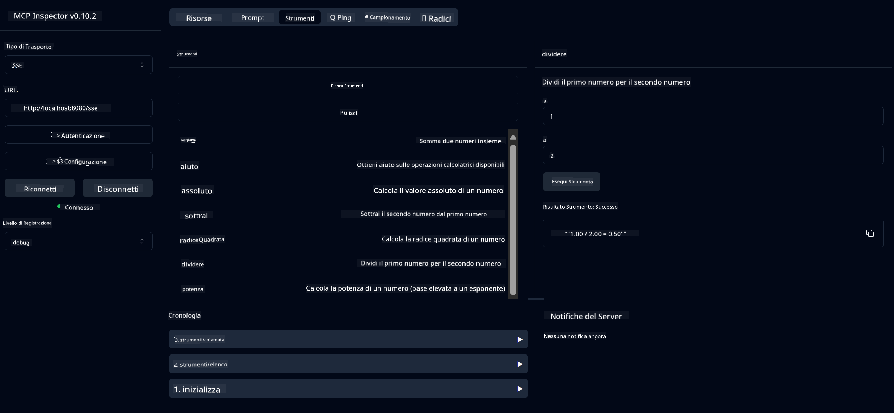

<!--
CO_OP_TRANSLATOR_METADATA:
{
  "original_hash": "ed9cab32cc67c12d8969b407aa47100a",
  "translation_date": "2025-07-13T17:54:08+00:00",
  "source_file": "03-GettingStarted/01-first-server/solution/java/README.md",
  "language_code": "it"
}
-->
# Servizio Calcolatrice Base MCP

Questo servizio offre operazioni di calcolatrice base tramite il Model Context Protocol (MCP) utilizzando Spring Boot con trasporto WebFlux. È progettato come esempio semplice per chi inizia a conoscere le implementazioni MCP.

Per maggiori informazioni, consulta la documentazione di riferimento [MCP Server Boot Starter](https://docs.spring.io/spring-ai/reference/api/mcp/mcp-server-boot-starter-docs.html).


## Utilizzo del Servizio

Il servizio espone i seguenti endpoint API tramite il protocollo MCP:

- `add(a, b)`: Somma due numeri
- `subtract(a, b)`: Sottrae il secondo numero dal primo
- `multiply(a, b)`: Moltiplica due numeri
- `divide(a, b)`: Divide il primo numero per il secondo (con controllo zero)
- `power(base, exponent)`: Calcola la potenza di un numero
- `squareRoot(number)`: Calcola la radice quadrata (con controllo su numeri negativi)
- `modulus(a, b)`: Calcola il resto della divisione
- `absolute(number)`: Calcola il valore assoluto

## Dipendenze

Il progetto richiede le seguenti dipendenze principali:

```xml
<dependency>
    <groupId>org.springframework.ai</groupId>
    <artifactId>spring-ai-starter-mcp-server-webflux</artifactId>
</dependency>
```

## Compilazione del Progetto

Compila il progetto usando Maven:
```bash
./mvnw clean install -DskipTests
```

## Avvio del Server

### Usando Java

```bash
java -jar target/calculator-server-0.0.1-SNAPSHOT.jar
```

### Usando MCP Inspector

MCP Inspector è uno strumento utile per interagire con i servizi MCP. Per usarlo con questo servizio calcolatrice:

1. **Installa e avvia MCP Inspector** in una nuova finestra del terminale:
   ```bash
   npx @modelcontextprotocol/inspector
   ```

2. **Accedi all’interfaccia web** cliccando sull’URL mostrato dall’app (di solito http://localhost:6274)

3. **Configura la connessione**:
   - Imposta il tipo di trasporto su "SSE"
   - Imposta l’URL sull’endpoint SSE del server in esecuzione: `http://localhost:8080/sse`
   - Clicca su "Connect"

4. **Usa gli strumenti**:
   - Clicca su "List Tools" per vedere le operazioni calcolatrice disponibili
   - Seleziona uno strumento e clicca su "Run Tool" per eseguire un’operazione



**Disclaimer**:  
Questo documento è stato tradotto utilizzando il servizio di traduzione automatica [Co-op Translator](https://github.com/Azure/co-op-translator). Pur impegnandoci per garantire accuratezza, si prega di notare che le traduzioni automatiche possono contenere errori o imprecisioni. Il documento originale nella sua lingua nativa deve essere considerato la fonte autorevole. Per informazioni critiche, si raccomanda una traduzione professionale effettuata da un umano. Non ci assumiamo alcuna responsabilità per eventuali malintesi o interpretazioni errate derivanti dall’uso di questa traduzione.