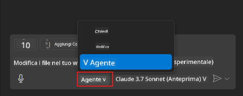
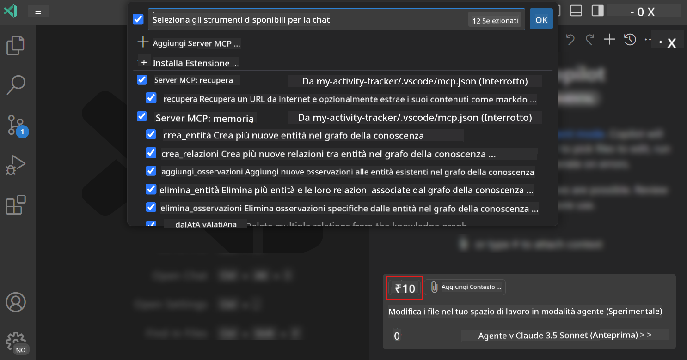
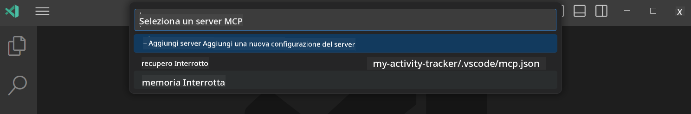
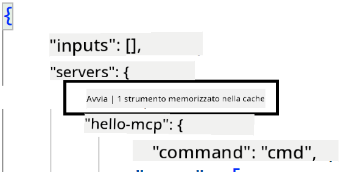
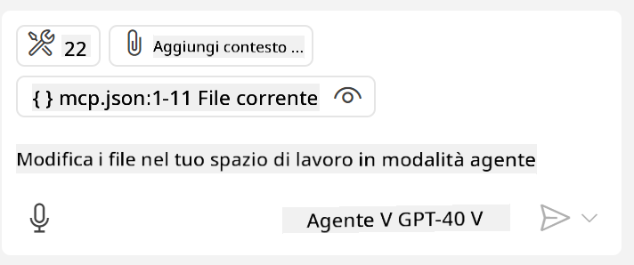

<!--
CO_OP_TRANSLATOR_METADATA:
{
  "original_hash": "d940b5e0af75e3a3a4d1c3179120d1d9",
  "translation_date": "2025-08-26T17:40:07+00:00",
  "source_file": "03-GettingStarted/04-vscode/README.md",
  "language_code": "it"
}
-->
# Utilizzare un server in modalità Agent di GitHub Copilot

Visual Studio Code e GitHub Copilot possono agire come client e utilizzare un MCP Server. Perché dovremmo volerlo fare, ti chiederai? Beh, questo significa che tutte le funzionalità dell'MCP Server possono ora essere utilizzate direttamente all'interno del tuo IDE. Immagina, ad esempio, di aggiungere il server MCP di GitHub: questo ti permetterebbe di controllare GitHub tramite prompt invece di digitare comandi specifici nel terminale. Oppure immagina qualsiasi altra cosa che potrebbe migliorare la tua esperienza di sviluppo, tutto controllato tramite linguaggio naturale. Ora inizi a vedere i vantaggi, giusto?

## Panoramica

Questa lezione spiega come utilizzare Visual Studio Code e la modalità Agent di GitHub Copilot come client per il tuo MCP Server.

## Obiettivi di apprendimento

Alla fine di questa lezione, sarai in grado di:

- Utilizzare un MCP Server tramite Visual Studio Code.
- Eseguire funzionalità come strumenti tramite GitHub Copilot.
- Configurare Visual Studio Code per individuare e gestire il tuo MCP Server.

## Utilizzo

Puoi controllare il tuo MCP Server in due modi diversi:

- Interfaccia utente: vedremo come fare più avanti in questo capitolo.
- Terminale: è possibile controllare le cose dal terminale utilizzando l'eseguibile `code`:

  Per aggiungere un MCP Server al tuo profilo utente, utilizza l'opzione della riga di comando --add-mcp e fornisci la configurazione del server JSON nel formato {\"name\":\"server-name\",\"command\":...}.

  ```
  code --add-mcp "{\"name\":\"my-server\",\"command\": \"uvx\",\"args\": [\"mcp-server-fetch\"]}"
  ```

### Screenshot

  
  
  

Parliamo ora di come utilizzare l'interfaccia visiva nelle prossime sezioni.

## Approccio

Ecco come dobbiamo procedere a livello generale:

- Configurare un file per individuare il nostro MCP Server.
- Avviare/Connettersi al server per elencarne le funzionalità.
- Utilizzare tali funzionalità tramite l'interfaccia Chat di GitHub Copilot.

Perfetto, ora che abbiamo compreso il flusso, proviamo a utilizzare un MCP Server tramite Visual Studio Code con un esercizio.

## Esercizio: Utilizzare un server

In questo esercizio, configureremo Visual Studio Code per individuare il tuo MCP Server in modo che possa essere utilizzato tramite l'interfaccia Chat di GitHub Copilot.

### -0- Prepasso: abilitare la scoperta del server MCP

Potresti dover abilitare la scoperta dei server MCP.

1. Vai su `File -> Preferences -> Settings` in Visual Studio Code.

1. Cerca "MCP" e abilita `chat.mcp.discovery.enabled` nel file settings.json.

### -1- Creare un file di configurazione

Inizia creando un file di configurazione nella radice del tuo progetto. Avrai bisogno di un file chiamato MCP.json da posizionare in una cartella chiamata .vscode. Dovrebbe apparire così:

```text
.vscode
|-- mcp.json
```

Successivamente, vediamo come aggiungere un'entry per il server.

### -2- Configurare un server

Aggiungi il seguente contenuto a *mcp.json*:

```json
{
    "inputs": [],
    "servers": {
       "hello-mcp": {
           "command": "node",
           "args": [
               "build/index.js"
           ]
       }
    }
}
```

Ecco un semplice esempio di come avviare un server scritto in Node.js. Per altri runtime, specifica il comando corretto per avviare il server utilizzando `command` e `args`.

### -3- Avviare il server

Ora che hai aggiunto un'entry, avviamo il server:

1. Individua la tua entry in *mcp.json* e assicurati di trovare l'icona "play":

    

1. Clicca sull'icona "play". Dovresti vedere l'icona degli strumenti nell'interfaccia Chat di GitHub Copilot aumentare il numero di strumenti disponibili. Se clicchi sull'icona degli strumenti, vedrai un elenco di strumenti registrati. Puoi selezionare/deselezionare ogni strumento a seconda che tu voglia che GitHub Copilot li utilizzi come contesto:

  

1. Per eseguire uno strumento, digita un prompt che corrisponda alla descrizione di uno dei tuoi strumenti, ad esempio un prompt come "aggiungi 22 a 1":

  

  Dovresti vedere una risposta che dice 23.

## Compito

Prova ad aggiungere un'entry per un server nel tuo file *mcp.json* e assicurati di poter avviare/arrestare il server. Assicurati anche di poter comunicare con gli strumenti sul tuo server tramite l'interfaccia Chat di GitHub Copilot.

## Soluzione

[Soluzione](./solution/README.md)

## Punti chiave

I punti chiave di questo capitolo sono i seguenti:

- Visual Studio Code è un ottimo client che ti consente di utilizzare diversi MCP Server e i loro strumenti.
- L'interfaccia Chat di GitHub Copilot è il modo in cui interagisci con i server.
- Puoi richiedere input all'utente, come chiavi API, che possono essere passati al MCP Server durante la configurazione dell'entry nel file *mcp.json*.

## Esempi

- [Calcolatrice Java](../samples/java/calculator/README.md)  
- [Calcolatrice .Net](../../../../03-GettingStarted/samples/csharp)  
- [Calcolatrice JavaScript](../samples/javascript/README.md)  
- [Calcolatrice TypeScript](../samples/typescript/README.md)  
- [Calcolatrice Python](../../../../03-GettingStarted/samples/python)  

## Risorse aggiuntive

- [Documentazione di Visual Studio](https://code.visualstudio.com/docs/copilot/chat/mcp-servers)

## Cosa c'è dopo

- Prossimo: [Creare un server stdio](../05-stdio-server/README.md)

---

**Disclaimer**:  
Questo documento è stato tradotto utilizzando il servizio di traduzione automatica [Co-op Translator](https://github.com/Azure/co-op-translator). Sebbene ci impegniamo per garantire l'accuratezza, si prega di notare che le traduzioni automatiche possono contenere errori o imprecisioni. Il documento originale nella sua lingua nativa dovrebbe essere considerato la fonte autorevole. Per informazioni critiche, si raccomanda una traduzione professionale effettuata da un traduttore umano. Non siamo responsabili per eventuali fraintendimenti o interpretazioni errate derivanti dall'uso di questa traduzione.