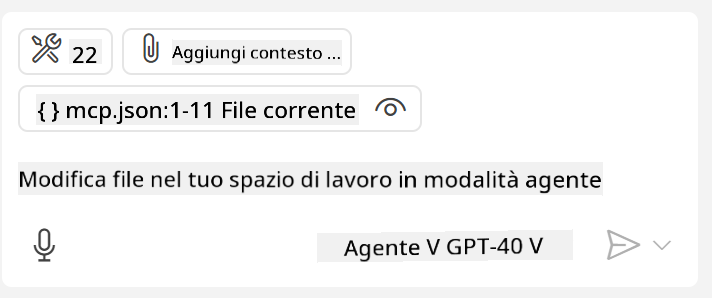
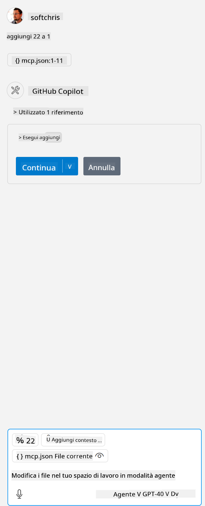

<!--
CO_OP_TRANSLATOR_METADATA:
{
  "original_hash": "c37fabfbc0dcbc9a4afb6d17e7d3be9f",
  "translation_date": "2025-05-17T11:07:11+00:00",
  "source_file": "03-GettingStarted/04-vscode/README.md",
  "language_code": "it"
}
-->
Parliamo più nel dettaglio di come utilizzare l'interfaccia visiva nelle prossime sezioni.

## Approccio

Ecco come dobbiamo affrontare la situazione a livello generale:

- Configurare un file per individuare il nostro MCP Server.
- Avviare/Connettersi a detto server per far elencare le sue capacità.
- Utilizzare queste capacità tramite l'interfaccia di chat di GitHub Copilot.

Perfetto, ora che abbiamo compreso il flusso, proviamo a utilizzare un MCP Server tramite Visual Studio Code attraverso un esercizio.

## Esercizio: Utilizzare un server

In questo esercizio, configureremo Visual Studio Code per individuare il tuo MCP server in modo che possa essere utilizzato dall'interfaccia di chat di GitHub Copilot.

### -0- Prestep, abilitare la scoperta del MCP Server

Potrebbe essere necessario abilitare la scoperta dei MCP Server.

1. Vai su `File -> Preferences -> Settings` in Visual Studio Code.

1. Search for "MCP" and enable `chat.mcp.discovery.enabled` nel file settings.json.

### -1- Creare il file di configurazione

Inizia creando un file di configurazione nella radice del tuo progetto, avrai bisogno di un file chiamato MCP.json da posizionare in una cartella chiamata .vscode. Dovrebbe apparire così:

```text
.vscode
|-- mcp.json
```

Successivamente, vediamo come possiamo aggiungere un'entrata del server.

### -2- Configurare un server

Aggiungi il seguente contenuto a *mcp.json*:

```json
{
    "inputs": [],
    "servers": {
       "hello-mcp": {
           "command": "cmd",
           "args": [
               "/c", "node", "<absolute path>\\build\\index.js"
           ]
       }
    }
}
```

Ecco un semplice esempio su come avviare un server scritto in Node.js, per altri runtime indica il comando corretto per avviare il server usando `command` and `args`.

### -3- Avviare il server

Ora che hai aggiunto un'entrata, avviamo il server:

1. Trova la tua entrata in *mcp.json* e assicurati di individuare l'icona "play":

    

1. Clicca sull'icona "play", dovresti vedere l'icona degli strumenti nella chat di GitHub Copilot aumentare il numero di strumenti disponibili. Se clicchi su detta icona degli strumenti, vedrai un elenco di strumenti registrati. Puoi selezionare/deselezionare ciascun strumento a seconda se desideri che GitHub Copilot li utilizzi come contesto:

  

1. Per eseguire uno strumento, digita un prompt che sai corrisponderà alla descrizione di uno dei tuoi strumenti, ad esempio un prompt come "aggiungi 22 a 1":

  

  Dovresti vedere una risposta che dice 23.

## Compito

Prova ad aggiungere un'entrata del server nel tuo file *mcp.json* e assicurati di poter avviare/arrestare il server. Assicurati anche di poter comunicare con gli strumenti sul tuo server tramite l'interfaccia di chat di GitHub Copilot.

## Soluzione

[Soluzione](./solution/README.md)

## Punti Chiave

I punti chiave di questo capitolo sono i seguenti:

- Visual Studio Code è un ottimo client che ti permette di utilizzare diversi MCP Server e i loro strumenti.
- L'interfaccia di chat di GitHub Copilot è come interagisci con i server.
- Puoi chiedere all'utente input come chiavi API che possono essere passati al MCP Server quando configuri l'entrata del server nel file *mcp.json*.

## Esempi

- [Calcolatrice Java](../samples/java/calculator/README.md)
- [Calcolatrice .Net](../../../../03-GettingStarted/samples/csharp)
- [Calcolatrice JavaScript](../samples/javascript/README.md)
- [Calcolatrice TypeScript](../samples/typescript/README.md)
- [Calcolatrice Python](../../../../03-GettingStarted/samples/python) 

## Risorse Aggiuntive

- [Documentazione di Visual Studio](https://code.visualstudio.com/docs/copilot/chat/mcp-servers)

## Cosa c'è Dopo

- Prossimo: [Creare un SSE Server](/03-GettingStarted/05-sse-server/README.md)

**Disclaimer**:  
Questo documento è stato tradotto utilizzando il servizio di traduzione AI [Co-op Translator](https://github.com/Azure/co-op-translator). Sebbene ci sforziamo di garantire l'accuratezza, si prega di essere consapevoli che le traduzioni automatiche possono contenere errori o imprecisioni. Il documento originale nella sua lingua nativa dovrebbe essere considerato la fonte autorevole. Per informazioni critiche, si raccomanda una traduzione professionale umana. Non siamo responsabili per eventuali incomprensioni o interpretazioni errate derivanti dall'uso di questa traduzione.