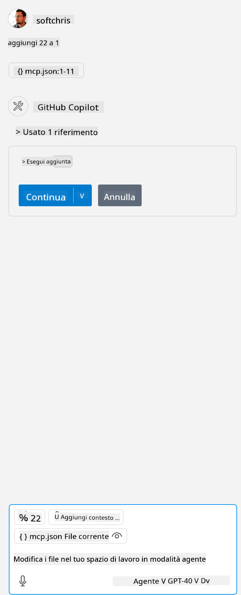

<!--
CO_OP_TRANSLATOR_METADATA:
{
  "original_hash": "5ef8f5821c1a04f7b1fc4f15098ecab8",
  "translation_date": "2025-07-13T19:42:09+00:00",
  "source_file": "03-GettingStarted/04-vscode/solution/README.md",
  "language_code": "it"
}
-->
Questo corrisponde all'esecuzione di un comando come: `node build/index.js`.

- Modifica questa voce del server in modo che corrisponda alla posizione del file del tuo server o a ciò che è necessario per avviare il server, a seconda del runtime scelto e della posizione del server.

## Utilizzare le funzionalità nel server

- Clicca sull'icona `play`, una volta che hai aggiunto *mcp.json* nella cartella *./vscode*,

    Osserva come l'icona degli strumenti cambi aumentando il numero di strumenti disponibili. L'icona degli strumenti si trova proprio sopra il campo di chat in GitHub Copilot.

## Eseguire uno strumento

- Digita un prompt nella finestra di chat che corrisponda alla descrizione del tuo strumento. Per esempio, per attivare lo strumento `add` digita qualcosa come "add 3 to 20".

    Dovresti vedere uno strumento presentato sopra la casella di testo della chat che ti invita a selezionarlo per eseguire lo strumento, come mostrato in questa immagine:

    

    Selezionando lo strumento dovrebbe apparire un risultato numerico con il valore "23" se il tuo prompt era simile a quello che abbiamo indicato prima.

**Disclaimer**:  
Questo documento è stato tradotto utilizzando il servizio di traduzione automatica [Co-op Translator](https://github.com/Azure/co-op-translator). Pur impegnandoci per garantire accuratezza, si prega di notare che le traduzioni automatiche possono contenere errori o imprecisioni. Il documento originale nella sua lingua nativa deve essere considerato la fonte autorevole. Per informazioni critiche, si raccomanda una traduzione professionale effettuata da un umano. Non ci assumiamo alcuna responsabilità per eventuali malintesi o interpretazioni errate derivanti dall’uso di questa traduzione.