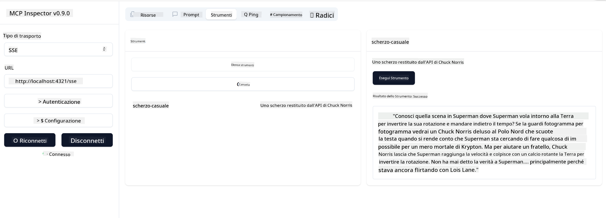

<!--
CO_OP_TRANSLATOR_METADATA:
{
  "original_hash": "0a8086dc4bf89448f83e7936db972c42",
  "translation_date": "2025-05-17T11:34:04+00:00",
  "source_file": "03-GettingStarted/05-sse-server/README.md",
  "language_code": "it"
}
-->
# SSE Server

SSE (Server Sent Events) è uno standard per lo streaming da server a client, che consente ai server di inviare aggiornamenti in tempo reale ai client tramite HTTP. Questo è particolarmente utile per applicazioni che richiedono aggiornamenti in tempo reale, come applicazioni di chat, notifiche o feed di dati in tempo reale. Inoltre, il tuo server può essere utilizzato da più client contemporaneamente poiché risiede su un server che può essere eseguito, ad esempio, nel cloud.

## Panoramica

Questa lezione copre come costruire e utilizzare i server SSE.

## Obiettivi di apprendimento

Al termine di questa lezione, sarai in grado di:

- Costruire un server SSE.
- Debuggare un server SSE usando l'Inspector.
- Utilizzare un server SSE con Visual Studio Code.

## SSE, come funziona

SSE è uno dei due tipi di trasporto supportati. Hai già visto il primo, stdio, utilizzato nelle lezioni precedenti. La differenza è la seguente:

- SSE richiede di gestire due cose: connessione e messaggi.
- Poiché si tratta di un server che può risiedere ovunque, è necessario che ciò si rifletta nel modo in cui si lavora con strumenti come l'Inspector e Visual Studio. Ciò significa che invece di indicare come avviare il server, si punta all'endpoint dove può stabilire una connessione. Vedi sotto il codice di esempio:

Ora che sappiamo qualcosa di più su SSE, costruiamo un server SSE.

## Esercizio: Creare un server SSE

Per creare il nostro server, dobbiamo tenere a mente due cose:

- Dobbiamo utilizzare un server web per esporre endpoint per la connessione e i messaggi.
- Costruire il nostro server come facciamo normalmente con strumenti, risorse e prompt quando usiamo stdio.

### -1- Creare un'istanza del server

Per creare il nostro server, utilizziamo gli stessi tipi di stdio. Tuttavia, per il trasporto, dobbiamo scegliere SSE.

Aggiungiamo le rotte necessarie.

### -2- Aggiungere rotte

Aggiungiamo le rotte che gestiscono la connessione e i messaggi in arrivo:

Aggiungiamo le capacità al server.

### -3- Aggiungere capacità al server

Ora che abbiamo definito tutto ciò che è specifico per SSE, aggiungiamo capacità al server come strumenti, prompt e risorse.

Il tuo codice completo dovrebbe apparire così:

Perfetto, abbiamo un server che utilizza SSE, vediamo come funziona.

## Esercizio: Debuggare un server SSE con Inspector

Inspector è un ottimo strumento che abbiamo visto in una lezione precedente [Creare il tuo primo server](/03-GettingStarted/01-first-server/README.md). Vediamo se possiamo utilizzare l'Inspector anche qui:

### -1- Eseguire l'inspector

Per eseguire l'inspector, devi prima avere un server SSE in esecuzione, quindi facciamolo:

1. Esegui il server

1. Esegui l'inspector

    > ![NOTE]
    > Esegui questo in una finestra di terminale separata rispetto a quella in cui è in esecuzione il server. Nota anche che devi adattare il comando qui sotto per adattarlo all'URL dove il tuo server è in esecuzione.

    ```sh
    npx @modelcontextprotocol/inspector --cli http://localhost:8000/sse --method tools/list
    ```

    L'esecuzione dell'inspector appare uguale in tutti i runtime. Nota come invece di passare un percorso al nostro server e un comando per avviare il server, passiamo l'URL dove il server è in esecuzione e specifichiamo anche la rotta `/sse`.

### -2- Provare lo strumento

Connetti il server selezionando SSE nel menu a tendina e inserisci l'URL dove il tuo server è in esecuzione, ad esempio http:localhost:4321/sse. Ora clicca sul pulsante "Connect". Come prima, seleziona per elencare gli strumenti, seleziona uno strumento e fornisci i valori di input. Dovresti vedere un risultato simile a quello qui sotto:



Perfetto, sei in grado di lavorare con l'inspector, vediamo come possiamo lavorare con Visual Studio Code.

## Compito

Prova a espandere il tuo server con più capacità. Guarda [questa pagina](https://api.chucknorris.io/) per esempio per aggiungere uno strumento che chiama un'API, decidi tu come dovrebbe apparire il server. Divertiti :)

## Soluzione

[Soluzione](./solution/README.md) Ecco una possibile soluzione con codice funzionante.

## Punti chiave

I punti chiave di questo capitolo sono i seguenti:

- SSE è il secondo trasporto supportato accanto a stdio.
- Per supportare SSE, devi gestire le connessioni in entrata e i messaggi utilizzando un framework web.
- Puoi utilizzare sia Inspector che Visual Studio Code per utilizzare il server SSE, proprio come i server stdio. Nota come differisce un po' tra stdio e SSE. Per SSE, devi avviare il server separatamente e poi eseguire il tuo strumento inspector. Per lo strumento inspector, ci sono anche alcune differenze in quanto devi specificare l'URL.

## Esempi

- [Calcolatrice Java](../samples/java/calculator/README.md)
- [Calcolatrice .Net](../../../../03-GettingStarted/samples/csharp)
- [Calcolatrice JavaScript](../samples/javascript/README.md)
- [Calcolatrice TypeScript](../samples/typescript/README.md)
- [Calcolatrice Python](../../../../03-GettingStarted/samples/python)

## Risorse aggiuntive

- [SSE](https://developer.mozilla.org/en-US/docs/Web/API/Server-sent_events)

## Cosa c'è dopo

- Prossimo: [Introduzione all'AI Toolkit per VSCode](/03-GettingStarted/06-aitk/README.md)

**Disclaimer**:  
Questo documento è stato tradotto utilizzando il servizio di traduzione AI [Co-op Translator](https://github.com/Azure/co-op-translator). Sebbene ci impegniamo per l'accuratezza, si prega di essere consapevoli che le traduzioni automatiche possono contenere errori o imprecisioni. Il documento originale nella sua lingua nativa dovrebbe essere considerato la fonte autorevole. Per informazioni critiche, si raccomanda la traduzione professionale umana. Non siamo responsabili per eventuali incomprensioni o interpretazioni errate derivanti dall'uso di questa traduzione.