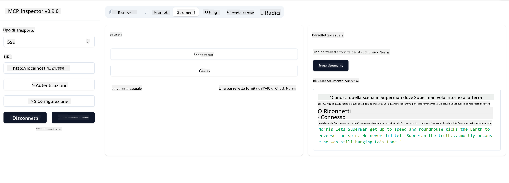

<!--
CO_OP_TRANSLATOR_METADATA:
{
  "original_hash": "6b1152afb5d4cb9a4175044694fd02ca",
  "translation_date": "2025-07-17T01:20:31+00:00",
  "source_file": "03-GettingStarted/05-sse-server/README.md",
  "language_code": "it"
}
-->
# SSE Server

SSE (Server Sent Events) è uno standard per lo streaming dal server al client, che permette ai server di inviare aggiornamenti in tempo reale ai client tramite HTTP. Questo è particolarmente utile per applicazioni che richiedono aggiornamenti live, come chat, notifiche o feed di dati in tempo reale. Inoltre, il tuo server può essere utilizzato da più client contemporaneamente, poiché risiede su un server che può essere eseguito, ad esempio, nel cloud.

## Panoramica

Questa lezione spiega come costruire e utilizzare SSE Server.

## Obiettivi di apprendimento

Al termine di questa lezione, sarai in grado di:

- Costruire un SSE Server.
- Eseguire il debug di un SSE Server usando l’Inspector.
- Utilizzare un SSE Server con Visual Studio Code.

## SSE, come funziona

SSE è uno dei due tipi di trasporto supportati. Hai già visto il primo, stdio, utilizzato nelle lezioni precedenti. La differenza è la seguente:

- SSE richiede di gestire due aspetti: la connessione e i messaggi.
- Poiché questo è un server che può risiedere ovunque, devi riflettere questo aspetto nel modo in cui lavori con strumenti come Inspector e Visual Studio Code. Ciò significa che invece di indicare come avviare il server, devi puntare all’endpoint dove può stabilire una connessione. Vedi l’esempio di codice qui sotto:

### TypeScript

```typescript
app.get("/sse", async (_: Request, res: Response) => {
    const transport = new SSEServerTransport('/messages', res);
    transports[transport.sessionId] = transport;
    res.on("close", () => {
        delete transports[transport.sessionId];
    });
    await server.connect(transport);
});

app.post("/messages", async (req: Request, res: Response) => {
    const sessionId = req.query.sessionId as string;
    const transport = transports[sessionId];
    if (transport) {
        await transport.handlePostMessage(req, res);
    } else {
        res.status(400).send('No transport found for sessionId');
    }
});
```

Nel codice precedente:

- `/sse` è configurato come route. Quando viene effettuata una richiesta a questa route, viene creata una nuova istanza di trasporto e il server si *connette* usando questo trasporto.
- `/messages` è la route che gestisce i messaggi in arrivo.

### Python

```python
mcp = FastMCP("My App")

@mcp.tool()
def add(a: int, b: int) -> int:
    """Add two numbers"""
    return a + b

# Mount the SSE server to the existing ASGI server
app = Starlette(
    routes=[
        Mount('/', app=mcp.sse_app()),
    ]
)

```

Nel codice precedente:

- Creiamo un’istanza di un server ASGI (usando specificamente Starlette) e montiamo la route di default `/`.

  Dietro le quinte, le route `/sse` e `/messages` sono configurate per gestire rispettivamente connessioni e messaggi. Il resto dell’app, come l’aggiunta di funzionalità come tools, avviene come con i server stdio.

### .NET    

```csharp
    var builder = WebApplication.CreateBuilder(args);
    builder.Services
        .AddMcpServer()
        .WithTools<Tools>();


    builder.Services.AddHttpClient();

    var app = builder.Build();

    app.MapMcp();
    ```

    Ci sono due metodi che ci aiutano a passare da un web server a un web server che supporta SSE e sono:

    - `AddMcpServer`, questo metodo aggiunge funzionalità.
    - `MapMcp`, questo aggiunge route come `/SSE` e `/messages`.

Ora che sappiamo qualcosa in più su SSE, costruiamo un server SSE.

## Esercizio: Creare un SSE Server

Per creare il nostro server, dobbiamo tenere a mente due cose:

- Dobbiamo usare un web server per esporre gli endpoint per connessione e messaggi.
- Costruire il server come facciamo normalmente con tools, risorse e prompt, come facevamo con stdio.

### -1- Creare un’istanza del server

Per creare il server, usiamo gli stessi tipi di stdio. Tuttavia, per il trasporto, dobbiamo scegliere SSE.

### TypeScript

```typescript
import { Request, Response } from "express";
import express from "express";
import { McpServer } from "@modelcontextprotocol/sdk/server/mcp.js";
import { SSEServerTransport } from "@modelcontextprotocol/sdk/server/sse.js";

const server = new McpServer({
  name: "example-server",
  version: "1.0.0"
});

const app = express();

const transports: {[sessionId: string]: SSEServerTransport} = {};
```

Nel codice precedente abbiamo:

- Creato un’istanza del server.
- Definito un’app usando il framework web express.
- Creato una variabile transports che useremo per memorizzare le connessioni in arrivo.

### Python

```python
from starlette.applications import Starlette
from starlette.routing import Mount, Host
from mcp.server.fastmcp import FastMCP


mcp = FastMCP("My App")
```

Nel codice precedente abbiamo:

- Importato le librerie necessarie, incluso Starlette (un framework ASGI).
- Creato un’istanza del server MCP chiamata `mcp`.

### .NET

```csharp
var builder = WebApplication.CreateBuilder(args);
builder.Services
    .AddMcpServer();


builder.Services.AddHttpClient();

var app = builder.Build();

// TODO: add routes 
```

A questo punto abbiamo:

- Creato un’app web.
- Aggiunto il supporto per le funzionalità MCP tramite `AddMcpServer`.

Aggiungiamo ora le route necessarie.

### -2- Aggiungere le route

Aggiungiamo ora le route che gestiscono la connessione e i messaggi in arrivo:

### TypeScript

```typescript
app.get("/sse", async (_: Request, res: Response) => {
  const transport = new SSEServerTransport('/messages', res);
  transports[transport.sessionId] = transport;
  res.on("close", () => {
    delete transports[transport.sessionId];
  });
  await server.connect(transport);
});

app.post("/messages", async (req: Request, res: Response) => {
  const sessionId = req.query.sessionId as string;
  const transport = transports[sessionId];
  if (transport) {
    await transport.handlePostMessage(req, res);
  } else {
    res.status(400).send('No transport found for sessionId');
  }
});

app.listen(3001);
```

Nel codice precedente abbiamo definito:

- Una route `/sse` che istanzia un trasporto di tipo SSE e chiama `connect` sul server MCP.
- Una route `/messages` che gestisce i messaggi in arrivo.

### Python

```python
app = Starlette(
    routes=[
        Mount('/', app=mcp.sse_app()),
    ]
)
```

Nel codice precedente abbiamo:

- Creato un’istanza dell’app ASGI usando il framework Starlette. Come parte di questo, passiamo `mcp.sse_app()` alla lista delle route. Questo monta le route `/sse` e `/messages` sull’istanza dell’app.

### .NET

```csharp
var builder = WebApplication.CreateBuilder(args);
builder.Services
    .AddMcpServer();

builder.Services.AddHttpClient();

var app = builder.Build();

app.MapMcp();
```

Abbiamo aggiunto una riga di codice alla fine `add.MapMcp()`, questo significa che ora abbiamo le route `/SSE` e `/messages`.

Aggiungiamo ora le funzionalità al server.

### -3- Aggiungere funzionalità al server

Ora che abbiamo definito tutto ciò che riguarda SSE, aggiungiamo funzionalità al server come tools, prompt e risorse.

### TypeScript

```typescript
server.tool("random-joke", "A joke returned by the chuck norris api", {},
  async () => {
    const response = await fetch("https://api.chucknorris.io/jokes/random");
    const data = await response.json();

    return {
      content: [
        {
          type: "text",
          text: data.value
        }
      ]
    };
  }
);
```

Ecco come puoi aggiungere, ad esempio, un tool. Questo tool specifico crea uno strumento chiamato "random-joke" che chiama un’API di Chuck Norris e restituisce una risposta JSON.

### Python

```python
@mcp.tool()
def add(a: int, b: int) -> int:
    """Add two numbers"""
    return a + b
```

Ora il tuo server ha un tool.

### TypeScript

```typescript
// server-sse.ts
import { Request, Response } from "express";
import express from "express";
import { McpServer } from "@modelcontextprotocol/sdk/server/mcp.js";
import { SSEServerTransport } from "@modelcontextprotocol/sdk/server/sse.js";

// Create an MCP server
const server = new McpServer({
  name: "example-server",
  version: "1.0.0",
});

const app = express();

const transports: { [sessionId: string]: SSEServerTransport } = {};

app.get("/sse", async (_: Request, res: Response) => {
  const transport = new SSEServerTransport("/messages", res);
  transports[transport.sessionId] = transport;
  res.on("close", () => {
    delete transports[transport.sessionId];
  });
  await server.connect(transport);
});

app.post("/messages", async (req: Request, res: Response) => {
  const sessionId = req.query.sessionId as string;
  const transport = transports[sessionId];
  if (transport) {
    await transport.handlePostMessage(req, res);
  } else {
    res.status(400).send("No transport found for sessionId");
  }
});

server.tool("random-joke", "A joke returned by the chuck norris api", {}, async () => {
  const response = await fetch("https://api.chucknorris.io/jokes/random");
  const data = await response.json();

  return {
    content: [
      {
        type: "text",
        text: data.value,
      },
    ],
  };
});

app.listen(3001);
```

### Python

```python
from starlette.applications import Starlette
from starlette.routing import Mount, Host
from mcp.server.fastmcp import FastMCP


mcp = FastMCP("My App")

@mcp.tool()
def add(a: int, b: int) -> int:
    """Add two numbers"""
    return a + b

# Mount the SSE server to the existing ASGI server
app = Starlette(
    routes=[
        Mount('/', app=mcp.sse_app()),
    ]
)
```

### .NET

1. Creiamo prima alcuni tools, per questo creeremo un file *Tools.cs* con il seguente contenuto:

  ```csharp
  using System.ComponentModel;
  using System.Text.Json;
  using ModelContextProtocol.Server;

  namespace server;

  [McpServerToolType]
  public sealed class Tools
  {

      public Tools()
      {
      
      }

      [McpServerTool, Description("Add two numbers together.")]
      public async Task<string> AddNumbers(
          [Description("The first number")] int a,
          [Description("The second number")] int b)
      {
          return (a + b).ToString();
      }

  }
  ```

  Qui abbiamo aggiunto:

  - Creato una classe `Tools` con il decoratore `McpServerToolType`.
  - Definito un tool `AddNumbers` decorando il metodo con `McpServerTool`. Abbiamo anche fornito parametri e implementazione.

1. Ora utilizziamo la classe `Tools` appena creata:

  ```csharp
  var builder = WebApplication.CreateBuilder(args);
  builder.Services
      .AddMcpServer()
      .WithTools<Tools>();


  builder.Services.AddHttpClient();

  var app = builder.Build();

  app.MapMcp();
  ```

  Abbiamo aggiunto una chiamata a `WithTools` che specifica `Tools` come classe contenente i tools. Fatto, siamo pronti.

Ottimo, abbiamo un server che usa SSE, proviamolo subito.

## Esercizio: Debuggare un SSE Server con Inspector

Inspector è uno strumento molto utile che abbiamo visto in una lezione precedente [Creating your first server](/03-GettingStarted/01-first-server/README.md). Vediamo se possiamo usarlo anche qui:

### -1- Avviare l’inspector

Per avviare l’inspector, devi prima avere un SSE server in esecuzione, quindi facciamolo:

1. Avvia il server

    ### TypeScript

    ```sh
    tsx && node ./build/server-sse.ts
    ```

    ### Python

    ```sh
    uvicorn server:app
    ```

    Nota come usiamo l’eseguibile `uvicorn` che viene installato quando digiti `pip install "mcp[cli]"`. Digitare `server:app` significa che stiamo cercando di eseguire un file `server.py` che contiene un’istanza Starlette chiamata `app`.

    ### .NET

    ```sh
    dotnet run
    ```

    Questo dovrebbe avviare il server. Per interagire con esso, apri un nuovo terminale.

1. Avvia l’inspector

    > ![NOTE]
    > Esegui questo in una finestra di terminale separata rispetto a quella in cui gira il server. Nota inoltre che devi adattare il comando sottostante all’URL dove gira il tuo server.

    ```sh
    npx @modelcontextprotocol/inspector --cli http://localhost:8000/sse --method tools/list
    ```

    L’esecuzione dell’inspector è uguale in tutti gli ambienti. Nota come invece di passare un percorso al server e un comando per avviarlo, passiamo l’URL dove il server è in esecuzione e specifichiamo anche la route `/sse`.

### -2- Provare il tool

Connetti il server selezionando SSE nel menu a tendina e inserisci l’URL dove gira il tuo server, ad esempio http:localhost:4321/sse. Ora clicca sul pulsante "Connect". Come prima, seleziona la lista dei tools, scegli un tool e fornisci i valori di input. Dovresti vedere un risultato simile a questo:



Ottimo, riesci a lavorare con l’inspector, vediamo ora come usare Visual Studio Code.

## Compito

Prova a sviluppare il tuo server aggiungendo più funzionalità. Consulta [questa pagina](https://api.chucknorris.io/) per esempio per aggiungere un tool che chiama un’API. Decidi tu come deve essere il server. Divertiti :)

## Soluzione

[Soluzione](./solution/README.md) Ecco una possibile soluzione con codice funzionante.

## Punti chiave

I punti chiave di questo capitolo sono:

- SSE è il secondo tipo di trasporto supportato dopo stdio.
- Per supportare SSE, devi gestire connessioni e messaggi in arrivo usando un framework web.
- Puoi usare sia Inspector che Visual Studio Code per consumare un SSE server, proprio come con i server stdio. Nota come ci siano alcune differenze tra stdio e SSE. Per SSE, devi avviare il server separatamente e poi eseguire lo strumento inspector. Per l’inspector ci sono anche differenze nel dover specificare l’URL.

## Esempi

- [Java Calculator](../samples/java/calculator/README.md)
- [.Net Calculator](../../../../03-GettingStarted/samples/csharp)
- [JavaScript Calculator](../samples/javascript/README.md)
- [TypeScript Calculator](../samples/typescript/README.md)
- [Python Calculator](../../../../03-GettingStarted/samples/python)

## Risorse aggiuntive

- [SSE](https://developer.mozilla.org/en-US/docs/Web/API/Server-sent_events)

## Cosa c’è dopo

- Successivo: [HTTP Streaming with MCP (Streamable HTTP)](../06-http-streaming/README.md)

**Disclaimer**:  
Questo documento è stato tradotto utilizzando il servizio di traduzione automatica [Co-op Translator](https://github.com/Azure/co-op-translator). Pur impegnandoci per garantire accuratezza, si prega di notare che le traduzioni automatiche possono contenere errori o imprecisioni. Il documento originale nella sua lingua nativa deve essere considerato la fonte autorevole. Per informazioni critiche, si raccomanda una traduzione professionale effettuata da un umano. Non siamo responsabili per eventuali malintesi o interpretazioni errate derivanti dall’uso di questa traduzione.