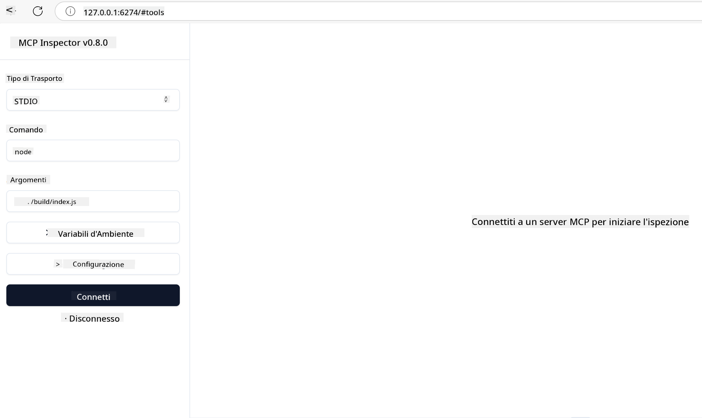

<!--
CO_OP_TRANSLATOR_METADATA:
{
  "original_hash": "4e34e34e84f013e73c7eaa6d09884756",
  "translation_date": "2025-07-13T22:00:01+00:00",
  "source_file": "03-GettingStarted/08-testing/README.md",
  "language_code": "it"
}
-->
## Testing e Debugging

Prima di iniziare a testare il tuo server MCP, è importante comprendere gli strumenti disponibili e le migliori pratiche per il debugging. Un testing efficace garantisce che il tuo server si comporti come previsto e ti aiuta a identificare e risolvere rapidamente eventuali problemi. La sezione seguente illustra gli approcci consigliati per convalidare la tua implementazione MCP.

## Panoramica

Questa lezione spiega come scegliere l'approccio di testing più adatto e lo strumento di testing più efficace.

## Obiettivi di Apprendimento

Al termine di questa lezione, sarai in grado di:

- Descrivere diversi approcci per il testing.
- Utilizzare vari strumenti per testare efficacemente il tuo codice.

## Testing dei Server MCP

MCP fornisce strumenti per aiutarti a testare e fare il debug dei tuoi server:

- **MCP Inspector**: Uno strumento da linea di comando che può essere eseguito sia come CLI che come strumento visuale.
- **Testing manuale**: Puoi usare uno strumento come curl per eseguire richieste web, ma qualsiasi strumento in grado di effettuare richieste HTTP va bene.
- **Unit testing**: È possibile utilizzare il framework di testing preferito per testare le funzionalità sia del server che del client.

### Uso di MCP Inspector

Abbiamo descritto l’uso di questo strumento nelle lezioni precedenti, ma vediamolo brevemente a livello generale. È uno strumento costruito in Node.js e puoi usarlo chiamando l’eseguibile `npx` che scaricherà e installerà temporaneamente lo strumento stesso, pulendosi automaticamente una volta terminata l’esecuzione della tua richiesta.

Il [MCP Inspector](https://github.com/modelcontextprotocol/inspector) ti aiuta a:

- **Scoprire le capacità del server**: Rileva automaticamente risorse, strumenti e prompt disponibili
- **Testare l’esecuzione degli strumenti**: Prova diversi parametri e visualizza le risposte in tempo reale
- **Visualizzare i metadata del server**: Esamina informazioni, schemi e configurazioni del server

Una tipica esecuzione dello strumento è la seguente:

```bash
npx @modelcontextprotocol/inspector node build/index.js
```

Il comando sopra avvia un MCP e la sua interfaccia visuale, lanciando un’interfaccia web locale nel browser. Puoi aspettarti di vedere una dashboard che mostra i server MCP registrati, i loro strumenti, risorse e prompt disponibili. L’interfaccia ti permette di testare interattivamente l’esecuzione degli strumenti, ispezionare i metadata del server e visualizzare risposte in tempo reale, facilitando la convalida e il debugging delle implementazioni MCP.

Ecco come può apparire: 

Puoi anche eseguire questo strumento in modalità CLI aggiungendo l’attributo `--cli`. Ecco un esempio di esecuzione in modalità "CLI" che elenca tutti gli strumenti sul server:

```sh
npx @modelcontextprotocol/inspector --cli node build/index.js --method tools/list
```

### Testing Manuale

Oltre a eseguire lo strumento inspector per testare le capacità del server, un altro approccio simile è utilizzare un client in grado di effettuare richieste HTTP, come ad esempio curl.

Con curl puoi testare direttamente i server MCP usando richieste HTTP:

```bash
# Example: Test server metadata
curl http://localhost:3000/v1/metadata

# Example: Execute a tool
curl -X POST http://localhost:3000/v1/tools/execute \
  -H "Content-Type: application/json" \
  -d '{"name": "calculator", "parameters": {"expression": "2+2"}}'
```

Come puoi vedere dall’esempio di utilizzo di curl sopra, usi una richiesta POST per invocare uno strumento passando un payload che contiene il nome dello strumento e i suoi parametri. Usa l’approccio che preferisci. Gli strumenti CLI in generale sono più veloci da usare e si prestano ad essere scriptati, cosa utile in un ambiente CI/CD.

### Unit Testing

Crea test unitari per i tuoi strumenti e risorse per assicurarti che funzionino come previsto. Ecco un esempio di codice per il testing.

```python
import pytest

from mcp.server.fastmcp import FastMCP
from mcp.shared.memory import (
    create_connected_server_and_client_session as create_session,
)

# Mark the whole module for async tests
pytestmark = pytest.mark.anyio


async def test_list_tools_cursor_parameter():
    """Test that the cursor parameter is accepted for list_tools.

    Note: FastMCP doesn't currently implement pagination, so this test
    only verifies that the cursor parameter is accepted by the client.
    """

 server = FastMCP("test")

    # Create a couple of test tools
    @server.tool(name="test_tool_1")
    async def test_tool_1() -> str:
        """First test tool"""
        return "Result 1"

    @server.tool(name="test_tool_2")
    async def test_tool_2() -> str:
        """Second test tool"""
        return "Result 2"

    async with create_session(server._mcp_server) as client_session:
        # Test without cursor parameter (omitted)
        result1 = await client_session.list_tools()
        assert len(result1.tools) == 2

        # Test with cursor=None
        result2 = await client_session.list_tools(cursor=None)
        assert len(result2.tools) == 2

        # Test with cursor as string
        result3 = await client_session.list_tools(cursor="some_cursor_value")
        assert len(result3.tools) == 2

        # Test with empty string cursor
        result4 = await client_session.list_tools(cursor="")
        assert len(result4.tools) == 2
    
```

Il codice precedente fa quanto segue:

- Utilizza il framework pytest che permette di creare test come funzioni e usare assert.
- Crea un MCP Server con due strumenti diversi.
- Usa l’istruzione `assert` per verificare che certe condizioni siano soddisfatte.

Dai un’occhiata al [file completo qui](https://github.com/modelcontextprotocol/python-sdk/blob/main/tests/client/test_list_methods_cursor.py)

Dato il file sopra, puoi testare il tuo server per assicurarti che le capacità siano create correttamente.

Tutti i principali SDK hanno sezioni di testing simili, quindi puoi adattarti al runtime che hai scelto.

## Esempi

- [Java Calculator](../samples/java/calculator/README.md)
- [.Net Calculator](../../../../03-GettingStarted/samples/csharp)
- [JavaScript Calculator](../samples/javascript/README.md)
- [TypeScript Calculator](../samples/typescript/README.md)
- [Python Calculator](../../../../03-GettingStarted/samples/python)

## Risorse Aggiuntive

- [Python SDK](https://github.com/modelcontextprotocol/python-sdk)

## Cosa c’è dopo

- Successivo: [Deployment](../09-deployment/README.md)

**Disclaimer**:  
Questo documento è stato tradotto utilizzando il servizio di traduzione automatica [Co-op Translator](https://github.com/Azure/co-op-translator). Pur impegnandoci per garantire accuratezza, si prega di notare che le traduzioni automatiche possono contenere errori o imprecisioni. Il documento originale nella sua lingua nativa deve essere considerato la fonte autorevole. Per informazioni critiche, si raccomanda una traduzione professionale effettuata da un umano. Non ci assumiamo alcuna responsabilità per eventuali malintesi o interpretazioni errate derivanti dall’uso di questa traduzione.